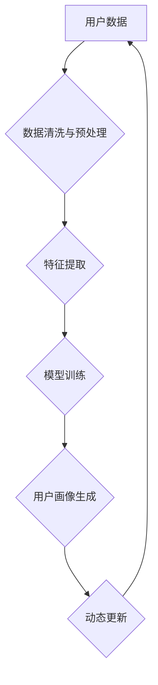

                 

## AI赋能的电商平台用户画像动态更新

> 关键词：用户画像、电商平台、人工智能、机器学习、深度学习、动态更新、个性化推荐

## 1. 背景介绍

在当今数据爆炸的时代，电商平台的用户画像已成为企业精准营销、个性化推荐和产品开发的关键要素。传统的静态用户画像难以适应用户行为的快速变化，而人工智能（AI）技术的兴起为构建动态更新的用户画像提供了新的可能性。

AI赋能的电商平台用户画像动态更新，是指利用机器学习和深度学习算法，从海量用户数据中不断挖掘和更新用户画像，使其能够实时反映用户的兴趣、需求和行为变化。这种动态更新的用户画像能够为电商平台提供更精准的营销策略、更个性化的商品推荐和更有效的客户服务。

## 2. 核心概念与联系

### 2.1 用户画像

用户画像是指对用户进行深入分析和描述，构建出用户特征、行为模式、兴趣偏好等多维度的综合描述。用户画像可以帮助电商平台了解用户的需求，提供更精准的营销服务。

### 2.2 AI赋能

人工智能（AI）是指模拟人类智能的计算机系统，包括机器学习、深度学习、自然语言处理等技术。AI技术能够从海量数据中自动学习和发现模式，为用户画像的动态更新提供强大的支持。

### 2.3 动态更新

动态更新是指用户画像能够随着用户行为的变化而不断更新和完善。传统的静态用户画像难以适应用户行为的快速变化，而动态更新的用户画像能够更准确地反映用户的最新需求和偏好。

**核心概念与联系流程图**



## 3. 核心算法原理 & 具体操作步骤

### 3.1 算法原理概述

AI赋能的电商平台用户画像动态更新主要依赖于机器学习和深度学习算法。常见的算法包括：

* **聚类算法**: 将用户根据相似特征进行分组，构建用户群画像。
* **推荐算法**: 基于用户的历史行为和偏好，预测用户可能感兴趣的商品，并生成个性化推荐。
* **深度学习模型**: 如循环神经网络（RNN）和卷积神经网络（CNN），能够从文本、图像等多模态数据中提取更丰富的用户特征。

### 3.2 算法步骤详解

1. **数据收集**: 收集用户行为数据，包括浏览记录、购买记录、评价信息、评论内容等。
2. **数据清洗与预处理**: 对收集到的数据进行清洗和预处理，去除噪声数据、缺失值和重复数据，并进行数据格式转换。
3. **特征提取**: 从用户数据中提取特征，例如用户年龄、性别、地理位置、购买频率、商品偏好等。
4. **模型训练**: 选择合适的机器学习或深度学习算法，对提取的特征进行训练，构建用户画像模型。
5. **用户画像生成**: 利用训练好的模型，对新用户进行分析，生成其个性化的用户画像。
6. **动态更新**: 定期对用户行为数据进行更新，并重新训练模型，使用户画像能够实时反映用户的最新需求和偏好。

### 3.3 算法优缺点

**优点**:

* **精准度高**: 基于机器学习和深度学习算法，能够从海量数据中挖掘更精准的用户特征。
* **动态更新**: 可以实时更新用户画像，适应用户行为的变化。
* **个性化推荐**: 可以根据用户的个性化需求，提供更精准的商品推荐。

**缺点**:

* **数据依赖**: 需要大量的用户数据进行训练，否则模型精度会降低。
* **算法复杂**: 需要专业的技术人员进行模型开发和维护。
* **隐私安全**: 需要妥善处理用户隐私数据，避免信息泄露。

### 3.4 算法应用领域

AI赋能的电商平台用户画像动态更新技术广泛应用于以下领域：

* **精准营销**: 根据用户画像，进行精准的广告投放和营销活动。
* **个性化推荐**: 根据用户的兴趣和偏好，推荐个性化的商品和服务。
* **客户服务**: 根据用户的画像，提供更个性化的客户服务。
* **产品开发**: 根据用户的画像，开发更符合用户需求的产品。

## 4. 数学模型和公式 & 详细讲解 & 举例说明

### 4.1 数学模型构建

用户画像的构建可以看作是一个特征工程和模型训练的过程。特征工程是指从原始数据中提取有价值的特征，而模型训练是指利用这些特征训练一个能够预测用户行为的模型。

常见的数学模型包括：

* **线性回归**: 用于预测连续型变量，例如用户的购买金额。
* **逻辑回归**: 用于预测分类型变量，例如用户的购买意向。
* **支持向量机 (SVM)**: 用于分类和回归问题，能够处理高维数据。
* **决策树**: 用于分类和回归问题，能够解释模型的决策过程。
* **神经网络**: 用于复杂数据分析，能够学习更复杂的模式。

### 4.2 公式推导过程

具体的公式推导过程取决于选择的模型类型。例如，线性回归模型的损失函数为均方误差，其公式为：

$$
L(w) = \frac{1}{n} \sum_{i=1}^{n} (y_i - \hat{y}_i)^2
$$

其中：

* $L(w)$ 为损失函数
* $w$ 为模型参数
* $n$ 为样本数量
* $y_i$ 为真实值
* $\hat{y}_i$ 为预测值

### 4.3 案例分析与讲解

假设我们想要预测用户的购买意向，可以使用逻辑回归模型。我们可以将用户的浏览记录、购买记录、评价信息等作为特征，训练一个逻辑回归模型。模型训练完成后，我们可以输入用户的特征，预测其购买意向。

例如，如果用户的特征包括浏览了商品A、购买了商品B、对商品C评价为好评，那么模型可能会预测其购买意向较高。

## 5. 项目实践：代码实例和详细解释说明

### 5.1 开发环境搭建

* Python 3.x
* TensorFlow 或 PyTorch
* Jupyter Notebook

### 5.2 源代码详细实现

```python
# 导入必要的库
import pandas as pd
from sklearn.model_selection import train_test_split
from sklearn.linear_model import LogisticRegression
from sklearn.metrics import accuracy_score

# 加载用户数据
data = pd.read_csv('user_data.csv')

# 选择特征和目标变量
features = ['浏览记录', '购买记录', '评价信息']
target = '购买意向'

# 将数据划分为训练集和测试集
X_train, X_test, y_train, y_test = train_test_split(data[features], data[target], test_size=0.2)

# 创建逻辑回归模型
model = LogisticRegression()

# 训练模型
model.fit(X_train, y_train)

# 预测测试集结果
y_pred = model.predict(X_test)

# 计算模型准确率
accuracy = accuracy_score(y_test, y_pred)
print('模型准确率:', accuracy)
```

### 5.3 代码解读与分析

* 首先，我们导入必要的库，并加载用户数据。
* 然后，我们选择特征和目标变量，并将数据划分为训练集和测试集。
* 接着，我们创建逻辑回归模型，并使用训练集训练模型。
* 最后，我们使用测试集预测结果，并计算模型准确率。

### 5.4 运行结果展示

运行上述代码后，会输出模型的准确率。

## 6. 实际应用场景

AI赋能的电商平台用户画像动态更新技术在实际应用中具有广泛的应用场景：

### 6.1 精准营销

电商平台可以根据用户的画像，进行精准的广告投放和营销活动。例如，可以根据用户的兴趣爱好，推荐相关的商品广告；可以根据用户的购买历史，推送个性化的促销活动。

### 6.2 个性化推荐

电商平台可以根据用户的画像，提供个性化的商品推荐。例如，可以根据用户的浏览记录，推荐用户可能感兴趣的商品；可以根据用户的购买历史，推荐用户可能需要的商品。

### 6.3 客户服务

电商平台可以根据用户的画像，提供更个性化的客户服务。例如，可以根据用户的购买记录，预先了解用户的需求，并提供相应的帮助；可以根据用户的评价信息，及时解决用户的疑问。

### 6.4 产品开发

电商平台可以根据用户的画像，开发更符合用户需求的产品。例如，可以根据用户的反馈信息，改进现有产品的功能；可以根据用户的需求，开发新的产品。

### 6.5 未来应用展望

随着人工智能技术的不断发展，AI赋能的电商平台用户画像动态更新技术将会有更广泛的应用场景。例如，可以利用用户的画像进行更精准的市场分析，预测未来的市场趋势；可以利用用户的画像进行更有效的风险控制，降低电商平台的运营风险。

## 7. 工具和资源推荐

### 7.1 学习资源推荐

* **书籍**:
    * 《深度学习》
    * 《机器学习实战》
    * 《Python机器学习》
* **在线课程**:
    * Coursera
    * edX
    * Udacity

### 7.2 开发工具推荐

* **Python**: 
    * TensorFlow
    * PyTorch
    * scikit-learn
* **数据处理工具**:
    * Pandas
    * NumPy

### 7.3 相关论文推荐

* **《基于深度学习的用户画像构建》**
* **《电商平台用户画像动态更新方法研究》**
* **《人工智能在电商平台中的应用》**

## 8. 总结：未来发展趋势与挑战

### 8.1 研究成果总结

AI赋能的电商平台用户画像动态更新技术取得了显著的成果，能够帮助电商平台实现精准营销、个性化推荐、客户服务优化等目标。

### 8.2 未来发展趋势

未来，AI赋能的电商平台用户画像动态更新技术将朝着以下方向发展：

* **更精准的用户画像**: 利用更先进的机器学习和深度学习算法，从更丰富的用户数据中挖掘更精准的用户特征。
* **更个性化的服务**: 根据用户的画像，提供更个性化的商品推荐、客户服务和营销活动。
* **更智能的决策**: 利用用户的画像，为电商平台的决策提供更智能的参考。

### 8.3 面临的挑战

AI赋能的电商平台用户画像动态更新技术也面临着一些挑战：

* **数据隐私**: 如何保护用户的隐私数据，避免信息泄露，是需要认真考虑的问题。
* **算法解释性**: 许多深度学习模型的决策过程难以解释，这可能会导致用户对模型结果的信任度降低。
* **模型可维护性**: 随着用户行为的变化，模型需要不断更新和维护，这需要投入大量的资源和人力。

### 8.4 研究展望

未来，我们需要继续研究如何解决上述挑战，并推动AI赋能的电商平台用户画像动态更新技术朝着更智能、更安全、更可持续的方向发展。

## 9. 附录：常见问题与解答

### 9.1 如何选择合适的算法？

选择合适的算法取决于用户的需求和数据的特点。例如，如果需要预测连续型变量，可以使用线性回归或神经网络；如果需要预测分类型变量，可以使用逻辑回归或决策树。

### 9.2 如何处理缺失数据？

缺失数据可以通过多种方法处理，例如删除缺失数据、用平均值或中位数填充缺失数据、使用机器学习算法进行预测填充等。

### 9.3 如何评估模型的性能？

模型的性能可以通过多种指标评估，例如准确率、召回率、F1-score等。

### 9.4 如何防止模型过拟合？

模型过拟合可以通过正则化、交叉验证等方法进行防止。

### 9.5 如何保证模型的公平性？

模型的公平性可以通过数据预处理、算法设计等方面进行保证。


作者：禅与计算机程序设计艺术 / Zen and the Art of Computer Programming 
<end_of_turn>

