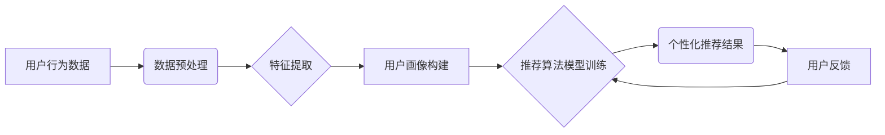

                 

## AI驱动的电商平台个性化推送策略

> 关键词：电商平台、个性化推荐、机器学习、深度学习、协同过滤、内容过滤、用户画像、推荐算法、A/B测试

## 1. 背景介绍

在当今数据爆炸的时代，电商平台面临着激烈的竞争。为了提升用户体验，提高转化率，个性化推荐已经成为电商平台的核心竞争力之一。传统的推荐算法主要依赖于用户历史行为和商品属性，但随着用户行为的复杂性和商品信息的丰富性不断增加，传统的算法难以满足个性化推荐的需求。

AI驱动的个性化推荐策略利用机器学习和深度学习等先进算法，对用户行为、商品信息、市场趋势等进行深度挖掘和分析，从而提供更精准、更个性化的商品推荐，提升用户购物体验和平台商业价值。

## 2. 核心概念与联系

### 2.1 个性化推荐

个性化推荐是指根据用户的兴趣、偏好、行为等信息，为用户提供定制化的商品推荐。其目标是提高用户满意度、提升转化率、促进用户复购。

### 2.2 机器学习

机器学习是人工智能领域的重要分支，它通过算法训练模型，使模型能够从数据中学习规律，并对新数据进行预测或分类。在个性化推荐中，机器学习算法可以根据用户的历史行为和商品信息，学习用户的偏好，并预测用户可能感兴趣的商品。

### 2.3 深度学习

深度学习是机器学习的子领域，它利用多层神经网络来模拟人类大脑的学习过程。深度学习算法能够处理更复杂的数据，并学习更深层次的特征，因此在个性化推荐中具有更强的学习能力和预测精度。

### 2.4 用户画像

用户画像是指对用户的行为、兴趣、偏好等进行分析和总结，形成的用户特征描述。用户画像是个性化推荐的基础，它帮助我们了解用户的需求，并为用户提供更精准的推荐。

**核心概念与架构流程图**



## 3. 核心算法原理 & 具体操作步骤

### 3.1 算法原理概述

个性化推荐算法主要分为两大类：协同过滤和内容过滤。

* **协同过滤**：基于用户的相似度或商品的相似度进行推荐。例如，如果用户A和用户B都喜欢购买相同类型的商品，那么当用户A购买了新的商品时，系统会推荐该商品给用户B。
* **内容过滤**：根据用户的兴趣偏好和商品的属性进行推荐。例如，如果用户A喜欢购买运动类商品，那么系统会推荐其他运动类商品给用户A。

### 3.2 算法步骤详解

**协同过滤算法步骤：**

1. **数据收集**: 收集用户行为数据，例如用户购买历史、浏览记录、评分等。
2. **数据预处理**: 对数据进行清洗、去噪、格式转换等处理。
3. **相似度计算**: 计算用户之间的相似度或商品之间的相似度。常用的相似度计算方法包括余弦相似度、皮尔逊相关系数等。
4. **推荐生成**: 根据用户与商品的相似度，生成个性化推荐列表。

**内容过滤算法步骤：**

1. **特征提取**: 从商品信息中提取特征，例如商品类别、品牌、价格、描述等。
2. **用户兴趣建模**: 根据用户的历史行为数据，构建用户的兴趣模型。
3. **推荐生成**: 根据用户的兴趣模型和商品特征，计算商品与用户的匹配度，并生成个性化推荐列表。

### 3.3 算法优缺点

**协同过滤算法：**

* **优点**: 可以发现用户之间的隐性关联，推荐更精准的商品。
* **缺点**: 数据稀疏性问题，当用户行为数据不足时，算法效果会下降。

**内容过滤算法：**

* **优点**: 不需要用户行为数据，可以推荐新商品。
* **缺点**: 难以发现用户之间的隐性关联，推荐结果可能不够个性化。

### 3.4 算法应用领域

个性化推荐算法广泛应用于电商平台、社交媒体、音乐平台、视频平台等领域，例如：

* **电商平台**: 为用户推荐商品，提高转化率。
* **社交媒体**: 为用户推荐好友、内容、活动等。
* **音乐平台**: 为用户推荐歌曲、艺术家、专辑等。
* **视频平台**: 为用户推荐视频、节目、电影等。

## 4. 数学模型和公式 & 详细讲解 & 举例说明

### 4.1 数学模型构建

协同过滤算法常用的数学模型是矩阵分解模型。

**矩阵分解模型**: 将用户-商品交互矩阵分解成两个低维矩阵，分别表示用户特征矩阵和商品特征矩阵。

**公式**:

$$
R = U \cdot V^T
$$

其中：

* $R$ 是用户-商品交互矩阵，$R_{ui}$ 表示用户 $u$ 对商品 $i$ 的评分。
* $U$ 是用户特征矩阵，$U_{u}$ 表示用户 $u$ 的特征向量。
* $V$ 是商品特征矩阵，$V_{i}$ 表示商品 $i$ 的特征向量。

### 4.2 公式推导过程

矩阵分解模型的目标是找到最优的用户特征矩阵 $U$ 和商品特征矩阵 $V$，使得 $U \cdot V^T$ 与真实的用户-商品交互矩阵 $R$ 最接近。

可以使用最小二乘法或梯度下降法来优化 $U$ 和 $V$。

### 4.3 案例分析与讲解

假设有一个用户-商品交互矩阵 $R$，其中 $R_{ui}$ 表示用户 $u$ 对商品 $i$ 的评分。

我们可以使用矩阵分解模型将 $R$ 分解成两个低维矩阵 $U$ 和 $V$。

例如，如果 $U$ 是一个 10x5 的矩阵，$V$ 是一个 5x10 的矩阵，那么我们可以得到一个 10x10 的用户-商品交互矩阵 $R'$，其中 $R'_{ui}$ 是 $U_{u} \cdot V_{i}^T$ 的结果。

通过调整 $U$ 和 $V$ 的值，我们可以使 $R'$ 与 $R$ 的差异最小化。

## 5. 项目实践：代码实例和详细解释说明

### 5.1 开发环境搭建

* Python 3.x
* TensorFlow 或 PyTorch
* Pandas
* Scikit-learn

### 5.2 源代码详细实现

```python
import tensorflow as tf

# 定义用户-商品交互矩阵
R = tf.constant([[5, 3, 4],
                 [4, 5, 2],
                 [3, 2, 5]])

# 定义用户特征矩阵和商品特征矩阵
U = tf.Variable(tf.random.normal([3, 2]))
V = tf.Variable(tf.random.normal([2, 3]))

# 计算预测评分
R_pred = tf.matmul(U, V, transpose_b=True)

# 定义损失函数
loss = tf.reduce_mean(tf.square(R - R_pred))

# 定义优化器
optimizer = tf.keras.optimizers.Adam()

# 训练模型
for epoch in range(100):
    with tf.GradientTape() as tape:
        loss_value = loss
    gradients = tape.gradient(loss_value, [U, V])
    optimizer.apply_gradients(zip(gradients, [U, V]))

# 打印训练结果
print(R_pred)
```

### 5.3 代码解读与分析

* 代码首先定义了用户-商品交互矩阵 $R$。
* 然后定义了用户特征矩阵 $U$ 和商品特征矩阵 $V$，并使用随机数初始化。
* 使用矩阵乘法计算预测评分 $R'$。
* 定义损失函数，用于衡量预测评分与真实评分之间的差异。
* 使用 Adam 优化器来优化 $U$ 和 $V$ 的值，从而最小化损失函数。
* 最后打印训练后的预测评分 $R'$。

### 5.4 运行结果展示

训练完成后，$R'$ 将包含预测的评分，这些评分可以用于个性化推荐。

## 6. 实际应用场景

### 6.1 电商平台商品推荐

* **首页推荐**: 根据用户的历史行为和偏好，推荐热门商品、新品上市、个性化套餐等。
* **商品详情页推荐**: 根据用户浏览的商品，推荐相关商品、搭配商品、用户评价等。
* **购物车推荐**: 根据用户购物车中的商品，推荐补充商品、促销活动、优惠券等。

### 6.2 社交媒体内容推荐

* **个性化新闻流**: 根据用户的兴趣爱好，推荐相关新闻、文章、视频等。
* **好友推荐**: 根据用户的社交关系，推荐潜在好友、共同兴趣的朋友等。
* **活动推荐**: 根据用户的兴趣爱好和地理位置，推荐附近的活动、演出、展览等。

### 6.3 音乐平台歌曲推荐

* **个性化歌单**: 根据用户的听歌习惯，推荐个性化歌单、新歌推荐、相似艺术家等。
* **音乐发现**: 根据用户的音乐偏好，推荐新音乐、热门歌曲、隐藏宝藏等。
* **音乐活动**: 根据用户的音乐兴趣，推荐音乐节、演唱会、音乐课程等。

### 6.4 未来应用展望

随着人工智能技术的不断发展，个性化推荐将更加智能化、精准化。未来，个性化推荐将应用于更多领域，例如：

* **医疗保健**: 为患者推荐个性化医疗方案、健康管理建议等。
* **教育**: 为学生推荐个性化学习内容、学习资源等。
* **金融**: 为用户推荐个性化理财产品、投资建议等。

## 7. 工具和资源推荐

### 7.1 学习资源推荐

* **书籍**:
    * 《推荐系统实践》
    * 《深度学习》
* **在线课程**:
    * Coursera: Recommender Systems
    * Udacity: Deep Learning Nanodegree

### 7.2 开发工具推荐

* **TensorFlow**: 开源深度学习框架
* **PyTorch**: 开源深度学习框架
* **Scikit-learn**: 机器学习库

### 7.3 相关论文推荐

* **Collaborative Filtering for Implicit Feedback Datasets**
* **Matrix Factorization Techniques for Recommender Systems**
* **Deep Learning for Recommender Systems**

## 8. 总结：未来发展趋势与挑战

### 8.1 研究成果总结

AI驱动的个性化推荐策略取得了显著的成果，能够为用户提供更精准、更个性化的商品推荐，提升用户体验和平台商业价值。

### 8.2 未来发展趋势

* **更精准的推荐**: 利用更先进的机器学习和深度学习算法，挖掘更深层次的用户特征和商品信息，实现更精准的推荐。
* **更个性化的体验**: 结合用户的情感、行为、上下文等信息，提供更个性化的推荐体验。
* **更智能的交互**: 利用自然语言处理、语音识别等技术，实现更智能的推荐交互。

### 8.3 面临的挑战

* **数据稀疏性**: 用户行为数据往往是稀疏的，如何有效处理数据稀疏性问题是重要的挑战。
* **冷启动问题**: 新用户和新商品缺乏历史数据，如何快速进行推荐是冷启动问题的关键。
* **公平性与可解释性**: 个性化推荐算法可能存在偏见，如何保证推荐结果的公平性和可解释性是需要解决的问题。

### 8.4 研究展望

未来，个性化推荐研究将继续深入，探索更先进的算法、更丰富的特征、更智能的交互，为用户提供更个性化、更智能的体验。


## 9. 附录：常见问题与解答

**Q1: 协同过滤和内容过滤算法哪个更好？**

**A1:** 两种算法各有优缺点，选择哪种算法取决于具体应用场景。协同过滤算法可以发现用户之间的隐性关联，推荐更精准的商品，但需要大量用户行为数据。内容过滤算法不需要用户行为数据，可以推荐新商品，但难以发现用户之间的隐性关联。

**Q2: 如何解决数据稀疏性问题？**

**A2:** 

* 使用矩阵分解模型，将用户-商品交互矩阵分解成低维矩阵，降低数据维度。
* 使用协同过滤算法的改进方法，例如基于因子分解的协同过滤算法。
* 使用内容过滤算法，结合商品属性和用户兴趣进行推荐。

**Q3: 如何评估个性化推荐算法的性能？**

**A3:** 常见的评估指标包括准确率、召回率、F1-score、NDCG等。

**Q4: 如何进行A/B测试？**

**A4:** A/B测试是指将用户随机分配到不同的实验组，比较不同推荐策略的效果。

**Q5: 如何保证推荐结果的公平性？**

**A5:** 

* 使用公平性算法，避免推荐结果存在偏见。
* 定期评估推荐结果的公平性，并进行调整。
* 透明化推荐算法，让用户了解推荐结果背后的逻辑。


作者：禅与计算机程序设计艺术 / Zen and the Art of Computer Programming 
<end_of_turn>

