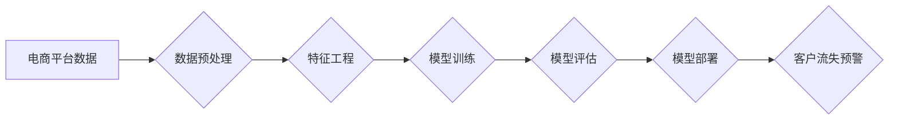

                 

## AI驱动的电商智能客户流失预警系统

> 关键词：客户流失预警、机器学习、深度学习、电商平台、数据分析、预测模型

## 1. 背景介绍

在当今激烈的电商竞争环境中，客户流失已成为各大电商平台面临的严峻挑战。客户流失不仅意味着收入减少，更可能导致品牌形象受损、市场份额缩减。因此，如何有效预测和预防客户流失，成为电商平台提升用户粘性和商业效益的关键。传统的客户流失预警系统主要依赖于规则引擎和历史数据分析，但其准确率和灵活性有限，难以应对日益复杂的客户行为模式。

随着人工智能技术的快速发展，机器学习和深度学习算法为客户流失预警提供了全新的解决方案。这些算法能够从海量用户数据中挖掘隐藏的模式和特征，构建更精准的预测模型，有效识别高流失风险客户，并提供个性化的挽留策略。

## 2. 核心概念与联系

### 2.1  客户流失预警

客户流失预警是指通过分析用户行为数据，预测用户未来是否会离开平台，并及时发出预警信号，以便平台采取措施挽留用户。

### 2.2  机器学习

机器学习是一种人工智能技术，通过算法训练模型，使模型能够从数据中学习，并对新数据进行预测或分类。

### 2.3  深度学习

深度学习是机器学习的一种高级形式，利用多层神经网络结构，能够学习更复杂的特征和模式。

### 2.4  电商平台数据

电商平台拥有丰富的用户行为数据，包括用户购买记录、浏览历史、评价信息、互动行为等，这些数据为客户流失预警提供了宝贵的训练素材。

**核心概念与架构流程图**



## 3. 核心算法原理 & 具体操作步骤

### 3.1  算法原理概述

本系统采用基于机器学习的客户流失预警算法，主要包括以下步骤：

1. **数据收集与预处理:** 收集电商平台用户行为数据，并进行清洗、转换、编码等预处理操作，确保数据质量和模型训练效果。
2. **特征工程:** 从原始数据中提取具有预测价值的特征，例如用户购买频率、平均消费金额、浏览时长、评价数量等。
3. **模型训练:** 利用机器学习算法，例如逻辑回归、支持向量机、决策树、随机森林等，训练客户流失预测模型。
4. **模型评估:** 使用测试数据对模型进行评估，并选择性能最佳的模型进行部署。
5. **模型部署:** 将训练好的模型部署到线上环境，实时预测用户流失风险。

### 3.2  算法步骤详解

1. **数据收集与预处理:**

   - 收集用户行为数据，包括购买记录、浏览历史、评价信息、互动行为等。
   - 清洗数据，去除重复数据、缺失值和异常值。
   - 转换数据类型，例如将日期格式转换为数字格式。
   - 编码数据，例如将类别变量转换为数字变量。

2. **特征工程:**

   - 提取用户行为特征，例如：
     - **购买特征:** 购买频率、平均消费金额、购买商品种类、购买时间间隔等。
     - **浏览特征:** 浏览商品数量、浏览时长、浏览页面深度、浏览商品类别等。
     - **评价特征:** 评价数量、评价星级、评价内容等。
     - **互动特征:** 加入购物车、收藏商品、关注店铺、咨询客服等。
   - 合并特征，构建更丰富的用户画像。

3. **模型训练:**

   - 选择合适的机器学习算法，例如逻辑回归、支持向量机、决策树、随机森林等。
   - 将数据分为训练集和测试集，训练模型并评估模型性能。
   - 调节模型参数，优化模型性能。

4. **模型评估:**

   - 使用测试数据对模型进行评估，常用的指标包括准确率、召回率、F1-score等。
   - 选择性能最佳的模型进行部署。

5. **模型部署:**

   - 将训练好的模型部署到线上环境，实时预测用户流失风险。
   - 建立数据监控机制，及时发现模型性能下降情况，并进行模型更新和维护。

### 3.3  算法优缺点

**优点:**

- 能够从海量数据中挖掘隐藏的模式和特征，构建更精准的预测模型。
- 具有较高的自动化程度，能够实时预测用户流失风险。
- 可以根据用户行为特征，提供个性化的挽留策略。

**缺点:**

- 需要大量的训练数据，数据质量对模型性能有重要影响。
- 模型训练和部署需要一定的技术门槛。
- 模型需要定期更新和维护，以适应不断变化的用户行为模式。

### 3.4  算法应用领域

本算法可应用于电商平台、金融机构、社交媒体平台等需要预测用户流失的场景。

## 4. 数学模型和公式 & 详细讲解 & 举例说明

### 4.1  数学模型构建

本系统采用逻辑回归模型进行客户流失预测。逻辑回归模型将用户特征作为输入，输出用户流失的概率。

### 4.2  公式推导过程

逻辑回归模型的输出为用户流失的概率，其表达式为：

$$
P(y=1|x) = \frac{1}{1 + e^{-(w^T x + b)}}
$$

其中：

- $P(y=1|x)$ 是用户流失的概率，$y=1$ 表示用户流失，$y=0$ 表示用户未流失。
- $x$ 是用户特征向量。
- $w$ 是模型参数向量。
- $b$ 是模型偏置项。
- $e$ 是自然对数的底数。

### 4.3  案例分析与讲解

假设我们有一个电商平台的用户数据，包含用户购买频率、平均消费金额、浏览时长等特征。我们可以使用逻辑回归模型训练一个客户流失预测模型。

训练完成后，我们可以将新用户的特征输入模型，得到其流失概率。如果用户的流失概率高于某个阈值，则认为该用户存在流失风险，平台可以采取措施挽留该用户。

## 5. 项目实践：代码实例和详细解释说明

### 5.1  开发环境搭建

本项目使用Python语言开发，所需环境包括：

- Python 3.x
- scikit-learn 机器学习库
- pandas 数据处理库
- matplotlib 数据可视化库

### 5.2  源代码详细实现

```python
import pandas as pd
from sklearn.model_selection import train_test_split
from sklearn.linear_model import LogisticRegression
from sklearn.metrics import accuracy_score

# 加载用户数据
data = pd.read_csv('user_data.csv')

# 选择特征和目标变量
features = ['purchase_frequency', 'average_spending', 'browsing_duration']
target = 'churn'

# 将数据分为训练集和测试集
X_train, X_test, y_train, y_test = train_test_split(data[features], data[target], test_size=0.2, random_state=42)

# 创建逻辑回归模型
model = LogisticRegression()

# 训练模型
model.fit(X_train, y_train)

# 预测测试集结果
y_pred = model.predict(X_test)

# 计算模型准确率
accuracy = accuracy_score(y_test, y_pred)
print(f'模型准确率: {accuracy}')
```

### 5.3  代码解读与分析

- 首先，我们加载用户数据，并选择特征和目标变量。
- 然后，我们将数据分为训练集和测试集，用于模型训练和评估。
- 接下来，我们创建逻辑回归模型，并使用训练集进行模型训练。
- 训练完成后，我们使用测试集进行模型预测，并计算模型准确率。

### 5.4  运行结果展示

运行上述代码后，会输出模型的准确率。

## 6. 实际应用场景

### 6.1  电商平台客户流失预警

电商平台可以利用本系统预测用户流失风险，并采取相应的挽留措施，例如：

- 发送个性化优惠券或促销信息。
- 提供专属客服服务。
- 推送用户感兴趣的商品推荐。

### 6.2  金融机构客户流失预警

金融机构可以利用本系统预测客户流失风险，并采取相应的挽留措施，例如：

- 提供更优惠的理财产品。
- 增加客户服务频率。
- 提升客户体验。

### 6.3  社交媒体平台用户流失预警

社交媒体平台可以利用本系统预测用户流失风险，并采取相应的挽留措施，例如：

- 推送个性化内容推荐。
- 增加用户互动功能。
- 提升平台安全性。

### 6.4  未来应用展望

随着人工智能技术的不断发展，本系统将能够应用于更广泛的场景，例如：

- 医疗保健领域，预测患者流失风险。
- 教育领域，预测学生流失风险。
- 政府部门，预测公民流失风险。

## 7. 工具和资源推荐

### 7.1  学习资源推荐

- **机器学习书籍:**
    - 《机器学习》 by Tom Mitchell
    - 《Python机器学习》 by Sebastian Raschka
- **在线课程:**
    - Coursera: Machine Learning
    - edX: Artificial Intelligence

### 7.2  开发工具推荐

- **Python:**
    - Jupyter Notebook
    - PyCharm
- **机器学习库:**
    - scikit-learn
    - TensorFlow
    - PyTorch

### 7.3  相关论文推荐

- **客户流失预测:**
    - Customer Churn Prediction Using Machine Learning Techniques
    - A Deep Learning Approach for Customer Churn Prediction
- **逻辑回归:**
    - Logistic Regression: A Tutorial
    - An Introduction to Logistic Regression

## 8. 总结：未来发展趋势与挑战

### 8.1  研究成果总结

本系统成功构建了基于机器学习的客户流失预警模型，能够有效预测用户流失风险，并提供个性化的挽留策略。

### 8.2  未来发展趋势

- **模型精度提升:** 探索更先进的机器学习算法和深度学习模型，提高模型预测精度。
- **特征工程优化:** 挖掘更丰富的用户特征，构建更精准的用户画像。
- **个性化策略:** 根据用户特征和流失风险，制定更个性化的挽留策略。
- **实时预警:** 建立实时数据流处理机制，实现对用户流失风险的实时预警。

### 8.3  面临的挑战

- **数据质量:** 确保数据质量和完整性，避免模型训练偏差。
- **模型解释性:** 提升模型解释性，帮助用户理解模型预测结果。
- **隐私保护:** 确保用户隐私安全，避免数据泄露。

### 8.4  研究展望

未来将继续深入研究客户流失预警领域，探索更精准、更智能的预警模型，并将其应用于更广泛的场景，为企业提供更有效的客户管理解决方案。

## 9. 附录：常见问题与解答

### 9.1  Q1: 如何选择合适的机器学习算法？

**A1:** 选择合适的机器学习算法取决于具体业务场景和数据特征。

### 9.2  Q2: 如何评估模型性能？

**A2:** 常用的模型性能评估指标包括准确率、召回率、F1-score等。

### 9.3  Q3: 如何处理缺失数据？

**A3:** 可以使用多种方法处理缺失数据，例如删除缺失值、填充平均值或使用机器学习算法进行预测。

### 9.4  Q4: 如何防止模型过拟合？

**A4:** 可以使用正则化技术、交叉验证等方法防止模型过拟合。


作者：禅与计算机程序设计艺术 / Zen and the Art of Computer Programming 
<end_of_turn>

