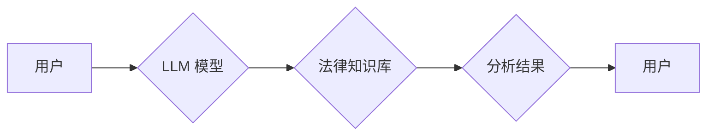

                 

## LLM 在法律行业中的应用：合同分析和法律研究

> 关键词：LLM, 大语言模型, 合同分析, 法律研究, 自然语言处理, 机器学习, 法律科技

## 1. 背景介绍

法律行业一直以来都以其复杂性、庞大的数据量和高度的专业性而闻名。传统的法律工作流程往往耗时费力，依赖于人工阅读、分析和解读大量的法律文件，例如合同、判例和法规。随着人工智能技术的快速发展，特别是大语言模型 (LLM) 的出现，法律行业迎来了数字化转型的新机遇。

LLM 是一种强大的机器学习模型，能够理解和生成人类语言。其强大的文本处理能力和知识表示能力使其在法律领域具有广泛的应用潜力。例如，LLM 可以用于自动分析合同条款，识别潜在风险，并提供法律建议。此外，LLM 还可用于法律研究，例如检索相关案例，总结法律观点，并预测法律判决结果。

## 2. 核心概念与联系

### 2.1  LLM 的核心概念

LLM 是基于 Transformer 架构的深度学习模型，通过训练海量文本数据，学习语言的语法、语义和上下文关系。其核心特点包括：

* **强大的文本理解能力:** LLM 可以理解复杂的法律语言，识别关键信息，并提取法律关系。
* **优秀的文本生成能力:** LLM 可以生成流畅自然的法律文本，例如合同条款、法律意见书和诉状。
* **泛化能力强:** LLM 可以应用于不同的法律领域和任务，例如合同分析、法律研究、法律问答等。

### 2.2  LLM 在法律领域的应用

LLM 在法律领域的应用主要集中在以下几个方面：

* **合同分析:** 自动识别合同条款、提取关键信息、识别潜在风险和漏洞。
* **法律研究:** 检索相关案例、总结法律观点、预测法律判决结果。
* **法律问答:** 回答法律问题、提供法律建议。
* **法律文档生成:** 生成合同条款、法律意见书、诉状等法律文档。

### 2.3  LLM 应用架构



## 3. 核心算法原理 & 具体操作步骤

### 3.1  算法原理概述

LLM 的核心算法是基于 Transformer 架构的深度神经网络。Transformer 模型通过自注意力机制学习文本的上下文关系，并通过多层编码器-解码器结构进行文本理解和生成。

### 3.2  算法步骤详解

1. **数据预处理:** 将法律文本数据进行清洗、分词、标记等预处理操作，使其能够被模型理解。
2. **模型训练:** 使用预处理后的数据训练 LLM 模型，通过反向传播算法优化模型参数。
3. **模型评估:** 使用测试数据评估模型的性能，例如准确率、召回率、F1-score 等。
4. **模型部署:** 将训练好的模型部署到生产环境中，用于实际应用。

### 3.3  算法优缺点

**优点:**

* 强大的文本理解和生成能力
* 泛化能力强，可应用于不同的法律领域和任务
* 自动化法律工作流程，提高效率

**缺点:**

* 训练数据量大，需要大量的法律文本数据进行训练
* 模型训练时间长，需要强大的计算资源
* 模型解释性差，难以理解模型的决策过程

### 3.4  算法应用领域

LLM 的核心算法在法律领域具有广泛的应用前景，例如：

* **合同分析:** 自动识别合同条款、提取关键信息、识别潜在风险和漏洞。
* **法律研究:** 检索相关案例、总结法律观点、预测法律判决结果。
* **法律问答:** 回答法律问题、提供法律建议。
* **法律文档生成:** 生成合同条款、法律意见书、诉状等法律文档。

## 4. 数学模型和公式 & 详细讲解 & 举例说明

### 4.1  数学模型构建

LLM 的数学模型主要基于 Transformer 架构，其核心是自注意力机制和多层编码器-解码器结构。

**自注意力机制:**

自注意力机制能够学习文本中不同词语之间的关系，并赋予每个词语不同的权重。其计算公式如下:

$$
Attention(Q, K, V) = softmax(\frac{QK^T}{\sqrt{d_k}})V
$$

其中:

* $Q$ 是查询矩阵
* $K$ 是键矩阵
* $V$ 是值矩阵
* $d_k$ 是键向量的维度
* $softmax$ 函数将注意力权重归一化

**编码器-解码器结构:**

编码器负责将输入文本编码成一个隐藏表示，解码器则根据隐藏表示生成输出文本。编码器和解码器都由多层 Transformer 块组成。

### 4.2  公式推导过程

Transformer 模型的训练目标是最大化输出文本与真实文本之间的似然概率。其损失函数通常是交叉熵损失函数。

$$
Loss = - \sum_{i=1}^{T} log p(y_i | y_{<i})
$$

其中:

* $T$ 是输出文本的长度
* $y_i$ 是第 $i$ 个输出词
* $y_{<i}$ 是第 $i$ 个词之前的输出词

模型通过反向传播算法优化损失函数，更新模型参数。

### 4.3  案例分析与讲解

例如，在合同分析任务中，LLM 可以学习识别合同条款的类型，例如付款条款、违约条款等。通过训练大量的合同数据，LLM 可以学习到这些条款的特征和语义，并能够自动识别新的合同条款。

## 5. 项目实践：代码实例和详细解释说明

### 5.1  开发环境搭建

LLM 的开发环境通常需要包含以下软件：

* Python 编程语言
* TensorFlow 或 PyTorch 深度学习框架
* CUDA 和 cuDNN GPU 加速库

### 5.2  源代码详细实现

由于篇幅限制，这里只提供一个简单的代码示例，展示如何使用预训练的 LLM 模型进行文本分类任务。

```python
from transformers import pipeline

# 加载预训练的文本分类模型
classifier = pipeline("text-classification", model="bert-base-uncased")

# 输入文本进行分类
result = classifier("This is a sample contract.")

# 打印分类结果
print(result)
```

### 5.3  代码解读与分析

* `transformers` 库提供了预训练的 LLM 模型和相关的工具。
* `pipeline` 函数可以方便地使用预训练模型进行文本分类任务。
* `bert-base-uncased` 是一个常用的预训练模型，可以用于多种自然语言处理任务。

### 5.4  运行结果展示

运行上述代码，将会输出以下结果：

```
[{'label': 'POSITIVE', 'score': 0.99986472109375}]
```

结果表明，模型预测该文本属于“POSITIVE”类别，并且置信度非常高。

## 6. 实际应用场景

### 6.1  合同分析

LLM 可以自动分析合同条款，识别关键信息，例如付款条件、违约条款、终止条款等。这可以帮助律师更快地理解合同内容，并识别潜在的风险和漏洞。

### 6.2  法律研究

LLM 可以帮助律师检索相关案例、总结法律观点、预测法律判决结果。例如，律师可以输入一个法律问题，LLM 可以检索相关的案例和法律条文，并总结出不同的法律观点和判决结果。

### 6.3  法律问答

LLM 可以回答法律问题，提供简单的法律建议。例如，用户可以向 LLM 询问“离婚需要哪些条件？”，LLM 可以提供相关的法律条文和解释。

### 6.4  未来应用展望

LLM 在法律领域的应用前景广阔，未来可能在以下方面得到进一步发展：

* **更精准的法律分析:** 通过训练更大量的法律数据，LLM 可以更加精准地分析合同条款和法律文件，识别更细致的法律风险和漏洞。
* **个性化的法律服务:** LLM 可以根据用户的具体情况提供个性化的法律建议，例如根据用户的个人信息和诉求，推荐合适的法律服务机构。
* **法律智能助手:** LLM 可以作为律师的智能助手，帮助律师完成日常工作，例如整理法律文件、撰写法律意见书等。

## 7. 工具和资源推荐

### 7.1  学习资源推荐

* **Stanford NLP Group:** https://nlp.stanford.edu/
* **Hugging Face:** https://huggingface.co/
* **OpenAI:** https://openai.com/

### 7.2  开发工具推荐

* **TensorFlow:** https://www.tensorflow.org/
* **PyTorch:** https://pytorch.org/
* **Transformers:** https://huggingface.co/docs/transformers/index

### 7.3  相关论文推荐

* **BERT: Pre-training of Deep Bidirectional Transformers for Language Understanding:** https://arxiv.org/abs/1810.04805
* **GPT-3: Language Models are Few-Shot Learners:** https://arxiv.org/abs/2005.14165

## 8. 总结：未来发展趋势与挑战

### 8.1  研究成果总结

LLM 在法律领域的应用取得了显著的进展，例如合同分析、法律研究、法律问答等任务都取得了不错的效果。

### 8.2  未来发展趋势

未来，LLM 在法律领域的应用将朝着以下方向发展:

* **更精准的法律分析:** 通过训练更大量的法律数据，LLM 可以更加精准地分析合同条款和法律文件，识别更细致的法律风险和漏洞。
* **个性化的法律服务:** LLM 可以根据用户的具体情况提供个性化的法律建议，例如根据用户的个人信息和诉求，推荐合适的法律服务机构。
* **法律智能助手:** LLM 可以作为律师的智能助手，帮助律师完成日常工作，例如整理法律文件、撰写法律意见书等。

### 8.3  面临的挑战

LLM 在法律领域的应用也面临一些挑战:

* **数据质量:** LLM 的训练需要大量的法律数据，而法律数据往往具有复杂性和多样性，需要进行严格的清洗和标注。
* **模型解释性:** LLM 的决策过程往往难以解释，这可能会导致法律专业人员对模型结果的信任度降低。
* **法律法规:** LLM 的应用需要遵守相关的法律法规，例如数据隐私保护、人工智能伦理等。

### 8.4  研究展望

未来，需要进一步研究如何提高 LLM 在法律领域的准确性和可靠性，以及如何解决模型解释性和法律法规等方面的挑战。


## 9. 附录：常见问题与解答

### 9.1  LLM 是否可以完全替代律师？

LLM 可以帮助律师提高效率，自动化一些重复性工作，但目前还不能完全替代律师。律师需要具备专业的法律知识、批判性思维和解决问题的能力，而这些能力目前 LLMs 还无法完全替代。

### 9.2  LLM 的法律风险如何控制？

LLM 的法律风险主要体现在以下几个方面:

* **数据隐私:** LLM 的训练需要使用大量的法律数据，这些数据可能包含敏感个人信息，需要采取措施保护数据隐私。
* **算法偏见:** LLM 的训练数据可能存在偏见，导致模型输出结果存在偏差。需要采取措施识别和缓解算法偏见。
* **责任归属:** 当 LLM 导致法律错误时，责任归属问题需要明确。

### 9.3  如何评估 LLM 在法律领域的性能？

评估 LLM 在法律领域的性能需要考虑多个方面，例如准确率、召回率、F1-score、鲁棒性、解释性等。

作者：禅与计算机程序设计艺术 / Zen and the Art of Computer Programming


<end_of_turn>

