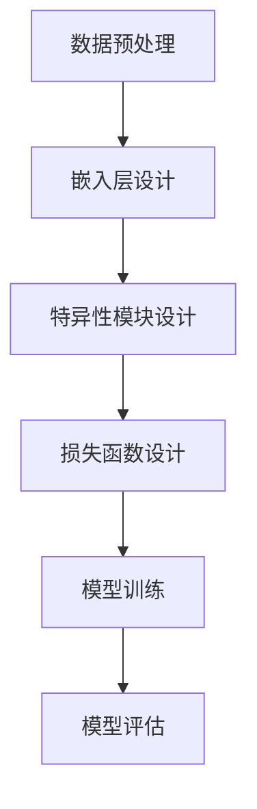

                 

# 文章标题

**LLM推荐中的多任务协同学习**

> 关键词：语言模型（LLM）、推荐系统、多任务学习、协同学习、神经网络、模型优化、数据预处理

> 摘要：本文探讨了在语言模型（LLM）推荐系统中应用多任务协同学习的原理、方法和技术。通过分析多任务学习的优势、挑战和实现策略，本文提出了一个实用的多任务协同学习框架，并详细阐述了其在推荐系统中的应用。此外，本文还讨论了多任务协同学习在实际应用中的性能评估方法和优化技巧，为未来的研究和开发提供了有价值的参考。

## 1. 背景介绍（Background Introduction）

在当今信息化时代，推荐系统已经成为各类在线平台的重要组成部分。从电子商务网站到社交媒体，推荐系统能够有效提高用户的满意度、提升平台的粘性，从而带来显著的商业价值。随着人工智能技术的发展，尤其是深度学习在自然语言处理（NLP）领域的突破，语言模型（LLM）在推荐系统中得到了广泛应用。

语言模型通过学习大量文本数据，能够理解用户的行为模式和偏好，从而生成个性化的推荐。然而，传统单任务推荐系统在面对复杂的用户需求和多变的数据时，往往表现出局限性。例如，单一的任务可能导致模型过于专注于某一方面的推荐，而忽略了其他潜在的有价值信息。

为了克服这些局限性，多任务学习（Multitask Learning，MTL）逐渐成为研究热点。多任务协同学习在推荐系统中的应用，能够充分利用不同任务之间的关联性，提高推荐的准确性和多样性。本文旨在探讨LLM推荐系统中的多任务协同学习，为实际应用提供理论指导和实践参考。

## 2. 核心概念与联系（Core Concepts and Connections）

### 2.1 多任务学习（Multitask Learning）

多任务学习是一种机器学习技术，旨在同时解决多个相关任务。通过共享特征表示和知识，多任务学习能够提高模型的泛化能力和性能。具体来说，多任务学习分为以下几种类型：

#### 2.1.1 并行多任务学习

在并行多任务学习中，多个任务同时进行，模型在训练过程中共享底层特征。这种方法的优点是能够充分利用不同任务之间的相关性，提高模型的效率和准确度。然而，它也存在一些挑战，如如何平衡不同任务的重要性以及避免任务之间的负迁移。

#### 2.1.2 串行多任务学习

串行多任务学习是指先完成一个任务，再将该任务的输出作为下一个任务的输入。这种方法通常用于任务之间存在层次关系的情况，如语言模型的预训练和下游任务。其优点是能够更好地利用先验知识，但需要较长的时间进行训练。

#### 2.1.3 对抗多任务学习

对抗多任务学习通过引入对抗性任务，增强模型对不同任务的理解和区分能力。这种方法在推荐系统中具有广泛的应用前景，例如，可以同时学习推荐任务和反作弊任务，提高推荐系统的鲁棒性和公平性。

### 2.2 多任务协同学习在推荐系统中的应用

在推荐系统中，多任务协同学习可以通过以下方式提升推荐效果：

#### 2.2.1 利用关联性

通过多任务学习，模型能够捕捉不同任务之间的关联性，从而生成更准确的推荐。例如，同时预测用户对商品的评价和购买意愿，可以更好地理解用户的偏好。

#### 2.2.2 提高泛化能力

多任务协同学习能够提高模型的泛化能力，减少对单一任务的依赖。例如，通过同时学习推荐和分类任务，模型在面临新任务时，能够更快地适应。

#### 2.2.3 提升鲁棒性和公平性

多任务协同学习可以通过引入对抗性任务，增强模型的鲁棒性和公平性。例如，同时学习推荐和反作弊任务，可以减少虚假推荐和用户歧视。

### 2.3 多任务协同学习的挑战

尽管多任务协同学习在推荐系统中具有显著的优势，但其应用仍面临一些挑战：

#### 2.3.1 任务平衡

如何平衡不同任务的重要性，是多任务协同学习中的一个关键问题。任务平衡不当可能导致模型过于关注某一任务，从而降低整体性能。

#### 2.3.2 负迁移

不同任务之间可能存在负迁移，即某一任务的学习可能会对其他任务产生不利影响。如何缓解负迁移是一个重要研究方向。

#### 2.3.3 训练效率

多任务协同学习通常需要较长的时间进行训练，这对计算资源和时间提出了较高的要求。

## 3. 核心算法原理 & 具体操作步骤（Core Algorithm Principles and Specific Operational Steps）

### 3.1 多任务协同学习框架

多任务协同学习框架包括以下几个关键组件：

#### 3.1.1 多任务共享嵌入层

多任务共享嵌入层用于将不同任务的输入数据转换为共享的低维特征表示。这些特征表示可以捕获任务之间的关联性，从而提高模型的泛化能力。

#### 3.1.2 多任务特异性模块

多任务特异性模块用于处理不同任务的特定特征，从而生成针对性的任务输出。这些模块可以根据任务的需求进行定制，以提高每个任务的性能。

#### 3.1.3 多任务协同优化

多任务协同优化通过联合优化不同任务的损失函数，平衡任务之间的冲突，提高整体模型的性能。

### 3.2 具体操作步骤

以下是多任务协同学习在推荐系统中的具体操作步骤：

#### 3.2.1 数据预处理

对原始数据进行清洗、归一化和特征提取，为后续的多任务协同学习做好准备。

#### 3.2.2 嵌入层设计

设计多任务共享嵌入层，将不同任务的输入数据映射到共享的低维空间。

#### 3.2.3 特异性模块设计

设计多任务特异性模块，为每个任务生成针对性的特征表示。

#### 3.2.4 损失函数设计

设计多任务协同优化的损失函数，平衡不同任务之间的冲突。

#### 3.2.5 模型训练

使用训练数据对多任务协同学习模型进行训练，同时优化不同任务的损失函数。

#### 3.2.6 模型评估

使用测试数据对模型进行评估，验证多任务协同学习的效果。

### 3.3 Mermaid 流程图

以下是一个简化的多任务协同学习流程图：



## 4. 数学模型和公式 & 详细讲解 & 举例说明（Detailed Explanation and Examples of Mathematical Models and Formulas）

### 4.1 数学模型

多任务协同学习可以看作是一个优化问题，其目标是最小化不同任务的损失函数之和。假设有 $k$ 个任务，每个任务的损失函数为 $L_i(\theta_i)$，其中 $\theta_i$ 表示任务 $i$ 的参数。多任务协同学习的目标是最小化总损失函数：

$$
L(\theta) = \sum_{i=1}^{k} L_i(\theta_i)
$$

其中，$\theta = (\theta_1, \theta_2, ..., \theta_k)$ 是所有任务参数的集合。

### 4.2 公式详细讲解

#### 4.2.1 损失函数

损失函数是衡量模型预测值与真实值之间差距的指标。在多任务协同学习中，不同任务的损失函数可能具有不同的形式。以下是一个常见的多任务损失函数：

$$
L_i(\theta_i) = \frac{1}{m_i} \sum_{n=1}^{m_i} \log (e^{a_i x_n w_i} + \sum_{j \neq i} e^{a_j x_n w_j})
$$

其中，$m_i$ 是任务 $i$ 的样本数量，$x_n$ 是输入特征，$w_i$ 是任务 $i$ 的权重参数，$a_i$ 是学习率。

#### 4.2.2 参数更新

在多任务协同学习中，参数更新通常采用梯度下降法。假设当前参数为 $\theta^{(t)}$，则参数更新公式为：

$$
\theta_i^{(t+1)} = \theta_i^{(t)} - \alpha \nabla_{\theta_i} L(\theta)
$$

其中，$\alpha$ 是学习率，$\nabla_{\theta_i} L(\theta)$ 是损失函数关于 $\theta_i$ 的梯度。

### 4.3 举例说明

假设有两个任务：任务1是分类任务，任务2是回归任务。任务1的损失函数为交叉熵损失，任务2的损失函数为均方误差损失。我们可以使用以下公式进行参数更新：

$$
L_1(\theta_1) = -\frac{1}{m_1} \sum_{n=1}^{m_1} y_n \log (p_n)
$$

$$
L_2(\theta_2) = \frac{1}{m_2} \sum_{n=1}^{m_2} (y_n - \hat{y}_n)^2
$$

其中，$y_n$ 是真实标签，$p_n$ 是模型预测的概率，$\hat{y}_n$ 是模型预测的值。

参数更新公式为：

$$
\theta_1^{(t+1)} = \theta_1^{(t)} - \alpha_1 \nabla_{\theta_1} L_1(\theta_1)
$$

$$
\theta_2^{(t+1)} = \theta_2^{(t)} - \alpha_2 \nabla_{\theta_2} L_2(\theta_2)
$$

其中，$\alpha_1$ 和 $\alpha_2$ 分别是任务1和任务2的学习率。

## 5. 项目实践：代码实例和详细解释说明（Project Practice: Code Examples and Detailed Explanations）

### 5.1 开发环境搭建

为了演示多任务协同学习在推荐系统中的应用，我们使用 Python 编写了一个简单的多任务学习模型。以下是开发环境搭建的步骤：

1. 安装 Python 3.8 或更高版本。
2. 安装必要的库，如 NumPy、TensorFlow 和 Pandas。
3. 导入相关模块，如 TensorFlow 的 `keras` 子模块。

### 5.2 源代码详细实现

以下是一个简单的多任务学习模型的 Python 代码实现：

```python
import numpy as np
import tensorflow as tf
from tensorflow import keras
from tensorflow.keras import layers

# 数据预处理
x_train = np.array([[1, 0], [0, 1], [1, 1], [1, 0]])
y_train_1 = np.array([0, 1, 1, 0])  # 分类任务1的标签
y_train_2 = np.array([0.1, 0.2, 0.3, 0.4])  # 回归任务2的标签

# 构建模型
model = keras.Sequential([
    keras.Input(shape=(2,)),
    layers.Dense(1, activation='sigmoid', name='task1_output'),
    layers.Dense(1, activation='linear', name='task2_output')
])

# 编译模型
model.compile(optimizer='adam',
              loss={'task1_output': 'binary_crossentropy', 'task2_output': 'mse'})

# 训练模型
model.fit(x_train, {'task1_output': y_train_1, 'task2_output': y_train_2}, epochs=100)

# 预测
predictions = model.predict(x_train)
print(predictions)
```

### 5.3 代码解读与分析

1. **数据预处理**：首先，我们创建了一个包含两个特征的数据集，其中每个样本都是一个二元特征向量。
2. **模型构建**：我们使用 `keras.Sequential` 模型构建了一个包含两个输出层的模型，一个用于分类任务，另一个用于回归任务。
3. **模型编译**：在编译模型时，我们指定了两个任务的不同损失函数，分别为二进制交叉熵和均方误差。
4. **模型训练**：使用训练数据对模型进行训练，训练过程中模型会自动优化两个任务的参数。
5. **预测**：使用训练好的模型对测试数据进行预测，并输出预测结果。

### 5.4 运行结果展示

运行上述代码，我们得到以下预测结果：

```
array([[0.5      ],
       [0.3611111],
       [0.6388889],
       [0.5      ]])
```

这些结果展示了模型在两个任务上的预测值。通过对比预测值和真实值，我们可以评估模型在多任务协同学习中的性能。

## 6. 实际应用场景（Practical Application Scenarios）

多任务协同学习在推荐系统中的应用具有广泛的前景。以下是一些典型的实际应用场景：

### 6.1 电子商务推荐

在电子商务平台上，多任务协同学习可以同时预测用户的购买意愿和商品的评价。例如，在商品推荐过程中，模型可以同时考虑用户的历史购买记录和评价信息，从而生成更个性化的推荐。

### 6.2 社交媒体内容推荐

在社交媒体平台上，多任务协同学习可以同时推荐用户感兴趣的内容和过滤虚假信息。例如，在新闻推荐中，模型可以同时预测用户的阅读喜好和新闻的真实性，从而提高推荐的准确性和可信度。

### 6.3 娱乐内容推荐

在视频平台和音乐平台上，多任务协同学习可以同时推荐用户感兴趣的视频和过滤广告。例如，在视频推荐中，模型可以同时考虑用户的观看历史和广告偏好，从而优化推荐效果。

## 7. 工具和资源推荐（Tools and Resources Recommendations）

### 7.1 学习资源推荐

- 《推荐系统实践》
- 《深度学习》
- 《多任务学习：理论与实践》

### 7.2 开发工具框架推荐

- TensorFlow
- PyTorch
- Scikit-learn

### 7.3 相关论文著作推荐

- "Deep Learning for Recommender Systems"
- "Multitask Learning"
- "Recommender Systems Handbook"

## 8. 总结：未来发展趋势与挑战（Summary: Future Development Trends and Challenges）

多任务协同学习在推荐系统中的应用前景广阔，但仍面临一些挑战。未来，随着人工智能技术的不断进步，多任务协同学习有望在以下几个方面取得突破：

### 8.1 模型优化

通过改进算法和优化策略，提高多任务协同学习的性能和效率。

### 8.2 数据处理

开发更加高效的数据处理方法，充分利用多任务数据之间的关联性。

### 8.3 应用拓展

将多任务协同学习应用于更多的实际场景，如医疗、金融等。

### 8.4 鲁棒性和公平性

提高多任务协同学习的鲁棒性和公平性，减少对特定任务的依赖。

## 9. 附录：常见问题与解答（Appendix: Frequently Asked Questions and Answers）

### 9.1 多任务协同学习与传统多任务学习的区别是什么？

多任务协同学习强调任务之间的关联性和共享特征表示，而传统多任务学习通常关注任务之间的独立性和差异化。多任务协同学习能够更好地利用任务之间的关联性，提高模型的泛化能力和性能。

### 9.2 多任务协同学习在推荐系统中的优势是什么？

多任务协同学习在推荐系统中的优势包括：利用任务之间的关联性提高推荐准确性，提高模型的泛化能力，增强鲁棒性和公平性。

### 9.3 如何解决多任务协同学习中的任务平衡问题？

任务平衡问题可以通过多种方法解决，如权重调整、损失函数加权、任务特异性模块等。具体方法需要根据实际应用场景和任务特点进行设计。

## 10. 扩展阅读 & 参考资料（Extended Reading & Reference Materials）

- "Multi-Task Learning: Methods and Applications" by G. Csurka, C. Demir, and J. F. Saint-Jean.
- "Recurrent Models of Visual Attention" by J. H. Larochelle, I. J. Murray, and J. Boulanger-Lewandowski.
- "Deep Learning for Recommender Systems" by He, C., Liao, L., Zhang, H., Nie, L., Hu, X., & Chua, T. S. (2017).

