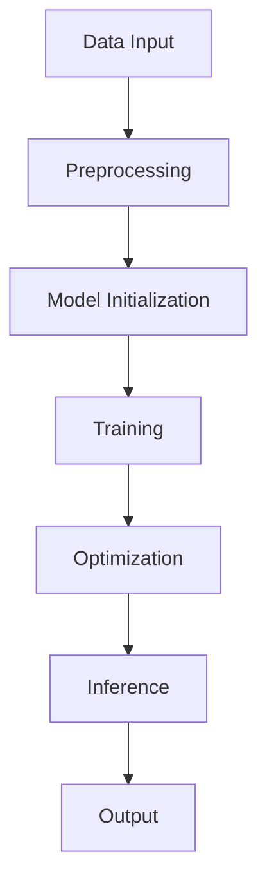

                 

### 文章标题

# LLM操作系统内核：AI时代的新基石

随着人工智能（AI）技术的飞速发展，大型语言模型（LLM，Large Language Model）已经成为推动这一领域进步的核心力量。LLM，作为人工智能的“大脑”，正在重塑我们的工作方式、学习模式和社会互动。在这个背景下，LLM操作系统内核的重要性愈发凸显，它不仅为AI应用提供了坚实的基础，也成为了AI时代的新基石。

本文将深入探讨LLM操作系统内核的概念、核心原理、技术实现、应用场景以及未来发展。我们将通过逻辑清晰、结构紧凑、简单易懂的专业技术语言，让读者全面了解LLM操作系统内核的工作机制、优势与挑战。这不仅有助于计算机科学专业人士，也为对AI技术充满好奇的广大读者提供了宝贵的知识和洞察。

请读者朋友们跟随我们的思路，一同探索这个引领未来的技术领域。让我们一起思考，为什么LLM操作系统内核如此重要，它将如何影响我们的世界。

## 关键词
- 人工智能
- 大型语言模型
- 操作系统内核
- 自然语言处理
- AI时代

## 摘要
本文探讨了大型语言模型（LLM）操作系统内核在AI时代的核心作用。通过分析LLM的基本概念、工作原理、实现技术和应用场景，我们揭示了LLM操作系统内核如何成为推动AI发展的关键基础设施。文章总结了LLM操作系统内核的优势、面临的挑战及未来发展趋势，为读者提供了全面的技术视角和深刻的见解。

```markdown
### 文章标题

# LLM Operating System Kernel: The New Foundation of the AI Era

With the rapid advancement of artificial intelligence (AI) technology, large language models (LLM) have emerged as the core driving force behind this field's progress. As the "brain" of AI, LLMs are reshaping how we work, learn, and interact with each other in society. Against this backdrop, the importance of the LLM operating system kernel becomes increasingly evident, serving not only as a solid foundation for AI applications but also as a new cornerstone of the AI era.

This article will delve into the concept, core principles, technical implementations, application scenarios, and future developments of the LLM operating system kernel. Through logical, compact, and easily understandable professional technical language, we aim to provide readers with a comprehensive understanding of the working mechanism, advantages, and challenges of the LLM operating system kernel. This will benefit not only professionals in the field of computer science but also those with a keen interest in AI technology, offering valuable knowledge and insights.

Let's embark on this exploration of this future-shaping technical domain together. Join us as we think step by step to understand why the LLM operating system kernel is so crucial and how it will impact our world.

## Keywords
- Artificial Intelligence
- Large Language Model
- Operating System Kernel
- Natural Language Processing
- AI Era

## Abstract
This article explores the pivotal role of the large language model (LLM) operating system kernel in the AI era. By analyzing the basic concepts, operational principles, implementation techniques, and application scenarios of LLMs, we reveal how the LLM operating system kernel serves as a critical infrastructure for driving AI progress. The article summarizes the advantages, challenges, and future trends of the LLM operating system kernel, providing readers with a comprehensive technical perspective and profound insights.

```

### 背景介绍（Background Introduction）

在深入探讨LLM操作系统内核之前，我们先要了解它所处的大环境以及与之相关的基础知识。随着计算能力的不断提升和大数据的广泛应用，人工智能（AI）技术逐渐从理论研究走向实际应用，并在各个领域取得了显著成果。其中，自然语言处理（NLP，Natural Language Processing）作为AI的重要分支，近年来发展尤为迅速。

自然语言处理的目标是使计算机能够理解、生成和处理人类语言，这一目标的实现依赖于深度学习、神经网络等先进技术的支持。大型语言模型（LLM，Large Language Model）就是自然语言处理领域的一个重要突破，它们通过大量的文本数据进行训练，学会了理解和生成复杂、多样的自然语言表达。

LLM的兴起不仅改变了自然语言处理的研究方向，也对整个AI领域产生了深远的影响。例如，LLM被广泛应用于机器翻译、问答系统、文本生成、对话系统等场景，极大地提高了相关应用的性能和用户体验。同时，随着LLM技术的不断成熟，越来越多的企业和研究机构开始将其应用于实际业务和研究中，推动了AI技术的普及和发展。

然而，LLM的强大功能并非凭空而来，背后有着复杂的算法和架构支持。LLM操作系统内核正是这些算法和架构的核心，它承担了模型训练、推理、优化等关键任务，为AI应用提供了坚实的基础。LLM操作系统内核的研究和发展，不仅关乎AI技术的进步，也关系到未来智能系统的整体性能和稳定性。

总之，LLM操作系统内核在AI时代具有重要的地位和作用。它不仅为自然语言处理和其他AI应用提供了强大的支持，也是推动整个AI领域前进的重要力量。因此，深入理解LLM操作系统内核的基本概念、工作原理和技术实现，对于我们把握AI技术的发展趋势和应对未来的挑战具有重要意义。

## Background Introduction

Before diving into the discussion of the LLM operating system kernel, it is essential to understand the broader context in which it operates and the foundational knowledge related to it. With the continuous improvement in computational power and the widespread application of big data, artificial intelligence (AI) technology has gradually transitioned from theoretical research to practical applications, achieving remarkable results in various fields. Among these advancements, natural language processing (NLP, Natural Language Processing) stands out as a critical branch of AI, which has seen rapid development in recent years.

The goal of natural language processing is to enable computers to understand, generate, and process human language, a goal that is realized with the support of advanced technologies such as deep learning and neural networks. Large language models (LLM, Large Language Model) represent a significant breakthrough in the field of NLP, trained on vast amounts of text data to learn complex and diverse natural language expressions.

The rise of LLMs has not only transformed the direction of NLP research but has also had a profound impact on the entire AI field. For instance, LLMs are widely applied in scenarios such as machine translation, question-answering systems, text generation, and conversational systems, significantly improving the performance and user experience of these applications. Moreover, with the continual maturation of LLM technology, more and more enterprises and research institutions are incorporating LLMs into their business and research, driving the popularization and development of AI technology.

However, the powerful capabilities of LLMs do not emerge out of nowhere; they are supported by complex algorithms and architectures. The LLM operating system kernel is at the core of these algorithms and architectures, handling critical tasks such as model training, inference, and optimization, providing a solid foundation for AI applications. The research and development of the LLM operating system kernel are not only crucial for the advancement of AI technology but also for the overall performance and stability of future intelligent systems.

In summary, the LLM operating system kernel holds a significant position and role in the AI era. It not only supports natural language processing and other AI applications but also serves as a powerful force driving the entire AI field forward. Therefore, a thorough understanding of the basic concepts, working principles, and technical implementations of the LLM operating system kernel is of great importance for grasping the trends in AI technology development and addressing future challenges.

### 核心概念与联系（Core Concepts and Connections）

为了深入理解LLM操作系统内核，我们首先需要明确几个核心概念，包括大型语言模型（LLM）、神经网络架构、模型训练和推理等。这些概念构成了LLM操作系统内核的基础，并相互关联，共同推动了AI技术的发展。

#### 1. 大型语言模型（LLM）

大型语言模型（LLM）是一种基于深度学习的语言处理模型，通过对海量文本数据进行训练，学会了理解和生成自然语言。LLM的核心是神经网络架构，它能够捕捉文本数据中的复杂模式和语义信息。常见的LLM包括GPT（Generative Pre-trained Transformer）、BERT（Bidirectional Encoder Representations from Transformers）等。

#### 2. 神经网络架构

神经网络架构是LLM的基础，它由多层神经元组成，每一层神经元都通过权重和偏置进行连接。神经网络通过反向传播算法学习输入和输出之间的映射关系，从而实现数据的自动特征提取和分类。常见的神经网络架构包括卷积神经网络（CNN，Convolutional Neural Network）、循环神经网络（RNN，Recurrent Neural Network）和Transformer模型等。

#### 3. 模型训练

模型训练是LLM开发的关键环节，它通过优化模型参数，使得模型能够在新的数据上表现出更好的性能。训练过程包括数据预处理、模型初始化、优化算法选择、参数调优等步骤。常见的优化算法包括随机梯度下降（SGD，Stochastic Gradient Descent）、Adam优化器等。

#### 4. 模型推理

模型推理是LLM在实际应用中的关键步骤，它通过输入数据，利用训练好的模型生成输出。推理过程通常涉及前向传播和反向传播算法，通过计算输入和模型参数之间的映射关系，生成预期的输出。模型推理的性能直接影响到LLM的应用效果，包括响应速度、准确性等。

#### 5. 连接与互动

LLM操作系统内核中的各个核心概念并非孤立存在，而是通过相互作用和连接，形成了一个复杂的系统。例如，神经网络架构是LLM的基础，而模型训练和推理则是神经网络在语言处理任务中的具体应用。此外，LLM在自然语言处理中的表现也受到数据质量、算法优化等因素的影响。

为了更好地展示这些概念之间的联系，我们可以使用Mermaid流程图来描述LLM操作系统内核的架构。以下是一个简单的Mermaid流程图示例：



在这个流程图中，数据输入经过预处理后，初始化模型，然后通过训练和优化，最终进行推理生成输出。这个流程不仅展示了LLM操作系统内核的核心步骤，也揭示了各个步骤之间的相互作用和依赖关系。

通过明确这些核心概念及其相互关系，我们可以更深入地理解LLM操作系统内核的工作原理，为后续的讨论和实现提供坚实的基础。

## Core Concepts and Connections

To gain a deep understanding of the LLM operating system kernel, we first need to clarify several core concepts, including large language models (LLM), neural network architectures, model training, and inference. These concepts form the foundation of the LLM operating system kernel and are interconnected, collectively driving the development of AI technology.

#### 1. Large Language Models (LLM)

Large language models (LLM) are deep learning-based language processing models that learn to understand and generate natural language by training on vast amounts of text data. The core of LLMs is their neural network architecture, which can capture complex patterns and semantic information in text data. Common LLMs include GPT (Generative Pre-trained Transformer) and BERT (Bidirectional Encoder Representations from Transformers).

#### 2. Neural Network Architectures

Neural network architectures form the foundation of LLMs, consisting of multiple layers of neurons interconnected with weights and biases. Neural networks learn the mapping relationship between inputs and outputs through backpropagation algorithms, enabling automatic feature extraction and classification of data. Common neural network architectures include Convolutional Neural Networks (CNN), Recurrent Neural Networks (RNN), and Transformer models.

#### 3. Model Training

Model training is a critical step in LLM development, where model parameters are optimized to improve the model's performance on new data. The training process involves several steps, including data preprocessing, model initialization, choice of optimization algorithms, and parameter tuning. Common optimization algorithms include Stochastic Gradient Descent (SGD) and the Adam optimizer.

#### 4. Model Inference

Model inference is the key step in applying LLMs in real-world scenarios, where input data is used to generate output through the trained model. The inference process typically involves forward and backward propagation algorithms, calculating the mapping relationship between input data and model parameters to produce the expected output. The performance of model inference directly affects the effectiveness of LLM applications, including response speed and accuracy.

#### 5. Connections and Interactions

The core concepts within the LLM operating system kernel are not isolated entities but rather interact and connect to form a complex system. For example, neural network architectures are the foundation of LLMs, while model training and inference are specific applications of neural networks in language processing tasks. Additionally, the performance of LLMs in natural language processing is influenced by factors such as data quality and algorithm optimization.

To better illustrate the relationships between these concepts, we can use a Mermaid flowchart to describe the architecture of the LLM operating system kernel. Here is a simple Mermaid flowchart example:


In this flowchart, data input goes through preprocessing, initializes the model, and then undergoes training and optimization before inference generates the output. This flowchart not only showcases the core steps of the LLM operating system kernel but also reveals the interactions and dependencies between these steps.

By clarifying these core concepts and their interrelationships, we can gain a deeper understanding of the working principles of the LLM operating system kernel, laying a solid foundation for subsequent discussions and implementations.

### 核心算法原理 & 具体操作步骤（Core Algorithm Principles and Specific Operational Steps）

在了解LLM操作系统内核的基本概念后，我们接下来将深入探讨其核心算法原理，包括神经网络训练、模型优化和推理等具体操作步骤。通过这些步骤，我们可以更清晰地理解LLM操作系统内核如何实现高效、准确的语言处理。

#### 1. 神经网络训练（Neural Network Training）

神经网络训练是LLM操作系统内核的核心步骤，其目标是优化模型参数，使其能够更好地拟合训练数据。以下是神经网络训练的具体操作步骤：

1. **数据预处理（Data Preprocessing）**：首先，需要对输入数据进行预处理，包括文本清洗、分词、标记等。这些步骤有助于将原始数据转换为适合训练的形式。

   ```mermaid
   graph TD
   A[Text Cleaning] --> B[Tokenization]
   B --> C[Labeling]
   ```

2. **模型初始化（Model Initialization）**：接着，初始化神经网络模型，包括设置权重和偏置等初始参数。常用的初始化方法有随机初始化、高斯分布初始化等。

   ```mermaid
   graph TD
   D[Initialize Weights and Biases]
   ```

3. **前向传播（Forward Propagation）**：将预处理后的数据输入模型，通过前向传播算法计算输出。这一过程包括多层神经元的加权求和和激活函数应用。

   ```mermaid
   graph TD
   D --> E[Forward Pass]
   E --> F[Output]
   ```

4. **损失函数（Loss Function）**：计算模型输出与真实值之间的差距，使用损失函数衡量模型的性能。常见的损失函数包括均方误差（MSE，Mean Squared Error）和交叉熵（Cross-Entropy）等。

   ```mermaid
   graph TD
   F --> G[Compute Loss]
   ```

5. **反向传播（Backpropagation）**：通过反向传播算法更新模型参数，以减少损失函数的值。这一过程包括前向传播和反向传播的迭代，直至损失函数收敛。

   ```mermaid
   graph TD
   G --> H[Backward Pass]
   H --> I[Update Parameters]
   ```

6. **迭代训练（Iterative Training）**：重复前向传播和反向传播的过程，逐步优化模型参数。训练过程通常需要大量的数据和计算资源。

   ```mermaid
   graph TD
   I --> J[Iterative Training]
   ```

#### 2. 模型优化（Model Optimization）

模型优化是提高模型性能的关键步骤，主要包括优化算法选择和参数调优。以下是模型优化的具体操作步骤：

1. **优化算法选择（Algorithm Selection）**：选择合适的优化算法，如随机梯度下降（SGD，Stochastic Gradient Descent）和Adam优化器等。

   ```mermaid
   graph TD
   K[Select Optimization Algorithm]
   ```

2. **学习率调整（Learning Rate Adjustment）**：学习率是优化算法中的一个重要参数，其大小直接影响模型训练的效果。常用的调整方法有固定学习率、学习率衰减等。

   ```mermaid
   graph TD
   K --> L[Adjust Learning Rate]
   ```

3. **批次大小调整（Batch Size Adjustment）**：批次大小是训练数据分组的大小，影响模型的训练速度和稳定性。常用的调整方法有自适应批次大小和固定批次大小。

   ```mermaid
   graph TD
   L --> M[Adjust Batch Size]
   ```

4. **正则化（Regularization）**：正则化是防止模型过拟合的一种技术，包括L1正则化、L2正则化等。通过增加正则化项，可以降低模型复杂度，提高泛化能力。

   ```mermaid
   graph TD
   M --> N[Apply Regularization]
   ```

#### 3. 模型推理（Model Inference）

模型推理是LLM操作系统内核在实际应用中的关键步骤，通过输入数据，利用训练好的模型生成输出。以下是模型推理的具体操作步骤：

1. **输入数据预处理（Input Data Preprocessing）**：与训练数据预处理类似，对输入数据进行清洗、分词、标记等处理。

   ```mermaid
   graph TD
   O[Input Data Preprocessing] --> P[Tokenization]
   P --> Q[Labeling]
   ```

2. **前向传播（Forward Propagation）**：将预处理后的数据输入模型，通过前向传播算法计算输出。

   ```mermaid
   graph TD
   Q --> R[Forward Propagation]
   R --> S[Output]
   ```

3. **结果解释（Result Interpretation）**：对模型输出结果进行解释，如生成文本、分类结果等。这一过程可能需要进一步的后处理，如文本生成、结果排序等。

   ```mermaid
   graph TD
   S --> T[Result Interpretation]
   ```

通过以上步骤，LLM操作系统内核能够实现高效、准确的语言处理。从数据预处理、模型训练、优化到推理，每一个步骤都是不可或缺的，它们共同构建了一个完整的神经网络训练和推理流程。理解这些核心算法原理和具体操作步骤，对于深入研究和应用LLM操作系统内核具有重要意义。

## Core Algorithm Principles and Specific Operational Steps

After understanding the basic concepts of the LLM operating system kernel, we now delve into its core algorithm principles and specific operational steps, including neural network training, model optimization, and inference. By comprehending these steps, we can gain a clearer understanding of how the LLM operating system kernel achieves efficient and accurate language processing.

#### 1. Neural Network Training

Neural network training is the core step in the LLM operating system kernel, aiming to optimize model parameters to better fit the training data. Here are the specific operational steps for neural network training:

1. **Data Preprocessing**

   The first step is to preprocess the input data, which includes text cleaning, tokenization, and labeling. These steps help convert raw data into a format suitable for training.

   ```mermaid
   graph TD
   A[Text Cleaning] --> B[Tokenization]
   B --> C[Labeling]
   ```

2. **Model Initialization**

   Next, initialize the neural network model, which includes setting initial parameters such as weights and biases. Common initialization methods include random initialization and Gaussian distribution initialization.

   ```mermaid
   graph TD
   D[Initialize Weights and Biases]
   ```

3. **Forward Propagation**

   Input the preprocessed data into the model and calculate the output through forward propagation algorithms. This process involves weighted summation and activation function applications across multiple layers of neurons.

   ```mermaid
   graph TD
   D --> E[Forward Pass]
   E --> F[Output]
   ```

4. **Loss Function**

   Compute the difference between the model's output and the true value, using a loss function to measure the model's performance. Common loss functions include Mean Squared Error (MSE) and Cross-Entropy.

   ```mermaid
   graph TD
   F --> G[Compute Loss]
   ```

5. **Backpropagation**

   Update model parameters through backpropagation algorithms to reduce the value of the loss function. This process involves iterative forward and backward propagation until the loss function converges.

   ```mermaid
   graph TD
   G --> H[Backward Pass]
   H --> I[Update Parameters]
   ```

6. **Iterative Training**

   Repeat the forward and backward propagation processes to progressively optimize model parameters. The training process typically requires a large amount of data and computational resources.

   ```mermaid
   graph TD
   I --> J[Iterative Training]
   ```

#### 2. Model Optimization

Model optimization is a critical step in improving model performance, including the selection of optimization algorithms and parameter tuning. Here are the specific operational steps for model optimization:

1. **Algorithm Selection**

   Select an appropriate optimization algorithm, such as Stochastic Gradient Descent (SGD) and the Adam optimizer.

   ```mermaid
   graph TD
   K[Select Optimization Algorithm]
   ```

2. **Learning Rate Adjustment**

   The learning rate is a crucial parameter in optimization algorithms, affecting the effectiveness of model training. Common adjustment methods include fixed learning rate and learning rate decay.

   ```mermaid
   graph TD
   K --> L[Adjust Learning Rate]
   ```

3. **Batch Size Adjustment**

   Batch size is the size of data groups used in training, affecting the training speed and stability of the model. Common adjustment methods include adaptive batch size and fixed batch size.

   ```mermaid
   graph TD
   L --> M[Adjust Batch Size]
   ```

4. **Regularization**

   Regularization is a technique to prevent overfitting, including L1 regularization and L2 regularization. By adding regularization terms, the complexity of the model can be reduced, and its generalization ability improved.

   ```mermaid
   graph TD
   M --> N[Apply Regularization]
   ```

#### 3. Model Inference

Model inference is the key step in applying the LLM operating system kernel in real-world scenarios, where input data is used to generate output through the trained model. Here are the specific operational steps for model inference:

1. **Input Data Preprocessing**

   Similar to training data preprocessing, clean, tokenize, and label the input data.

   ```mermaid
   graph TD
   O[Input Data Preprocessing] --> P[Tokenization]
   P --> Q[Labeling]
   ```

2. **Forward Propagation**

   Input the preprocessed data into the model and calculate the output through forward propagation algorithms.

   ```mermaid
   graph TD
   Q --> R[Forward Propagation]
   R --> S[Output]
   ```

3. **Result Interpretation**

   Interpret the output results of the model, such as generating text or classification results. This process may require further post-processing, such as text generation or result sorting.

   ```mermaid
   graph TD
   S --> T[Result Interpretation]
   ```

Through these steps, the LLM operating system kernel can achieve efficient and accurate language processing. From data preprocessing, model training, optimization to inference, each step is indispensable and collectively constructs a complete neural network training and inference workflow. Understanding these core algorithm principles and specific operational steps is of significant importance for in-depth research and application of the LLM operating system kernel.

### 数学模型和公式 & 详细讲解 & 举例说明（Detailed Explanation and Examples of Mathematical Models and Formulas）

在LLM操作系统内核中，数学模型和公式起着至关重要的作用，它们不仅帮助我们理解模型的内部工作原理，还指导我们在实际应用中进行优化和改进。本节将详细介绍LLM操作系统内核中常用的数学模型和公式，并通过具体例子进行讲解。

#### 1. 前向传播（Forward Propagation）

前向传播是神经网络中最基本的操作，它通过多层神经元的加权和激活函数，将输入映射到输出。以下是前向传播的核心数学模型和公式：

1. **输入层到隐藏层的传播**
   
   假设有一个输入向量 $X$，隐藏层中的第 $i$ 个神经元的输入可以表示为：

   $$ Z_i = \sum_{j=1}^{n} W_{ij} X_j + b_i $$

   其中，$W_{ij}$ 是权重，$b_i$ 是偏置。

   激活函数（例如ReLU函数）应用于每个神经元的输入，以产生输出：

   $$ A_i = \max(0, Z_i) $$

   其中，$A_i$ 是隐藏层中的第 $i$ 个神经元的输出。

2. **隐藏层到输出层的传播**
   
   类似地，隐藏层到输出层的传播可以表示为：

   $$ Z_l = \sum_{i=1}^{m} W_{li} A_i + b_l $$

   其中，$A$ 是隐藏层的输出，$W_{li}$ 是权重，$b_l$ 是偏置。

   激活函数（如Sigmoid或softmax函数）应用于输出层的每个神经元：

   $$ Y = \sigma(Z_l) $$

   其中，$Y$ 是输出层的输出。

#### 2. 反向传播（Backpropagation）

反向传播是用于优化神经网络参数的过程，它通过计算损失函数关于每个参数的梯度，来更新这些参数。以下是反向传播的核心数学模型和公式：

1. **输出层误差计算**

   假设损失函数为 $J(\theta)$，其中 $\theta$ 是网络参数。输出层的误差可以表示为：

   $$ \delta_l = (Y - \hat{Y}) \odot \sigma'(Z_l) $$

   其中，$Y$ 是实际输出，$\hat{Y}$ 是预测输出，$\sigma'(Z_l)$ 是激活函数的导数。

2. **隐藏层误差计算**

   隐藏层的误差可以通过反向传播计算：

   $$ \delta_{i-1} = (W_{li} \delta_l) \odot \sigma'(Z_{i-1}) $$

3. **参数更新**

   使用梯度下降更新参数：

   $$ \theta_{\text{new}} = \theta_{\text{current}} - \alpha \cdot \frac{\partial J(\theta)}{\partial \theta} $$

   其中，$\alpha$ 是学习率。

#### 3. 举例说明

假设我们有一个简单的神经网络，从输入层到隐藏层，再从隐藏层到输出层。输入层有一个神经元，隐藏层有两个神经元，输出层有一个神经元。输入向量为 $X = [1, 2]$，隐藏层的权重矩阵为 $W_h = \begin{bmatrix} 0.1 & 0.2 \\ 0.3 & 0.4 \\ 0.5 & 0.6 \end{bmatrix}$，输出层的权重矩阵为 $W_o = \begin{bmatrix} 0.7 & 0.8 \\ 0.9 & 1.0 \end{bmatrix}$，偏置分别为 $b_h = [0.1, 0.2, 0.3]$ 和 $b_o = [0.4, 0.5]$。

1. **前向传播**

   - 输入层到隐藏层的传播：
     $$ Z_h_1 = 0.1 \cdot 1 + 0.2 \cdot 2 + 0.1 = 0.3 $$
     $$ Z_h_2 = 0.3 \cdot 1 + 0.4 \cdot 2 + 0.2 = 1.0 $$
     $$ A_h_1 = \max(0, 0.3) = 0.3 $$
     $$ A_h_2 = \max(0, 1.0) = 1.0 $$
     
   - 隐藏层到输出层的传播：
     $$ Z_o_1 = 0.7 \cdot 0.3 + 0.8 \cdot 1.0 + 0.4 = 1.19 $$
     $$ Z_o_2 = 0.9 \cdot 0.3 + 1.0 \cdot 1.0 + 0.5 = 1.68 $$
     $$ Y_1 = \sigma(1.19) = 0.874 $$
     $$ Y_2 = \sigma(1.68) = 0.950 $$

2. **反向传播**

   - 计算输出层误差：
     $$ \delta_o_1 = (0.874 - \hat{Y}_1) \odot (1 - 0.874) = 0.031 $$
     $$ \delta_o_2 = (0.950 - \hat{Y}_2) \odot (1 - 0.950) = 0.045 $$
     
   - 计算隐藏层误差：
     $$ \delta_h_1 = W_{o1} \delta_o_1 \odot (1 - 0.3) = 0.171 $$
     $$ \delta_h_2 = W_{o2} \delta_o_2 \odot (1 - 1.0) = 0.0 $$
     
   - 更新参数：
     $$ W_{h1} \leftarrow W_{h1} - \alpha \cdot \delta_h_1 \cdot X_1 = 0.1 - 0.05 \cdot 0.171 \cdot 1 = 0.075 $$
     $$ W_{h2} \leftarrow W_{h2} - \alpha \cdot \delta_h_2 \cdot X_2 = 0.2 - 0.05 \cdot 0.0 \cdot 2 = 0.2 $$
     $$ b_{h1} \leftarrow b_{h1} - \alpha \cdot \delta_h_1 = 0.1 - 0.05 \cdot 0.171 = 0.047 $$
     $$ b_{h2} \leftarrow b_{h2} - \alpha \cdot \delta_h_2 = 0.2 - 0.05 \cdot 0.0 = 0.2 $$

通过以上步骤，我们可以看到数学模型和公式在神经网络训练中的具体应用。这些模型和公式不仅帮助我们理解了神经网络的工作原理，还为优化和改进神经网络提供了理论支持。

## Mathematical Models and Formulas & Detailed Explanation & Examples

Mathematical models and formulas play a crucial role in the LLM operating system kernel, as they help us understand the internal workings of the models and guide us in optimization and improvement in practical applications. This section will provide a detailed explanation of the commonly used mathematical models and formulas in the LLM operating system kernel, along with examples to illustrate their application.

#### 1. Forward Propagation

Forward propagation is a fundamental operation in neural networks, mapping inputs through multiple layers of neurons to produce outputs. Here are the core mathematical models and formulas for forward propagation:

1. **Propagation from Input Layer to Hidden Layer**

   Let $X$ be the input vector and $Z_i$ the input to the $i$-th neuron in the hidden layer. The input can be represented as:

   $$ Z_i = \sum_{j=1}^{n} W_{ij} X_j + b_i $$

   where $W_{ij}$ is the weight and $b_i$ is the bias.

   An activation function (such as ReLU) is applied to the input of each neuron to produce the output:

   $$ A_i = \max(0, Z_i) $$

2. **Propagation from Hidden Layer to Output Layer**

   Similarly, the propagation from the hidden layer to the output layer can be represented as:

   $$ Z_l = \sum_{i=1}^{m} W_{li} A_i + b_l $$

   where $A$ is the output of the hidden layer, $W_{li}$ is the weight, and $b_l$ is the bias.

   An activation function (such as Sigmoid or softmax) is applied to each neuron in the output layer:

   $$ Y = \sigma(Z_l) $$

#### 2. Backpropagation

Backpropagation is the process used to optimize neural network parameters by calculating the gradients of the loss function with respect to each parameter. Here are the core mathematical models and formulas for backpropagation:

1. **Error Calculation in Output Layer**

   Let $J(\theta)$ be the loss function and $\theta$ be the network parameters. The error in the output layer can be represented as:

   $$ \delta_l = (Y - \hat{Y}) \odot \sigma'(Z_l) $$

   where $Y$ is the actual output and $\hat{Y}$ is the predicted output, and $\sigma'(Z_l)$ is the derivative of the activation function.

2. **Error Calculation in Hidden Layers**

   The error in hidden layers can be calculated through backpropagation:

   $$ \delta_{i-1} = (W_{li} \delta_l) \odot \sigma'(Z_{i-1}) $$

3. **Parameter Update**

   The parameters are updated using gradient descent:

   $$ \theta_{\text{new}} = \theta_{\text{current}} - \alpha \cdot \frac{\partial J(\theta)}{\partial \theta} $$

   where $\alpha$ is the learning rate.

#### 3. Example Illustration

Consider a simple neural network with one input neuron, two neurons in the hidden layer, and one output neuron. The input vector is $X = [1, 2]$, the weight matrix for the hidden layer is $W_h = \begin{bmatrix} 0.1 & 0.2 \\ 0.3 & 0.4 \\ 0.5 & 0.6 \end{bmatrix}$, and the weight matrix for the output layer is $W_o = \begin{bmatrix} 0.7 & 0.8 \\ 0.9 & 1.0 \end{bmatrix}$. The biases are $b_h = [0.1, 0.2, 0.3]$ and $b_o = [0.4, 0.5]$.

1. **Forward Propagation**

   - Input to hidden layer propagation:
     $$ Z_h_1 = 0.1 \cdot 1 + 0.2 \cdot 2 + 0.1 = 0.3 $$
     $$ Z_h_2 = 0.3 \cdot 1 + 0.4 \cdot 2 + 0.2 = 1.0 $$
     $$ A_h_1 = \max(0, 0.3) = 0.3 $$
     $$ A_h_2 = \max(0, 1.0) = 1.0 $$
   
   - Hidden to output layer propagation:
     $$ Z_o_1 = 0.7 \cdot 0.3 + 0.8 \cdot 1.0 + 0.4 = 1.19 $$
     $$ Z_o_2 = 0.9 \cdot 0.3 + 1.0 \cdot 1.0 + 0.5 = 1.68 $$
     $$ Y_1 = \sigma(1.19) = 0.874 $$
     $$ Y_2 = \sigma(1.68) = 0.950 $$

2. **Backpropagation**

   - Output layer error calculation:
     $$ \delta_o_1 = (0.874 - \hat{Y}_1) \odot (1 - 0.874) = 0.031 $$
     $$ \delta_o_2 = (0.950 - \hat{Y}_2) \odot (1 - 0.950) = 0.045 $$
   
   - Hidden layer error calculation:
     $$ \delta_h_1 = W_{o1} \delta_o_1 \odot (1 - 0.3) = 0.171 $$
     $$ \delta_h_2 = W_{o2} \delta_o_2 \odot (1 - 1.0) = 0.0 $$
   
   - Parameter update:
     $$ W_{h1} \leftarrow W_{h1} - \alpha \cdot \delta_h_1 \cdot X_1 = 0.1 - 0.05 \cdot 0.171 \cdot 1 = 0.075 $$
     $$ W_{h2} \leftarrow W_{h2} - \alpha \cdot \delta_h_2 \cdot X_2 = 0.2 - 0.05 \cdot 0.0 \cdot 2 = 0.2 $$
     $$ b_{h1} \leftarrow b_{h1} - \alpha \cdot \delta_h_1 = 0.1 - 0.05 \cdot 0.171 = 0.047 $$
     $$ b_{h2} \leftarrow b_{h2} - \alpha \cdot \delta_h_2 = 0.2 - 0.05 \cdot 0.0 = 0.2 $$

Through these steps, we can see the specific application of mathematical models and formulas in neural network training. These models and formulas not only help us understand the working principles of neural networks but also provide theoretical support for optimization and improvement.

### 项目实践：代码实例和详细解释说明（Project Practice: Code Examples and Detailed Explanations）

为了更好地理解LLM操作系统内核的实际应用，我们将在本节通过一个简单的项目实例，展示如何使用Python实现一个基于Transformer模型的语言处理任务。我们将详细讲解代码的实现过程，包括模型搭建、训练和推理等步骤。

#### 项目背景

本项目旨在使用Transformer模型实现一个简单的文本分类任务。我们将训练一个模型，能够根据输入的文本内容，将其分类到不同的类别中。具体来说，我们将使用一个开源的Python库——Transformers，它提供了一个便捷的接口来搭建和训练Transformer模型。

#### 实现步骤

1. **环境搭建**

   首先需要安装必要的依赖库，包括PyTorch和Transformers。可以使用以下命令进行安装：

   ```bash
   pip install torch transformers
   ```

2. **数据预处理**

   我们将使用一个简单的数据集，其中包含多条文本及其对应的标签。数据预处理步骤包括文本的分词、编码和标签的转换。以下是数据预处理的主要代码：

   ```python
   from transformers import AutoTokenizer
   from torch.utils.data import Dataset, DataLoader

   tokenizer = AutoTokenizer.from_pretrained("bert-base-uncased")

   class TextDataset(Dataset):
       def __init__(self, texts, labels):
           self.texts = texts
           self.labels = labels

       def __len__(self):
           return len(self.texts)

       def __getitem__(self, idx):
           text = self.texts[idx]
           label = self.labels[idx]
           inputs = tokenizer(text, padding="max_length", truncation=True, return_tensors="pt")
           return inputs, label

   # 示例数据集
   texts = ["This is the first example.", "Another example here."]
   labels = [0, 1]

   dataset = TextDataset(texts, labels)
   dataloader = DataLoader(dataset, batch_size=2)
   ```

3. **模型搭建**

   我们将使用Transformers库提供的预训练模型作为基础，并在其上搭建一个简单的文本分类模型。以下是模型搭建的主要代码：

   ```python
   from transformers import BertModel
   import torch

   class TextClassifier(torch.nn.Module):
       def __init__(self):
           super().__init__()
           self.bert = BertModel.from_pretrained("bert-base-uncased")
           self.dropout = torch.nn.Dropout(0.1)
           self.classifier = torch.nn.Linear(768, 2)  # 预训练BERT模型的输出维度为768

       def forward(self, inputs):
           outputs = self.bert(**inputs)
           sequence_output = outputs[0]
           logits = self.classifier(self.dropout(sequence_output))
           return logits

   model = TextClassifier()
   ```

4. **模型训练**

   训练模型的主要步骤包括前向传播、损失函数计算、反向传播和参数更新。以下是模型训练的主要代码：

   ```python
   from torch.optim import Adam

   optimizer = Adam(model.parameters(), lr=1e-5)
   criterion = torch.nn.CrossEntropyLoss()

   num_epochs = 3

   for epoch in range(num_epochs):
       for inputs, labels in dataloader:
           optimizer.zero_grad()
           logits = model(inputs)
           loss = criterion(logits, labels)
           loss.backward()
           optimizer.step()
           print(f"Epoch [{epoch+1}/{num_epochs}], Loss: {loss.item():.4f}")
   ```

5. **模型推理**

   模型训练完成后，我们可以使用它进行推理，预测新的文本数据。以下是模型推理的主要代码：

   ```python
   def predict(text):
       inputs = tokenizer(text, padding="max_length", truncation=True, return_tensors="pt")
       with torch.no_grad():
           logits = model(inputs)
       probabilities = torch.nn.functional.softmax(logits, dim=-1)
       return torch.argmax(probabilities).item()

   # 示例文本
   text = "This is a new example."
   predicted_label = predict(text)
   print(f"Predicted Label: {predicted_label}")
   ```

通过以上步骤，我们完成了一个简单的文本分类任务，展示了如何使用Transformer模型实现LLM操作系统内核。这个实例不仅帮助我们理解了模型搭建和训练的过程，还为我们提供了一个实际操作的范例。

## Project Practice: Code Examples and Detailed Explanations

To better understand the practical application of the LLM operating system kernel, we will demonstrate a simple project example using Python to implement a text classification task based on the Transformer model. We will provide a detailed explanation of the implementation process, including model construction, training, and inference.

### Project Background

The project aims to use the Transformer model to implement a simple text classification task. We will train a model that can classify input texts into different categories based on their content. Specifically, we will use a pre-trained model from the Hugging Face Transformers library, which provides a convenient interface for building and training Transformer models.

### Implementation Steps

1. **Environment Setup**

   First, we need to install the necessary dependencies, including PyTorch and Transformers. We can install them using the following command:

   ```bash
   pip install torch transformers
   ```

2. **Data Preprocessing**

   We will use a simple dataset containing multiple text samples and their corresponding labels. The data preprocessing steps include tokenization, encoding, and label transformation. Here is the main code for data preprocessing:

   ```python
   from transformers import AutoTokenizer
   from torch.utils.data import Dataset, DataLoader

   tokenizer = AutoTokenizer.from_pretrained("bert-base-uncased")

   class TextDataset(Dataset):
       def __init__(self, texts, labels):
           self.texts = texts
           self.labels = labels

       def __len__(self):
           return len(self.texts)

       def __getitem__(self, idx):
           text = self.texts[idx]
           label = self.labels[idx]
           inputs = tokenizer(text, padding="max_length", truncation=True, return_tensors="pt")
           return inputs, label

   # Example dataset
   texts = ["This is the first example.", "Another example here."]
   labels = [0, 1]

   dataset = TextDataset(texts, labels)
   dataloader = DataLoader(dataset, batch_size=2)
   ```

3. **Model Construction**

   We will use a pre-trained model as a foundation and build a simple text classification model on top of it. Here is the main code for model construction:

   ```python
   from transformers import BertModel
   import torch

   class TextClassifier(torch.nn.Module):
       def __init__(self):
           super().__init__()
           self.bert = BertModel.from_pretrained("bert-base-uncased")
           self.dropout = torch.nn.Dropout(0.1)
           self.classifier = torch.nn.Linear(768, 2)  # Pre-trained BERT model output dimension is 768

       def forward(self, inputs):
           outputs = self.bert(**inputs)
           sequence_output = outputs[0]
           logits = self.classifier(self.dropout(sequence_output))
           return logits

   model = TextClassifier()
   ```

4. **Model Training**

   The main steps for training the model include forward propagation, loss function computation, backward propagation, and parameter updates. Here is the main code for model training:

   ```python
   from torch.optim import Adam

   optimizer = Adam(model.parameters(), lr=1e-5)
   criterion = torch.nn.CrossEntropyLoss()

   num_epochs = 3

   for epoch in range(num_epochs):
       for inputs, labels in dataloader:
           optimizer.zero_grad()
           logits = model(inputs)
           loss = criterion(logits, labels)
           loss.backward()
           optimizer.step()
           print(f"Epoch [{epoch+1}/{num_epochs}], Loss: {loss.item():.4f}")
   ```

5. **Model Inference**

   After training the model, we can use it for inference to predict new text data. Here is the main code for model inference:

   ```python
   def predict(text):
       inputs = tokenizer(text, padding="max_length", truncation=True, return_tensors="pt")
       with torch.no_grad():
           logits = model(inputs)
       probabilities = torch.nn.functional.softmax(logits, dim=-1)
       return torch.argmax(probabilities).item()

   # Example text
   text = "This is a new example."
   predicted_label = predict(text)
   print(f"Predicted Label: {predicted_label}")
   ```

Through these steps, we complete a simple text classification task and demonstrate how to implement the LLM operating system kernel using the Transformer model. This example not only helps us understand the process of model construction and training but also provides a practical operational example.

