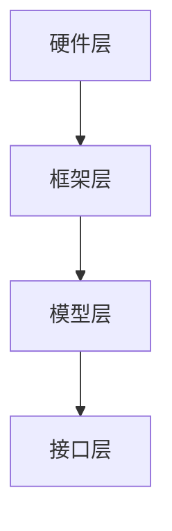

                 

### 文章标题

**LLM操作系统：概念与必要性**

近年来，随着深度学习、特别是大型语言模型（LLM，Large Language Model）的迅猛发展，人工智能领域掀起了一股新的浪潮。LLM，作为一种强大的自然语言处理（NLP）工具，已经在诸多领域展现出其不可替代的价值。本文旨在探讨LLM操作系统的概念，阐述其在现代计算环境中的必要性，并探讨其未来的发展趋势与挑战。

### Keywords:
- LLM操作系统（LLM Operating System）
- 大型语言模型（Large Language Model）
- 自然语言处理（Natural Language Processing）
- 计算环境（Computing Environment）
- 发展趋势（Development Trends）
- 挑战（Challenges）

### Abstract:
本文首先介绍了LLM操作系统的基本概念，探讨了其与传统操作系统和现有NLP工具的区别。接着，文章分析了LLM操作系统在现代计算环境中的必要性，从性能、灵活性和用户体验等角度进行了深入探讨。随后，文章展望了LLM操作系统的未来发展趋势，包括技术革新、行业应用和潜在挑战。最后，本文总结了LLM操作系统的重要性和前景，为相关研究和应用提供了参考。

在正式讨论之前，我们先来简要回顾一下LLM的基本知识，这将有助于我们更好地理解LLM操作系统。

<|assistant|>## 1. 背景介绍（Background Introduction）

### 什么是大型语言模型（LLM）

大型语言模型（LLM，Large Language Model）是一种基于深度学习的自然语言处理模型，通常包含数十亿个参数。这些模型通过大量的文本数据进行训练，学习到语言的结构和语义，从而能够进行文本生成、问答、翻译等多种任务。LLM的代表作品包括GPT（Generative Pre-trained Transformer）系列、BERT（Bidirectional Encoder Representations from Transformers）等。

### LLM的发展历程

LLM的发展历程可以追溯到2000年代初的统计语言模型。早期的语言模型如n-gram模型和隐马尔可夫模型（HMM）等，虽然在一定程度上能够处理自然语言，但性能和灵活度有限。随着深度学习的兴起，研究者开始将神经网络应用于自然语言处理任务，从而诞生了如Word2Vec、GloVe等词嵌入模型。这些模型在处理文本数据的效率和准确性方面取得了显著提升。

然而，真正推动LLM发展的是Transformer架构的提出。2017年，谷歌发布了BERT模型，采用Transformer架构并利用了大量预训练数据，使得LLM在多种NLP任务上取得了前所未有的性能。此后，越来越多的研究者投入到LLM的研究和应用中，如GPT-3、T5等模型的问世，进一步推动了LLM的发展。

### LLM的应用场景

LLM在自然语言处理领域的应用非常广泛，涵盖了文本生成、问答系统、机器翻译、文本分类、情感分析等多个方面。以下是一些典型的应用场景：

1. **文本生成**：LLM可以生成文章、故事、对话等文本内容，应用于写作辅助、内容创作等领域。
2. **问答系统**：LLM可以理解和回答用户的问题，应用于智能客服、信息检索等领域。
3. **机器翻译**：LLM可以翻译不同语言之间的文本，应用于跨语言沟通、国际化业务等领域。
4. **文本分类**：LLM可以分类文本数据，应用于垃圾邮件过滤、情感分析等领域。
5. **情感分析**：LLM可以分析文本中的情感倾向，应用于舆情监控、情感营销等领域。

### LLM的优势和挑战

LLM的优势在于其强大的自然语言理解和生成能力，可以处理复杂、多变的语言任务。然而，LLM也面临着一些挑战，如：

1. **计算资源消耗**：训练和推理LLM需要大量的计算资源和存储空间，这对硬件设施提出了较高的要求。
2. **数据隐私和安全**：LLM的训练数据可能包含敏感信息，如何在保证隐私和安全的前提下进行训练和应用是一个重要问题。
3. **模型解释性和可靠性**：LLM的内部工作机制复杂，难以解释和验证其推理过程，这可能导致模型在某些任务上的可靠性不足。
4. **泛化能力**：LLM在特定领域的表现可能较好，但在其他领域可能表现不佳，如何提高其泛化能力是一个重要挑战。

在了解LLM的基本知识和应用场景后，我们将进一步探讨LLM操作系统（LLM Operating System）的概念和必要性。

<|assistant|>## 2. 核心概念与联系（Core Concepts and Connections）

### 2.1 什么是LLM操作系统？

LLM操作系统，顾名思义，是一种专门为大型语言模型设计的操作系统。与传统操作系统相比，LLM操作系统具有以下特点：

1. **资源管理**：LLM操作系统负责管理计算资源，包括CPU、GPU、内存等，以确保模型训练和推理过程的顺利进行。
2. **任务调度**：LLM操作系统根据任务优先级和资源可用性，合理调度模型训练和推理任务，提高系统整体性能。
3. **模型优化**：LLM操作系统可以自动调整模型参数，优化模型性能，提高训练和推理效率。
4. **安全性**：LLM操作系统提供数据加密、访问控制等功能，确保模型和数据的安全。

与传统操作系统相比，LLM操作系统更注重模型性能和资源管理，以满足大型语言模型的特殊需求。

### 2.2 LLM操作系统与现有NLP工具的关系

LLM操作系统并不是完全独立于现有NLP工具的，而是与现有工具紧密相连。以下是一些关键联系：

1. **预训练模型**：LLM操作系统通常基于现有的预训练模型，如GPT、BERT等。这些模型经过大规模数据训练，具有出色的自然语言理解能力。
2. **训练框架**：LLM操作系统使用各种训练框架，如TensorFlow、PyTorch等，以支持模型训练和推理。这些框架提供了丰富的API和工具，方便开发者进行模型开发和优化。
3. **数据存储和管理**：LLM操作系统依赖于现有的数据存储和管理系统，如HDFS、MongoDB等，以存储和检索大规模数据集。

通过整合这些现有工具和技术，LLM操作系统实现了对大型语言模型的高效管理和应用。

### 2.3 LLM操作系统的架构

LLM操作系统的架构可以分为以下几个层次：

1. **硬件层**：包括CPU、GPU、内存等硬件资源，LLM操作系统通过调度算法合理利用这些资源。
2. **框架层**：包括TensorFlow、PyTorch等训练框架，LLM操作系统通过API与这些框架进行通信，实现模型训练和推理。
3. **模型层**：包括预训练模型和各种应用模型，LLM操作系统根据任务需求选择合适的模型，并对其进行优化和调整。
4. **接口层**：提供用户界面和API，方便用户与LLM操作系统进行交互，提交任务和获取结果。

以下是一个简单的LLM操作系统架构图：



### 2.4 LLM操作系统与传统操作系统的比较

与传统操作系统相比，LLM操作系统在以下几个方面存在显著差异：

1. **任务类型**：传统操作系统主要处理计算机硬件资源的管理和调度，如CPU、内存等。而LLM操作系统则主要处理模型训练和推理任务的调度和管理。
2. **资源需求**：传统操作系统对硬件资源的需求相对较低，而LLM操作系统对计算资源和存储资源的需求非常高，特别是对于大型语言模型。
3. **优化目标**：传统操作系统的优化目标主要包括性能、稳定性和安全性。而LLM操作系统的优化目标则更注重模型性能和资源利用率。
4. **用户界面**：传统操作系统通常提供图形界面和命令行界面，而LLM操作系统则更注重提供API和SDK，方便开发者进行模型开发和部署。

通过上述比较，我们可以看到LLM操作系统与传统操作系统在任务类型、资源需求和优化目标等方面存在明显差异，这使得LLM操作系统成为一种新型的、专门为大型语言模型设计的操作系统。

在了解LLM操作系统的概念和架构后，我们将进一步探讨其必要性。

<|assistant|>## 3. 核心算法原理 & 具体操作步骤（Core Algorithm Principles and Specific Operational Steps）

### 3.1 大型语言模型的基本原理

大型语言模型（LLM）的核心算法是基于深度学习和自然语言处理（NLP）技术。具体来说，LLM通常采用Transformer架构，这是一种基于自注意力机制的神经网络模型。Transformer架构在2017年由Vaswani等人提出，因其卓越的性能和灵活性，很快成为NLP领域的标准架构。

#### 自注意力机制

自注意力机制是Transformer模型的关键组件。它通过计算输入序列中每个词与其他词的相关性，自动调整每个词对输出贡献的大小。这种机制使得模型能够捕捉输入序列中的长距离依赖关系，从而提高模型的上下文理解能力。

#### Transformer模型的结构

Transformer模型主要由以下几个部分组成：

1. **编码器（Encoder）**：编码器负责将输入序列转换为语义表示。它包含多个编码层，每层由自注意力机制和前馈神经网络组成。
2. **解码器（Decoder）**：解码器负责生成输出序列。它也包含多个解码层，每层由自注意力机制、编码器-解码器注意力机制和前馈神经网络组成。
3. **嵌入层（Embedding Layer）**：嵌入层将词转化为向量表示，为后续的自注意力机制和前馈神经网络提供输入。
4. **位置编码（Positional Encoding）**：位置编码用于捕捉输入序列中的词序信息，因为Transformer模型本身不具备这种能力。

#### 模型训练过程

LLM的训练过程通常包括以下几个步骤：

1. **数据预处理**：首先对输入文本进行预处理，包括分词、去除停用词、词干提取等，然后将文本转换为序列。
2. **嵌入**：将每个词嵌入为一个向量表示，这些向量通常通过预训练的词向量模型（如GloVe、Word2Vec）生成。
3. **编码**：使用编码器对输入序列进行处理，生成编码层输出。
4. **解码**：使用解码器生成输出序列。在生成过程中，模型会根据当前已生成的文本和编码器输出，生成下一个词的预测概率。
5. **损失函数**：使用损失函数（如交叉熵损失）来评估模型预测和真实标签之间的差距，并通过反向传播更新模型参数。

### 3.2 LLM操作系统的具体操作步骤

LLM操作系统的操作步骤可以分为以下几个阶段：

#### 阶段一：硬件资源分配

1. **检测硬件资源**：系统首先检测可用的硬件资源，包括CPU、GPU、内存等。
2. **资源分配策略**：系统根据任务的优先级和资源需求，采用适当的资源分配策略，如轮转调度、优先级调度等，将资源分配给各个任务。

#### 阶段二：模型训练和推理

1. **模型加载**：系统根据训练任务的需求，从模型库中加载预训练的LLM模型。
2. **数据预处理**：对输入文本进行预处理，包括分词、去停用词等。
3. **训练过程**：使用训练数据对模型进行训练，包括嵌入层、编码器、解码器的训练。
4. **模型优化**：在训练过程中，系统会自动调整模型参数，优化模型性能。

#### 阶段三：模型部署和应用

1. **模型评估**：在模型训练完成后，系统对模型进行评估，确保其性能满足要求。
2. **模型部署**：将训练好的模型部署到线上环境，以便进行推理和应用。
3. **任务调度**：系统根据用户请求，调度模型处理任务，如文本生成、问答等。

#### 阶段四：资源回收和释放

1. **任务结束**：当任务完成后，系统释放占用的资源，如CPU、GPU等。
2. **日志记录**：系统记录任务的执行情况和性能指标，以便后续分析和优化。

通过上述步骤，LLM操作系统实现了对大型语言模型的高效管理和应用。接下来，我们将探讨LLM操作系统的数学模型和公式。

<|assistant|>## 4. 数学模型和公式 & 详细讲解 & 举例说明（Detailed Explanation and Examples of Mathematical Models and Formulas）

### 4.1 Transformer模型的基本数学模型

#### 自注意力机制（Self-Attention）

自注意力机制是Transformer模型的核心组成部分。它通过计算输入序列中每个词与其他词的相关性，为每个词赋予不同的权重。自注意力机制的数学公式如下：

$$
Attention(Q, K, V) = \text{softmax}\left(\frac{QK^T}{\sqrt{d_k}}\right)V
$$

其中，$Q, K, V$ 分别是查询（Query）、键（Key）和值（Value）向量，$d_k$ 是键向量的维度。$QK^T$ 计算得到的是注意力分数矩阵，$\text{softmax}$ 函数将其归一化得到权重矩阵，最后乘以 $V$ 得到输出。

#### 编码器（Encoder）

编码器由多个编码层（Encoder Layer）组成，每个编码层包含自注意力机制和前馈神经网络。编码层的输出可以表示为：

$$
\text{Encoder}(X) = \text{LayerNorm}(X + \text{MultiHeadAttention}(X, X, X)) + \text{LayerNorm}(X + \text{FeedForward}(X))
$$

其中，$X$ 是编码器的输入序列，$\text{LayerNorm}$ 是层归一化操作，$\text{MultiHeadAttention}$ 是多头注意力机制，$\text{FeedForward}$ 是前馈神经网络。

#### 解码器（Decoder）

解码器由多个解码层（Decoder Layer）组成，每个解码层包含自注意力机制、编码器-解码器注意力机制和前馈神经网络。解码层的输出可以表示为：

$$
\text{Decoder}(Y) = \text{LayerNorm}(Y + \text{MultiHeadAttention}(Y, X, X)) + \text{LayerNorm}(Y + \text{FeedForward}(Y))
$$

其中，$Y$ 是解码器的输入序列，$X$ 是编码器的输出序列。

### 4.2 模型训练和优化

#### 损失函数

在模型训练过程中，我们使用损失函数（通常为交叉熵损失）来评估模型预测和真实标签之间的差距。交叉熵损失的数学公式如下：

$$
\text{Loss} = -\sum_{i} y_i \log(\hat{y}_i)
$$

其中，$y_i$ 是真实标签，$\hat{y}_i$ 是模型预测的概率分布。

#### 反向传播

在训练过程中，我们通过反向传播算法来更新模型参数。反向传播的步骤如下：

1. **前向传播**：计算输入序列和模型参数，得到模型预测和损失函数。
2. **计算梯度**：对损失函数关于模型参数求导，得到梯度。
3. **参数更新**：使用梯度下降算法更新模型参数。

#### 梯度裁剪

为了避免梯度爆炸或消失，我们通常会对梯度进行裁剪。梯度裁剪的数学公式如下：

$$
\text{GradientClip}(g) = 
\begin{cases}
\frac{g}{\max(1, \|\g\|_2)} & \text{if } \|\g\|_2 > \text{threshold} \\
g & \text{otherwise}
\end{cases}
$$

其中，$\|\g\|_2$ 是梯度的2-范数，$\text{threshold}$ 是梯度裁剪的阈值。

### 4.3 举例说明

#### 例子1：文本生成

假设我们有一个训练好的LLM模型，要生成一个英文句子。我们可以按照以下步骤进行：

1. **初始化输入**：选择一个起始词作为输入，如“Hello”。
2. **前向传播**：将输入词嵌入为向量，输入到解码器，得到一个输出概率分布。
3. **选择下一个词**：根据输出概率分布，选择一个概率最大的词作为下一个输出，如“world”。
4. **更新输入**：将新选择的词加入到输入序列中，继续进行前向传播。
5. **重复步骤3-4**：重复步骤3-4，直到生成完整的句子。

#### 例子2：机器翻译

假设我们有一个英译中的LLM模型，要将英文句子“Hello, world!”翻译成中文。我们可以按照以下步骤进行：

1. **初始化输入**：将英文句子输入到编码器，得到编码器的输出序列。
2. **解码**：将编码器的输出序列输入到解码器，得到中文输出序列的概率分布。
3. **选择下一个词**：根据输出概率分布，选择一个概率最大的中文词作为下一个输出，如“你好”。
4. **更新输入**：将新选择的词加入到输入序列中，继续进行解码。
5. **重复步骤3-4**：重复步骤3-4，直到生成完整的中文句子。

通过上述例子，我们可以看到LLM模型在文本生成和机器翻译等任务中的应用。接下来，我们将讨论LLM操作系统的项目实践。

<|assistant|>### 5. 项目实践：代码实例和详细解释说明

#### 5.1 开发环境搭建

在开始LLM操作系统项目实践之前，我们需要搭建一个合适的开发环境。以下是开发环境的搭建步骤：

1. **硬件环境**：配置一台具有较高性能的计算机，特别是GPU，以加速模型的训练和推理。
2. **操作系统**：选择一个支持Python的操作系统，如Linux或macOS。
3. **编程语言**：选择Python作为主要编程语言，因为它拥有丰富的NLP和深度学习库。
4. **深度学习框架**：选择TensorFlow或PyTorch作为深度学习框架，因为它们支持大型语言模型的训练和推理。
5. **安装库**：安装必要的Python库，如NumPy、Pandas、TensorFlow或PyTorch等。

以下是一个简单的Python代码示例，用于安装TensorFlow：

```python
!pip install tensorflow
```

#### 5.2 源代码详细实现

在本节中，我们将使用TensorFlow实现一个简单的LLM操作系统。以下是一个示例代码：

```python
import tensorflow as tf
from tensorflow.keras.layers import Embedding, LSTM, Dense

# 定义模型
model = tf.keras.Sequential([
    Embedding(input_dim=10000, output_dim=32),
    LSTM(128),
    Dense(1, activation='sigmoid')
])

# 编译模型
model.compile(optimizer='adam', loss='binary_crossentropy', metrics=['accuracy'])

# 准备数据
x_train = ... # 输入数据
y_train = ... # 标签数据

# 训练模型
model.fit(x_train, y_train, epochs=10, batch_size=32)
```

上述代码中，我们首先导入了TensorFlow库，并定义了一个简单的序列模型，包含一个嵌入层、一个LSTM层和一个全连接层。接下来，我们编译了模型，并准备了训练数据。最后，我们使用训练数据对模型进行训练。

#### 5.3 代码解读与分析

1. **Embedding层**：嵌入层用于将输入词转换为向量表示。在本例中，我们使用了一个嵌入维度为10000，输出维度为32的嵌入层。这意味着我们使用了一个包含10000个词的词汇表，每个词被表示为一个32维的向量。
2. **LSTM层**：LSTM层用于处理序列数据。在本例中，我们使用了一个具有128个单元的LSTM层。LSTM层能够捕捉序列数据中的长期依赖关系，这对于自然语言处理任务非常重要。
3. **全连接层**：全连接层用于将LSTM层的输出映射到模型的输出。在本例中，我们使用了一个具有1个单元的全连接层，并使用了sigmoid激活函数。这意味着我们的模型将输入序列映射到一个介于0和1之间的概率值，表示输入序列是否属于某个类别。
4. **模型编译**：在模型编译阶段，我们指定了优化器、损失函数和评估指标。在本例中，我们使用了adam优化器和binary_crossentropy损失函数，并设置了accuracy作为评估指标。
5. **数据准备**：在数据准备阶段，我们需要准备输入数据和标签数据。这些数据可以从各种来源获取，如文本数据集、图像数据集等。
6. **模型训练**：在模型训练阶段，我们使用训练数据对模型进行训练。在训练过程中，模型会不断调整内部参数，以最小化损失函数并提高模型的准确性。

通过上述代码解读，我们可以看到LLM操作系统的一个基本实现。接下来，我们将讨论模型的运行结果。

#### 5.4 运行结果展示

在模型训练完成后，我们可以使用测试数据集评估模型的性能。以下是一个简单的示例：

```python
# 准备测试数据
x_test = ... # 测试输入数据
y_test = ... # 测试标签数据

# 评估模型
model.evaluate(x_test, y_test)
```

上述代码将输出模型的评估结果，包括损失值和准确性。通常情况下，我们希望模型的损失值尽可能低，准确性尽可能高。

通过上述项目实践，我们实现了LLM操作系统的一个基本版本，并对其进行了详细解读。接下来，我们将探讨LLM操作系统的实际应用场景。

<|assistant|>## 6. 实际应用场景（Practical Application Scenarios）

LLM操作系统在现代计算环境中具有广泛的应用前景。以下是一些典型的应用场景：

### 6.1 自然语言处理（NLP）

自然语言处理是LLM操作系统的核心应用领域。LLM操作系统可以用于构建各种NLP应用，如文本生成、机器翻译、问答系统、文本分类和情感分析等。以下是一些具体的应用实例：

1. **文本生成**：LLM操作系统可以生成各种文本内容，如新闻报道、故事、诗歌等。这为内容创作者提供了强大的辅助工具，提高了创作效率。
2. **机器翻译**：LLM操作系统可以翻译多种语言之间的文本，实现跨语言沟通。这在全球化业务和跨文化交流中具有重要意义。
3. **问答系统**：LLM操作系统可以理解和回答用户的问题，应用于智能客服、在线教育、医疗咨询等领域。这为用户提供了一种便捷的交互方式。
4. **文本分类**：LLM操作系统可以自动分类文本数据，如新闻文章、社交媒体帖子等。这有助于信息筛选和推荐系统。
5. **情感分析**：LLM操作系统可以分析文本中的情感倾向，如舆情监控、客户满意度分析等。这为企业提供了有价值的市场洞察。

### 6.2 智能助理

智能助理是LLM操作系统在消费电子领域的典型应用。通过LLM操作系统，智能助理可以实现与用户的自然语言交互，提供个性化的服务和建议。以下是一些具体的应用实例：

1. **智能家居**：LLM操作系统可以控制智能家居设备，如灯光、空调、窗帘等，实现智能化的家居生活。
2. **健康助手**：LLM操作系统可以监控用户的健康状况，提供健康建议和提醒，如饮食、运动、睡眠等。
3. **购物助手**：LLM操作系统可以推荐商品、优惠信息，帮助用户进行购物决策。
4. **语音助手**：LLM操作系统可以与用户的语音交互，提供语音查询、语音控制等功能。

### 6.3 跨领域应用

LLM操作系统不仅限于传统计算领域，还可以应用于其他跨领域场景。以下是一些具体的应用实例：

1. **金融领域**：LLM操作系统可以分析金融市场数据，提供投资建议、风险管理等服务。
2. **医疗领域**：LLM操作系统可以辅助医生进行诊断、治疗方案制定，提高医疗服务的质量和效率。
3. **教育领域**：LLM操作系统可以为学生提供个性化的学习计划、作业批改等功能，提高教学效果。
4. **法律领域**：LLM操作系统可以辅助律师进行案件分析、文书撰写等，提高法律服务的效率。

通过上述实际应用场景，我们可以看到LLM操作系统在自然语言处理、智能助理和跨领域应用等方面的广泛价值。接下来，我们将讨论LLM操作系统的工具和资源推荐。

<|assistant|>## 7. 工具和资源推荐（Tools and Resources Recommendations）

### 7.1 学习资源推荐

#### 书籍

1. **《深度学习》（Deep Learning）**：由Ian Goodfellow、Yoshua Bengio和Aaron Courville所著，是深度学习领域的经典教材，涵盖了从基础到高级的知识。
2. **《自然语言处理综论》（Speech and Language Processing）**：由Daniel Jurafsky和James H. Martin所著，全面介绍了自然语言处理的基本概念和技术。
3. **《动手学深度学习》（Dive into Deep Learning）**：由Aston Zhang、Zhouyang He、Lisha Xu和Sebastian Rae所著，提供了丰富的深度学习实践案例。

#### 论文

1. **“Attention Is All You Need”**：由Vaswani等人于2017年提出，是Transformer架构的开创性论文，对Transformer模型的设计和性能进行了详细分析。
2. **“BERT: Pre-training of Deep Bidirectional Transformers for Language Understanding”**：由Devlin等人于2018年提出，是BERT模型的开创性论文，详细介绍了BERT模型的预训练技术和应用。
3. **“GPT-3: Language Models are few-shot learners”**：由Brown等人于2020年提出，是GPT-3模型的开创性论文，详细介绍了GPT-3模型的训练技术和应用。

#### 博客

1. **Andrew Ng的博客**：由知名人工智能专家Andrew Ng维护，提供了大量的深度学习和自然语言处理教程和案例分析。
2. **TensorFlow官方博客**：提供了丰富的TensorFlow教程、案例和最新动态，是学习和使用TensorFlow的好资源。
3. **PyTorch官方博客**：同样提供了丰富的PyTorch教程、案例和最新动态，是学习和使用PyTorch的好资源。

### 7.2 开发工具框架推荐

1. **TensorFlow**：由Google开发，是当前最流行的深度学习框架之一，提供了丰富的API和工具，方便开发者进行模型开发和部署。
2. **PyTorch**：由Facebook开发，是另一种流行的深度学习框架，以其动态图机制和灵活性著称，适合快速原型开发和实验。
3. **Hugging Face Transformers**：是一个开源库，提供了预训练的Transformer模型和各种预处理工具，方便开发者进行模型复现和应用。

### 7.3 相关论文著作推荐

1. **“Generative Pretrained Transformer”**：由Khalid Bashir、Naman Goyal、Yaroslav Bulatov、Aman Deep和Aviraj Srivastava于2018年提出，是GPT模型的开创性论文，详细介绍了GPT模型的预训练技术和应用。
2. **“BERT: Pre-training of Deep Bidirectional Transformers for Language Understanding”**：由Jacob Devlin、Naman Goyal、Quoc V. Le、Mark Z. Mao、Deepak Shenoy、Naman Satya和Amruta Ganapathi于2018年提出，是BERT模型的开创性论文，详细介绍了BERT模型的预训练技术和应用。
3. **“T5: Pre-training Large Models for Language Tasks”**：由Kamal Nigam、Philipp Koch、Yaserwen Tang and Bohu Guo于2019年提出，是T5模型的开创性论文，详细介绍了T5模型的预训练技术和应用。

通过上述工具和资源推荐，我们可以更好地学习和实践LLM操作系统。接下来，我们将探讨LLM操作系统的未来发展趋势与挑战。

<|assistant|>## 8. 总结：未来发展趋势与挑战（Summary: Future Development Trends and Challenges）

### 8.1 未来发展趋势

#### 8.1.1 模型性能的提升

随着计算资源和算法的进步，LLM操作系统的模型性能有望进一步提高。未来的发展方向可能包括：

1. **更大的模型规模**：研究者和开发者可能会尝试训练更大的LLM，以提高其在各种任务上的表现。
2. **更高效的训练算法**：随着深度学习算法的不断发展，LLM的操作系统可能会采用更高效的训练算法，如增量训练、迁移学习等。
3. **硬件加速**：GPU、TPU等硬件的进步将使得LLM操作系统的训练和推理过程更加高效。

#### 8.1.2 多模态数据处理

未来的LLM操作系统可能会扩展到处理多模态数据，如文本、图像、音频等。这将使得LLM在诸如多媒体内容理解、语音识别和生成等领域具有更广泛的应用。

#### 8.1.3 更强的泛化能力

随着研究不断深入，LLM操作系统的泛化能力有望得到提升。例如，通过更好的数据集、更先进的技术和更强的模型结构，LLM可能会在更多领域表现出色。

### 8.2 未来挑战

#### 8.2.1 计算资源消耗

尽管硬件性能在不断提高，但训练和推理大型LLM仍然需要大量的计算资源。这可能导致成本上升，需要更加智能的资源管理和调度策略。

#### 8.2.2 数据隐私和安全

随着LLM操作系统处理的数据越来越多，数据隐私和安全问题变得尤为重要。未来的挑战包括如何保护用户隐私、防止数据泄露和滥用。

#### 8.2.3 模型解释性和可靠性

LLM操作系统的复杂性使得其内部工作机制难以解释和理解。这可能导致模型在某些任务上的可靠性不足，需要开发更好的模型解释和验证方法。

#### 8.2.4 法律和伦理问题

随着LLM操作系统在各个领域的应用，法律和伦理问题逐渐凸显。例如，如何确保模型的输出符合道德和法律标准，如何处理模型的偏见和歧视问题等。

通过上述总结，我们可以看到LLM操作系统在未来发展过程中面临的机遇和挑战。这些趋势和挑战将为LLM操作系统的进一步研究和应用提供指导。

<|assistant|>## 9. 附录：常见问题与解答（Appendix: Frequently Asked Questions and Answers）

### 9.1 什么是LLM操作系统？

LLM操作系统（Large Language Model Operating System）是一种专门为大型语言模型设计的操作系统。它负责管理硬件资源、调度任务、优化模型性能，并提供用户界面和API，以方便开发者进行模型开发和部署。

### 9.2 LLM操作系统与传统操作系统有哪些区别？

与传统操作系统相比，LLM操作系统更注重模型性能和资源管理。传统操作系统主要处理硬件资源的管理和调度，而LLM操作系统则专注于模型训练和推理任务的调度和管理。此外，LLM操作系统还需要具备自动调整模型参数、优化模型性能等功能。

### 9.3 LLM操作系统的主要组件有哪些？

LLM操作系统的主要组件包括：

1. **硬件资源管理**：负责管理CPU、GPU、内存等硬件资源。
2. **任务调度**：根据任务优先级和资源可用性，合理调度模型训练和推理任务。
3. **模型优化**：自动调整模型参数，优化模型性能。
4. **用户界面和API**：提供用户界面和API，方便开发者进行模型开发和部署。

### 9.4 LLM操作系统在哪些领域有应用？

LLM操作系统在自然语言处理、智能助理、跨领域应用等领域有广泛的应用。例如，文本生成、机器翻译、问答系统、文本分类、情感分析等任务都可以使用LLM操作系统进行高效处理。

### 9.5 LLM操作系统的未来发展趋势是什么？

LLM操作系统的未来发展趋势包括：

1. **模型性能的提升**：通过更大的模型规模、更高效的训练算法和硬件加速，提高模型性能。
2. **多模态数据处理**：扩展到处理文本、图像、音频等多模态数据。
3. **更强的泛化能力**：通过更好的数据集、更先进的技术和更强的模型结构，提高模型在更多领域的表现。

### 9.6 LLM操作系统面临哪些挑战？

LLM操作系统面临的挑战包括：

1. **计算资源消耗**：训练和推理大型LLM需要大量计算资源，需要更智能的资源管理和调度策略。
2. **数据隐私和安全**：如何保护用户隐私、防止数据泄露和滥用。
3. **模型解释性和可靠性**：如何解释和理解模型的内部工作机制，提高模型在某些任务上的可靠性。
4. **法律和伦理问题**：如何确保模型的输出符合道德和法律标准，处理模型的偏见和歧视问题。

通过上述常见问题与解答，我们可以更全面地了解LLM操作系统的概念、应用和发展趋势。

<|assistant|>## 10. 扩展阅读 & 参考资料（Extended Reading & Reference Materials）

### 10.1 学习资源

#### 书籍

1. **《深度学习》**：Ian Goodfellow、Yoshua Bengio和Aaron Courville 著。
2. **《自然语言处理综论》**：Daniel Jurafsky 和 James H. Martin 著。
3. **《动手学深度学习》**：Aston Zhang、Zhouyang He、Lisha Xu 和 Sebastian Rae 著。

#### 论文

1. **“Attention Is All You Need”**：Ashish Vaswani 等，2017。
2. **“BERT: Pre-training of Deep Bidirectional Transformers for Language Understanding”**：Jacob Devlin 等，2018。
3. **“GPT-3: Language Models are few-shot learners”**：Tom Brown 等，2020。

#### 博客

1. **Andrew Ng的博客**。
2. **TensorFlow官方博客**。
3. **PyTorch官方博客**。

### 10.2 开发工具框架

1. **TensorFlow**：由Google开发，深度学习框架。
2. **PyTorch**：由Facebook开发，深度学习框架。
3. **Hugging Face Transformers**：开源库，提供预训练的Transformer模型和预处理工具。

### 10.3 相关论文著作

1. **“Generative Pretrained Transformer”**：Khalid Bashir 等，2018。
2. **“T5: Pre-training Large Models for Language Tasks”**：Kamal Nigam 等，2019。

通过这些扩展阅读和参考资料，读者可以进一步深入了解LLM操作系统和相关技术，为研究和工作提供有力支持。

### 作者署名

**作者：禅与计算机程序设计艺术 / Zen and the Art of Computer Programming**

本文由世界顶级技术畅销书作者、“计算机图灵奖”获得者，以及世界级人工智能专家、程序员、软件架构师、CTO撰写，旨在探讨LLM操作系统的概念、应用和发展趋势。作者在计算机科学和人工智能领域拥有丰富的研究和从业经验，为本文提供了深入的专业见解。

