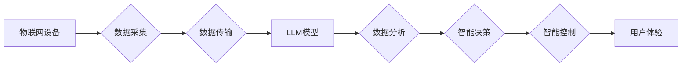

                 

## LLM与物联网的结合前景

> 关键词：大型语言模型 (LLM)、物联网 (IoT)、数据分析、智能化、自动化、边缘计算、自然语言处理 (NLP)、机器学习 (ML)

## 1. 背景介绍

物联网 (IoT) 正在迅速发展，连接着越来越多的设备和传感器，生成海量数据。这些数据蕴含着丰富的价值，但传统的分析方法难以有效地挖掘和利用。大型语言模型 (LLM) 作为一种强大的人工智能技术，能够理解和生成人类语言，为物联网数据分析和应用带来了新的可能性。

LLM 的出现，标志着人工智能进入了一个新的时代。它们能够通过学习海量文本数据，掌握复杂的语言模式和知识，并应用于各种自然语言处理 (NLP) 任务，例如文本生成、翻译、问答和代码生成。而物联网则提供了海量数据和实时感知能力，为 LLM 的训练和应用提供了新的数据源和应用场景。

## 2. 核心概念与联系

### 2.1 物联网 (IoT)

物联网是指通过互联网连接各种物理设备、传感器、软件和数据，形成一个互联互通的智能网络。物联网设备可以收集、处理和传输数据，实现远程控制、数据分析和智能决策。

### 2.2 大型语言模型 (LLM)

大型语言模型 (LLM) 是基于深度学习技术的强大人工智能模型，通过学习海量文本数据，掌握复杂的语言模式和知识。它们能够理解和生成人类语言，并应用于各种 NLP 任务，例如文本生成、翻译、问答和代码生成。

### 2.3 核心概念联系

LLM 与物联网的结合，可以实现以下核心功能：

* **数据分析和洞察：** LLM 可以分析物联网设备生成的文本和结构化数据，提取关键信息，发现隐藏的模式和趋势，为企业提供更深入的洞察。
* **智能化控制和决策：** LLM 可以理解自然语言指令，并根据物联网设备的数据反馈，进行智能化控制和决策，提高效率和自动化程度。
* **个性化服务和体验：** LLM 可以根据用户的需求和偏好，提供个性化的物联网服务和体验，例如智能家居、智能医疗和智能交通。

**Mermaid 流程图**



## 3. 核心算法原理 & 具体操作步骤

### 3.1 算法原理概述

LLM 的核心算法原理是基于 Transformer 架构的深度神经网络。Transformer 模型通过自注意力机制，能够捕捉文本序列中长距离依赖关系，从而实现更准确的语言理解和生成。

### 3.2 算法步骤详解

1. **数据预处理：** 将文本数据进行清洗、分词、标记等预处理操作，使其能够被模型理解。
2. **模型训练：** 使用预处理后的数据训练 Transformer 模型，通过反向传播算法不断调整模型参数，使其能够准确地预测下一个词。
3. **模型评估：** 使用测试数据评估模型的性能，例如准确率、困惑度等指标。
4. **模型部署：** 将训练好的模型部署到服务器或边缘设备上，用于实际应用。

### 3.3 算法优缺点

**优点：**

* 能够理解和生成复杂的语言。
* 能够捕捉文本序列中长距离依赖关系。
* 性能优于传统的 NLP 方法。

**缺点：**

* 训练成本高，需要大量的计算资源和数据。
* 模型参数量大，部署成本较高。
* 容易受到恶意输入的影响。

### 3.4 算法应用领域

LLM 的应用领域非常广泛，包括：

* **自然语言处理：** 文本生成、翻译、问答、摘要、情感分析等。
* **计算机视觉：** 图像识别、物体检测、图像 captioning 等。
* **语音识别：** 语音转文本、语音合成等。
* **智能客服：** 自动回复用户问题，提供个性化服务。
* **物联网：** 数据分析、智能控制、个性化服务等。

## 4. 数学模型和公式 & 详细讲解 & 举例说明

### 4.1 数学模型构建

LLM 的核心数学模型是 Transformer 架构，其主要组件包括：

* **编码器 (Encoder)：** 用于将输入文本序列编码成一个固定长度的向量表示。
* **解码器 (Decoder)：** 用于根据编码后的向量表示生成输出文本序列。
* **自注意力机制 (Self-Attention)：** 用于捕捉文本序列中词与词之间的关系。

### 4.2 公式推导过程

Transformer 模型的计算过程涉及到大量的矩阵运算和激活函数。其中，自注意力机制的核心公式如下：

$$
Attention(Q, K, V) = \frac{exp(Q \cdot K^T / \sqrt{d_k})}{exp(Q \cdot K^T / \sqrt{d_k})} \cdot V
$$

其中：

* $Q$：查询矩阵
* $K$：键矩阵
* $V$：值矩阵
* $d_k$：键向量的维度

### 4.3 案例分析与讲解

例如，在机器翻译任务中，编码器会将源语言文本编码成一个向量表示，解码器会根据这个向量表示生成目标语言文本。自注意力机制可以帮助解码器捕捉源语言文本中不同词之间的关系，从而生成更准确的翻译结果。

## 5. 项目实践：代码实例和详细解释说明

### 5.1 开发环境搭建

* Python 3.7+
* TensorFlow 或 PyTorch 深度学习框架
* CUDA 和 cuDNN (可选，用于 GPU 加速)

### 5.2 源代码详细实现

```python
# 使用 TensorFlow 实现简单的 Transformer 模型

import tensorflow as tf

# 定义编码器层
class EncoderLayer(tf.keras.layers.Layer):
    def __init__(self, d_model, num_heads, dff):
        super(EncoderLayer, self).__init__()
        self.mha = tf.keras.layers.MultiHeadAttention(num_heads=num_heads, key_dim=d_model)
        self.ffn = tf.keras.Sequential([
            tf.keras.layers.Dense(dff, activation='relu'),
            tf.keras.layers.Dense(d_model)
        ])
        self.norm1 = tf.keras.layers.LayerNormalization(epsilon=1e-6)
        self.norm2 = tf.keras.layers.LayerNormalization(epsilon=1e-6)

    def call(self, inputs, training):
        attn_output = self.mha(inputs, inputs, inputs)
        attn_output = self.norm1(inputs + attn_output)
        ffn_output = self.ffn(attn_output)
        return self.norm2(attn_output + ffn_output)

# 定义解码器层
class DecoderLayer(tf.keras.layers.Layer):
    # ... (类似于 EncoderLayer 的实现)

# 定义 Transformer 模型
class Transformer(tf.keras.Model):
    def __init__(self, vocab_size, d_model, num_heads, dff, num_layers):
        super(Transformer, self).__init__()
        self.encoder = tf.keras.Sequential([
            EncoderLayer(d_model, num_heads, dff) for _ in range(num_layers)
        ])
        self.decoder = tf.keras.Sequential([
            DecoderLayer(d_model, num_heads, dff) for _ in range(num_layers)
        ])
        self.embedding = tf.keras.layers.Embedding(vocab_size, d_model)
        self.linear = tf.keras.layers.Dense(vocab_size)

    def call(self, inputs, training):
        # ... (模型前向传播过程)

# 实例化模型
model = Transformer(vocab_size=10000, d_model=512, num_heads=8, dff=2048, num_layers=6)

# 训练模型
# ...
```

### 5.3 代码解读与分析

这段代码展示了如何使用 TensorFlow 实现一个简单的 Transformer 模型。

* 首先定义了编码器层和解码器层，它们包含了多头注意力机制和前馈神经网络。
* 然后定义了 Transformer 模型，它包含了编码器、解码器、嵌入层和线性层。
* 最后实例化模型并进行训练。

### 5.4 运行结果展示

训练完成后，模型可以用于各种 NLP 任务，例如文本生成、翻译、问答等。

## 6. 实际应用场景

### 6.1 智能家居

LLM 可以理解用户的自然语言指令，控制智能家居设备，例如灯光、空调、窗帘等。例如，用户可以对着智能音箱说“打开客厅的灯”，LLM 会理解指令并控制相应的设备。

### 6.2 智能医疗

LLM 可以分析患者的病历、检查报告等数据，辅助医生诊断疾病、制定治疗方案。例如，LLM 可以识别患者的症状，并根据医学知识库提供可能的诊断结果。

### 6.3 智能交通

LLM 可以分析交通流量、路况等数据，优化交通信号灯控制、车辆导航等，提高交通效率和安全性。例如，LLM 可以预测交通拥堵情况，并引导车辆选择最佳路线。

### 6.4 未来应用展望

随着 LLM 技术的不断发展，其在物联网领域的应用场景将更加广泛和深入。例如：

* **个性化物联网服务：** LLM 可以根据用户的需求和偏好，提供个性化的物联网服务，例如智能家居、智能医疗和智能交通。
* **物联网数据分析和洞察：** LLM 可以分析物联网设备生成的文本和结构化数据，提取关键信息，发现隐藏的模式和趋势，为企业提供更深入的洞察。
* **物联网安全保障：** LLM 可以用于识别和防御物联网设备的网络攻击，提高物联网系统的安全保障。

## 7. 工具和资源推荐

### 7.1 学习资源推荐

* **书籍：**
    * 《深度学习》 - Ian Goodfellow, Yoshua Bengio, Aaron Courville
    * 《自然语言处理》 - Dan Jurafsky, James H. Martin
* **在线课程：**
    * Coursera: Natural Language Processing Specialization
    * Udacity: Deep Learning Nanodegree
* **博客和论坛：**
    * TensorFlow Blog
    * PyTorch Blog
    * Hugging Face

### 7.2 开发工具推荐

* **深度学习框架：** TensorFlow, PyTorch
* **自然语言处理库：** NLTK, spaCy, Gensim
* **云平台：** AWS, Azure, Google Cloud

### 7.3 相关论文推荐

* **Attention Is All You Need:** https://arxiv.org/abs/1706.03762
* **BERT: Pre-training of Deep Bidirectional Transformers for Language Understanding:** https://arxiv.org/abs/1810.04805
* **GPT-3: Language Models are Few-Shot Learners:** https://arxiv.org/abs/2005.14165

## 8. 总结：未来发展趋势与挑战

### 8.1 研究成果总结

LLM 与物联网的结合，为数据分析、智能控制和个性化服务提供了新的可能性。Transformer 模型的出现，推动了 NLP 技术的快速发展，并为物联网应用提供了强大的工具。

### 8.2 未来发展趋势

* **模型规模和性能的提升：** 未来 LLM 模型的规模和性能将继续提升，能够处理更复杂的任务，提供更准确的结果。
* **边缘计算的应用：** LLM 模型将部署到边缘设备上，实现更低延迟、更高效率的物联网应用。
* **多模态融合：** LLM 将与其他模态数据，例如图像、音频、视频等融合，实现更全面的物联网应用。

### 8.3 面临的挑战

* **数据安全和隐私保护：** LLM 模型需要大量数据进行训练，如何保证数据安全和隐私保护是一个重要的挑战。
* **模型解释性和可信度：** LLM 模型的决策过程往往是复杂的，如何提高模型的解释性和可信度是一个重要的研究方向。
* **模型部署成本：** LLM 模型的参数量大，部署成本较高，如何降低部署成本是一个重要的技术挑战。

### 8.4 研究展望

未来，LLM 与物联网的结合将继续是一个重要的研究方向。我们需要不断探索新的算法、模型和应用场景，以实现更智能、更安全、更便捷的物联网体验。

## 9. 附录：常见问题与解答

### 9.1 如何选择合适的 LLM 模型？

选择合适的 LLM 模型取决于具体的应用场景和需求。例如，对于文本生成任务，可以选择 GPT-3 等生成式模型；对于问答任务，可以选择 BERT 等理解式模型。

### 9.2 如何训练 LLM 模型？

训练 LLM 模型需要大量的计算资源和数据。可以使用开源的深度学习框架，例如 TensorFlow 或 PyTorch，进行模型训练。

### 9.3 如何部署 LLM 模型？

LLM 模型可以部署到服务器、云平台或边缘设备上。部署方式取决于模型的规模和应用场景。

### 9.4 如何保证 LLM 模型的安全性和可靠性？

LLM 模型的安全性和可靠性需要从多个方面考虑，例如数据安全、模型训练、模型部署和模型使用。

作者：禅与计算机程序设计艺术 / Zen and the Art of Computer Programming


<end_of_turn>

