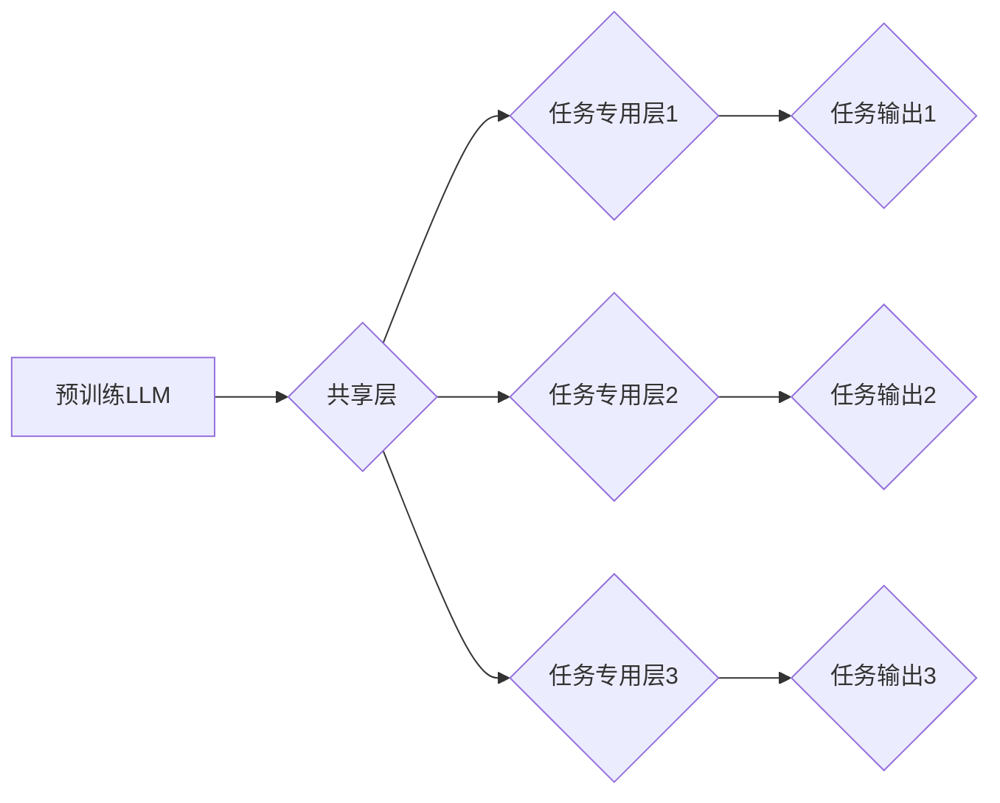

                 

## LLM的versatility：多任务处理能力探析

> 关键词：大型语言模型（LLM）、多任务学习、迁移学习、泛化能力、任务适应性、模型架构、Transformer、注意力机制

## 1. 背景介绍

近年来，大型语言模型（LLM）在自然语言处理（NLP）领域取得了显著的进展，展现出强大的文本生成、翻译、问答和代码生成能力。这些模型通常基于Transformer架构，并通过海量文本数据进行预训练，从而学习到丰富的语言表示和知识。然而，LLM的训练成本高昂，且往往针对特定任务进行微调，这限制了其在实际应用中的灵活性。

多任务学习（Multi-Task Learning，MTL）作为一种有效的学习策略，旨在训练一个模型同时学习多个相关任务，以提高模型的泛化能力和任务适应性。将MTL应用于LLM，可以使其在更广泛的任务场景中发挥作用，并降低针对特定任务的微调成本。

## 2. 核心概念与联系

**2.1 多任务学习 (MTL)**

多任务学习是指训练一个模型同时学习多个相关任务，共享一部分参数和知识，从而提高模型的泛化能力和效率。

**2.2 迁移学习 (Transfer Learning)**

迁移学习是一种基于已训练模型的学习策略，将预训练模型在源任务上的知识迁移到目标任务中，以提高目标任务的学习效率。

**2.3 LLM的多任务处理能力**

将MTL和迁移学习应用于LLM，可以使其具备更强的多任务处理能力。预训练的LLM已经掌握了丰富的语言知识，通过MTL，可以进一步学习多个任务相关的知识，并将其应用于新的任务中。

**2.4 架构图**



## 3. 核心算法原理 & 具体操作步骤

**3.1 算法原理概述**

多任务学习的核心思想是共享模型参数，从而在多个任务之间进行知识迁移。

在训练过程中，模型会同时学习多个任务的损失函数，并通过优化器更新共享层和任务专用层的参数。

**3.2 算法步骤详解**

1. **预训练阶段:** 使用大量的文本数据预训练一个LLM模型，使其掌握基本的语言知识和表示能力。
2. **任务定义:** 明确需要学习的多个任务，并设计相应的任务专用层和损失函数。
3. **模型训练:** 将预训练的LLM模型作为基础，添加任务专用层，并使用多个任务的数据进行联合训练。
4. **模型评估:** 在测试集上评估模型在每个任务上的性能，并分析模型的泛化能力和任务适应性。

**3.3 算法优缺点**

**优点:**

* 提高模型的泛化能力和任务适应性。
* 降低针对特定任务的微调成本。
* 促进不同任务之间的知识迁移。

**缺点:**

* 训练过程更加复杂，需要更多的计算资源。
* 任务之间的相关性需要仔细考虑，否则可能会导致模型性能下降。

**3.4 算法应用领域**

* 自然语言理解：文本分类、情感分析、问答系统等。
* 自然语言生成：机器翻译、文本摘要、对话系统等。
* 代码生成：代码补全、代码翻译、代码生成等。

## 4. 数学模型和公式 & 详细讲解 & 举例说明

**4.1 数学模型构建**

假设我们有N个任务，每个任务都有其对应的损失函数$L_i(θ)$，其中$θ$是模型参数。

多任务学习的目标是最小化所有任务的平均损失函数：

$$
L(θ) = \frac{1}{N} \sum_{i=1}^{N} L_i(θ)
$$

**4.2 公式推导过程**

使用梯度下降算法优化模型参数：

$$
θ = θ - \alpha \nabla_θ L(θ)
$$

其中$\alpha$是学习率。

**4.3 案例分析与讲解**

例如，我们训练一个多任务学习模型，用于文本分类和情感分析两个任务。

* 文本分类任务的损失函数为交叉熵损失函数。
* 情感分析任务的损失函数为二分类交叉熵损失函数。

模型训练过程中，会同时学习这两个任务的损失函数，并更新模型参数。

## 5. 项目实践：代码实例和详细解释说明

**5.1 开发环境搭建**

使用Python语言和深度学习框架TensorFlow或PyTorch搭建开发环境。

**5.2 源代码详细实现**

```python
import tensorflow as tf

# 定义模型架构
class MultiTaskModel(tf.keras.Model):
    def __init__(self, num_tasks):
        super(MultiTaskModel, self).__init__()
        # 共享层
        self.shared_layer = tf.keras.layers.Embedding(input_dim=vocab_size, output_dim=embedding_dim)
        # 任务专用层
        self.task_layers = [tf.keras.layers.Dense(units=num_classes) for _ in range(num_tasks)]

    def call(self, inputs):
        # 共享层处理
        x = self.shared_layer(inputs)
        # 任务专用层处理
        outputs = [task_layer(x) for task_layer in self.task_layers]
        return outputs

# 实例化模型
model = MultiTaskModel(num_tasks=2)

# 定义损失函数和优化器
loss_fn = tf.keras.losses.CategoricalCrossentropy()
optimizer = tf.keras.optimizers.Adam()

# 训练模型
for epoch in range(num_epochs):
    for batch in dataset:
        with tf.GradientTape() as tape:
            outputs = model(batch['inputs'])
            loss = loss_fn(batch['labels'], outputs)
        gradients = tape.gradient(loss, model.trainable_variables)
        optimizer.apply_gradients(zip(gradients, model.trainable_variables))

```

**5.3 代码解读与分析**

* 模型架构：模型包含共享层和多个任务专用层。共享层用于提取文本特征，任务专用层用于处理不同任务的输出。
* 损失函数：使用交叉熵损失函数对文本分类和情感分析任务进行训练。
* 优化器：使用Adam优化器更新模型参数。
* 训练过程：模型在多个任务的数据上进行联合训练，并使用梯度下降算法优化模型参数。

**5.4 运行结果展示**

训练完成后，可以评估模型在每个任务上的性能，例如准确率、F1-score等。

## 6. 实际应用场景

**6.1 文本分类与情感分析**

LLM可以用于分类新闻文章、社交媒体帖子等文本，并分析其情感倾向。

**6.2 机器翻译与文本摘要**

LLM可以用于将文本从一种语言翻译成另一种语言，并生成文本摘要。

**6.3 代码生成与代码补全**

LLM可以用于生成代码，并根据上下文自动补全代码片段。

**6.4 未来应用展望**

随着LLM技术的不断发展，其多任务处理能力将得到进一步提升，并应用于更多领域，例如：

* 个性化教育：根据学生的学习情况，提供个性化的学习内容和建议。
* 医疗诊断：辅助医生进行疾病诊断，并提供个性化的治疗方案。
* 科学研究：加速科学研究的进程，例如药物研发和材料科学。

## 7. 工具和资源推荐

**7.1 学习资源推荐**

* **书籍:**

    * Deep Learning by Ian Goodfellow, Yoshua Bengio, and Aaron Courville
    * Hands-On Machine Learning with Scikit-Learn, Keras & TensorFlow by Aurélien Géron

* **在线课程:**

    * Stanford CS224N: Natural Language Processing with Deep Learning
    * DeepLearning.AI TensorFlow Specialization

**7.2 开发工具推荐**

* **深度学习框架:** TensorFlow, PyTorch, JAX
* **自然语言处理库:** NLTK, spaCy, Hugging Face Transformers

**7.3 相关论文推荐**

* Multi-Task Learning by Andrej Karpathy and Fei-Fei Li
* Transfer Learning by Yoshua Bengio, Jean-François Dauphin, and Aaron Courville

## 8. 总结：未来发展趋势与挑战

**8.1 研究成果总结**

LLM的多任务处理能力取得了显著的进展，并展现出巨大的应用潜力。

**8.2 未来发展趋势**

* 模型架构的创新：探索更有效的模型架构，例如混合模型和自适应模型。
* 训练数据的丰富化：收集和构建更丰富、更高质量的训练数据。
* 算法的优化：开发更有效的训练算法，例如强化学习和联邦学习。

**8.3 面临的挑战**

* 训练成本高昂：LLM的训练需要大量的计算资源和时间。
* 数据偏差问题：训练数据可能存在偏差，导致模型在某些任务上表现不佳。
* 伦理问题：LLM的应用可能引发伦理问题，例如偏见和虚假信息传播。

**8.4 研究展望**

未来研究将继续探索LLM的多任务处理能力，并解决其面临的挑战，以推动其在更多领域中的应用。

## 9. 附录：常见问题与解答

**9.1 如何选择合适的任务？**

选择与LLM预训练数据相关的任务，并确保任务之间存在一定的相关性。

**9.2 如何处理数据偏差问题？**

使用数据增强技术，例如文本合成和数据混淆，来缓解数据偏差问题。

**9.3 如何评估LLM的多任务处理能力？**

使用多个任务的评估指标，例如准确率、F1-score和泛化能力，来评估LLM的多任务处理能力。


作者：禅与计算机程序设计艺术 / Zen and the Art of Computer Programming 
<end_of_turn>

