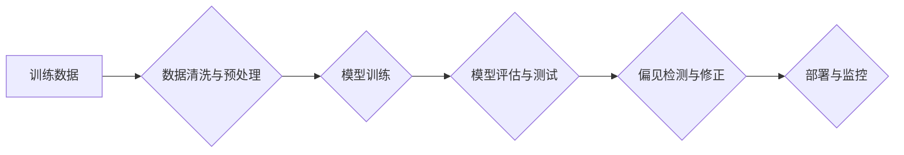

                 

## LLM的偏见消除：构建公平的AI世界

> 关键词：大型语言模型（LLM）、偏见消除、公平性、算法、数据、伦理、可解释性

### 1. 背景介绍

大型语言模型（LLM）近年来取得了令人瞩目的成就，在文本生成、翻译、问答等领域展现出强大的能力。然而，这些模型也可能继承并放大人类社会中的偏见，导致不公平、歧视甚至有害的结果。例如，训练数据中存在性别、种族或其他社会属性的偏见，可能会导致模型生成带有歧视性的文本，加剧社会不平等。因此，消除LLM中的偏见，构建公平的AI世界，成为一个至关重要的研究课题。

### 2. 核心概念与联系

**2.1 偏见定义与来源**

偏见是指对特定群体或个体持有的不公正、不合理的看法或态度，它往往根植于社会文化、历史经验和个人认知等方面。LLM的偏见主要来源于以下几个方面：

* **训练数据偏见:** 训练数据本身可能包含社会偏见，例如性别、种族、宗教等方面的刻板印象和歧视性语言。
* **算法设计偏见:** 某些算法的设计本身可能导致偏见，例如使用不均衡的特征或采用不公平的评分标准。
* **数据收集偏见:** 数据收集过程可能存在偏见，例如只收集特定群体的样本数据，导致模型缺乏对其他群体的理解。

**2.2 偏见的影响**

LLM中的偏见可能导致一系列负面影响：

* **歧视和不公平:** 模型生成带有歧视性的文本，加剧社会不平等和不公正。
* **误导和误判:** 模型基于偏见做出错误的判断，导致决策失误和负面后果。
* **社会信任危机:** 偏见导致的错误和歧视会损害公众对AI技术的信任。

**2.3 构建公平的AI世界**

构建公平的AI世界需要从多个方面着手：

* **数据治理:** 确保训练数据的多样性和代表性，并采取措施消除数据中的偏见。
* **算法设计:** 设计公平、透明、可解释的算法，避免算法本身导致偏见。
* **伦理规范:** 制定和遵守AI伦理规范，确保AI技术应用符合社会价值观。
* **社会参与:** 鼓励公众参与AI技术发展和监管，促进社会对AI技术的理解和信任。

**Mermaid 流程图**



### 3. 核心算法原理 & 具体操作步骤

**3.1 算法原理概述**

消除LLM中的偏见需要采用多种算法和技术，例如：

* **数据增强:** 通过生成新的数据样本，增加训练数据的多样性和代表性。
* **对抗训练:** 使用对抗样本训练模型，提高模型对偏见样本的鲁棒性。
* **公平性约束:** 在模型训练过程中加入公平性约束，例如限制模型对不同群体的预测结果差异。
* **偏见检测与修正:** 使用专门的算法检测模型中的偏见，并采取措施进行修正。

**3.2 算法步骤详解**

以下以数据增强为例，详细介绍算法步骤：

1. **数据分析:** 对训练数据进行分析，识别潜在的偏见来源和类型。
2. **数据生成:** 根据识别出的偏见类型，生成新的数据样本，例如通过修改文本中的性别、种族等属性。
3. **数据融合:** 将生成的样本与原始数据融合，形成新的训练数据集。
4. **模型训练:** 使用新的训练数据集训练LLM模型。
5. **模型评估:** 对训练后的模型进行评估，验证其偏见消除效果。

**3.3 算法优缺点**

* **优点:** 数据增强可以有效增加训练数据的多样性，提高模型的泛化能力和鲁棒性。
* **缺点:** 数据生成过程需要一定的专业知识和技术，生成的样本可能无法完全模拟真实数据，存在一定的局限性。

**3.4 算法应用领域**

数据增强技术广泛应用于各种机器学习领域，例如图像识别、自然语言处理、语音识别等。

### 4. 数学模型和公式 & 详细讲解 & 举例说明

**4.1 数学模型构建**

假设我们有一个训练数据集 D，包含 N 个样本 (x_i, y_i)，其中 x_i 是输入特征，y_i 是输出标签。我们想要训练一个分类模型 f(x)，使得 f(x) 对给定的输入 x 能够预测其对应的类别。

我们可以使用交叉熵损失函数来衡量模型的预测结果与真实标签之间的差异：

$$L(f, D) = -\frac{1}{N} \sum_{i=1}^{N} y_i \log(f(x_i)) + (1-y_i) \log(1-f(x_i))$$

其中，log 表示自然对数。

**4.2 公式推导过程**

交叉熵损失函数的推导过程基于概率论和信息论的原理。

* **概率分布:** 模型 f(x) 的输出可以看作是一个概率分布，其中 f(x) 表示输入 x 属于某个类别的概率。
* **信息熵:** 信息熵度量了随机变量的不确定性，它等于概率分布的平均信息量。
* **交叉熵:** 交叉熵度量了两个概率分布之间的差异，它等于真实分布和预测分布的联合信息熵。

**4.3 案例分析与讲解**

假设我们有一个二分类问题，模型需要判断文本是否属于特定主题。

* **真实分布:** 训练数据中，特定主题的文本占 60%，非特定主题的文本占 40%。
* **预测分布:** 模型预测特定主题的文本概率为 70%，非特定主题的文本概率为 30%。

我们可以使用交叉熵损失函数计算模型的预测结果与真实分布之间的差异。

### 5. 项目实践：代码实例和详细解释说明

**5.1 开发环境搭建**

* Python 3.7+
* TensorFlow 2.0+
* PyTorch 1.0+

**5.2 源代码详细实现**

```python
import tensorflow as tf

# 定义模型
model = tf.keras.Sequential([
    tf.keras.layers.Embedding(input_dim=10000, output_dim=128),
    tf.keras.layers.LSTM(units=64),
    tf.keras.layers.Dense(units=1, activation='sigmoid')
])

# 定义损失函数和优化器
loss_fn = tf.keras.losses.BinaryCrossentropy()
optimizer = tf.keras.optimizers.Adam(learning_rate=0.001)

# 训练模型
model.compile(loss=loss_fn, optimizer=optimizer)
model.fit(x_train, y_train, epochs=10)

# 评估模型
loss, accuracy = model.evaluate(x_test, y_test)
print('Loss:', loss)
print('Accuracy:', accuracy)
```

**5.3 代码解读与分析**

* 模型结构: 使用了嵌入层、LSTM层和全连接层，用于处理文本数据和学习文本特征。
* 损失函数: 使用了二元交叉熵损失函数，用于衡量模型预测结果与真实标签之间的差异。
* 优化器: 使用了Adam优化器，用于更新模型参数。
* 训练过程: 使用训练数据训练模型，并使用测试数据评估模型性能。

**5.4 运行结果展示**

训练完成后，可以查看模型的损失值和准确率，评估模型的性能。

### 6. 实际应用场景

LLM的偏见消除技术在多个领域具有广泛的应用场景：

* **招聘和人力资源:** 避免基于性别、种族等因素的歧视性招聘决策。
* **金融和保险:** 确保公平的贷款审批和保险定价，避免对特定群体的歧视。
* **医疗保健:** 避免基于性别、种族等因素的医疗偏见，确保所有患者都能获得公平的医疗服务。
* **司法和法律:** 避免基于性别、种族等因素的司法偏见，确保法律的公正性和公平性。

**6.4 未来应用展望**

随着LLM技术的不断发展，偏见消除技术将得到更广泛的应用，例如：

* **个性化教育:** 针对不同学生的学习特点和需求提供个性化的教育资源，避免教育资源分配不均。
* **智能客服:** 开发更公平、更包容的智能客服系统，为所有用户提供优质的服务。
* **社会治理:** 利用LLM技术分析社会数据，识别和解决社会偏见和不公正现象。

### 7. 工具和资源推荐

**7.1 学习资源推荐**

* **书籍:**

    * "Fairness and Machine Learning" by  Sarah M. Bender, Timnit Gebru, Angelina McMillan-Major, and  Emily M. Bender
    * "Weapons of Math Destruction: How Big Data Increases Inequality and Threatens Democracy" by Cathy O'Neil

* **论文:**

    * "On the Dangers of Stochastic Parrots: Can Language Models Be Too Big?" by Emily M. Bender, Timnit Gebru, Angelina McMillan-Major, and Margaret Mitchell
    * "Mitigating Bias in Machine Learning" by  Virginia Eubanks

* **在线课程:**

    * Coursera: "Fairness, Accountability, and Transparency in Machine Learning"
    * edX: "AI Ethics"

**7.2 开发工具推荐**

* **TensorFlow Fairness:** TensorFlow 的一个工具包，用于检测和缓解机器学习模型中的偏见。
* **AIF360:** 一个开源工具包，用于评估和缓解机器学习模型中的公平性问题。
* **Fairlearn:** 一个 Python 库，用于检测和缓解机器学习模型中的偏见。

**7.3 相关论文推荐**

* "Gender Shades: Intersectional Accuracy Disparities in Commercial Gender Classification" by Joy Buolamwini and Timnit Gebru
* "Predicting Recidivism: Big Data and the Future of Justice" by  Jeffries, et al.

### 8. 总结：未来发展趋势与挑战

**8.1 研究成果总结**

近年来，在LLM的偏见消除方面取得了显著进展，例如：

* 开发了多种算法和技术，用于检测和缓解模型中的偏见。
* 构建了公平性评估指标和工具，用于评估模型的公平性。
* 制定了AI伦理规范和政策，指导AI技术的开发和应用。

**8.2 未来发展趋势**

* **更有效的偏见检测和缓解方法:** 开发更准确、更有效的算法和技术，能够识别和缓解更隐蔽的偏见。
* **可解释性增强:** 提高LLM模型的可解释性，使人们能够更好地理解模型的决策过程，并识别潜在的偏见来源。
* **公平性嵌入式设计:** 将公平性原则融入到LLM模型的设计和开发过程中，从源头上避免偏见。

**8.3 面临的挑战**

* **数据偏差的根源:** 许多数据偏差源于社会文化和历史因素，难以完全消除。
* **定义公平性的难点:** 公平性是一个复杂的概念，缺乏统一的定义和标准。
* **技术与伦理的平衡:** 如何在追求技术进步的同时，保障AI技术的伦理安全和社会责任，是一个需要不断探索和思考的问题。

**8.4 研究展望**

未来，LLM的偏见消除研究将继续深入，朝着以下方向发展：

* **跨学科合作:** 促进计算机科学、社会学、伦理学等多学科的合作，从更全面的角度研究偏见问题。
* **社会参与:** 鼓励公众参与AI技术发展和监管，促进社会对AI技术的理解和信任。
* **持续评估和改进:** 不断评估和改进偏见消除技术，确保AI技术能够真正服务于人类社会。

### 9. 附录：常见问题与解答

**9.1 如何评估LLM模型的公平性？**

可以使用多种公平性评估指标，例如：

* **均等机会指标:** 衡量模型对不同群体预测结果的差异。
* **公平准确率指标:** 衡量模型在不同群体上的准确率。
* **公平召回率指标:** 衡量模型在不同群体上的召回率。

**9.2 如何缓解LLM模型中的偏见？**

可以使用多种技术来缓解模型中的偏见，例如：

* **数据增强:** 增加训练数据的多样性和代表性。
* **对抗训练:** 使用对抗样本训练模型，提高模型对偏见样本的鲁棒性。
* **公平性约束:** 在模型训练过程中加入公平性约束，例如限制模型对不同群体的预测结果差异。

**9.3 如何确保AI技术的伦理安全？**

需要从多个方面着手，例如：

* 制定和遵守AI伦理规范和政策。
* 提高公众对AI技术的理解和信任。
* 促进跨学科合作，研究AI技术的伦理问题。


作者：禅与计算机程序设计艺术 / Zen and the Art of Computer Programming 
<end_of_turn>

