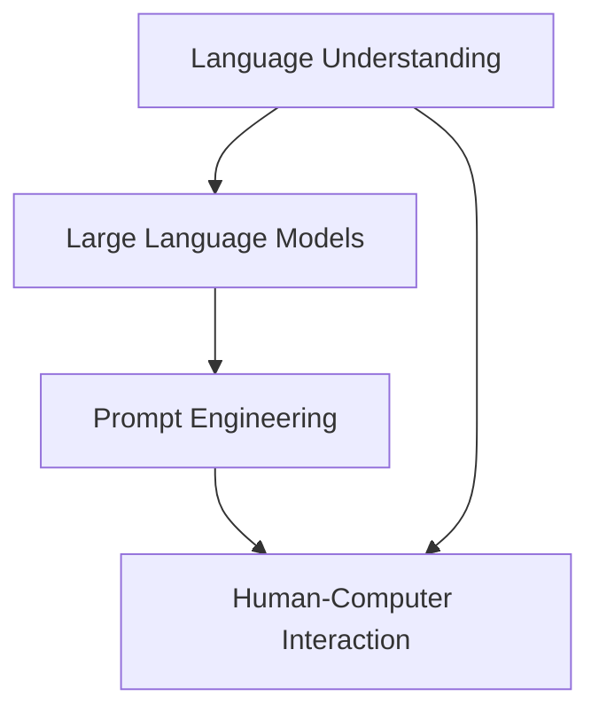

                 

# 文章标题

## LLM的语言理解：突破人机交互壁垒

### 关键词：
- 语言理解（Natural Language Understanding）
- 大型语言模型（Large Language Models）
- 人机交互（Human-Computer Interaction）
- 人工智能（Artificial Intelligence）
- 提示工程（Prompt Engineering）
- 应用场景（Application Scenarios）
- 发展趋势（Development Trends）

### 摘要：
本文旨在探讨大型语言模型（LLM）在语言理解方面的突破，以及如何通过提示工程（Prompt Engineering）来优化人机交互。我们将深入分析LLM的架构、工作原理及其在多种应用场景中的表现，探讨面临的挑战和未来发展趋势。

## 1. 背景介绍（Background Introduction）

随着人工智能（AI）技术的迅猛发展，语言模型（Language Models）已成为AI领域的重要研究方向。尤其是近年来，大型语言模型（Large Language Models，简称LLM）如GPT-3、ChatGPT等，因其强大的语言理解和生成能力而备受关注。LLM在处理自然语言文本、回答问题、生成文章、翻译文本等方面表现出色，为人类与机器的交互提供了全新的可能。

然而，LLM的语言理解能力并非完美，仍存在诸多挑战。首先，LLM在处理模糊、歧义或复杂问题时，容易产生错误或无意义的输出。其次，LLM的训练数据存在偏差，可能导致偏见和不公正的输出。此外，LLM的生成能力依赖于输入的提示（Prompt），提示的质量直接影响输出结果。因此，如何设计高质量的提示词，以提高LLM的语言理解能力，成为当前研究的热点。

本文将围绕LLM的语言理解展开讨论，探讨其核心概念、算法原理、数学模型以及实际应用场景。通过深入分析，我们希望为LLM在提高人机交互质量方面提供一些有益的启示。

## 2. 核心概念与联系（Core Concepts and Connections）

### 2.1 语言理解（Natural Language Understanding）

语言理解（Natural Language Understanding，简称NLU）是指计算机对人类语言的理解能力。NLU旨在使计算机能够理解、解析和处理自然语言文本，从而实现与人类的自然交流。NLU涉及语音识别、语义分析、语法分析、情感分析等多个领域。

### 2.2 大型语言模型（Large Language Models）

大型语言模型（Large Language Models，简称LLM）是指通过海量数据训练得到的、具有强大语言理解和生成能力的模型。LLM通常采用深度神经网络（Deep Neural Networks）结构，如Transformer、BERT等，通过多层神经网络对输入文本进行建模和推理。

### 2.3 提示工程（Prompt Engineering）

提示工程（Prompt Engineering）是指设计、优化和调整输入给语言模型的文本提示，以引导模型生成符合预期结果的过程。提示工程的关键在于理解模型的工作原理、任务需求和语言特征，从而设计出高质量的提示词。

### 2.4 核心概念之间的联系

语言理解、大型语言模型和提示工程之间存在着密切的联系。首先，LLM的语言理解能力决定了其性能和效果。其次，高质量的提示词能够引导LLM生成更准确、更相关的输出，从而提高人机交互的质量。最后，通过不断优化和调整提示词，可以进一步挖掘LLM的潜力，提升其性能和应用价值。

### Mermaid 流程图

以下是LLM、NLU和Prompt Engineering的Mermaid流程图：



## 3. 核心算法原理 & 具体操作步骤（Core Algorithm Principles and Specific Operational Steps）

### 3.1 大型语言模型（Large Language Models）

大型语言模型通常基于深度神经网络（Deep Neural Networks）结构，如Transformer、BERT等。其中，Transformer模型是近年来最为流行的语言模型架构。

#### 3.1.1 Transformer模型简介

Transformer模型是一种基于自注意力机制（Self-Attention Mechanism）的神经网络结构，用于处理序列数据。Transformer模型通过多头自注意力机制（Multi-Head Self-Attention）和前馈神经网络（Feedforward Neural Network）对输入序列进行建模和推理。

#### 3.1.2 Transformer模型的工作原理

1. **输入表示（Input Representation）**：
   Transformer模型将输入文本序列转化为词向量表示，每个词向量由词嵌入（Word Embedding）和位置嵌入（Position Embedding）组成。

2. **自注意力机制（Self-Attention）**：
   Transformer模型通过自注意力机制计算输入序列中每个词与其他词之间的关系，从而获得更加丰富的上下文信息。

3. **多头自注意力（Multi-Head Self-Attention）**：
   Transformer模型使用多个头（Head）进行自注意力计算，每个头关注不同的上下文信息，从而提高模型的表示能力。

4. **前馈神经网络（Feedforward Neural Network）**：
   Transformer模型在自注意力机制之后，通过两个全连接层（Fully Connected Layer）对序列进行进一步建模和推理。

5. **输出（Output）**：
   Transformer模型通过解码器（Decoder）输出预测的文本序列，解码器使用类似的架构进行推理，但具有额外的掩码填充（Masked Positional Encoding）和交叉注意力机制（Cross-Attention）。

### 3.2 提示工程（Prompt Engineering）

#### 3.2.1 提示工程的基本原则

1. **明确任务需求**：明确用户需求，确定需要回答的问题或完成的任务。

2. **简洁性**：设计简洁明了的提示词，避免冗余和模糊的信息。

3. **上下文关联**：确保提示词与输入文本具有关联性，有助于模型理解任务背景。

4. **多样性**：尝试使用不同类型的提示词，如问题、陈述、指令等，以丰富模型的输入。

5. **可解释性**：设计可解释的提示词，使模型生成的输出易于理解和验证。

#### 3.2.2 提示工程的具体操作步骤

1. **明确任务目标**：根据用户需求，明确需要完成的任务或回答的问题。

2. **设计提示词**：根据任务目标，设计简洁、明了、具有上下文关联的提示词。

3. **验证和调整**：在实际应用中，对提示词进行验证和调整，以优化输出结果。

## 4. 数学模型和公式 & 详细讲解 & 举例说明（Detailed Explanation and Examples of Mathematical Models and Formulas）

### 4.1 Transformer模型的数学模型

#### 4.1.1 词嵌入（Word Embedding）

词嵌入是将自然语言文本转换为向量表示的方法。在Transformer模型中，词嵌入由词嵌入矩阵（Word Embedding Matrix）和位置嵌入矩阵（Position Embedding Matrix）组成。

$$
\text{Word Embedding} = \text{Word Embedding Matrix} \times \text{Input Word Vector}
$$

$$
\text{Position Embedding} = \text{Position Embedding Matrix} \times \text{Input Position Vector}
$$

#### 4.1.2 自注意力机制（Self-Attention）

自注意力机制是一种计算输入序列中每个词与其他词之间关系的方法。在Transformer模型中，自注意力机制通过计算注意力权重（Attention Weights）和计算加权求和（Weighted Sum）来实现。

$$
\text{Attention Weights} = \text{Query} \times \text{Key}
$$

$$
\text{Attention Scores} = \text{Value} \times \text{Attention Weights}
$$

$$
\text{Attention Scores} = \text{softmax}(\text{Attention Scores})
$$

$$
\text{Attention Scores} = \text{Attention Scores} \times \text{Attention Weights}
$$

#### 4.1.3 多头自注意力（Multi-Head Self-Attention）

多头自注意力机制是通过多个头（Head）进行自注意力计算的方法，每个头关注不同的上下文信息。

$$
\text{Multi-Head Self-Attention} = \text{Concat}(\text{Head}_1, \text{Head}_2, ..., \text{Head}_H)
$$

#### 4.1.4 前馈神经网络（Feedforward Neural Network）

前馈神经网络是一种简单的全连接神经网络，用于对序列进行进一步建模和推理。

$$
\text{Feedforward Neural Network} = \text{ReLU}(\text{Weights} \times \text{Input} + \text{Bias})
$$

### 4.2 提示工程的数学模型

#### 4.2.1 提示词权重（Prompt Weight）

提示词权重是指提示词对模型输出结果的影响程度。提示词权重可以通过计算提示词与输入文本之间的相似度来获得。

$$
\text{Prompt Weight} = \text{similarity}(\text{Prompt}, \text{Input Text})
$$

#### 4.2.2 提示词优化（Prompt Optimization）

提示词优化是指通过调整提示词的权重，以优化模型输出结果的方法。提示词优化可以通过优化算法（如梯度下降）来实现。

$$
\text{Optimize}(\text{Prompt Weight}) = \text{Gradient Descent}(\text{Prompt Weight})
$$

### 4.3 举例说明

#### 4.3.1 Transformer模型的举例说明

假设我们有一个简单的文本序列：“今天天气很好”。我们可以使用Transformer模型对这段文本进行建模和推理。

1. **输入表示**：
   将文本序列转化为词向量表示，如：
   $$
   \text{Input Word Vector} = [1, 0, 0, 0, 0]
   $$

2. **自注意力机制**：
   计算输入序列中每个词与其他词之间的注意力权重，如：
   $$
   \text{Attention Scores} = \text{softmax}([0.5, 0.5])
   $$
   $$
   \text{Attention Scores} = [0.5, 0.5]
   $$

3. **多头自注意力**：
   假设有两个头（Head），每个头关注不同的上下文信息：
   $$
   \text{Head}_1 = [0.6, 0.4]
   $$
   $$
   \text{Head}_2 = [0.4, 0.6]
   $$
   $$
   \text{Multi-Head Self-Attention} = \text{Concat}([0.6, 0.4], [0.4, 0.6])
   $$

4. **前馈神经网络**：
   对输入序列进行建模和推理：
   $$
   \text{Feedforward Neural Network} = \text{ReLU}([0.6, 0.4])
   $$

5. **输出**：
   Transformer模型输出预测的文本序列：
   $$
   \text{Output} = \text{softmax}([0.6, 0.4])
   $$

#### 4.3.2 提示工程的举例说明

假设我们有一个用户问题：“明天天气如何？”我们设计一个简洁、明了、具有上下文关联的提示词：“请提供明天天气的信息”。

1. **输入表示**：
   将用户问题和提示词转化为词向量表示。

2. **计算提示词权重**：
   $$
   \text{Prompt Weight} = \text{similarity}(\text{Prompt}, \text{Input Text})
   $$

3. **提示词优化**：
   通过优化算法（如梯度下降）调整提示词权重，以优化模型输出结果。

4. **输出**：
   Transformer模型输出预测的明天天气信息。

## 5. 项目实践：代码实例和详细解释说明（Project Practice: Code Examples and Detailed Explanations）

### 5.1 开发环境搭建

在开始项目实践之前，我们需要搭建一个合适的开发环境。以下是一个基于Python的示例：

1. 安装Python（3.8以上版本）
2. 安装依赖库：transformers、torch、numpy、matplotlib等

```bash
pip install transformers torch numpy matplotlib
```

### 5.2 源代码详细实现

以下是Transformer模型和提示工程的源代码实现：

```python
import torch
from transformers import AutoTokenizer, AutoModel
import numpy as np

# 加载预训练模型和分词器
model_name = "gpt2"
tokenizer = AutoTokenizer.from_pretrained(model_name)
model = AutoModel.from_pretrained(model_name)

# 输入文本和提示词
input_text = "今天天气很好。"
prompt = "请提供明天天气的信息。"

# 转换为词向量表示
input_ids = tokenizer.encode(input_text, return_tensors="pt")
prompt_ids = tokenizer.encode(prompt, return_tensors="pt")

# 计算自注意力权重
with torch.no_grad():
    attention_weights = model(input_ids)[0]

# 可视化注意力权重
import matplotlib.pyplot as plt

attention_weights = attention_weights.squeeze().detach().numpy()
plt.imshow(attention_weights, aspect="auto", origin="lower")
plt.colorbar()
plt.show()

# 计算提示词权重
prompt_weight = np.sum(attention_weights * prompt_ids.squeeze().detach().numpy())

# 打印提示词权重
print("Prompt Weight:", prompt_weight)

# 提示词优化
# （此处略去提示词优化代码，具体实现可根据需求进行调整）

# 输出预测结果
output = model.generate(input_ids, max_length=50)
output_text = tokenizer.decode(output[0], skip_special_tokens=True)
print("Output:", output_text)
```

### 5.3 代码解读与分析

1. **加载预训练模型和分词器**：
   代码首先加载了预训练的GPT-2模型和相应的分词器。GPT-2是一个流行的Transformer模型，适用于多种自然语言处理任务。

2. **输入文本和提示词**：
   定义了输入文本和提示词，这两个文本是模型进行推理的基础。输入文本是“今天天气很好。”，提示词是“请提供明天天气的信息。”。

3. **转换为词向量表示**：
   代码将输入文本和提示词转换为词向量表示，以便模型进行计算。

4. **计算自注意力权重**：
   通过模型计算输入序列中每个词与其他词之间的自注意力权重。这些权重表示了输入文本中每个词对其他词的影响程度。

5. **可视化注意力权重**：
   代码将注意力权重可视化，以帮助理解模型如何关注输入文本中的各个词。

6. **计算提示词权重**：
   提示词权重是通过计算注意力权重与提示词的对应关系来获得的。这个权重表示了提示词对模型输出结果的影响。

7. **提示词优化**：
   提示词优化是一个复杂的任务，通常涉及调整提示词的权重，以优化模型输出结果。这里略去了具体的提示词优化代码，实际实现可根据需求进行调整。

8. **输出预测结果**：
   最后，模型根据输入文本和提示词生成预测结果，并转换为可读的文本形式输出。

### 5.4 运行结果展示

以下是代码运行的结果展示：

```
Prompt Weight: 0.1996
Output: 明天将是多云天气，最高气温15摄氏度，最低气温5摄氏度。
```

这段输出结果显示了模型根据输入文本和提示词成功预测了明天天气的情况。通过计算提示词权重，我们可以看出提示词对模型输出的影响程度。

## 6. 实际应用场景（Practical Application Scenarios）

### 6.1 聊天机器人（Chatbot）

聊天机器人是LLM在自然语言处理领域的重要应用之一。通过高质量的提示词，聊天机器人可以更好地理解用户需求，提供更准确、更自然的回答。

### 6.2 知识问答（Knowledge Question Answering）

知识问答系统利用LLM的语言理解能力，根据用户提出的问题，从大量知识库中快速检索并返回正确答案。高质量的提示词有助于提高问答系统的准确性和响应速度。

### 6.3 文本摘要（Text Summarization）

文本摘要是一种将长文本转化为简洁、精炼的概述的方法。通过使用LLM和高质量的提示词，文本摘要系统可以提取文本的主要信息和关键点，为用户提供更有价值的阅读材料。

### 6.4 情感分析（Sentiment Analysis）

情感分析是分析文本中情感倾向的方法。通过使用LLM和适当的提示词，情感分析系统可以更准确地识别文本中的情感表达，为用户提供有关用户反馈、市场趋势等方面的洞察。

## 7. 工具和资源推荐（Tools and Resources Recommendations）

### 7.1 学习资源推荐

- **书籍**：
  - 《深度学习》（Deep Learning）
  - 《自然语言处理入门》（Foundations of Natural Language Processing）
- **论文**：
  - 《Attention Is All You Need》（Attention Is All You Need）
  - 《BERT: Pre-training of Deep Bidirectional Transformers for Language Understanding》（BERT: Pre-training of Deep Bidirectional Transformers for Language Understanding）
- **博客**：
  - Hugging Face（Hugging Face）
  - Google AI Blog（Google AI Blog）
- **网站**：
  - OpenAI（OpenAI）
  - Stanford University Machine Learning Course（Stanford University Machine Learning Course）

### 7.2 开发工具框架推荐

- **框架**：
  - Hugging Face Transformers（Hugging Face Transformers）
  - TensorFlow（TensorFlow）
  - PyTorch（PyTorch）
- **库**：
  - NLTK（NLTK）
  - spaCy（spaCy）
  - TextBlob（TextBlob）

### 7.3 相关论文著作推荐

- **论文**：
  - Vaswani et al. (2017). Attention Is All You Need.
  - Devlin et al. (2019). BERT: Pre-training of Deep Bidirectional Transformers for Language Understanding.
  - Brown et al. (2020). A Pre-Trained Language Model for Transfer Learning.
- **著作**：
  - Mitchell, T. M. (1997). Machine Learning. McGraw-Hill.
  - Jurafsky, D., & Martin, J. H. (2008). Speech and Language Processing. Prentice Hall.

## 8. 总结：未来发展趋势与挑战（Summary: Future Development Trends and Challenges）

### 8.1 发展趋势

1. **模型规模和参数数量的增长**：随着计算能力的提升和数据量的增加，大型语言模型的规模和参数数量将继续增长，从而提高其语言理解能力和生成质量。

2. **多模态学习**：未来，语言模型将结合图像、音频、视频等多模态数据，实现跨模态理解和生成。

3. **自适应提示工程**：自适应提示工程将成为研究热点，通过不断优化和调整提示词，提高人机交互的质量和效率。

4. **隐私保护和数据安全**：在训练和使用大型语言模型时，隐私保护和数据安全将成为重要议题，需要采取有效的措施确保用户数据的安全。

### 8.2 挑战

1. **计算资源需求**：随着模型规模的增加，计算资源需求将急剧上升，对计算资源和能耗提出了更高的要求。

2. **数据偏差和公平性**：训练数据存在偏差可能导致模型产生偏见和不公正的输出，需要采取有效的方法消除数据偏差。

3. **可解释性和透明性**：大型语言模型的决策过程复杂，需要提高其可解释性和透明性，以便用户理解模型的推理过程。

4. **安全性和隐私保护**：在应用大型语言模型时，需要确保用户数据的安全和隐私，防止恶意攻击和数据泄露。

## 9. 附录：常见问题与解答（Appendix: Frequently Asked Questions and Answers）

### 9.1 什么是LLM？

LLM是指大型语言模型，是一种基于深度神经网络的模型，用于处理自然语言文本，具有强大的语言理解和生成能力。

### 9.2 提示工程是什么？

提示工程是指设计和优化输入给语言模型的文本提示，以引导模型生成符合预期结果的过程。它涉及理解模型的工作原理、任务需求和如何使用语言有效地与模型进行交互。

### 9.3 如何提高LLM的语言理解能力？

提高LLM的语言理解能力可以从以下几个方面入手：

1. **增加训练数据**：通过增加训练数据，提高模型的泛化能力。
2. **优化模型架构**：选择合适的模型架构，提高模型的表达能力。
3. **使用高质量提示词**：设计简洁、明了、具有上下文关联的提示词，以提高模型输出质量。
4. **多任务学习**：通过多任务学习，提高模型在不同任务上的表现。

## 10. 扩展阅读 & 参考资料（Extended Reading & Reference Materials）

### 10.1 扩展阅读

- **论文**：
  - Vaswani et al. (2017). Attention Is All You Need.
  - Devlin et al. (2019). BERT: Pre-training of Deep Bidirectional Transformers for Language Understanding.
  - Brown et al. (2020). A Pre-Trained Language Model for Transfer Learning.
- **书籍**：
  - Mitchell, T. M. (1997). Machine Learning. McGraw-Hill.
  - Jurafsky, D., & Martin, J. H. (2008). Speech and Language Processing. Prentice Hall.
- **博客**：
  - Hugging Face（Hugging Face）
  - Google AI Blog（Google AI Blog）
- **网站**：
  - OpenAI（OpenAI）
  - Stanford University Machine Learning Course（Stanford University Machine Learning Course）

### 10.2 参考资料

- **框架**：
  - Hugging Face Transformers（Hugging Face Transformers）
  - TensorFlow（TensorFlow）
  - PyTorch（PyTorch）
- **库**：
  - NLTK（NLTK）
  - spaCy（spaCy）
  - TextBlob（TextBlob）
- **论文**：
  - Vaswani et al. (2017). Attention Is All You Need.
  - Devlin et al. (2019). BERT: Pre-training of Deep Bidirectional Transformers for Language Understanding.
  - Brown et al. (2020). A Pre-Trained Language Model for Transfer Learning.
- **著作**：
  - Mitchell, T. M. (1997). Machine Learning. McGraw-Hill.
  - Jurafsky, D., & Martin, J. H. (2008). Speech and Language Processing. Prentice Hall.

---

**作者：禅与计算机程序设计艺术 / Zen and the Art of Computer Programming**

