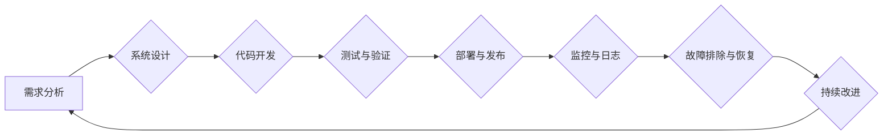

                 

## SRE（站点可靠性工程）：确保系统稳定性

> 关键词：站点可靠性工程 (SRE)、系统稳定性、DevOps、监控、故障排除、自动化、容错设计、性能优化、持续交付

### 1. 背景介绍

在当今以数字化为核心的时代，网站和应用程序已成为企业运营和用户体验的关键支柱。然而，随着系统规模和复杂度的不断增长，系统故障和性能问题也日益频繁，给企业带来巨大的经济损失和声誉损害。为了应对这一挑战，站点可靠性工程 (Site Reliability Engineering，简称 SRE)应运而生。

SRE 是一种将软件工程的最佳实践与 IT 运维相结合的工程实践，旨在提高系统可靠性、可用性和性能。它强调自动化、监控、故障排除和持续改进，以确保系统能够始终如一地提供高可用性和高质量的服务。

### 2. 核心概念与联系

SRE 的核心概念包括：

* **可靠性 (Reliability):** 系统能够持续正常运行的能力，不受故障和意外事件的影响。
* **可用性 (Availability):** 系统在指定时间内能够被用户访问和使用的能力。
* **性能 (Performance):** 系统处理请求的速度、效率和响应时间。
* **可维护性 (Maintainability):** 系统易于维护、更新和修复的能力。
* **可扩展性 (Scalability):** 系统能够随着用户需求的增长而灵活扩展的能力。

SRE 强调将这些核心概念融入到整个软件开发生命周期中，从设计阶段到部署和运营阶段，以确保系统始终保持高水平的可靠性、可用性和性能。

**SRE 架构流程图**



### 3. 核心算法原理 & 具体操作步骤

SRE 中使用的算法和技术主要集中在以下几个方面：

* **监控与告警:** 使用各种监控工具和指标，实时监测系统性能和健康状况，并设置告警阈值，以便在出现异常时及时通知相关人员。
* **故障排除与恢复:** 使用日志分析、故障树分析等技术，快速定位和解决系统故障，并制定相应的恢复方案。
* **自动化运维:** 使用自动化脚本和工具，实现系统部署、配置、更新和故障恢复等操作，提高运维效率和降低人为错误的风险。
* **容错设计:** 设计容错机制，例如冗余系统、负载均衡和故障转移，以确保系统在发生故障时能够继续运行。

**3.1 算法原理概述**

SRE 中使用的算法和技术通常基于以下原理：

* **数据驱动:** 依赖于系统监控数据，通过分析和挖掘数据，发现问题和趋势。
* **自动化:** 通过自动化脚本和工具，减少人为干预，提高效率和准确性。
* **持续改进:** 通过不断收集反馈和改进流程，提高系统的可靠性和性能。

**3.2 算法步骤详解**

SRE 的具体操作步骤通常包括以下几个阶段：

1. **需求分析:** 了解系统需求和目标，确定可靠性、可用性和性能指标。
2. **系统设计:** 设计系统架构和组件，并考虑容错、可扩展性和可维护性。
3. **代码开发:** 开发系统代码，并进行单元测试和集成测试。
4. **部署与发布:** 将系统部署到生产环境，并进行性能测试和负载测试。
5. **监控与告警:** 设置监控指标和告警阈值，实时监测系统状态。
6. **故障排除与恢复:** 当系统出现故障时，使用日志分析、故障树分析等技术，快速定位和解决问题。
7. **持续改进:** 收集系统运行数据和用户反馈，不断改进系统设计、代码和运维流程。

**3.3 算法优缺点**

SRE 的优点包括：

* **提高系统可靠性、可用性和性能:** 通过自动化、监控和持续改进，可以有效降低系统故障率和修复时间。
* **提高运维效率:** 自动化运维可以减少人为干预，提高运维效率和准确性。
* **降低运营成本:** 通过提高系统可靠性和效率，可以降低运营成本。

SRE 的缺点包括：

* **需要投入大量时间和资源:** 建立和维护 SRE 系统需要投入大量时间和资源。
* **需要具备高水平的技能:** SRE 工程师需要具备软件工程、系统运维和数据分析等方面的专业技能。
* **需要改变组织文化:** SRE 需要打破传统 IT 部门和开发团队之间的壁垒，需要组织文化和流程的改变。

**3.4 算法应用领域**

SRE 的应用领域非常广泛，包括：

* **互联网公司:** 为了确保网站和应用程序的高可用性和性能，互联网公司广泛采用 SRE。
* **金融机构:** 金融机构需要确保系统安全性和可靠性，SRE 可以帮助他们实现这一目标。
* **医疗机构:** 医疗机构需要确保系统稳定性和数据安全，SRE 可以帮助他们提高系统可靠性。
* **制造业:** 制造业可以使用 SRE 来监控和管理工业控制系统，提高生产效率和安全性。

### 4. 数学模型和公式 & 详细讲解 & 举例说明

SRE 中使用的一些数学模型和公式主要用于：

* **可靠性分析:** 使用概率论和统计学模型，分析系统故障率和平均故障间隔时间 (MTBF)。
* **可用性计算:** 使用公式计算系统可用性，例如 99.99% 的可用性。
* **性能优化:** 使用数学模型和算法，优化系统性能，例如降低延迟和提高吞吐量。

**4.1 数学模型构建**

可靠性分析中常用的数学模型包括：

* **指数分布:** 用于描述系统故障时间，假设故障时间服从指数分布，则故障率为 λ，平均故障间隔时间为 1/λ。
* **泊松分布:** 用于描述系统在特定时间段内发生的故障次数，假设故障次数服从泊松分布，则平均故障次数为 λt，其中 λ 为故障率，t 为时间段。

**4.2 公式推导过程**

系统可用性计算公式为：

$$
Availability = 1 - (Failure Rate * Average Downtime)
$$

其中：

* Failure Rate 为系统故障率
* Average Downtime 为平均故障恢复时间

**4.3 案例分析与讲解**

假设一个网站的故障率为 0.01，平均故障恢复时间为 10 分钟，则其可用性为：

$$
Availability = 1 - (0.01 * 10/60) = 0.9983
$$

即网站的可用性为 99.83%。

### 5. 项目实践：代码实例和详细解释说明

SRE 的实践通常需要使用各种工具和技术，例如监控系统、自动化脚本、配置管理工具等。以下是一个简单的代码实例，演示如何使用 Python 编写一个监控脚本，监控网站的响应时间。

**5.1 开发环境搭建**

需要安装 Python 和必要的库，例如 requests 和 time。

**5.2 源代码详细实现**

```python
import requests
import time

def check_website_response_time(url):
    start_time = time.time()
    response = requests.get(url)
    end_time = time.time()
    response_time = end_time - start_time
    return response_time

if __name__ == "__main__":
    website_url = "https://www.example.com"
    response_time = check_website_response_time(website_url)
    print(f"Website {website_url} response time: {response_time:.2f} seconds")
```

**5.3 代码解读与分析**

该脚本首先定义了一个函数 `check_website_response_time`，该函数接受一个网站 URL 作为参数，并使用 `requests` 库发送一个 GET 请求到该 URL。然后，脚本记录请求开始和结束时间，计算响应时间并返回。

**5.4 运行结果展示**

运行该脚本后，会输出网站的响应时间，例如：

```
Website https://www.example.com response time: 0.52 seconds
```

### 6. 实际应用场景

SRE 的应用场景非常广泛，以下是一些具体的例子：

* **监控网站性能:** 使用监控工具监控网站的响应时间、错误率、流量等指标，及时发现和解决性能问题。
* **自动化部署:** 使用自动化脚本和工具，实现网站代码的自动部署和发布，提高部署效率和可靠性。
* **容错设计:** 设计容错机制，例如冗余服务器和负载均衡，确保网站在发生故障时能够继续运行。
* **故障排除:** 使用日志分析和故障树分析等技术，快速定位和解决系统故障。

**6.4 未来应用展望**

随着云计算、人工智能和机器学习技术的不断发展，SRE 将会更加智能化和自动化。未来，SRE 可能会应用于以下领域：

* **预测性维护:** 使用机器学习算法，预测系统故障，并提前进行维护。
* **自愈式系统:** 设计能够自动修复故障的系统，减少人工干预。
* **微服务架构:** 针对微服务架构，开发更精细化的监控和故障排除工具。

### 7. 工具和资源推荐

**7.1 学习资源推荐**

* **书籍:**
    * 《Site Reliability Engineering: How Google Runs Production Systems》
    * 《The Phoenix Project: A Novel About IT, DevOps, and Helping Your Business Win》
* **博客:**
    * Google SRE Blog: https://sre.googleblog.com/
    * Netflix Tech Blog: https://netflixtechblog.com/

**7.2 开发工具推荐**

* **监控工具:** Prometheus, Grafana, Datadog
* **自动化工具:** Ansible, Puppet, Chef
* **配置管理工具:** Kubernetes, Docker

**7.3 相关论文推荐**

* "Building a Sustainable Site Reliability Engineering Practice"
* "Site Reliability Engineering: A Practical Guide"

### 8. 总结：未来发展趋势与挑战

SRE 已经成为现代软件开发和运维的重要实践，它帮助企业提高系统可靠性、可用性和性能。未来，SRE 将会更加智能化和自动化，并应用于更多领域。

**8.1 研究成果总结**

SRE 的研究成果主要集中在以下几个方面：

* **监控和告警:** 开发更智能的监控和告警系统，能够自动识别和解决问题。
* **自动化运维:** 开发更强大的自动化工具，能够实现更复杂的运维任务。
* **容错设计:** 设计更有效的容错机制，能够提高系统的可靠性和可用性。

**8.2 未来发展趋势**

SRE 的未来发展趋势包括：

* **人工智能和机器学习:** 使用人工智能和机器学习算法，实现更智能的监控、故障排除和性能优化。
* **云原生:** 针对云原生架构，开发更适合的 SRE 工具和实践。
* **持续交付:** 将 SRE 与持续交付流程紧密结合，实现更快速和可靠的软件发布。

**8.3 面临的挑战**

SRE 面临的挑战包括：

* **人才短缺:** SRE 需要具备高水平的技能，但人才短缺是一个普遍问题。
* **文化转变:** SRE 需要改变组织文化和流程，这需要时间和努力。
* **技术复杂性:** SRE 需要掌握各种复杂的工具和技术，这需要持续学习和提升。

**8.4 研究展望**

未来，SRE 研究将继续探索以下方向：

* **更智能的自动化:** 开发能够自动识别和解决问题的更智能的自动化工具。
* **更有效的容错设计:** 设计更有效的容错机制，能够提高系统的可靠性和可用性。
* **更完善的 SRE 框架:** 建立更完善的 SRE 框架，能够指导企业更好地实施 SRE。

### 9. 附录：常见问题与解答

**9.1 什么是 SRE？**

SRE (Site Reliability Engineering) 是将软件工程的最佳实践与 IT 运维相结合的工程实践，旨在提高系统可靠性、可用性和性能。

**9.2 SRE 的优势是什么？**

SRE 的优势包括：

* 提高系统可靠性、可用性和性能
* 提高运维效率
* 降低运营成本

**9.3 如何实施 SRE？**

实施 SRE 需要以下步骤：

1. 了解系统需求和目标
2. 设计系统架构和组件
3. 开发系统代码
4. 部署和测试系统
5. 设置监控和告警
6. 定期进行故障排除和改进

**9.4 SRE 需要哪些技能？**

SRE 工程师需要具备以下技能：

* 软件工程
* 系统运维
* 数据分析
* 沟通和协作

作者：禅与计算机程序设计艺术 / Zen and the Art of Computer Programming


<end_of_turn>

