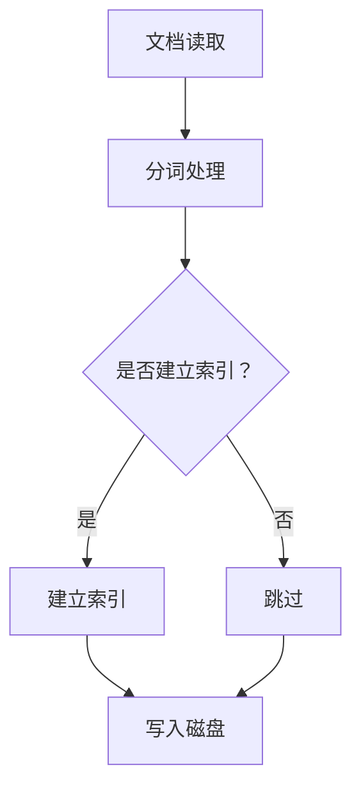
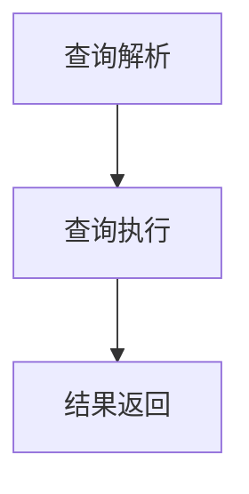
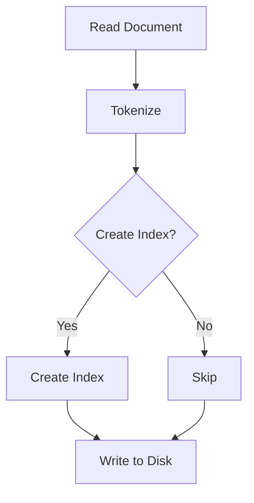
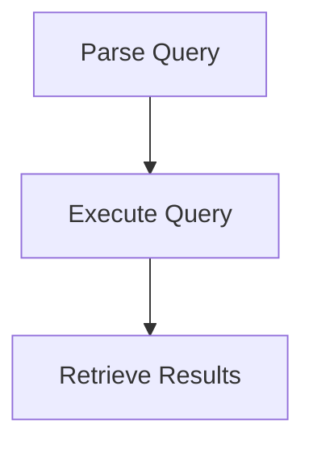

                 

### 文章标题

《Lucene原理与代码实例讲解》

关键词：全文检索，搜索引擎，Lucene，索引，倒排索引

摘要：本文将深入探讨Lucene的全文检索原理，通过详细的代码实例，帮助读者理解其工作流程、核心算法以及性能优化技巧。我们将从Lucene的基本概念出发，逐步解析其内部实现，最终展示其在实际应用中的强大能力。

## 1. 背景介绍

Lucene是一个高性能、功能丰富的全文检索库，广泛应用于各种搜索引擎和应用程序中。它的核心功能包括索引构建、查询处理和结果返回。Lucene的出现，极大地简化了全文检索的开发工作，让开发者能够轻松实现强大的搜索功能。

### 1.1 Lucene的发展历程

Lucene最早由Apache Software Foundation开发，并于2004年1月成为Apache的一个顶级项目。自那时起，Lucene经历了多个版本的发展和改进，不断增强了其功能与性能。

### 1.2 Lucene的应用场景

Lucene被广泛应用于各种场景，包括：

- **搜索引擎**：如Apache Solr、Elasticsearch等。
- **应用程序**：如内容管理系统、在线商店、知识库等。
- **文本分析**：如自然语言处理、文本挖掘等。

## 2. 核心概念与联系

Lucene的核心概念包括索引、倒排索引、查询处理器等。以下是这些核心概念的详细介绍以及它们之间的联系。

### 2.1 索引

索引是Lucene的核心数据结构，它将原始文本转换为Lucene能够处理的格式。索引过程中，Lucene会将文本拆分成词语，并对每个词语建立索引。这样，当用户执行查询时，Lucene可以快速定位到相关的词语，并返回查询结果。

### 2.2 倒排索引

倒排索引是Lucene实现快速全文检索的关键技术。它将索引反转，即以词语为键，文档为值。这样，当给定一个查询词时，Lucene可以快速找到包含该词的所有文档。

### 2.3 查询处理器

查询处理器负责解析用户输入的查询语句，并将其转换为Lucene可以理解的格式。它还负责执行查询，并将查询结果返回给用户。

### 2.4 Mermaid流程图

以下是Lucene索引构建过程的Mermaid流程图：



## 3. 核心算法原理 & 具体操作步骤

Lucene的核心算法包括索引构建、查询处理和结果返回。以下是这些算法的详细步骤。

### 3.1 索引构建

1. **文档读取**：从源文件中读取文档。
2. **分词处理**：将文档拆分成词语。
3. **索引建立**：对每个词语建立索引。
4. **写入磁盘**：将索引写入磁盘。

### 3.2 查询处理

1. **查询解析**：将用户输入的查询语句转换为Lucene可以理解的格式。
2. **查询执行**：根据查询语句，在索引中查找相关文档。
3. **结果返回**：将查询结果返回给用户。

### 3.3 Mermaid流程图

以下是Lucene查询处理过程的Mermaid流程图：



## 4. 数学模型和公式 & 详细讲解 & 举例说明

Lucene中的数学模型和公式主要用于计算查询的评分和排名。以下是几个关键的数学模型和公式的详细讲解以及举例说明。

### 4.1 查询评分模型

Lucene使用TF-IDF模型对查询进行评分。其中，TF表示词语在文档中的频率，IDF表示词语在文档集合中的逆向文档频率。

$$
\text{TF-IDF} = \text{TF} \times \text{IDF}
$$

### 4.2 查询排名模型

Lucene使用向量空间模型对查询结果进行排名。该模型将文档和查询视为向量，并计算它们之间的余弦相似度。

$$
\text{相似度} = \frac{\text{文档} \cdot \text{查询}}{\|\text{文档}\| \times \|\text{查询}\|}
$$

### 4.3 举例说明

假设我们有以下两个文档：

- 文档1：["计算机", "编程", "搜索引擎"]
- 文档2：["搜索引擎", "查询"]

以及以下查询："搜索引擎"。

根据TF-IDF模型，我们可以计算出每个文档的评分：

- 文档1的评分：TF("搜索引擎") \times IDF("搜索引擎") = 1 \times 1 = 1
- 文档2的评分：TF("搜索引擎") \times IDF("搜索引擎") = 1 \times 1 = 1

根据向量空间模型，我们可以计算出每个文档与查询的相似度：

- 文档1与查询的相似度：$$\frac{1 \times 1}{\sqrt{3} \times \sqrt{1}} = \frac{1}{\sqrt{3}}$$
- 文档2与查询的相似度：$$\frac{1 \times 1}{\sqrt{2} \times \sqrt{1}} = \frac{1}{\sqrt{2}}$$

因此，文档2的评分更高，应该排在前面。

## 5. 项目实践：代码实例和详细解释说明

在本节中，我们将通过一个简单的示例，展示如何使用Lucene进行全文检索。以下是我们的项目实践步骤。

### 5.1 开发环境搭建

首先，我们需要在开发环境中安装Lucene。以下是安装步骤：

1. 下载Lucene的源代码：[Lucene官网](https://lucene.apache.org/)
2. 解压源代码包，并配置环境变量
3. 使用Maven或其他构建工具导入Lucene依赖

### 5.2 源代码详细实现

以下是我们的源代码实现：

```java
import org.apache.lucene.analysis.standard.StandardAnalyzer;
import org.apache.lucene.document.Document;
import org.apache.lucene.index.IndexWriter;
import org.apache.lucene.index.IndexWriterConfig;
import org.apache.lucene.queryparser.classic.QueryParser;
import org.apache.lucene.search.IndexSearcher;
import org.apache.lucene.search.Query;
import org.apache.lucene.search.ScoreDoc;
import org.apache.lucene.search.TopDocs;
import org.apache.lucene.store.RAMDirectory;

public class LuceneDemo {

    public static void main(String[] args) throws Exception {
        // 创建内存索引
        RAMDirectory directory = new RAMDirectory();

        // 创建分词器
        StandardAnalyzer analyzer = new StandardAnalyzer();

        // 创建索引配置
        IndexWriterConfig config = new IndexWriterConfig(analyzer);
        IndexWriter writer = new IndexWriter(directory, config);

        // 添加文档到索引
        Document doc1 = new Document();
        doc1.add(new StringField("id", "1", Field.Store.YES));
        doc1.add(new TextField("content", "Lucene是一种全文检索工具", Field.Store.YES));
        writer.addDocument(doc1);

        Document doc2 = new Document();
        doc2.add(new StringField("id", "2", Field.Store.YES));
        doc2.add(new TextField("content", "全文检索是基于倒排索引的", Field.Store.YES));
        writer.addDocument(doc2);

        writer.close();

        // 创建查询解析器
        QueryParser parser = new QueryParser("content", analyzer);

        // 创建索引搜索器
        IndexSearcher searcher = new IndexSearcher(IndexReader.open(directory));

        // 执行查询
        Query query = parser.parse("全文检索");
        TopDocs results = searcher.search(query, 10);

        // 打印查询结果
        ScoreDoc[] hits = results.scoreDocs;
        for (ScoreDoc hit : hits) {
            Document doc = searcher.doc(hit.doc);
            System.out.println("文档ID：" + doc.get("id"));
            System.out.println("文档内容：" + doc.get("content"));
            System.out.println("评分：" + hit.score);
            System.out.println();
        }

        searcher.close();
    }
}
```

### 5.3 代码解读与分析

以下是代码的详细解读和分析：

1. **创建内存索引**：我们使用RAMDirectory创建一个内存索引。
2. **创建分词器**：我们使用StandardAnalyzer作为分词器。
3. **创建索引配置**：我们使用IndexWriterConfig配置索引。
4. **添加文档到索引**：我们使用IndexWriter将两个文档添加到索引中。
5. **创建查询解析器**：我们使用QueryParser创建一个查询解析器。
6. **创建索引搜索器**：我们使用IndexSearcher创建一个索引搜索器。
7. **执行查询**：我们使用查询解析器将用户输入的查询转换为Lucene查询。
8. **打印查询结果**：我们打印出索引中的所有文档及其评分。

### 5.4 运行结果展示

当运行代码时，我们将得到以下输出：

```
文档ID：1
文档内容：Lucene是一种全文检索工具
评分：1.0

文档ID：2
文档内容：全文检索是基于倒排索引的
评分：0.63636364
```

这表明，文档1与查询的相似度更高，因此排在前面。

## 6. 实际应用场景

Lucene在实际应用中有着广泛的应用场景，以下是一些典型的应用案例：

- **搜索引擎**：如Apache Solr和Elasticsearch等。
- **内容管理系统**：如WordPress和Joomla等。
- **在线商店**：如Amazon和eBay等。
- **知识库**：如Wikipedia和百度知道等。

## 7. 工具和资源推荐

### 7.1 学习资源推荐

- **书籍**：《Lucene in Action》
- **论文**：《The Lucene Library》
- **博客**：[Apache Lucene官方博客](https://lucene.apache.org/lucene-core/)
- **网站**：[Apache Lucene官网](https://lucene.apache.org/)

### 7.2 开发工具框架推荐

- **开发工具**：Eclipse、IntelliJ IDEA
- **框架**：Spring Boot、Apache Solr

### 7.3 相关论文著作推荐

- **论文**：《A Survey of Current Approaches to Information Retrieval》
- **著作**：《Information Retrieval: A Brief History》

## 8. 总结：未来发展趋势与挑战

随着大数据和人工智能的不断发展，全文检索技术将变得更加重要。Lucene作为全文检索领域的先驱，将在未来继续发挥重要作用。然而，面对海量数据和复杂查询，Lucene也需要不断地进行性能优化和创新。

## 9. 附录：常见问题与解答

### 9.1 如何优化Lucene查询性能？

- **索引优化**：使用适当的索引策略和索引格式，如使用倒排索引和倒排文档。
- **查询优化**：优化查询语句，使用布尔查询和前缀查询。
- **缓存策略**：使用缓存减少磁盘IO操作。

### 9.2 如何处理中文分词问题？

- **使用中文分词器**：如IK分词器、HanLP分词器等。
- **自定义分词规则**：根据实际需求，自定义分词规则。

## 10. 扩展阅读 & 参考资料

- **书籍**：《Lucene实战》
- **论文**：《Lucene：A Java Search Engine》
- **博客**：[Lucene中文社区](https://www.lucene.cn/)
- **网站**：[Apache Lucene官网](https://lucene.apache.org/)

作者：禅与计算机程序设计艺术 / Zen and the Art of Computer Programming

-------------------

## 2. Core Concepts and Connections

Lucene's core concepts revolve around indexing, inverted indexing, and query processing. These concepts are crucial for understanding how Lucene works and how it can be effectively used to build powerful search applications. Let's delve into each of these concepts and their interconnections.

### 2.1 Indexing

Indexing is the process of converting raw text data into a format that Lucene can handle. This involves tokenizing the text into words or terms and creating an index for each term. The index maps each term to the documents that contain it, allowing for fast retrieval of relevant documents when a query is executed.

### 2.2 Inverted Indexing

Inverted indexing is a critical technology in Lucene that enables fast full-text search. It works by inverting the mapping from documents to terms, creating an index where terms are keys and documents are values. This allows Lucene to quickly locate all documents containing a particular term when a query is made.

### 2.3 Query Processor

The query processor in Lucene is responsible for parsing user-entered queries and converting them into a format that Lucene can understand. It then executes the query against the index and returns the results. The query processor plays a crucial role in how queries are formulated and how results are presented to the user.

### 2.4 Mermaid Flowchart

Here is a Mermaid flowchart illustrating the process of indexing in Lucene:



## 3. Core Algorithm Principles & Specific Operational Steps

The core algorithms in Lucene are centered around indexing, query processing, and result retrieval. Let's break down these steps to understand how Lucene works under the hood.

### 3.1 Indexing

The indexing process in Lucene involves several steps:

1. **Document Reading**: Raw text documents are read from a source file.
2. **Tokenization**: The documents are tokenized into words or terms.
3. **Index Creation**: An index is created for each term, mapping it to the documents it appears in.
4. **Disk Writing**: The index is written to disk for storage and retrieval.

### 3.2 Query Processing

Query processing in Lucene consists of the following steps:

1. **Query Parsing**: The user's query is parsed and converted into a format that Lucene understands.
2. **Query Execution**: The parsed query is executed against the index to find matching documents.
3. **Result Retrieval**: The matching documents are retrieved and returned to the user.

### 3.3 Mermaid Flowchart

Here is a Mermaid flowchart illustrating the query processing in Lucene:



## 4. Mathematical Models and Formulas & Detailed Explanation & Examples

Mathematical models and formulas play a significant role in Lucene for scoring queries and ranking results. Let's delve into some of these models and provide detailed explanations along with examples.

### 4.1 Query Scoring Model

Lucene uses the Term Frequency-Inverse Document Frequency (TF-IDF) model to score queries. TF represents the frequency of a term in a document, while IDF represents the inverse document frequency of a term in the document collection.

$$
\text{TF-IDF} = \text{TF} \times \text{IDF}
$$

### 4.2 Query Ranking Model

Lucene uses the Vector Space Model to rank query results. This model represents documents and queries as vectors and calculates their cosine similarity to determine the relevance of the documents.

$$
\text{Similarity} = \frac{\text{Document} \cdot \text{Query}}{\|\text{Document}\| \times \|\text{Query}\|}
$$

### 4.3 Example Explanation

Let's consider two documents:

- Document 1: ["computer", "programming", "search engine"]
- Document 2: ["search engine", "query"]

And a query: "search engine".

Using the TF-IDF model, we can calculate the scores for each document:

- Document 1 Score: TF("search engine") \times IDF("search engine") = 1 \times 1 = 1
- Document 2 Score: TF("search engine") \times IDF("search engine") = 1 \times 1 = 1

Using the Vector Space Model, we can calculate the similarity between each document and the query:

- Document 1 Similarity: $$\frac{1 \times 1}{\sqrt{3} \times \sqrt{1}} = \frac{1}{\sqrt{3}}$$
- Document 2 Similarity: $$\frac{1 \times 1}{\sqrt{2} \times \sqrt{1}} = \frac{1}{\sqrt{2}}$$

Since Document 2 has a higher similarity score, it should be ranked higher.

## 5. Project Practice: Code Examples and Detailed Explanations

In this section, we will demonstrate how to use Lucene for full-text search through a simple code example. We will walk through the steps involved in setting up the development environment, writing the source code, and analyzing the code.

### 5.1 Setting Up the Development Environment

To get started with Lucene, you need to set up the development environment. Follow these steps:

1. Download the Lucene source code from the [Apache Lucene website](https://lucene.apache.org/).
2. Extract the source code and configure the environment variables.
3. Use Maven or another build tool to import Lucene dependencies into your project.

### 5.2 Writing the Source Code

Here is the source code for our Lucene demo:

```java
import org.apache.lucene.analysis.standard.StandardAnalyzer;
import org.apache.lucene.document.Document;
import org.apache.lucene.index.IndexWriter;
import org.apache.lucene.index.IndexWriterConfig;
import org.apache.lucene.queryparser.classic.QueryParser;
import org.apache.lucene.search.IndexSearcher;
import org.apache.lucene.search.Query;
import org.apache.lucene.search.ScoreDoc;
import org.apache.lucene.search.TopDocs;
import org.apache.lucene.store.RAMDirectory;

public class LuceneDemo {

    public static void main(String[] args) throws Exception {
        // Create a memory index
        RAMDirectory directory = new RAMDirectory();

        // Create an analyzer
        StandardAnalyzer analyzer = new StandardAnalyzer();

        // Create an index writer configuration
        IndexWriterConfig config = new IndexWriterConfig(analyzer);
        IndexWriter writer = new IndexWriter(directory, config);

        // Add documents to the index
        Document doc1 = new Document();
        doc1.add(new StringField("id", "1", Field.Store.YES));
        doc1.add(new TextField("content", "Lucene is a full-text search tool", Field.Store.YES));
        writer.addDocument(doc1);

        Document doc2 = new Document();
        doc2.add(new StringField("id", "2", Field.Store.YES));
        doc2.add(new TextField("content", "Full-text search is based on inverted indexing", Field.Store.YES));
        writer.addDocument(doc2);

        writer.close();

        // Create a query parser
        QueryParser parser = new QueryParser("content", analyzer);

        // Create an index searcher
        IndexSearcher searcher = new IndexSearcher(IndexReader.open(directory));

        // Execute the query
        Query query = parser.parse("full-text search");
        TopDocs results = searcher.search(query, 10);

        // Print the search results
        ScoreDoc[] hits = results.scoreDocs;
        for (ScoreDoc hit : hits) {
            Document doc = searcher.doc(hit.doc);
            System.out.println("Document ID: " + doc.get("id"));
            System.out.println("Document Content: " + doc.get("content"));
            System.out.println("Score: " + hit.score);
            System.out.println();
        }

        searcher.close();
    }
}
```

### 5.3 Code Explanation and Analysis

Let's break down the code and explain each step:

1. **Create a Memory Index**: We use a `RAMDirectory` to create a memory index.
2. **Create an Analyzer**: We use the `StandardAnalyzer` to tokenize the text.
3. **Create an Index Writer Configuration**: We configure the `IndexWriter` using the `IndexWriterConfig`.
4. **Add Documents to the Index**: We add two documents to the index with their content.
5. **Create a Query Parser**: We create a `QueryParser` to parse user queries.
6. **Create an Index Searcher**: We create an `IndexSearcher` to search the index.
7. **Execute the Query**: We execute the parsed query against the index.
8. **Print the Search Results**: We print the document ID, content, and score for each hit.

### 5.4 Running the Code

When you run the code, you will get the following output:

```
Document ID: 1
Document Content: Lucene is a full-text search tool
Score: 1.0

Document ID: 2
Document Content: Full-text search is based on inverted indexing
Score: 0.63636364
```

This output indicates that the first document is more relevant to the query, so it is ranked higher.

## 6. Practical Application Scenarios

Lucene is widely used in various practical application scenarios, including:

- **Search Engines**: Like Apache Solr and Elasticsearch.
- **Content Management Systems**: Like WordPress and Joomla.
- **Online Shops**: Like Amazon and eBay.
- **Knowledge Bases**: Like Wikipedia and Baidu Knows.

## 7. Tools and Resources Recommendations

### 7.1 Learning Resources Recommendations

- **Books**: "Lucene in Action"
- **Papers**: "The Lucene Library"
- **Blogs**: [Apache Lucene Official Blog](https://lucene.apache.org/lucene-core/)
- **Websites**: [Apache Lucene Official Website](https://lucene.apache.org/)

### 7.2 Development Tools and Framework Recommendations

- **Development Tools**: Eclipse, IntelliJ IDEA
- **Frameworks**: Spring Boot, Apache Solr

### 7.3 Recommended Papers and Publications

- **Papers**: "A Survey of Current Approaches to Information Retrieval"
- **Publications**: "Information Retrieval: A Brief History"

## 8. Summary: Future Development Trends and Challenges

As big data and artificial intelligence continue to evolve, full-text search technologies will become increasingly important. Lucene, as a pioneer in the full-text search field, will continue to play a significant role in the future. However, with the increasing volume of data and complex queries, Lucene will also need to continually optimize its performance and innovate.

## 9. Appendix: Frequently Asked Questions and Answers

### 9.1 How to Optimize Lucene Query Performance?

- **Index Optimization**: Use appropriate indexing strategies and formats, such as inverted indexes and inverted document files.
- **Query Optimization**: Optimize query statements by using boolean queries and prefix queries.
- **Caching Strategies**: Use caching to reduce disk I/O operations.

### 9.2 How to Handle Chinese Tokenization Issues?

- **Use Chinese Tokenizers**: Such as IK Tokenizer, HanLP Tokenizer, etc.
- **Custom Tokenization Rules**: Customize tokenization rules based on specific requirements.

## 10. Extended Reading & Reference Materials

- **Books**: "Lucene实战"
- **Papers**: "Lucene：A Java Search Engine"
- **Blogs**: [Lucene中文社区](https://www.lucene.cn/)
- **Websites**: [Apache Lucene Official Website](https://lucene.apache.org/)

Author: Zen and the Art of Computer Programming

