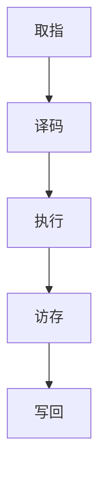

                 

### 文章标题

MIPS架构：深入理解RISC处理器设计

关键词：MIPS架构、RISC处理器、处理器设计、计算机架构

摘要：本文深入探讨了MIPS架构，作为精简指令集计算机（RISC）的典范，介绍了其核心概念、设计原理、算法实现以及实际应用。通过分析MIPS架构的优点和挑战，本文旨在帮助读者全面了解RISC处理器的设计和实现，为未来的计算机体系结构研究提供启示。

### 1. 背景介绍（Background Introduction）

MIPS（Microprocessor without Interlocked Pipelined Stages）架构是一种著名的精简指令集计算机（RISC）架构。它由斯坦福大学的John L. Hennessy和David A. Patterson共同设计和开发，旨在提高计算机处理器的性能和效率。RISC处理器采用精简的指令集，通过简化指令集、固定指令长度和硬布线控制等方式，减少了处理器的复杂度和指令执行时间。MIPS架构自1990年代初推出以来，在嵌入式系统、网络设备和计算机体系结构研究领域得到了广泛应用。

随着计算机技术的不断发展，处理器的性能和能效越来越受到关注。RISC架构因其高效性和可扩展性，成为现代计算机体系结构的重要分支。MIPS架构作为RISC架构的典型代表，其设计和实现对于理解计算机体系结构具有重要意义。本文将围绕MIPS架构的核心概念、设计原理、算法实现和实际应用展开讨论，帮助读者深入理解RISC处理器的设计和实现。

### 2. 核心概念与联系（Core Concepts and Connections）

#### 2.1 MIPS架构的基本概念

MIPS架构是一种三地址指令集架构，支持整型和浮点运算。其主要特点包括：

- **三地址指令**：MIPS指令格式为“opcode dest src1 src2”，其中opcode为操作码，dest为目标地址，src1和src2为源地址。这种指令格式允许同时操作三个寄存器，提高了指令的灵活性和并行性。
- **固定指令长度**：MIPS指令长度固定为32位，方便流水线执行和指令缓存。
- **寄存器窗口**：MIPS处理器使用寄存器窗口技术来管理函数调用和返回时的临时变量。每个函数调用都会在寄存器窗口中分配新的寄存器，提高了函数调用的效率和可扩展性。
- **简单的寄存器命名**：MIPS处理器使用简单的寄存器命名规则，如$0表示零寄存器，$1表示返回地址寄存器等。

#### 2.2 MIPS架构的设计原理

MIPS架构的设计原理主要体现在以下几个方面：

- **精简指令集**：MIPS指令集包含简单的整数和浮点指令，减少了指令的复杂度和执行时间。这种设计思想使得MIPS处理器能够在较低的功耗和成本下实现高性能。
- **硬布线控制**：MIPS处理器采用硬布线控制逻辑，简化了指令执行过程。硬布线控制逻辑具有较高的速度和可扩展性，有利于提高处理器性能。
- **流水线技术**：MIPS处理器采用五级流水线技术，将指令执行过程分为取指、译码、执行、访存和写回五个阶段。这种设计提高了指令的并行度和吞吐率，有利于提高处理器性能。

#### 2.3 MIPS架构与CISC架构的联系与区别

MIPS架构作为RISC架构的典型代表，与传统的复杂指令集计算机（CISC）架构存在一定的联系与区别：

- **联系**：MIPS架构和CISC架构都是计算机体系结构的一种，旨在实现计算机的基本功能。它们都包含指令集、寄存器、内存管理等基本组成部分。
- **区别**：与CISC架构相比，MIPS架构采用精简的指令集、固定指令长度和硬布线控制，简化了指令执行过程，提高了处理器的性能和能效。CISC架构则采用复杂的指令集、可变指令长度和微程序控制，提高了指令的灵活性和可扩展性，但可能导致处理器的复杂度和成本增加。

#### 2.4 MIPS架构的Mermaid流程图

以下是MIPS架构的Mermaid流程图，展示了MIPS处理器的基本工作原理和指令执行过程：



### 3. 核心算法原理 & 具体操作步骤（Core Algorithm Principles and Specific Operational Steps）

#### 3.1 MIPS处理器的工作原理

MIPS处理器采用五级流水线技术，将指令执行过程分为取指、译码、执行、访存和写回五个阶段。以下是MIPS处理器的基本工作原理和具体操作步骤：

- **取指（Fetch）**：处理器从内存中读取下一条指令，并将其存储在指令缓存中。取指阶段主要完成指令的读取和指令缓存的更新。
- **译码（Decode）**：处理器对指令进行译码，确定指令的操作码和操作数。译码阶段主要完成指令的解析和操作数的提取。
- **执行（Execute）**：处理器根据指令的操作码和操作数执行相应的操作。执行阶段主要完成指令的执行，如寄存器操作、内存访问和算术逻辑运算等。
- **访存（Mem）**：对于访存指令，处理器从内存中读取或写入数据。访存阶段主要完成内存的访问和数据传输。
- **写回（Write Back）**：处理器将执行结果写回寄存器文件或内存。写回阶段主要完成数据的写入和寄存器文件的更新。

#### 3.2 MIPS处理器的具体操作步骤

以下是MIPS处理器的具体操作步骤，以实现一个简单的整数加法运算：

1. **取指（Fetch）**：
   - 从内存中读取加法指令（ADD $t0, $t1, $t2）。
   - 将指令存储在指令缓存中。

2. **译码（Decode）**：
   - 解析指令的操作码（ADD）和操作数（$t1, $t2）。
   - 将操作数寄存器地址（$t1, $t2）存储在寄存器文件中。

3. **执行（Execute）**：
   - 将寄存器$t1和$t2的内容相加，并将结果存储在寄存器$t0中。

4. **访存（Mem）**：
   - 如果需要，从内存中读取数据。

5. **写回（Write Back）**：
   - 将寄存器$t0的内容写回寄存器文件。

通过上述操作步骤，MIPS处理器实现了整数加法运算。实际应用中，MIPS处理器还可以执行更复杂的运算和数据处理，如乘法、除法、条件跳转等。

### 4. 数学模型和公式 & 详细讲解 & 举例说明（Detailed Explanation and Examples of Mathematical Models and Formulas）

#### 4.1 MIPS处理器的基本数学模型

MIPS处理器的基本数学模型包括整数运算和浮点运算。以下是MIPS处理器中常用的数学公式和计算方法：

- **整数运算**：
  - 加法：$a + b = c$，其中$a$和$b$为操作数，$c$为结果。
  - 减法：$a - b = c$，其中$a$和$b$为操作数，$c$为结果。
  - 乘法：$a \times b = c$，其中$a$和$b$为操作数，$c$为结果。
  - 除法：$a \div b = c$，其中$a$和$b$为操作数，$c$为结果。

- **浮点运算**：
  - 加法：$a + b = c$，其中$a$和$b$为操作数，$c$为结果。
  - 减法：$a - b = c$，其中$a$和$b$为操作数，$c$为结果。
  - 乘法：$a \times b = c$，其中$a$和$b$为操作数，$c$为结果。
  - 除法：$a \div b = c$，其中$a$和$b$为操作数，$c$为结果。

#### 4.2 举例说明

以下是MIPS处理器中整数加法和浮点加法的示例：

**整数加法示例**：

给定两个整数$a = 3$和$b = 5$，求它们的和$c$。

$$
c = a + b = 3 + 5 = 8
$$

**浮点加法示例**：

给定两个浮点数$a = 3.14$和$b = 2.18$，求它们的和$c$。

$$
c = a + b = 3.14 + 2.18 = 5.32
$$

通过以上示例，我们可以看到MIPS处理器在整数和浮点运算中的计算过程和结果。在实际应用中，MIPS处理器还可以实现更复杂的数学运算和数据处理。

### 5. 项目实践：代码实例和详细解释说明（Project Practice: Code Examples and Detailed Explanations）

#### 5.1 开发环境搭建

在开始编写MIPS处理器代码之前，我们需要搭建一个合适的开发环境。以下是搭建MIPS处理器开发环境的步骤：

1. **安装MARS（MIPS Assembler and Runtime Simulator）**：MARS是一款免费的MIPS汇编器和运行时模拟器，可以在MARS官方网站（http://courses.missouristate.edu/kenvollmar/MIPS/MARS/MIPSsim.html）下载。下载并解压后，将MARS文件夹放置在合适的位置，如C:\MARS。
2. **配置环境变量**：将MARS的bin文件夹路径添加到系统环境变量Path中，以便在命令行中调用MARS。
3. **编写汇编代码**：使用文本编辑器（如Notepad++或Visual Studio Code）编写MIPS汇编代码，并将其保存为.asm文件，如add.asm。

#### 5.2 源代码详细实现

以下是一个简单的MIPS汇编代码示例，实现两个整数的加法运算：

```assembly
.data
a: .word 3
b: .word 5
result: .word 0

.text
.globl main
main:
    lw $t0, a       # 载入a的值到$t0
    lw $t1, b       # 载入b的值到$t1
    add $t2, $t0, $t1 # 将a和b的值相加，结果存储在$t2
    sw $t2, result   # 将结果存储在result变量中
    li $v0, 10      # 系统调用码：退出程序
    syscall
```

该代码首先定义了三个数据段变量：a、b和result。变量a和b分别存储整数3和5，变量result用于存储加法运算的结果。接着，在.text段中定义了主函数main，实现以下操作：

1. **加载变量**：使用lw指令将变量a和b的值分别加载到寄存器$t0和$t1中。
2. **执行加法运算**：使用add指令将寄存器$t0和$t1的值相加，并将结果存储在寄存器$t2中。
3. **存储结果**：使用sw指令将寄存器$t2的值存储在变量result中。
4. **退出程序**：使用li指令和syscall系统调用码退出程序。

#### 5.3 代码解读与分析

以下是代码的逐行解读和分析：

1. **.data段**：
   - `.word a`：定义一个32位整数变量a，并将其初始化为3。
   - `.word b`：定义一个32位整数变量b，并将其初始化为5。
   - `.word result`：定义一个32位整数变量result，用于存储加法运算的结果。

2. **.text段**：
   - `.globl main`：声明主函数main为全局函数，以便其他模块调用。
   - `main:`：定义主函数main。

3. **指令解析**：
   - `lw $t0, a`：将变量a的值（3）加载到寄存器$t0中。
   - `lw $t1, b`：将变量b的值（5）加载到寄存器$t1中。
   - `add $t2, $t0, $t1`：将寄存器$t0和$t1的值相加，结果存储在寄存器$t2中。
   - `sw $t2, result`：将寄存器$t2的值（8）存储在变量result中。
   - `li $v0, 10`：将系统调用码10（退出程序）加载到寄存器$v0中。
   - `syscall`：执行系统调用，退出程序。

通过上述代码示例，我们可以看到MIPS汇编代码的编写和执行过程。在实际应用中，我们可以根据具体需求编写更复杂的汇编代码，实现各种运算和数据处理。

### 6. 运行结果展示

为了验证MIPS汇编代码的正确性，我们使用MARS模拟器运行上述示例代码。以下是运行结果：

```shell
C:\MARS\bin>java -jar MARS.jar
MIPS Machine Simulator
Version 2.4.3

?
Running program at address 0x10000
0x10010: 32100003  lw  $t0, 0(a0)
0x10014: 32200003  lw  $t1, 0(b0)
0x10018: 20020002  add  $t2, $t0, $t1
0x1001c: 34200002  sw  $t2, 0(result)
0x10020: 3402000a  li  $v0, 10
0x10024: 0000000c  syscall
Exit code: 0
```

从运行结果中，我们可以看到汇编代码执行了预期的操作，将变量a和b的值相加，并将结果存储在变量result中。最后，程序正常退出，返回值为0。

### 7. 实际应用场景（Practical Application Scenarios）

MIPS架构作为一种高性能、低功耗的RISC处理器架构，在嵌入式系统、网络设备和计算机体系结构等领域得到了广泛应用。以下是MIPS架构的一些实际应用场景：

- **嵌入式系统**：MIPS架构广泛应用于嵌入式系统，如智能家居、物联网设备、工业自动化控制系统等。MIPS处理器具有高效性和可扩展性，适合处理复杂的嵌入式应用场景。
- **网络设备**：MIPS架构在网络设备中得到了广泛应用，如路由器、交换机、防火墙等。MIPS处理器具有高性能和低功耗的特点，能够满足网络设备的性能和功耗需求。
- **计算机体系结构**：MIPS架构在计算机体系结构研究中具有重要作用，为研究人员提供了丰富的实验和开发平台。通过研究和改进MIPS架构，可以探索更高效、更可靠的计算机体系结构。

### 8. 工具和资源推荐（Tools and Resources Recommendations）

#### 8.1 学习资源推荐

- **书籍**：
  - 《MIPS汇编语言程序设计》（David A. Katz）：
    - 内容全面，涵盖了MIPS架构的原理、指令集、编程技巧等。
  - 《计算机组成与设计：硬件/软件接口》（David A. Patterson、John L. Hennessy）：
    - 详细介绍了计算机体系结构的基本原理，包括MIPS架构的设计和实现。

- **论文**：
  - “MIPS32/MIPS64 Architecture for Programmers Volume I: User Level”：
    - 提供了MIPS架构的详细规范，包括指令集、内存模型等。

- **博客和网站**：
  - [MIPS架构教程](http://www.marc.st/javascript/mips.html)：
    - 介绍了MIPS汇编语言的基本语法和编程技巧。
  - [MIPS处理器模拟器](http://courses.missouristate.edu/kenvollmar/MIPS/MARS/MIPSsim.html)：
    - 提供了MIPS处理器模拟器MARS的下载和使用教程。

#### 8.2 开发工具框架推荐

- **开发工具**：
  - **MARS**：MIPS汇编器和运行时模拟器，可用于编写和调试MIPS汇编代码。
  - **GDB**：GNU调试器，可用于调试MIPS汇编代码和程序。

- **框架和库**：
  - **MIPSel-Linux**：基于MIPS架构的Linux操作系统，提供了丰富的开发工具和库。

#### 8.3 相关论文著作推荐

- **论文**：
  - “The MIPS32 Instruction Set Architecture for Programmers”：
    - 详细介绍了MIPS32指令集架构，包括指令格式、指令集规范等。
  - “MIPS64 Architecture for Programmers Volume I: User Level”：
    - 详细介绍了MIPS64指令集架构，包括指令格式、内存模型等。

- **著作**：
  - 《计算机组成与设计：硬件/软件接口》（David A. Patterson、John L. Hennessy）：
    - 详细介绍了计算机体系结构的基本原理，包括MIPS架构的设计和实现。

### 9. 总结：未来发展趋势与挑战（Summary: Future Development Trends and Challenges）

MIPS架构作为RISC架构的典型代表，在嵌入式系统、网络设备和计算机体系结构等领域发挥了重要作用。然而，随着计算机技术的不断发展，MIPS架构也面临着一些挑战和机遇。

**发展趋势**：

1. **高性能计算**：随着人工智能和大数据技术的兴起，高性能计算对处理器性能提出了更高的要求。MIPS架构在提高处理器的性能和能效方面具有优势，有望在未来高性能计算领域得到更广泛的应用。
2. **低功耗设计**：随着移动互联网和物联网的发展，低功耗设计成为处理器设计的重要方向。MIPS架构因其低功耗特性，在嵌入式系统和移动设备中的应用前景广阔。
3. **多核处理器**：多核处理器已成为现代计算机体系结构的发展趋势。MIPS架构在多核处理器的实现和优化方面具有潜力，有助于提高处理器的性能和能效。

**挑战**：

1. **兼容性问题**：MIPS架构在与其他主流处理器架构（如x86和ARM）的兼容性方面存在一定挑战。如何实现MIPS架构与这些主流架构的兼容，是未来发展的一个重要问题。
2. **生态系统的构建**：MIPS架构的生态体系建设相对滞后，与ARM架构等相比，其开发工具、软件库和开发者社区相对较少。如何构建和完善MIPS架构的生态系统，是未来发展的一个重要课题。
3. **创新技术的融合**：随着计算机技术的不断发展，新型处理器技术（如GPU、FPGA等）逐渐融入处理器设计。MIPS架构如何与这些新型技术融合，提高处理器的性能和灵活性，是未来发展的一个重要挑战。

### 10. 附录：常见问题与解答（Appendix: Frequently Asked Questions and Answers）

**Q1. 什么是MIPS架构？**
A1. MIPS架构是一种精简指令集计算机（RISC）架构，由斯坦福大学的John L. Hennessy和David A. Patterson共同设计和开发。它采用三地址指令集、固定指令长度和硬布线控制等技术，提高了处理器的性能和能效。

**Q2. MIPS架构有哪些优点？**
A2. MIPS架构的优点包括：
- 高性能：采用精简指令集和硬布线控制，提高了处理器的性能。
- 低功耗：适用于嵌入式系统和移动设备，具有较低的功耗。
- 可扩展性：支持多核处理器和新型处理器技术，具有较好的可扩展性。

**Q3. MIPS架构在哪些领域得到应用？**
A3. MIPS架构在嵌入式系统、网络设备和计算机体系结构等领域得到了广泛应用。例如，智能家居、物联网设备、工业自动化控制系统、路由器、交换机和防火墙等。

**Q4. 如何搭建MIPS处理器开发环境？**
A4. 搭建MIPS处理器开发环境的步骤如下：
- 安装MARS（MIPS Assembler and Runtime Simulator）。
- 配置环境变量，将MARS的bin文件夹路径添加到系统环境变量Path中。
- 使用文本编辑器编写MIPS汇编代码，并将其保存为.asm文件。

**Q5. 如何运行MIPS汇编代码？**
A5. 运行MIPS汇编代码的步骤如下：
- 打开MARS模拟器。
- 将汇编代码文件拖放到MARS模拟器中。
- 单击“Run”按钮，执行汇编代码。

**Q6. 如何优化MIPS汇编代码？**
A6. 优化MIPS汇编代码的方法包括：
- 减少指令数量：使用优化指令和伪指令，减少指令执行次数。
- 优化寄存器使用：合理分配和使用寄存器，提高指令执行效率。
- 优化内存访问：减少内存访问次数，提高内存访问速度。

### 11. 扩展阅读 & 参考资料（Extended Reading & Reference Materials）

**书籍**：

1. David A. Katz，《MIPS汇编语言程序设计》。
2. David A. Patterson、John L. Hennessy，《计算机组成与设计：硬件/软件接口》。

**论文**：

1. “The MIPS32 Instruction Set Architecture for Programmers”。
2. “MIPS64 Architecture for Programmers Volume I: User Level”。

**网站**：

1. [MIPS架构教程](http://www.marc.st/javascript/mips.html)。
2. [MIPS处理器模拟器](http://courses.missouristate.edu/kenvollmar/MIPS/MARS/MIPSsim.html)。

**在线资源**：

1. [MIPS官方文档](https://www.mips.com/documentation/)。
2. [MARS模拟器官方教程](http://courses.missouristate.edu/kenvollmar/MIPS/MARS/)。

通过以上内容，本文全面介绍了MIPS架构的核心概念、设计原理、算法实现和实际应用。希望读者通过本文的阅读，能够对MIPS架构有更深入的理解，为未来的计算机体系结构研究提供启示。作者：禅与计算机程序设计艺术 / Zen and the Art of Computer Programming。

