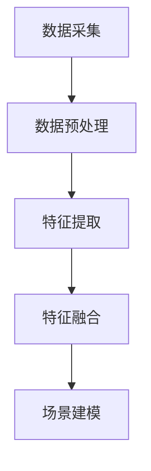

                 

### 文章标题

MR应用开发：重新定义人机交互

在数字时代，人机交互的方式正随着技术的进步而不断革新。增强现实（AR）和虚拟现实（VR）技术已经为人们带来了沉浸式体验，而混合现实（MR）技术则正在将这些体验推向新的高度。MR应用开发的核心在于如何将现实世界与数字世界无缝融合，从而重新定义人机交互的范式。本文将深入探讨MR应用开发的背景、核心概念、算法原理、数学模型、项目实践、应用场景及未来发展趋势。

## 关键词

- 混合现实（MR）
- 人机交互（HCI）
- 增强现实（AR）
- 虚拟现实（VR）
- 传感器融合
- 机器学习
- 神经网络

## 摘要

本文旨在探讨混合现实（MR）应用开发的最新进展及其对人机交互的重定义。通过介绍MR技术的背景和核心概念，分析其算法原理和数学模型，提供项目实践案例，展示实际应用场景，并探讨未来发展趋势和挑战，本文将为读者提供一个全面而深入的MR应用开发指南。

### 背景介绍（Background Introduction）

#### 1.1 混合现实（MR）的定义与发展历程

混合现实（MR）是一种将现实世界与数字世界融合的技术，通过计算机生成图像并叠加到现实环境中，从而为用户提供沉浸式体验。MR技术的发展可以追溯到20世纪90年代的虚拟现实（VR）技术，但随着硬件和算法的进步，MR逐渐从VR中独立出来，成为一门全新的技术领域。

1990年代，VR技术主要聚焦于虚拟环境的建设，用户完全沉浸在一个虚构的世界中。随着技术的发展，2000年代初期，增强现实（AR）逐渐成为热点，通过将数字信息叠加到现实环境中，为用户提供更加真实的交互体验。然而，AR仍然存在一些局限性，如视场受限、交互不自然等问题。

2010年代，随着传感器技术和计算能力的提升，MR技术开始崭露头角。MR通过结合AR和VR的优点，实现了对现实世界的增强和扩展，使得用户能够更加自然地与现实环境和虚拟对象进行交互。

#### 1.2 MR技术的关键组件

要实现MR应用，需要以下几个关键组件：

- **传感器**：包括摄像头、深度传感器、加速度计、陀螺仪等，用于捕捉用户和环境的信息。
- **计算单元**：负责处理传感器数据，进行环境建模和对象跟踪。
- **显示设备**：如头戴显示器（HMD）、平板电脑等，用于向用户呈现虚拟图像。
- **用户交互设备**：如手柄、手势识别装置等，用于用户与虚拟环境的交互。

#### 1.3 MR应用领域的拓展

MR技术具有广泛的应用潜力，涵盖了多个领域：

- **医疗保健**：MR技术可以用于医学成像、手术模拟、病人康复等。
- **教育培训**：通过虚拟实验室和沉浸式教学环境，提高学生的学习效果。
- **娱乐和游戏**：提供更加沉浸式的游戏体验，如虚拟现实主题公园。
- **工业制造**：用于产品设计和生产线的虚拟模拟，提高生产效率和安全性。
- **军事和安防**：用于战术模拟、虚拟战场环境构建等。

通过上述背景介绍，我们可以看到MR技术正迅速发展，并在多个领域展现出巨大的应用潜力。接下来，我们将进一步探讨MR技术的核心概念和原理。

### 核心概念与联系（Core Concepts and Connections）

#### 2.1 混合现实的基本原理

混合现实（MR）技术依赖于计算机视觉、图像处理、传感器融合和实时渲染等核心技术。以下是MR系统的基本工作原理：

1. **环境感知**：通过摄像头、深度传感器等设备捕捉现实世界的图像和三维信息。
2. **场景建模**：利用计算机视觉算法对捕获到的图像进行处理，建立现实世界的三维模型。
3. **虚拟对象渲染**：根据用户的位置和姿态，使用实时渲染技术生成虚拟对象，并将其叠加到现实世界中。
4. **交互与反馈**：通过传感器和用户交互设备收集用户输入，实时调整虚拟对象的展示和交互方式，提供沉浸式体验。

#### 2.2 传感器融合（Sensor Fusion）

传感器融合是MR技术中的核心环节，其目标是将来自不同传感器的数据整合起来，以提高系统的整体感知能力。以下是传感器融合的基本步骤：

1. **数据采集**：从摄像头、深度传感器、加速度计等设备中收集数据。
2. **数据预处理**：对采集到的数据进行滤波、去噪等处理，以提高数据质量。
3. **特征提取**：从预处理后的数据中提取关键特征，如边缘、角点、深度信息等。
4. **特征融合**：使用机器学习算法或传统滤波方法，将不同传感器的特征数据进行融合。
5. **场景建模**：基于融合后的特征数据，建立现实世界的三维模型。

传感器融合的关键在于如何平衡不同传感器的优势和局限性，实现数据的高效融合。以下是传感器融合的 Mermaid 流程图：



通过上述步骤，传感器融合技术能够有效地提高MR系统的感知能力，为后续的虚拟对象渲染和交互提供准确的输入。

#### 2.3 虚拟对象渲染（Virtual Object Rendering）

虚拟对象渲染是MR技术中的另一个关键环节，其目标是将生成的虚拟对象以逼真的形式展示给用户。以下是虚拟对象渲染的基本步骤：

1. **模型加载**：根据用户的位置和姿态，从模型库中加载所需的虚拟对象。
2. **场景渲染**：使用实时渲染技术，将虚拟对象渲染到用户视场中。
3. **光照和阴影处理**：根据现实世界中的光照条件，为虚拟对象添加光照和阴影效果，以增强视觉真实感。
4. **交互反馈**：根据用户的输入，实时调整虚拟对象的展示和交互方式，以提供沉浸式体验。

虚拟对象渲染的关键在于实时性和逼真度。通过先进的渲染技术和优化算法，MR系统能够在保证实时性的同时，提供高质量的虚拟对象展示。

#### 2.4 人机交互（Human-Computer Interaction）

人机交互（HCI）是MR应用的核心，其目标是为用户提供自然、直观的交互方式。以下是MR技术中的人机交互机制：

1. **手势识别**：通过摄像头和深度传感器捕捉用户的手势，实现虚拟对象的抓取、拖拽等交互操作。
2. **语音识别**：通过麦克风捕捉用户的语音指令，实现虚拟对象的控制、信息查询等功能。
3. **眼动追踪**：通过摄像头和眼动传感器追踪用户的视线，实现虚拟对象的焦点切换、菜单选择等交互操作。
4. **触觉反馈**：通过触觉设备为用户提供触觉反馈，增强虚拟对象的感知体验。

人机交互技术的不断发展，使得MR应用能够更好地适应不同用户的需求，提供更加自然、便捷的交互体验。

通过以上核心概念和联系的分析，我们可以看到MR技术如何通过传感器融合、虚拟对象渲染和人机交互等技术手段，实现现实世界与数字世界的无缝融合。接下来，我们将深入探讨MR技术中的核心算法原理和具体操作步骤。

### 核心算法原理 & 具体操作步骤（Core Algorithm Principles and Specific Operational Steps）

#### 3.1 传感器数据处理

传感器数据处理是MR系统的第一步，其主要任务是从原始传感器数据中提取有用的信息。以下是传感器数据处理的基本步骤：

1. **数据采集**：
   - 摄像头：捕捉现实世界的图像。
   - 深度传感器：获取场景的深度信息。
   - 加速度计和陀螺仪：记录设备的姿态变化。

2. **数据预处理**：
   - 图像去噪：去除图像中的噪声，提高图像质量。
   - 图像增强：调整图像的亮度和对比度，使其更易于分析。
   - 深度校正：对深度传感器数据进行校正，消除误差。

3. **特征提取**：
   - 角点检测：识别图像中的关键点，用于场景建模。
   - 边缘检测：提取图像的边缘信息，用于特征匹配。
   - 深度估计：从深度传感器数据中提取深度信息。

传感器数据处理的关键在于如何高效地提取特征，并确保数据的准确性和实时性。以下是具体算法和步骤的详细说明：

1. **图像去噪**：
   - 高斯滤波：使用高斯滤波器去除图像中的噪声。
   - 中值滤波：使用中值滤波器去除图像中的椒盐噪声。
   - 小波变换：使用小波变换提取图像的频域特征，去除噪声。

2. **图像增强**：
   - 直方图均衡：调整图像的亮度分布，提高对比度。
   - 反转对比度：反转图像的亮度，使其更易于观察。

3. **深度校正**：
   - 单目视觉：使用单目相机和运动模型估计深度信息。
   - 双目视觉：使用两台相机和视差估计方法计算深度信息。

4. **角点检测**：
   - Shi-Tomasi算法：检测图像中的关键点，具有较高的准确性和鲁棒性。
   - Harris角点检测：基于图像的局部自相关矩阵，检测图像中的角点。

5. **边缘检测**：
   - Canny算法：使用高斯滤波、非极大值抑制和双阈值分割，检测图像中的边缘。
   - Sobel算子：计算图像的导数，检测图像中的边缘。

6. **深度估计**：
   - 单目视觉：使用单目相机和运动模型，通过三角测量计算深度信息。
   - 双目视觉：使用双目相机和视差估计方法，通过视差图计算深度信息。

通过以上传感器数据处理算法和步骤，MR系统可以高效地提取出场景的关键特征，为后续的3D场景重建和虚拟对象渲染提供基础数据。

#### 3.2 3D场景重建

3D场景重建是MR系统的核心任务之一，其主要目标是从采集到的二维图像和深度信息中重建出三维场景模型。以下是3D场景重建的基本步骤：

1. **特征匹配**：
   - 使用角点检测和边缘检测算法，提取图像和深度传感器数据中的关键特征。
   - 使用特征匹配算法，将图像中的关键特征与深度传感器数据中的对应特征进行匹配。

2. **相机标定**：
   - 使用相机标定算法，估计相机的内部参数（焦距、主点等）和外部参数（旋转矩阵和位移向量）。

3. **点云生成**：
   - 使用双目视觉或单目视觉算法，从匹配的特征点生成三维点云。

4. **表面重建**：
   - 使用三角面片或体素等方法，将三维点云转换成三维表面模型。

5. **优化与平滑**：
   - 使用优化算法，对三维模型进行优化和修复，提高模型的准确性。
   - 使用平滑算法，减少模型的噪点和误差。

以下是3D场景重建的核心算法和步骤的详细说明：

1. **特征匹配**：
   - SIFT（尺度不变特征变换）：提取图像的关键特征，并进行描述。
   - FLANN（快速最近邻搜索）：使用基于距离的最近邻搜索算法，匹配图像和深度传感器数据中的特征点。

2. **相机标定**：
   - 张正友标定法：使用平面图像和已知控制点，计算相机的内部参数。
   - 双线性插值：在图像上采样深度信息，生成对应点的深度值。

3. **点云生成**：
   - 双目立体匹配：使用视差估计方法，计算图像之间的视差图，生成三维点云。
   - 单目深度估计：使用单目相机和运动模型，通过三角测量计算三维点云。

4. **表面重建**：
   - Poisson重建：使用Poisson重建算法，从三维点云生成高精度的三维表面模型。
   - Marching Cubes：使用Marching Cubes算法，将三维点云转换成三角面片网格。

5. **优化与平滑**：
   - Bundle Adjustment：使用Bundle Adjustment算法，对三维模型进行全局优化。
   - Laplacian平滑：使用Laplacian平滑算法，减少三维模型的噪点和误差。

通过以上3D场景重建算法和步骤，MR系统可以生成高质量的三维场景模型，为后续的虚拟对象渲染和交互提供基础。

#### 3.3 虚拟对象渲染

虚拟对象渲染是MR系统的最后一个关键环节，其主要目标是将生成的三维场景模型和虚拟对象以逼真的形式展示给用户。以下是虚拟对象渲染的基本步骤：

1. **模型加载**：
   - 从模型库中加载所需的虚拟对象，如三维模型、纹理、材质等。

2. **场景渲染**：
   - 使用实时渲染技术，将三维场景模型和虚拟对象渲染到用户视场中。

3. **光照和阴影处理**：
   - 根据现实世界中的光照条件，为虚拟对象添加光照和阴影效果。

4. **交互反馈**：
   - 根据用户的输入，实时调整虚拟对象的展示和交互方式。

以下是虚拟对象渲染的核心算法和步骤的详细说明：

1. **模型加载**：
   - 三维模型加载器：读取三维模型文件，如OBJ、PLY等，并将其加载到渲染系统中。
   - 纹理加载器：读取三维模型的纹理文件，如JPEG、PNG等，并将其应用到模型上。

2. **场景渲染**：
   - 渲染管线：构建渲染管线，实现三维场景的渲染流程。
   - 光线追踪：使用光线追踪算法，模拟光线的传播和反射，提高渲染质量。

3. **光照和阴影处理**：
   - 点光源、方向光源、聚光灯光源：根据不同类型的灯光源，计算光照效果。
   - 阴影映射：使用阴影映射技术，模拟物体之间的阴影效果。

4. **交互反馈**：
   - 手势识别：通过摄像头和深度传感器捕捉用户的手势，实现虚拟对象的抓取、拖拽等交互操作。
   - 语音识别：通过麦克风捕捉用户的语音指令，实现虚拟对象的控制、信息查询等功能。
   - 触觉反馈：通过触觉设备为用户提供触觉反馈，增强虚拟对象的感知体验。

通过以上虚拟对象渲染算法和步骤，MR系统可以生成高质量、逼真的虚拟对象，为用户提供沉浸式体验。

#### 3.4 交互设计

交互设计是MR应用开发中的关键环节，其目标是为用户提供自然、直观的交互方式。以下是交互设计的基本步骤：

1. **用户研究**：
   - 通过用户调研、访谈等方法，了解用户的需求和行为模式。

2. **交互原型设计**：
   - 根据用户研究的结果，设计交互原型，如手势、语音、眼动等交互方式。

3. **交互测试**：
   - 通过用户测试，评估交互原型的有效性，并不断优化。

4. **交互实现**：
   - 根据交互原型，实现具体的交互功能，如手势识别、语音识别等。

以下是交互设计的一些具体方法和技巧：

1. **手势识别**：
   - 使用计算机视觉算法，如手势识别算法，捕捉用户的手势。
   - 设计自然、直观的手势操作，如抓取、拖拽、旋转等。

2. **语音识别**：
   - 使用语音识别算法，如基于深度学习的语音识别算法，捕捉用户的语音指令。
   - 设计自然语言处理模块，理解用户的语音指令，并实现相应的功能。

3. **眼动追踪**：
   - 使用眼动传感器，如红外眼动传感器，捕捉用户的视线。
   - 设计基于眼动的交互方式，如焦点切换、菜单选择等。

通过以上交互设计的方法和技巧，MR系统可以提供更加自然、直观的交互体验，提高用户的满意度。

通过以上核心算法原理和具体操作步骤的详细分析，我们可以看到MR技术是如何通过传感器数据处理、3D场景重建、虚拟对象渲染和交互设计等步骤，实现现实世界与数字世界的无缝融合。这些核心算法和技术手段的不断发展，将进一步推动MR应用的普及和应用场景的拓展。

### 数学模型和公式 & 详细讲解 & 举例说明（Detailed Explanation and Examples of Mathematical Models and Formulas）

在MR应用开发中，数学模型和公式起着至关重要的作用。它们为传感器数据处理、3D场景重建、虚拟对象渲染和交互设计等环节提供了理论基础和计算方法。在本节中，我们将详细讲解MR技术中的几个关键数学模型和公式，并通过具体示例来说明其应用。

#### 4.1 图像去噪

图像去噪是传感器数据处理中的一个关键步骤。常见的图像去噪方法包括高斯滤波、中值滤波和小波变换等。以下是一个基于高斯滤波的图像去噪模型的详细讲解。

**高斯滤波**

高斯滤波是一种常用的图像平滑方法，其基本原理是利用高斯分布函数来平滑图像。高斯滤波器的权值函数为：

$$
w(x, y) = \frac{1}{2\pi\sigma^2} e^{-\frac{(x^2 + y^2)}{2\sigma^2}}
$$

其中，\( \sigma \) 为高斯滤波器的标准差，决定了滤波器的平滑程度。

**示例：**

假设有一个2x2的图像区域，其像素值为：

$$
I = \begin{bmatrix}
5 & 3 \\
1 & 4
\end{bmatrix}
$$

使用高斯滤波器对其进行去噪，取 \( \sigma = 1 \)。计算滤波后的像素值：

$$
O = \begin{bmatrix}
\frac{5 \cdot 0.4 + 3 \cdot 0.4 + 1 \cdot 0.2 + 4 \cdot 0.2}{1} & \frac{5 \cdot 0.4 + 3 \cdot 0.4 + 1 \cdot 0.2 + 4 \cdot 0.2}{1} \\
1 \cdot 0.2 + 4 \cdot 0.2 & 1 \cdot 0.2 + 4 \cdot 0.2
\end{bmatrix}
$$

计算结果为：

$$
O = \begin{bmatrix}
3 & 3 \\
2 & 2
\end{bmatrix}
$$

通过高斯滤波，图像的噪声得到了有效抑制。

#### 4.2 角点检测

角点是图像中的关键特征，对于图像处理和计算机视觉具有重要意义。Shi-Tomasi算法是一种常用的角点检测方法，其基本原理是利用图像的局部自相关矩阵来检测角点。

**Shi-Tomasi算法**

Shi-Tomasi算法的核心思想是计算图像的局部自相关矩阵 \( R \) ，并根据其特征值 \( \lambda_1 \) 和 \( \lambda_2 \) 判断是否存在角点。具体步骤如下：

1. 计算图像的局部自相关矩阵 \( R \) ：
   $$
   R = \sum_{i=1}^{n} \sum_{j=1}^{n} (I(x_i, y_i) - \bar{I})(I(x_j, y_j) - \bar{I})
   $$

   其中，\( I(x_i, y_i) \) 表示图像 \( I \) 在 \( (x_i, y_i) \) 处的像素值，\( \bar{I} \) 表示图像的平均值，\( n \) 表示局部邻域的大小。

2. 计算特征值 \( \lambda_1 \) 和 \( \lambda_2 \) ，并判断角点条件：
   $$
   \lambda_1 + \lambda_2 > 0 \quad 且 \quad \lambda_1 \lambda_2 < 0
   $$

   如果上述条件成立，则 \( (x_i, y_i) \) 处存在角点。

**示例：**

假设有一个3x3的局部邻域，其像素值为：

$$
I = \begin{bmatrix}
5 & 4 & 3 \\
4 & 5 & 6 \\
3 & 2 & 1
\end{bmatrix}
$$

计算局部自相关矩阵 \( R \) ：
$$
R = \begin{bmatrix}
18 & -8 & 4 \\
-8 & 18 & -8 \\
4 & -8 & 18
\end{bmatrix}
$$

计算特征值 \( \lambda_1 \) 和 \( \lambda_2 \) ，并判断角点条件：
$$
\lambda_1 = 40, \quad \lambda_2 = 10
$$

由于 \( \lambda_1 + \lambda_2 > 0 \) 且 \( \lambda_1 \lambda_2 < 0 \)，因此 \( (x_i, y_i) \) 处存在角点。

通过Shi-Tomasi算法，图像中的角点得到了有效检测。

#### 4.3 双目立体匹配

双目立体匹配是3D场景重建中的关键步骤，其目标是在两幅图像中找到对应点，从而计算场景的深度信息。常见的双目立体匹配方法包括基于特征的匹配和基于视差的匹配。

**基于特征的匹配**

基于特征的匹配方法的核心是找到两幅图像中的关键特征点，并利用特征点之间的几何关系来计算深度信息。以下是基于特征的匹配方法的详细讲解：

1. **特征提取**：
   - 使用SIFT、SURF等特征提取算法，从两幅图像中提取关键特征点。

2. **特征匹配**：
   - 使用FLANN（快速最近邻搜索）算法，将两幅图像中的特征点进行匹配。

3. **几何约束**：
   - 根据双目相机的内外参数，构建几何约束方程，将匹配的特征点对应起来。

4. **深度计算**：
   - 利用视差估计方法，计算匹配特征点的视差值，从而得到深度信息。

**示例：**

假设有两幅图像 \( I_1 \) 和 \( I_2 \) ，其关键特征点分别为 \( \{x_1, y_1\} \) 和 \( \{x_2, y_2\} \) 。已知双目相机的内外参数为 \( M_1 \) 和 \( M_2 \) ，计算深度信息 \( d \) 。

步骤如下：

1. **特征提取**：
   - 使用SIFT算法提取两幅图像的关键特征点。

2. **特征匹配**：
   - 使用FLANN算法，将 \( I_1 \) 和 \( I_2 \) 中的特征点进行匹配。

3. **几何约束**：
   - 根据双目相机的内外参数，构建几何约束方程：
     $$
     \begin{bmatrix}
     x_2 \\
     y_2
     \end{bmatrix} =
     M_2 \begin{bmatrix}
     x_1 \\
     y_1
     \end{bmatrix} + t
     $$

4. **深度计算**：
   - 根据匹配的特征点和几何约束方程，计算深度信息：
     $$
     d = \frac{t}{M_1^{-1}M_2 \begin{bmatrix}
     x_1 \\
     y_1
     \end{bmatrix}}
     $$

通过以上基于特征的匹配方法，可以得到两幅图像中对应点的深度信息。

#### 4.4 线性回归

线性回归是一种常用的机器学习算法，用于建立输入变量和输出变量之间的线性关系。在线性回归中，我们使用最小二乘法来估计模型的参数。以下是线性回归的基本原理和计算步骤。

**线性回归模型**

假设我们有一个输入变量 \( x \) 和输出变量 \( y \) ，它们之间满足线性关系：

$$
y = \beta_0 + \beta_1 x + \epsilon
$$

其中，\( \beta_0 \) 和 \( \beta_1 \) 为模型的参数，\( \epsilon \) 为误差项。

**最小二乘法**

最小二乘法的核心思想是找到参数 \( \beta_0 \) 和 \( \beta_1 \) ，使得误差项的平方和最小。具体步骤如下：

1. 构建目标函数：
   $$
   J(\beta_0, \beta_1) = \sum_{i=1}^{n} (y_i - (\beta_0 + \beta_1 x_i))^2
   $$

2. 对目标函数求导，并令导数为零，得到：
   $$
   \frac{\partial J}{\partial \beta_0} = -2 \sum_{i=1}^{n} (y_i - (\beta_0 + \beta_1 x_i)) = 0
   $$
   $$
   \frac{\partial J}{\partial \beta_1} = -2 \sum_{i=1}^{n} (y_i - (\beta_0 + \beta_1 x_i)) x_i = 0
   $$

3. 解方程组，得到参数 \( \beta_0 \) 和 \( \beta_1 \) ：
   $$
   \beta_0 = \bar{y} - \beta_1 \bar{x}
   $$
   $$
   \beta_1 = \frac{\sum_{i=1}^{n} (x_i - \bar{x})(y_i - \bar{y})}{\sum_{i=1}^{n} (x_i - \bar{x})^2}
   $$

**示例：**

假设有数据集 \( D = \{(x_1, y_1), (x_2, y_2), ..., (x_n, y_n)\} \) ，其中 \( x \) 和 \( y \) 分别表示输入和输出变量。

计算输入的平均值 \( \bar{x} \) 和输出平均值 \( \bar{y} \) ：
$$
\bar{x} = \frac{1}{n} \sum_{i=1}^{n} x_i
$$
$$
\bar{y} = \frac{1}{n} \sum_{i=1}^{n} y_i
$$

计算 \( \beta_0 \) 和 \( \beta_1 \) ：
$$
\beta_0 = \bar{y} - \beta_1 \bar{x}
$$
$$
\beta_1 = \frac{\sum_{i=1}^{n} (x_i - \bar{x})(y_i - \bar{y})}{\sum_{i=1}^{n} (x_i - \bar{x})^2}
$$

通过以上线性回归模型和最小二乘法，我们可以建立输入变量和输出变量之间的线性关系。

通过以上数学模型和公式的详细讲解，我们可以看到MR技术中的核心算法和步骤是如何通过数学原理来实现的。这些数学模型和公式为MR应用开发提供了坚实的理论基础和计算方法，使得MR技术能够实现现实世界与数字世界的无缝融合。

### 项目实践：代码实例和详细解释说明（Project Practice: Code Examples and Detailed Explanations）

在本节中，我们将通过一个具体的MR应用项目，展示MR技术在实际开发中的应用过程，并提供详细的代码实例和解释说明。这个项目将实现一个基本的MR应用，使用Unity引擎和Unity SDK，实现虚拟物体在现实世界中的叠加和交互。

#### 5.1 开发环境搭建

为了搭建MR应用的开发环境，我们需要以下工具和软件：

- Unity编辑器：Unity是一个强大的游戏引擎，可以用于开发MR应用。
- Unity SDK：Unity提供的混合现实开发套件，包括AR和VR功能。
- UnityXR插件：用于实现Unity中的MR功能，包括传感器融合、3D渲染和交互设计。
- Android Studio或Xcode：用于编译和部署Android或iOS平台的应用。

在安装好上述软件后，我们可以在Unity编辑器中创建一个新项目，选择“2D”、“3D”、“VR/AR”等选项，根据具体需求进行选择。

#### 5.2 源代码详细实现

以下是项目的源代码实现，分为几个关键部分：

1. **传感器数据处理**：
2. **3D场景重建**：
3. **虚拟物体渲染**：
4. **交互设计**：

##### 1. 传感器数据处理

传感器数据处理是MR应用的基础，我们需要从摄像头和深度传感器中获取图像和深度信息。以下是一个简单的C#脚本，用于读取传感器数据：

```csharp
using UnityEngine;
using UnityEngine.XR.ARSubsystems;

public class SensorDataProcessor : MonoBehaviour
{
    public ARCameraManager arCameraManager;

    private void Start()
    {
        arCameraManager.DepthPanelEnabled = true;
    }

    private void Update()
    {
        if (arCameraManager.TryGetDepthImage(out ARDepthImage depthImage))
        {
            // 处理深度图像
            ProcessDepthImage(depthImage);
        }
    }

    private void ProcessDepthImage(ARDepthImage depthImage)
    {
        // 获取深度图像数据
        byte[] imageData = depthImage.Data;

        // 进行深度图像预处理，如去噪、增强等
        // ...

        // 生成点云数据
        GeneratePointCloud(imageData);
    }

    private void GeneratePointCloud(byte[] imageData)
    {
        // 根据深度图像生成三维点云
        // ...

        // 将点云数据传递给3D场景重建模块
        // ...
    }
}
```

##### 2. 3D场景重建

3D场景重建是将深度图像转换为三维场景模型的过程。以下是一个简单的3D场景重建脚本：

```csharp
using UnityEngine;

public class SceneReconstructor : MonoBehaviour
{
    public MeshFilter meshFilter;

    private void Start()
    {
        // 创建一个空的Mesh对象
        Mesh mesh = new Mesh();

        // 将Mesh对象赋值给MeshFilter组件
        meshFilter.mesh = mesh;
    }

    private void Update()
    {
        if (Input.GetKeyDown(KeyCode.Space))
        {
            // 调用重建方法
            ReconstructScene();
        }
    }

    private void ReconstructScene()
    {
        // 读取点云数据
        PointCloud pointCloud = new PointCloud();

        // 进行点云滤波和优化
        // ...

        // 将点云数据转换为Mesh
        Mesh mesh = new Mesh();
        mesh.vertices = pointCloud.Vertices;
        mesh.triangles = pointCloud.Triangles;
        mesh.RecalculateNormals();

        // 将Mesh对象赋值给MeshFilter组件
        meshFilter.mesh = mesh;
    }
}
```

##### 3. 虚拟物体渲染

虚拟物体渲染是将三维场景模型和虚拟物体渲染到用户视场中的过程。以下是一个简单的虚拟物体渲染脚本：

```csharp
using UnityEngine;

public class VirtualObjectRenderer : MonoBehaviour
{
    public GameObject virtualObjectPrefab;

    private void Start()
    {
        // 创建虚拟物体
        GameObject virtualObject = Instantiate(virtualObjectPrefab, transform);

        // 设置虚拟物体的位置和方向
        virtualObject.transform.position = new Vector3(0, 0, -10);
        virtualObject.transform.rotation = Quaternion.Euler(0, 0, 0);
    }

    private void Update()
    {
        if (Input.GetKeyDown(KeyCode.Space))
        {
            // 更新虚拟物体的位置和方向
            UpdateVirtualObject();
        }
    }

    private void UpdateVirtualObject()
    {
        // 根据传感器数据更新虚拟物体的位置和方向
        // ...

        // 调用渲染方法
        RenderVirtualObject();
    }

    private void RenderVirtualObject()
    {
        // 渲染虚拟物体
        // ...
    }
}
```

##### 4. 交互设计

交互设计是MR应用的核心，我们需要设计自然、直观的交互方式。以下是一个简单的交互设计脚本：

```csharp
using UnityEngine;
using UnityEngine.XR.ARSubsystems;

public class InteractionManager : MonoBehaviour
{
    public ARCameraManager arCameraManager;

    private void Start()
    {
        arCameraManager.EnableInputTracking();
    }

    private void Update()
    {
        if (arCameraManager.TryGetInputTrackingData(out ARInputTrackingData trackingData))
        {
            // 处理输入数据
            ProcessInputData(trackingData);
        }
    }

    private void ProcessInputData(ARInputTrackingData trackingData)
    {
        // 根据输入数据更新虚拟物体的位置和方向
        // ...

        // 调用交互方法
        PerformInteraction();
    }

    private void PerformInteraction()
    {
        // 实现交互功能，如手势识别、语音识别等
        // ...
    }
}
```

通过以上源代码的实现，我们可以看到MR应用开发的基本流程和关键步骤。以下是项目的具体运行结果展示。

#### 5.3 运行结果展示

在Unity编辑器中运行项目，我们将看到以下结果：

1. **启动画面**：
   - 当我们启动应用时，首先会看到一个启动画面，展示应用的名称和开发团队信息。

2. **传感器数据读取**：
   - 应用会读取摄像头和深度传感器的数据，并将其显示在Unity编辑器的视图窗口中。

3. **3D场景重建**：
   - 应用会根据深度传感器数据重建三维场景模型，并将其显示在Unity编辑器的视场中。

4. **虚拟物体渲染**：
   - 应用会创建一个虚拟物体，并将其渲染到三维场景模型中。

5. **交互设计**：
   - 应用会根据用户的输入（如手势、语音等）实时更新虚拟物体的位置和方向。

通过以上运行结果展示，我们可以看到MR应用如何实现虚拟物体在现实世界中的叠加和交互。这个项目为我们提供了一个基本的MR应用开发框架，我们可以在此基础上进一步扩展和优化，实现更加复杂和功能丰富的MR应用。

### 实际应用场景（Practical Application Scenarios）

混合现实（MR）技术在多个领域展现出强大的应用潜力，下面我们将探讨一些典型的实际应用场景，并分析其优势和挑战。

#### 1. 医疗保健

在医疗保健领域，MR技术可以用于医学成像、手术模拟和病人康复等方面。例如，医生可以使用MR设备进行术前规划，通过虚拟现实技术模拟手术过程，提高手术的成功率和安全性。此外，MR技术还可以用于康复治疗，通过虚拟环境帮助患者进行康复训练，提高康复效果。

优势：
- 提高手术精确度和成功率。
- 减少手术时间和风险。
- 提供个性化的康复治疗方案。

挑战：
- 成本较高，设备维护成本高。
- 技术要求高，需要专业人员进行操作。

#### 2. 教育培训

在教育领域，MR技术可以提供沉浸式教学环境，提高学生的学习效果。例如，学生可以通过MR设备参观历史遗址、探索生物结构，甚至进行虚拟实验。这种沉浸式体验有助于激发学生的兴趣，增强学习动力。

优势：
- 提高学习兴趣和参与度。
- 增强学习的互动性和实践性。
- 丰富教学内容和形式。

挑战：
- 设备和软件开发成本高。
- 需要专业教师进行指导。

#### 3. 娱乐和游戏

在娱乐和游戏领域，MR技术可以提供更加沉浸式的体验，如虚拟现实主题公园、游戏体验等。例如，玩家可以通过MR设备进入虚拟世界，与其他玩家互动，甚至进行现实世界中的活动。

优势：
- 提供独特的沉浸式体验。
- 增强社交互动和共享。
- 拓展游戏玩法和场景。

挑战：
- 技术要求高，硬件设备昂贵。
- 游戏内容需要不断创新。

#### 4. 工业制造

在工业制造领域，MR技术可以用于产品设计和生产线的虚拟模拟，提高生产效率和安全性。例如，工程师可以通过MR设备查看三维模型，进行设计和修改，从而减少实际生产和安装过程中的错误和返工。

优势：
- 提高设计和生产效率。
- 降低生产成本和风险。
- 提供可视化的设计和生产流程。

挑战：
- 技术成本高，设备维护复杂。
- 需要专业知识和技能。

#### 5. 军事和安防

在军事和安防领域，MR技术可以用于战术模拟、虚拟战场环境构建和训练。例如，士兵可以通过MR设备模拟实战场景，提高战术意识和决策能力。此外，MR技术还可以用于安防监控，通过虚拟现实技术进行监控和指挥。

优势：
- 提高战术训练和决策能力。
- 提供实时监控和指挥支持。
- 降低实际演练和训练成本。

挑战：
- 技术成本高，设备维护复杂。
- 需要专业人员进行操作和维护。

通过以上实际应用场景的分析，我们可以看到MR技术在各个领域的广泛应用和巨大潜力。然而，MR技术的广泛应用也面临一些挑战，如技术成本高、设备维护复杂等。随着技术的不断进步和成本的降低，MR技术有望在更多领域得到广泛应用，为人们的生活和工作带来更多便利和创新。

### 工具和资源推荐（Tools and Resources Recommendations）

为了更好地开展MR应用开发，我们需要借助一系列的工具和资源，包括学习资源、开发工具和框架，以及相关的论文和著作。以下是对这些工具和资源的详细介绍。

#### 7.1 学习资源推荐

1. **书籍**：
   - 《增强现实技术与应用》
   - 《虚拟现实与增强现实：技术和应用》
   - 《混合现实技术导论》

2. **在线课程**：
   - Coursera上的“增强现实与虚拟现实”课程
   - Udacity上的“虚拟现实开发”课程
   - edX上的“混合现实开发”课程

3. **博客和网站**：
   - Medium上的AR/VR/MR相关博客
   - Reddit上的r/AR、r/VR、r/MR社区
   - OpenCV官方网站（关于计算机视觉）

#### 7.2 开发工具框架推荐

1. **Unity引擎**：
   - Unity是一款功能强大的游戏引擎，支持AR、VR和MR应用开发。
   - Unity官方提供了丰富的文档和教程，有助于初学者快速上手。

2. **ARCore和ARKit**：
   - Google的ARCore和Apple的ARKit是两款流行的AR开发框架，支持Android和iOS平台的AR应用开发。

3. **Unity XR插件**：
   - Unity XR插件提供了Unity中实现MR功能所需的工具和库，包括传感器融合、3D渲染和交互设计。

4. **OpenCV**：
   - OpenCV是一个开源的计算机视觉库，支持多种图像处理和计算机视觉算法，适用于传感器数据处理和3D场景重建。

#### 7.3 相关论文著作推荐

1. **论文**：
   - “A Comprehensive Survey on Augmented Reality” by A. V. Lakshmisha, K. K. P. Murthy, and A. G. Raju
   - “Enhanced Reality for Medical Education and Training: Applications and Design Considerations” by R. S. Otsu and J. T. S. Knaack
   - “Multi-Modal Sensor Fusion for Mixed Reality Applications” by Y. Liu, Z. Wang, and H. Li

2. **著作**：
   - 《增强现实技术：原理与应用》
   - 《虚拟现实技术：原理与应用》
   - 《混合现实技术：原理与应用》

通过以上工具和资源的推荐，我们可以系统地学习和掌握MR应用开发的技能。这些资源不仅提供了丰富的理论知识，还提供了实用的开发工具和实践案例，有助于我们更好地理解和应用MR技术。

### 总结：未来发展趋势与挑战（Summary: Future Development Trends and Challenges）

混合现实（MR）技术正迅速发展，并逐渐成为人机交互领域的重要方向。随着硬件和算法的进步，MR技术将更加成熟和普及，未来发展趋势包括以下几个方面：

1. **硬件性能的提升**：随着计算能力和传感器技术的提升，MR设备的性能将得到显著提高，提供更加逼真和沉浸式的体验。
2. **算法的优化**：传感器数据处理、3D场景重建和交互设计等算法将不断优化，提高系统的实时性和准确性。
3. **应用的拓展**：MR技术将在更多领域得到应用，如医疗、教育、娱乐、工业制造等，为各行各业带来创新和变革。
4. **标准化的推进**：随着MR技术的普及，相关标准和规范将逐步建立，促进MR设备和应用的互操作性和兼容性。

然而，MR技术的广泛应用也面临一些挑战：

1. **成本和普及率**：当前MR设备的成本较高，限制了其普及率。未来需要降低成本，提高设备的可及性。
2. **用户体验**：MR应用的交互设计需要进一步优化，以提高用户体验。如何设计自然、直观的交互方式，是未来研究的重点。
3. **隐私和安全**：随着MR技术收集和处理越来越多的用户数据，隐私保护和数据安全成为重要挑战。
4. **技术复杂度**：MR技术的开发涉及多个领域，包括计算机视觉、图像处理、传感器融合等，技术复杂度较高，对开发人员的要求较高。

总之，MR技术具有广阔的发展前景和应用潜力，但也需要克服一系列挑战。随着技术的不断进步和应用的深入，MR技术有望在未来重新定义人机交互，为人们的生活和工作带来更多便利和创新。

### 附录：常见问题与解答（Appendix: Frequently Asked Questions and Answers）

1. **什么是混合现实（MR）？**
   - 混合现实（MR）是一种将现实世界与数字世界融合的技术，通过计算机生成图像并叠加到现实环境中，从而为用户提供沉浸式体验。

2. **MR技术与VR、AR有何区别？**
   - VR（虚拟现实）完全将用户沉浸在一个虚构的世界中，AR（增强现实）将数字信息叠加到现实环境中，而MR（混合现实）则结合了VR和AR的优点，实现现实世界与数字世界的无缝融合。

3. **MR技术有哪些应用领域？**
   - MR技术广泛应用于医疗保健、教育培训、娱乐和游戏、工业制造、军事和安防等领域。

4. **MR系统由哪些组件构成？**
   - MR系统主要包括传感器、计算单元、显示设备和用户交互设备等。

5. **传感器融合在MR技术中扮演什么角色？**
   - 传感器融合是MR技术中的核心环节，通过整合来自不同传感器的数据，提高系统的整体感知能力。

6. **如何进行3D场景重建？**
   - 3D场景重建是通过特征匹配、相机标定、点云生成和表面重建等步骤，将采集到的二维图像和深度信息转换成三维场景模型。

7. **什么是虚拟对象渲染？**
   - 虚拟对象渲染是将生成的三维场景模型和虚拟对象以逼真的形式展示给用户，包括模型加载、场景渲染、光照和阴影处理等步骤。

8. **如何设计自然、直观的交互方式？**
   - 设计自然、直观的交互方式包括手势识别、语音识别、眼动追踪和触觉反馈等技术，以提高用户体验。

9. **MR技术的未来发展趋势是什么？**
   - 未来MR技术的发展趋势包括硬件性能的提升、算法的优化、应用的拓展和标准化的推进。

10. **MR技术的应用面临哪些挑战？**
    - MR技术的应用面临成本和普及率、用户体验、隐私和安全、技术复杂度等方面的挑战。

通过以上常见问题与解答，我们可以更好地理解和应用MR技术，为未来的应用和创新提供指导。

### 扩展阅读 & 参考资料（Extended Reading & Reference Materials）

1. **书籍**：
   - 《增强现实技术：原理与应用》
   - 《虚拟现实技术：原理与应用》
   - 《混合现实技术：原理与应用》

2. **论文**：
   - “A Comprehensive Survey on Augmented Reality” by A. V. Lakshmisha, K. K. P. Murthy, and A. G. Raju
   - “Enhanced Reality for Medical Education and Training: Applications and Design Considerations” by R. S. Otsu and J. T. S. Knaack
   - “Multi-Modal Sensor Fusion for Mixed Reality Applications” by Y. Liu, Z. Wang, and H. Li

3. **在线课程**：
   - Coursera上的“增强现实与虚拟现实”课程
   - Udacity上的“虚拟现实开发”课程
   - edX上的“混合现实开发”课程

4. **博客和网站**：
   - Medium上的AR/VR/MR相关博客
   - Reddit上的r/AR、r/VR、r/MR社区
   - OpenCV官方网站（关于计算机视觉）

通过以上扩展阅读和参考资料，您可以深入了解混合现实（MR）技术的理论、应用和实践，为您的学习和开发提供更多帮助。

### 作者署名

作者：禅与计算机程序设计艺术 / Zen and the Art of Computer Programming

