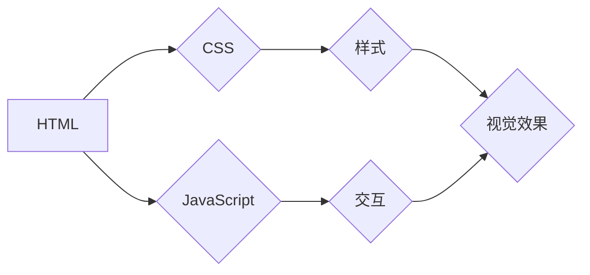

                 

## Web 前端开发：HTML、CSS 和 JavaScript

> 关键词：HTML, CSS, JavaScript, Web 前端, 网页开发, DOM, 样式表, 响应式设计, 前端框架

## 1. 背景介绍

随着互联网的蓬勃发展，网页开发作为构建数字世界的基石，日益重要。Web 前端开发，即构建用户在浏览器中看到的网页内容和交互体验的过程，是整个网页开发流程的核心环节。HTML、CSS 和 JavaScript 作为 Web 前端开发的三大核心技术，共同构成了网页的结构、样式和交互逻辑。

HTML (HyperText Markup Language) 负责网页的结构和内容，它使用标记语言定义网页元素，例如标题、段落、图像和链接。CSS (Cascading Style Sheets) 则负责网页的样式和布局，它定义了网页元素的字体、颜色、大小、位置等属性，使网页呈现出美观和一致的视觉效果。JavaScript 则赋予网页交互性和动态性，它可以响应用户操作，处理数据，实现动画效果等，使网页更加丰富和生动。

## 2. 核心概念与联系

### 2.1 HTML

HTML 是用于构建网页结构的标记语言。它使用标签来定义网页元素，标签通常成对出现，例如 `<p>` 标签表示段落，`</p>` 标签表示段落结束。HTML 元素可以嵌套，形成复杂的网页结构。

### 2.2 CSS

CSS 是用于定义网页样式的语言。它使用选择器选择 HTML 元素，然后使用属性值来设置元素的样式。CSS 可以通过内联样式、嵌入式样式和外部样式表三种方式应用于网页。

### 2.3 JavaScript

JavaScript 是用于添加网页交互性的编程语言。它可以访问和修改 HTML 元素，处理用户事件，执行计算，以及与服务器进行通信。JavaScript 代码通常嵌入在 HTML 文件中，也可以通过外部 JavaScript 文件引入。

**Mermaid 流程图**



## 3. 核心算法原理 & 具体操作步骤

### 3.1 算法原理概述

Web 前端开发的核心算法主要涉及 DOM 操作、CSS 选择器匹配、事件处理和数据处理等方面。

* **DOM 操作:** DOM (Document Object Model) 是一个表示网页结构的树形模型。JavaScript 可以通过 DOM API 操作 DOM 树，例如添加、删除、修改元素，以及获取元素属性和内容。

* **CSS 选择器匹配:** CSS 选择器用于选择特定的 HTML 元素，以便应用样式。选择器可以根据元素的标签名、类名、ID、属性值等进行匹配。

* **事件处理:** 事件处理是指在用户与网页交互时，JavaScript 代码根据用户操作触发相应的事件处理函数。常见的事件包括点击、鼠标移动、键盘输入等。

* **数据处理:** JavaScript 可以处理各种数据类型，例如字符串、数字、数组和对象。它提供了一系列函数和方法用于数据操作，例如字符串拼接、数字计算、数组排序和对象遍历等。

### 3.2 算法步骤详解

**DOM 操作步骤:**

1. 获取 DOM 元素：使用 JavaScript 的 `document.getElementById()`、`document.getElementsByClassName()` 等方法获取目标元素。
2. 操作 DOM 元素：使用 DOM API 方法修改元素属性、内容、样式等。例如，`element.textContent` 用于获取或设置元素的文本内容，`element.style.color` 用于设置元素的颜色。
3. 添加事件监听器：使用 `element.addEventListener()` 方法添加事件监听器，监听目标元素的事件触发。

**CSS 选择器匹配步骤:**

1. 编写 CSS 选择器：根据需要选择的目标元素属性，编写相应的 CSS 选择器。
2. 应用 CSS 样式：将 CSS 选择器和样式规则组合在一起，应用于目标元素。

**事件处理步骤:**

1. 添加事件监听器：使用 `element.addEventListener()` 方法添加事件监听器，监听目标元素的事件触发。
2. 定义事件处理函数：编写事件处理函数，用于处理事件触发后的逻辑。
3. 在事件处理函数中执行操作：根据事件类型和目标元素，执行相应的操作，例如修改元素样式、显示提示信息、发送网络请求等。

### 3.3 算法优缺点

**DOM 操作:**

* **优点:** 灵活、强大，可以精确地控制网页元素的结构和内容。
* **缺点:** 操作 DOM 树可能会导致性能问题，尤其是在处理大量元素时。

**CSS 选择器匹配:**

* **优点:** 简洁、易用，可以快速地应用样式规则到多个元素。
* **缺点:** 选择器匹配规则比较复杂，需要一定的学习成本。

**事件处理:**

* **优点:** 响应用户交互，使网页更加动态和交互性强。
* **缺点:** 事件处理逻辑可能会比较复杂，需要仔细设计和调试。

### 3.4 算法应用领域

* **网页布局和设计:** 使用 HTML、CSS 和 JavaScript 实现网页的结构、样式和布局。
* **网页交互和动画:** 使用 JavaScript 实现网页的交互效果和动画效果。
* **单页面应用 (SPA):** 使用 JavaScript 和框架 (如 React、Vue、Angular) 开发复杂的单页面应用。
* **移动端开发:** 使用 HTML、CSS 和 JavaScript 开发跨平台的移动应用。

## 4. 数学模型和公式 & 详细讲解 & 举例说明

### 4.1 数学模型构建

在 Web 前端开发中，数学模型主要用于计算网页元素的尺寸、位置、动画效果等。例如，计算元素的宽度和高度，可以使用以下公式：

$$
width = element.offsetWidth;
height = element.offsetHeight;
$$

### 4.2 公式推导过程

CSS 中的布局模型使用盒模型来描述元素的尺寸和位置。盒模型包含四个部分：内容区域、边框、内边距和外边距。

* **内容区域:** 元素本身的内容。
* **边框:** 元素周围的边框。
* **内边距:** 元素内容和边框之间的空白区域。
* **外边距:** 元素边框和相邻元素之间的空白区域。

元素的总宽度和高度等于内容区域宽度和高度加上边框宽度、内边距和外边距。

### 4.3 案例分析与讲解

假设一个元素的宽度为 100px，边框宽度为 2px，内边距为 5px，外边距为 10px。那么该元素的总宽度为：

$$
totalWidth = contentWidth + borderWidth + paddingLeft + paddingRight + marginLeft + marginRight;
totalWidth = 100px + 2px + 5px + 5px + 10px + 10px;
totalWidth = 132px;
$$

## 5. 项目实践：代码实例和详细解释说明

### 5.1 开发环境搭建

* 安装 Node.js 和 npm (Node Package Manager)。
* 创建一个新的项目文件夹。
* 在项目文件夹中创建一个 `index.html` 文件。

### 5.2 源代码详细实现

```html
<!DOCTYPE html>
<html>
<head>
  <title>Web 前端开发示例</title>
  <style>
    body {
      margin: 0;
      padding: 0;
      font-family: sans-serif;
    }
    .container {
      width: 500px;
      margin: 50px auto;
      padding: 20px;
      border: 1px solid #ccc;
    }
    h1 {
      text-align: center;
    }
    p {
      margin-bottom: 10px;
    }
    button {
      padding: 10px 20px;
      background-color: #4CAF50;
      color: white;
      border: none;
      cursor: pointer;
    }
  </style>
</head>
<body>
  <div class="container">
    <h1>Web 前端开发示例</h1>
    <p>这是一个简单的网页示例，展示了 HTML、CSS 和 JavaScript 的基本用法。</p>
    <button id="myButton">点击我</button>
  </div>
  <script>
    const button = document.getElementById('myButton');
    button.addEventListener('click', function() {
      alert('按钮被点击了!');
    });
  </script>
</body>
</html>
```

### 5.3 代码解读与分析

* **HTML 部分:** 定义了网页的结构，包括标题、段落和按钮元素。
* **CSS 部分:** 定义了网页元素的样式，例如字体、颜色、大小和布局。
* **JavaScript 部分:** 添加了一个事件监听器，当用户点击按钮时，会弹出提示信息。

### 5.4 运行结果展示

运行上述代码，将打开一个简单的网页，包含标题、段落和一个按钮。点击按钮，将弹出“按钮被点击了！”的提示信息。

## 6. 实际应用场景

### 6.1 网站建设

Web 前端开发是构建网站的基础，无论是个人博客、企业网站还是电商平台，都需要使用 HTML、CSS 和 JavaScript 来实现网页的结构、样式和交互功能。

### 6.2 移动应用开发

随着移动互联网的普及，Web 前端开发技术也应用于移动应用开发。可以使用 HTML、CSS 和 JavaScript 开发跨平台的移动应用，例如使用 React Native 或 Ionic 等框架。

### 6.3 单页面应用 (SPA)

SPA (Single Page Application) 是指只加载一次 HTML 文件，然后通过 JavaScript 动态更新页面内容的应用。SPA 可以提供更流畅的用户体验，例如 Gmail、Facebook 等应用都使用了 SPA 技术。

### 6.4 游戏开发

一些简单的网页游戏也可以使用 HTML、CSS 和 JavaScript 开发。例如，可以使用 Canvas API 绘制图形，实现游戏逻辑和交互效果。

### 6.4 未来应用展望

随着 Web 技术的不断发展，Web 前端开发将更加强大和灵活。例如，WebAssembly 技术可以使 Web 应用运行更快的性能，GraphQL 可以提供更灵活的数据获取方式，WebXR 可以实现虚拟现实和增强现实体验。

## 7. 工具和资源推荐

### 7.1 学习资源推荐

* **MDN Web Docs:** https://developer.mozilla.org/en-US/
* **W3Schools:** https://www.w3schools.com/
* **freeCodeCamp:** https://www.freecodecamp.org/

### 7.2 开发工具推荐

* **Visual Studio Code:** https://code.visualstudio.com/
* **Sublime Text:** https://www.sublimetext.com/
* **Atom:** https://atom.io/

### 7.3 相关论文推荐

* **The Web Platform: A Survey:** https://www.researchgate.net/publication/326352214_The_Web_Platform_A_Survey
* **WebAssembly: A New Frontier for Web Development:** https://www.researchgate.net/publication/331833093_WebAssembly_A_New_Frontier_for_Web_Development

## 8. 总结：未来发展趋势与挑战

### 8.1 研究成果总结

Web 前端开发技术已经取得了长足的进步，HTML、CSS 和 JavaScript 已经成为构建现代网页的标准工具。WebAssembly、GraphQL、WebXR 等新技术也为 Web 开发带来了新的可能性。

### 8.2 未来发展趋势

* **性能优化:** Web 应用的性能将更加重要，例如 WebAssembly、Service Workers 等技术将被更加广泛地应用。
* **跨平台开发:** 跨平台开发工具和框架将更加成熟，例如 React Native、Ionic 等。
* **人工智能 (AI) 增强:** AI 技术将被应用于 Web 开发，例如代码生成、自动测试等。

### 8.3 面临的挑战

* **复杂性:** Web 应用的复杂性不断增加，开发人员需要掌握越来越多的技术和知识。
* **安全问题:** Web 应用的安全问题仍然是一个挑战，需要不断改进安全机制。
* **兼容性:** 不同浏览器和设备的兼容性问题仍然存在，需要开发人员进行测试和适配。

### 8.4 研究展望

未来 Web 前端开发的研究方向将集中在性能优化、跨平台开发、AI 增强等方面。同时，还需要解决安全问题、兼容性问题等挑战，不断提升 Web 开发的效率和质量。

## 9. 附录：常见问题与解答

### 9.1 什么是 DOM？

DOM (Document Object Model) 是一个表示网页结构的树形模型。它将网页元素表示为对象，可以使用 JavaScript 操作这些对象，例如获取元素属性、修改元素内容、添加元素等。

### 9.2 CSS 选择器是什么？

CSS 选择器用于选择特定的 HTML 元素，以便应用样式规则。选择器可以根据元素的标签名、类名、ID、属性值等进行匹配。

### 9.3 如何添加事件监听器？

可以使用 `element.addEventListener()` 方法添加事件监听器，监听目标元素的事件触发。例如，要监听按钮点击事件，可以使用以下代码：

```javascript
const button = document.getElementById('myButton');
button.addEventListener('click', function() {
  // 点击事件处理逻辑
});
```


作者：禅与计算机程序设计艺术 / Zen and the Art of Computer Programming<end_of_turn>

