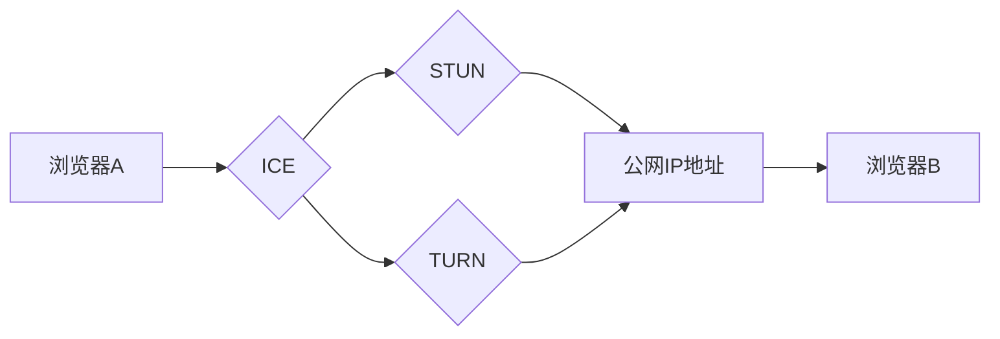

                 

## WebRTC技术：实现浏览器间的实时通信

> 关键词：WebRTC, 实时通信, 浏览器, 音视频, 数据传输, P2P, STUN, TURN, ICE

## 1. 背景介绍

随着互联网技术的不断发展，实时通信的需求日益增长。传统的实时通信技术，例如基于服务器的 VoIP 和视频会议系统，存在着延迟高、成本高、安全性低等问题。为了解决这些问题，WebRTC（Web Real-Time Communication）应运而生。WebRTC 是一种开源的 Web 技术标准，它允许浏览器之间直接进行实时音视频和数据传输，无需安装任何插件或应用程序。

WebRTC 的出现，为实时通信带来了革命性的改变。它简化了开发流程，降低了成本，提高了安全性，并为各种应用场景提供了新的可能性。例如，在线教育、远程医疗、在线游戏、即时聊天等领域都受益于 WebRTC 的应用。

## 2. 核心概念与联系

WebRTC 的核心概念包括：

* **P2P (点对点)：** WebRTC 允许浏览器之间直接进行通信，无需通过中间服务器。这种点对点通信方式可以有效降低延迟，提高通信效率。

* **STUN (Session Traversal Utilities for NAT)：** NAT (网络地址转换) 是路由器的一种功能，它可以将多个设备共享同一个公网 IP 地址。STUN 协议可以帮助 WebRTC 应用程序在 NAT 环境下进行通信。

* **TURN (Traversal Using Relays around NAT)：** 当 STUN 协议无法解决 NAT 问题时，TURN 协议可以提供一个中转服务器，帮助 WebRTC 应用程序进行通信。

* **ICE (Interactive Connectivity Establishment)：** ICE 协议是 WebRTC 的核心协议之一，它负责建立连接，并选择最佳的通信路径。ICE 协议会尝试使用多种方式进行连接，例如 P2P、STUN 和 TURN，最终选择最优的方案。

**Mermaid 流程图**



## 3. 核心算法原理 & 具体操作步骤

### 3.1  算法原理概述

WebRTC 的核心算法原理主要包括：

* **媒体编码和解码：** WebRTC 使用多种媒体编码和解码算法，例如 VP8、VP9 和 Opus，来压缩和解压缩音视频数据。

* **数据传输协议：** WebRTC 使用 UDP 协议进行媒体数据传输，并使用 TCP 协议进行控制信息传输。

* **网络连接管理：** WebRTC 使用 ICE 协议来管理网络连接，并选择最佳的通信路径。

### 3.2  算法步骤详解

WebRTC 的具体操作步骤如下：

1. **建立连接：** 两个浏览器首先需要建立连接，这可以通过 ICE 协议完成。ICE 协议会尝试使用多种方式进行连接，例如 P2P、STUN 和 TURN。

2. **媒体数据传输：** 浏览器之间可以使用 UDP 协议进行媒体数据传输。

3. **控制信息传输：** 浏览器之间可以使用 TCP 协议进行控制信息传输，例如媒体参数设置、连接状态等。

4. **媒体处理：** 浏览器会对接收到的媒体数据进行解码，并将其显示或播放。

### 3.3  算法优缺点

**优点：**

* **低延迟：** WebRTC 使用 P2P 通信方式，可以有效降低延迟。
* **成本低：** WebRTC 是开源的，无需支付任何费用。
* **安全性高：** WebRTC 使用加密技术来保护通信数据。

**缺点：**

* **网络复杂性：** WebRTC 需要处理 NAT 和防火墙等网络复杂问题。
* **浏览器兼容性：** WebRTC 的支持需要依赖浏览器厂商的更新。

### 3.4  算法应用领域

WebRTC 的应用领域非常广泛，包括：

* **在线教育：** WebRTC 可以用于进行在线直播、视频会议和远程教学。
* **远程医疗：** WebRTC 可以用于远程诊断、远程咨询和远程手术。
* **在线游戏：** WebRTC 可以用于开发低延迟的在线游戏。
* **即时聊天：** WebRTC 可以用于开发实时语音和视频聊天应用。

## 4. 数学模型和公式 & 详细讲解 & 举例说明

### 4.1  数学模型构建

WebRTC 的核心算法涉及到许多数学模型，例如：

* **数据包传输模型：** 

$$
P(t) = \frac{R}{B} * e^{-\frac{t}{T}}
$$

其中：

* $P(t)$ 表示在时间 $t$ 时刻传输的数据包数量。
* $R$ 表示传输速率。
* $B$ 表示数据包大小。
* $T$ 表示数据包传输时间。

* **延迟模型：**

$$
D = \frac{L}{R} + \frac{N}{B}
$$

其中：

* $D$ 表示延迟时间。
* $L$ 表示数据包长度。
* $R$ 表示传输速率。
* $N$ 表示数据包数量。
* $B$ 表示数据包大小。

### 4.2  公式推导过程

上述公式的推导过程较为复杂，需要结合网络传输原理、数据包处理机制等多方面因素进行分析。

### 4.3  案例分析与讲解

例如，在进行视频通话时，WebRTC 会根据网络状况动态调整视频分辨率和帧率，以保证通话质量。

## 5. 项目实践：代码实例和详细解释说明

### 5.1  开发环境搭建

WebRTC 的开发环境搭建相对简单，主要需要安装以下软件：

* **Web 浏览器：** 支持 WebRTC 的浏览器，例如 Chrome、Firefox、Edge 等。
* **WebRTC 库：** 例如 SimpleWebRTC、PeerJS 等。

### 5.2  源代码详细实现

以下是一个简单的 WebRTC 音视频通话示例代码：

```javascript
// 使用 SimpleWebRTC 库
var peer = new SimpleWebRTC({
  // 配置项
});

// 连接到服务器
peer.on('readyToCall', function() {
  console.log('ready to call');
});

// 接收视频流
peer.on('stream', function(stream) {
  // 将视频流添加到页面
});

// 发送视频流
peer.startLocalVideo();
```

### 5.3  代码解读与分析

* **SimpleWebRTC 库：** 提供了 WebRTC 的基础功能，例如连接管理、媒体处理等。
* **peer.on('readyToCall')：** 当浏览器准备好进行通话时触发。
* **peer.on('stream')：** 当接收到的视频流时触发。
* **peer.startLocalVideo()：** 启动本地视频流。

### 5.4  运行结果展示

运行上述代码后，浏览器将启动本地视频摄像头，并连接到服务器。当连接成功后，用户将能够看到对方的视频流。

## 6. 实际应用场景

WebRTC 的应用场景非常广泛，例如：

* **在线教育：** WebRTC 可以用于进行在线直播、视频会议和远程教学。
* **远程医疗：** WebRTC 可以用于远程诊断、远程咨询和远程手术。
* **在线游戏：** WebRTC 可以用于开发低延迟的在线游戏。
* **即时聊天：** WebRTC 可以用于开发实时语音和视频聊天应用。

### 6.4  未来应用展望

WebRTC 的未来应用前景十分广阔，例如：

* **虚拟现实 (VR) 和增强现实 (AR)：** WebRTC 可以用于构建沉浸式的 VR 和 AR 体验。
* **物联网 (IoT)：** WebRTC 可以用于连接和控制 IoT 设备。
* **工业自动化：** WebRTC 可以用于远程监控和控制工业设备。

## 7. 工具和资源推荐

### 7.1  学习资源推荐

* **WebRTC 官方网站：** https://webrtc.org/
* **WebRTC 文档：** https://developer.mozilla.org/en-US/docs/Web/API/WebRTC_API
* **WebRTC 教程：** https://www.w3schools.com/html/html5_webRTC.asp

### 7.2  开发工具推荐

* **SimpleWebRTC：** https://github.com/SimpleWebRTC/SimpleWebRTC
* **PeerJS：** https://peerjs.com/
* **MediaSoup：** https://mediasoup.org/

### 7.3  相关论文推荐

* **WebRTC：A New Era for Real-Time Communication on the Web**
* **The Design and Implementation of WebRTC**

## 8. 总结：未来发展趋势与挑战

### 8.1  研究成果总结

WebRTC 技术已经取得了显著的成果，为实时通信带来了革命性的改变。它简化了开发流程，降低了成本，提高了安全性，并为各种应用场景提供了新的可能性。

### 8.2  未来发展趋势

WebRTC 的未来发展趋势包括：

* **更低延迟：** 研究人员将继续探索更低延迟的实时通信技术。
* **更广泛的应用场景：** WebRTC 将被应用于更多领域，例如 VR、AR、IoT 等。
* **更强大的功能：** WebRTC 将支持更多功能，例如屏幕共享、文件传输等。

### 8.3  面临的挑战

WebRTC 还面临着一些挑战，例如：

* **网络复杂性：** WebRTC 需要处理 NAT 和防火墙等网络复杂问题。
* **浏览器兼容性：** WebRTC 的支持需要依赖浏览器厂商的更新。
* **安全性：** WebRTC 需要保证通信数据的安全性。

### 8.4  研究展望

未来，WebRTC 技术将继续发展和完善，为用户提供更便捷、更安全、更可靠的实时通信体验。

## 9. 附录：常见问题与解答

**常见问题：**

* **WebRTC 是否需要安装插件？**

答：不需要安装任何插件，WebRTC 是直接在浏览器中运行的。

* **WebRTC 是否支持所有浏览器？**

答：大部分主流浏览器都支持 WebRTC，但具体支持情况请参考浏览器厂商的官方文档。

* **WebRTC 的安全性如何？**

答：WebRTC 使用加密技术来保护通信数据，但用户仍需注意网络安全问题。

**作者：禅与计算机程序设计艺术 / Zen and the Art of Computer Programming**<end_of_turn>

