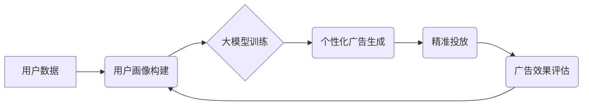

                 

## 个性化广告：大模型的精准投放

> 关键词：大模型、个性化广告、推荐系统、深度学习、自然语言处理、用户画像、精准投放

## 1. 背景介绍

在数字时代，广告已成为企业营销的重要手段。然而，传统的广告投放方式往往缺乏精准性，导致资源浪费和广告效果不佳。随着人工智能技术的快速发展，大模型的出现为个性化广告的精准投放提供了新的可能性。

大模型，是指在海量数据上训练的具有强大泛化能力的深度学习模型。其强大的语义理解和文本生成能力，能够有效分析用户行为、兴趣偏好等信息，并生成个性化的广告内容，从而实现精准投放。

## 2. 核心概念与联系

### 2.1 个性化广告

个性化广告是指根据用户的个人特征、行为模式、兴趣爱好等信息，定制化的广告内容和投放方式。其目标是提高广告的点击率、转化率，并提升用户体验。

### 2.2 大模型

大模型是指参数量巨大、训练数据海量、具备强大泛化能力的深度学习模型。其能够学习复杂的模式和关系，并应用于各种自然语言处理任务，例如文本分类、机器翻译、问答系统等。

### 2.3 精准投放

精准投放是指根据用户画像和行为数据，将广告精准地投放到目标用户面前，提高广告的有效性。

**核心概念与联系流程图**



## 3. 核心算法原理 & 具体操作步骤

### 3.1 算法原理概述

大模型在个性化广告精准投放中的核心算法主要包括：

* **用户画像构建:** 利用用户行为数据、兴趣偏好、社交关系等信息，构建用户画像，刻画用户的特征和属性。
* **大模型训练:** 利用海量用户数据和广告数据，训练大模型，使其能够学习用户行为模式和广告特征之间的关系。
* **个性化广告生成:** 根据用户的画像信息，利用训练好的大模型生成个性化的广告内容，例如推荐商品、展示相关信息等。
* **精准投放:** 根据用户的画像信息和广告内容，将广告精准地投放到目标用户面前。

### 3.2 算法步骤详解

1. **数据收集与预处理:** 收集用户行为数据、广告数据、产品信息等数据，并进行清洗、转换、编码等预处理操作。
2. **用户画像构建:** 利用机器学习算法，例如聚类算法、关联规则挖掘算法等，构建用户画像，将用户分为不同的群体，并为每个群体描述其特征和属性。
3. **大模型训练:** 选择合适的深度学习模型，例如Transformer、BERT等，利用收集到的数据进行训练，使其能够学习用户行为模式和广告特征之间的关系。
4. **个性化广告生成:** 根据用户的画像信息，利用训练好的大模型生成个性化的广告内容，例如推荐商品、展示相关信息等。
5. **精准投放:** 根据用户的画像信息和广告内容，将广告精准地投放到目标用户面前，例如在搜索结果页面、社交媒体平台、网站banner等位置。
6. **广告效果评估:** 收集广告点击率、转化率等数据，评估广告效果，并根据评估结果进行模型优化和调整。

### 3.3 算法优缺点

**优点:**

* **精准投放:** 大模型能够根据用户的画像信息，精准地投放广告，提高广告的有效性。
* **个性化体验:** 大模型能够生成个性化的广告内容，提升用户的广告体验。
* **自动化运营:** 大模型能够自动生成广告内容和进行精准投放，降低人工成本。

**缺点:**

* **数据依赖:** 大模型的训练需要海量数据，数据质量直接影响模型效果。
* **计算资源:** 大模型的训练需要大量的计算资源，成本较高。
* **隐私安全:** 大模型的训练和应用可能会涉及用户隐私信息，需要做好隐私保护工作。

### 3.4 算法应用领域

大模型在个性化广告精准投放领域具有广泛的应用前景，例如：

* **电商平台:** 推荐商品、个性化促销活动。
* **社交媒体平台:** 个性化广告投放、精准用户匹配。
* **新闻网站:** 个性化新闻推荐、精准广告投放。
* **游戏平台:** 个性化游戏推荐、精准用户运营。

## 4. 数学模型和公式 & 详细讲解 & 举例说明

### 4.1 数学模型构建

个性化广告精准投放的数学模型通常基于用户画像和广告特征之间的关系。

**用户画像:**

用户画像可以表示为一个向量，其中每个维度代表用户的某个特征，例如年龄、性别、兴趣爱好、购买行为等。

**广告特征:**

广告特征也可以表示为一个向量，其中每个维度代表广告的某个属性，例如广告标题、广告内容、广告类别、广告价格等。

**关系模型:**

用户画像和广告特征之间的关系可以表示为一个评分函数，该函数将用户画像和广告特征作为输入，输出一个分数，表示用户对该广告的兴趣程度。

### 4.2 公式推导过程

评分函数的具体形式取决于具体的算法模型。例如，可以使用协同过滤算法，根据用户的历史行为数据和广告的特征信息，计算用户对广告的评分。

**协同过滤算法公式:**

$$
r_{ui} = \frac{\sum_{j \in N(u)} \frac{s_{uj} \cdot s_{ij}}{\sqrt{\sum_{k \in N(u)} s_{uk}^2} \cdot \sqrt{\sum_{l \in N(i)} s_{il}^2}}}{ \sum_{j \in N(u)} \frac{1}{\sqrt{\sum_{k \in N(u)} s_{uk}^2}}}
$$

其中：

* $r_{ui}$ 表示用户 $u$ 对广告 $i$ 的评分。
* $s_{uj}$ 表示用户 $u$ 对广告 $j$ 的评分。
* $s_{ij}$ 表示广告 $i$ 和广告 $j$ 的相似度。
* $N(u)$ 表示用户 $u$ 评分过的广告集合。
* $N(i)$ 表示广告 $i$ 评分过的用户集合。

### 4.3 案例分析与讲解

假设有一个电商平台，想要推荐商品给用户。

* **用户画像:** 用户的年龄、性别、购买历史、浏览记录等信息。
* **广告特征:** 商品的类别、价格、品牌、描述等信息。

可以使用协同过滤算法，根据用户的历史购买行为和商品的特征信息，计算用户对每个商品的评分，并推荐用户评分最高的商品。

## 5. 项目实践：代码实例和详细解释说明

### 5.1 开发环境搭建

* **操作系统:** Linux/macOS/Windows
* **编程语言:** Python
* **深度学习框架:** TensorFlow/PyTorch
* **其他工具:** Jupyter Notebook、Git

### 5.2 源代码详细实现

```python
# 导入必要的库
import tensorflow as tf

# 定义用户画像和广告特征的维度
user_dim = 10
item_dim = 5

# 定义评分函数
def rating_function(user_vector, item_vector):
  return tf.reduce_sum(user_vector * item_vector)

# 创建用户向量和商品向量
user_vectors = tf.random.normal([100, user_dim])
item_vectors = tf.random.normal([1000, item_dim])

# 计算用户对每个商品的评分
ratings = rating_function(user_vectors, item_vectors)

# 打印评分结果
print(ratings)
```

### 5.3 代码解读与分析

* 代码首先导入必要的库，包括 TensorFlow 深度学习框架。
* 然后定义用户画像和广告特征的维度，例如用户画像包含 10 个维度，商品特征包含 5 个维度。
* 定义评分函数，该函数将用户向量和商品向量作为输入，计算用户对商品的评分。
* 创建用户向量和商品向量，使用随机数初始化。
* 计算用户对每个商品的评分，并打印结果。

### 5.4 运行结果展示

运行代码后，会输出一个包含 100 个用户和 1000 个商品的评分矩阵。每个元素代表用户对商品的评分。

## 6. 实际应用场景

### 6.1 电商平台

电商平台可以利用大模型进行个性化商品推荐，提高用户购物体验和转化率。例如，根据用户的浏览历史、购买记录、购物车内容等信息，推荐用户可能感兴趣的商品。

### 6.2 社交媒体平台

社交媒体平台可以利用大模型进行精准广告投放，提高广告效果和用户参与度。例如，根据用户的兴趣爱好、社交关系、行为模式等信息，投放与用户相关联的广告。

### 6.3 新闻网站

新闻网站可以利用大模型进行个性化新闻推荐，提高用户阅读兴趣和粘性。例如，根据用户的阅读历史、关注领域、新闻偏好等信息，推荐用户可能感兴趣的新闻。

### 6.4 未来应用展望

随着大模型技术的不断发展，个性化广告精准投放的应用场景将更加广泛，例如：

* **医疗保健:** 根据用户的健康状况、病史、生活习惯等信息，推荐个性化的医疗服务和健康产品。
* **教育培训:** 根据用户的学习目标、知识水平、学习风格等信息，推荐个性化的学习资源和课程。
* **金融服务:** 根据用户的财务状况、投资偏好、风险承受能力等信息，推荐个性化的理财产品和金融服务。

## 7. 工具和资源推荐

### 7.1 学习资源推荐

* **书籍:**
    * 《深度学习》
    * 《自然语言处理》
    * 《大模型的训练与应用》
* **在线课程:**
    * Coursera
    * edX
    * Udacity

### 7.2 开发工具推荐

* **深度学习框架:** TensorFlow, PyTorch
* **数据处理工具:** Pandas, NumPy
* **云计算平台:** AWS, Azure, GCP

### 7.3 相关论文推荐

* **BERT: Pre-training of Deep Bidirectional Transformers for Language Understanding**
* **GPT-3: Language Models are Few-Shot Learners**
* **Attention Is All You Need**

## 8. 总结：未来发展趋势与挑战

### 8.1 研究成果总结

大模型在个性化广告精准投放领域取得了显著的成果，能够有效提高广告效果和用户体验。

### 8.2 未来发展趋势

* **模型规模和能力的提升:** 未来大模型的规模和能力将进一步提升，能够学习更复杂的模式和关系，提供更精准的广告投放。
* **多模态融合:** 大模型将融合文本、图像、音频等多模态数据，提供更丰富的广告内容和更精准的个性化推荐。
* **隐私保护:** 大模型的训练和应用需要更加注重用户隐私保护，开发更加安全的隐私保护机制。

### 8.3 面临的挑战

* **数据质量和可获取性:** 大模型的训练需要海量高质量数据，数据质量和可获取性是制约大模型发展的关键因素。
* **计算资源和成本:** 大模型的训练需要大量的计算资源，成本较高，需要开发更加高效的训练算法和硬件平台。
* **伦理和社会影响:** 大模型的应用可能会带来伦理和社会问题，例如算法偏见、信息茧房等，需要加强伦理和社会规范的制定和监管。

### 8.4 研究展望

未来，大模型在个性化广告精准投放领域将继续发挥重要作用，为企业提供更有效的营销手段，为用户提供更个性化的广告体验。


## 9. 附录：常见问题与解答

**Q1: 大模型的训练需要多少数据？**

A1: 大模型的训练需要海量数据，通常需要百万甚至数十亿条数据。

**Q2: 大模型的训练需要多少计算资源？**

A2: 大模型的训练需要大量的计算资源，例如数百甚至数千个GPU。

**Q3: 大模型的应用会带来哪些伦理问题？**

A3: 大模型的应用可能会带来算法偏见、信息茧房等伦理问题，需要加强伦理和社会规范的制定和监管。


作者：禅与计算机程序设计艺术 / Zen and the Art of Computer Programming 
<end_of_turn>

