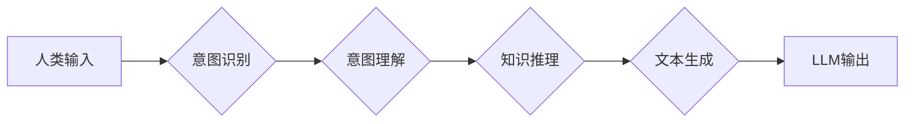

                 

## 人机共融：实现LLM与人类意图的完美对齐

> 关键词：LLM, 人机共融, 意图对齐, 自然语言理解, 深度学习, 知识图谱, 伦理问题

### 1. 背景介绍

近年来，大型语言模型（LLM）的快速发展，如GPT-3、LaMDA等，展现出惊人的文本生成、翻译、问答等能力，为人工智能领域带来了革命性的变革。然而，LLM的强大能力也伴随着一些挑战，其中最关键的便是**意图对齐问题**。

意图对齐是指让LLM能够准确理解人类的意图，并根据意图生成符合预期结果的输出。目前，许多LLM模型仍然存在着理解人类意图偏差、生成结果不符合预期、甚至产生有害输出等问题。这些问题严重阻碍了LLM在实际应用中的推广和发展。

解决意图对齐问题是LLM走向真正智能的关键。只有当LLM能够真正理解人类的意图，才能更好地服务于人类，并与人类实现真正的共融。

### 2. 核心概念与联系

**2.1  LLM与人类意图**

LLM本质上是一个强大的文本处理引擎，它通过学习海量文本数据，掌握了语言的语法、语义和上下文关系。然而，人类意图并非仅仅是文本的表面表达，它包含着复杂的背景知识、情感、动机等因素。

**2.2  意图识别与理解**

意图识别是指识别用户文本中的意图类别，例如查询信息、完成任务、表达情感等。意图理解则是进一步解析用户意图的具体内容，包括用户想要获取的信息、想要完成的任务、想要表达的情感等。

**2.3  LLM与意图对齐的架构**

实现LLM与人类意图的完美对齐，需要构建一个多层次的架构，包括：

* **数据层:** 收集和清洗人类意图相关的丰富数据，例如对话记录、文本注释、知识图谱等。
* **模型层:** 构建能够理解人类意图的模型，包括意图识别模型、意图理解模型、文本生成模型等。
* **算法层:** 设计有效的算法，用于训练和优化模型，提高意图对齐的准确率和鲁棒性。
* **应用层:** 将意图对齐技术应用于实际场景，例如聊天机器人、智能客服、个性化推荐等。

**2.4  Mermaid 流程图**



### 3. 核心算法原理 & 具体操作步骤

**3.1  算法原理概述**

实现LLM与人类意图的完美对齐，需要结合多种算法和技术，例如：

* **深度学习:** 利用深度神经网络，学习人类语言的复杂模式和关系。
* **强化学习:** 通过奖励机制，训练LLM模型生成符合人类意图的输出。
* **知识图谱:** 利用知识图谱，丰富LLM模型的知识储备，提高其理解人类意图的能力。

**3.2  算法步骤详解**

1. **数据预处理:** 收集和清洗人类意图相关的文本数据，并进行分词、词性标注、语义分析等预处理操作。
2. **意图识别模型训练:** 利用深度学习算法，训练一个意图识别模型，能够准确识别用户文本中的意图类别。
3. **意图理解模型训练:** 利用深度学习算法，训练一个意图理解模型，能够解析用户意图的具体内容，包括用户想要获取的信息、想要完成的任务、想要表达的情感等。
4. **知识图谱构建:** 构建一个知识图谱，包含人类世界中丰富的知识和关系，并与LLM模型进行连接。
5. **文本生成模型训练:** 利用深度学习算法，训练一个文本生成模型，能够根据用户意图生成符合预期结果的文本输出。
6. **强化学习训练:** 利用强化学习算法，训练LLM模型生成符合人类意图的输出，并通过奖励机制优化模型性能。

**3.3  算法优缺点**

* **优点:**

    * 能够准确识别和理解人类意图。
    * 能够生成符合人类预期结果的文本输出。
    * 能够不断学习和改进，提高意图对齐的准确率和鲁棒性。

* **缺点:**

    * 需要大量的数据进行训练，数据质量对模型性能有很大影响。
    * 模型训练过程复杂，需要专业的技术人员进行操作。
    * 仍然存在着一些理解人类意图偏差的可能性，需要不断改进和完善。

**3.4  算法应用领域**

* **聊天机器人:** 构建能够自然流畅地与人类对话的聊天机器人。
* **智能客服:** 提供24小时在线客服服务，自动解答用户问题。
* **个性化推荐:** 根据用户的意图，推荐个性化的商品、服务或内容。
* **教育领域:** 提供个性化的学习辅导和知识问答服务。
* **医疗领域:** 辅助医生诊断疾病、提供医疗建议。

### 4. 数学模型和公式 & 详细讲解 & 举例说明

**4.1  数学模型构建**

LLM与人类意图的完美对齐可以看作是一个**概率模型**问题。我们假设用户输入的文本为**x**，对应的意图为**y**，LLM模型的输出为**z**。

我们的目标是找到一个模型**P(z|x, y)**，能够最大化预测LLM输出**z**与真实意图**y**的匹配度。

**4.2  公式推导过程**

为了实现这个目标，我们可以使用**交叉熵损失函数**来衡量模型预测结果与真实意图之间的差异。

$$
Loss = - \sum_{y} y \log P(z|x, y)
$$

其中，**y**是真实意图的one-hot编码，**P(z|x, y)**是模型预测的概率分布。

通过最小化这个损失函数，我们可以训练模型，使其能够更好地预测LLM输出与真实意图的匹配度。

**4.3  案例分析与讲解**

假设用户输入的文本为“今天天气怎么样？”，对应的真实意图为“查询天气信息”。

LLM模型需要根据这个文本，预测出最符合用户意图的输出，例如“今天天气晴朗”。

我们可以使用交叉熵损失函数来衡量模型预测结果与真实意图之间的差异。

如果模型预测的概率分布为：

* 查询天气信息：0.9
* 查询新闻信息：0.1

那么，损失函数的值为：

$$
Loss = - (1 \log 0.9 + 0 \log 0.1) = - \log 0.9
$$

通过不断训练模型，我们可以降低这个损失函数的值，使得模型能够更好地预测用户意图。

### 5. 项目实践：代码实例和详细解释说明

**5.1  开发环境搭建**

* Python 3.7+
* TensorFlow 2.0+
* PyTorch 1.0+
* CUDA 10.0+ (可选)

**5.2  源代码详细实现**

```python
# 导入必要的库
import tensorflow as tf

# 定义一个简单的LLM模型
class SimpleLLM(tf.keras.Model):
    def __init__(self):
        super(SimpleLLM, self).__init__()
        self.embedding = tf.keras.layers.Embedding(input_dim=10000, output_dim=128)
        self.lstm = tf.keras.layers.LSTM(units=64)
        self.dense = tf.keras.layers.Dense(units=10, activation='softmax')

    def call(self, inputs):
        x = self.embedding(inputs)
        x = self.lstm(x)
        outputs = self.dense(x)
        return outputs

# 实例化模型
model = SimpleLLM()

# 定义损失函数和优化器
loss_fn = tf.keras.losses.CategoricalCrossentropy()
optimizer = tf.keras.optimizers.Adam(learning_rate=0.001)

# 训练模型
# ...

# 预测用户意图
user_input = tf.constant(["今天天气怎么样？"])
predictions = model(user_input)
```

**5.3  代码解读与分析**

* **模型结构:** 该代码实现了一个简单的LLM模型，包含嵌入层、LSTM层和全连接层。
* **数据处理:** 模型需要输入文本数据，并将其转换为数字向量。
* **训练过程:** 模型通过训练数据，学习预测用户意图的概率分布。
* **预测过程:** 模型根据用户输入的文本，预测出最符合用户意图的输出。

**5.4  运行结果展示**

训练完成后，我们可以使用模型预测用户意图。例如，当用户输入“今天天气怎么样？”时，模型可能会预测出“查询天气信息”作为用户的意图。

### 6. 实际应用场景

**6.1  聊天机器人**

LLM可以用于构建更智能、更自然的聊天机器人，能够理解用户的意图，并提供更精准的回复。例如，可以构建一个可以进行天气预报、新闻查询、旅游攻略等服务的聊天机器人。

**6.2  智能客服**

LLM可以用于构建智能客服系统，能够自动解答用户常见问题，提高客服效率。例如，可以构建一个可以回答用户关于产品、服务、订单等问题的智能客服系统。

**6.3  个性化推荐**

LLM可以用于分析用户的行为数据和偏好，提供个性化的商品、服务或内容推荐。例如，可以构建一个可以推荐用户感兴趣的书籍、电影、音乐等内容的个性化推荐系统。

**6.4  未来应用展望**

随着LLM技术的不断发展，其应用场景将会更加广泛，例如：

* **教育领域:** 提供个性化的学习辅导和知识问答服务。
* **医疗领域:** 辅助医生诊断疾病、提供医疗建议。
* **法律领域:** 辅助律师进行法律研究、撰写法律文件。
* **金融领域:** 辅助金融分析师进行风险评估、投资决策。

### 7. 工具和资源推荐

**7.1  学习资源推荐**

* **书籍:**
    * 《深度学习》
    * 《自然语言处理》
    * 《机器学习》
* **在线课程:**
    * Coursera: 深度学习
    * edX: 自然语言处理
    * Udacity: 机器学习工程师

**7.2  开发工具推荐**

* **TensorFlow:** 开源深度学习框架
* **PyTorch:** 开源深度学习框架
* **Hugging Face Transformers:** 预训练语言模型库

**7.3  相关论文推荐**

* **BERT: Pre-training of Deep Bidirectional Transformers for Language Understanding**
* **GPT-3: Language Models are Few-Shot Learners**
* **T5: Text-to-Text Transfer Transformer**

### 8. 总结：未来发展趋势与挑战

**8.1  研究成果总结**

近年来，LLM技术取得了长足的进步，能够完成许多复杂的任务，例如文本生成、翻译、问答等。

**8.2  未来发展趋势**

* **模型规模的进一步扩大:** 更大的模型能够学习更复杂的语言模式，提高模型性能。
* **多模态LLM的开发:** 将文本、图像、音频等多种模态信息融合到LLM模型中，实现更全面的理解和生成能力。
* **可解释性与透明性的提升:** 研究更可解释、更透明的LLM模型，提高模型的信任度和安全性。

**8.3  面临的挑战**

* **数据获取与标注:** 训练高质量的LLM模型需要大量的文本数据，数据获取和标注成本较高。
* **模型训练与部署:** 训练大型LLM模型需要强大的计算资源，部署到实际应用场景中也存在一定的挑战。
* **伦理问题:** LLM模型可能存在偏见、歧视等问题，需要关注其伦理安全和社会影响。

**8.4  研究展望**

未来，LLM技术将继续发展，并应用于更广泛的领域。我们需要不断探索新的算法、模型架构和训练方法，以提高LLM的性能、安全性、可解释性和伦理性。


### 9. 附录：常见问题与解答

**9.1  Q: 如何评估LLM模型的意图对齐能力？**

**A:** 常见的评估指标包括准确率、召回率、F1-score等。

**9.2  Q: 如何解决LLM模型的偏见问题？**

**A:** 可以通过使用更加多样化的训练数据、进行数据清洗和去噪、使用公平性约束等方法来解决。

**9.3  Q: 如何确保LLM模型的安全性和可靠性？**

**A:** 可以通过进行安全性测试、使用对抗训练等方法来提高模型的安全性和可靠性。

作者：禅与计算机程序设计艺术 / Zen and the Art of Computer Programming 


<end_of_turn>

