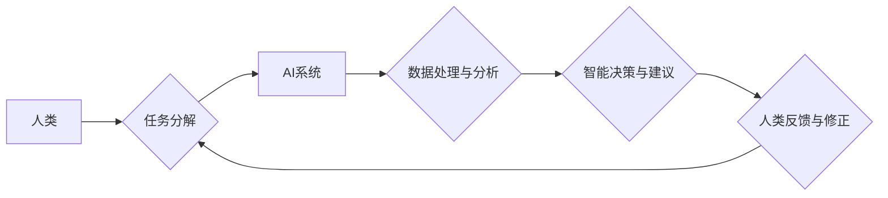

                 

## 人类-AI协作：增强人类潜能与AI能力的融合发展趋势分析预测机遇挑战

> 关键词：人工智能、人类-AI协作、协同智能、增强人类潜能、AI能力、融合发展趋势、机遇挑战

### 1. 背景介绍

人工智能（AI）技术近年来发展迅速，从语音识别、图像识别到自然语言处理等领域取得了突破性进展。AI技术的广泛应用正在深刻地改变着人类社会，为我们带来了前所未有的便利和机遇。然而，AI技术也面临着一些挑战，例如数据安全、算法偏见、伦理道德等。

人类-AI协作作为一种新的智能交互模式，正逐渐成为AI技术发展的重要方向。它旨在通过融合人类的智慧和创造力与AI的计算能力和数据处理能力，实现互补和协同，从而提升整体智能水平。

### 2. 核心概念与联系

**2.1 核心概念**

* **人工智能（AI）：** 指机器能够模拟人类智能行为的能力，例如学习、推理、决策、感知等。
* **人类-AI协作：** 指人类和AI系统在共同目标下进行合作，相互补充、共同完成任务的智能交互模式。
* **协同智能：** 指人类和AI系统在相互理解和信任的基础上，通过信息共享、任务分工、决策融合等方式，实现智能的协同提升。

**2.2 架构关系**



**2.3 联系分析**

人类-AI协作的核心是建立人类和AI系统之间的有效沟通和协作机制。人类提供高层级的目标和策略，AI系统则负责数据处理、分析和决策，并根据人类反馈进行调整和优化。

### 3. 核心算法原理 & 具体操作步骤

**3.1 算法原理概述**

人类-AI协作的算法原理主要基于以下几个方面：

* **强化学习：** AI系统通过与环境交互，学习最佳的行动策略，以获得最大奖励。
* **迁移学习：** AI系统利用已有的知识和经验，迁移到新的任务或领域，提高学习效率。
* **知识图谱：** 建立人类知识的结构化表示，方便AI系统理解和推理。
* **自然语言处理：** 允许人类与AI系统进行自然语言交互，提高沟通效率。

**3.2 算法步骤详解**

1. **任务分解：** 将复杂的任务分解成多个子任务，分配给人类和AI系统分别完成。
2. **数据收集与预处理：** 收集相关数据，并进行清洗、转换和特征提取等预处理工作。
3. **模型训练：** 利用训练数据，训练AI模型，使其能够完成指定任务。
4. **任务执行：** 人类和AI系统根据任务分配，协同完成任务。
5. **结果评估与反馈：** 对任务结果进行评估，并反馈给AI系统，用于模型优化和改进。

**3.3 算法优缺点**

* **优点：**
    * 能够充分发挥人类和AI的各自优势，实现智能协同。
    * 提高任务效率和准确性。
    * 促进人类和AI之间的理解和信任。
* **缺点：**
    * 需要设计合理的协作机制和任务分配策略。
    * 需要保证数据安全和隐私保护。
    * 需要解决算法偏见和伦理道德问题。

**3.4 算法应用领域**

* **医疗保健：** AI辅助诊断、个性化治疗方案制定。
* **教育培训：** 智能化教学系统、个性化学习辅导。
* **金融服务：** 风险评估、欺诈检测、智能理财。
* **制造业：** 智能生产线、设备故障预测。
* **交通运输：** 自动驾驶、智能交通管理。

### 4. 数学模型和公式 & 详细讲解 & 举例说明

**4.1 数学模型构建**

人类-AI协作可以抽象为一个博弈模型，其中人类和AI系统是参与者，任务目标是共同利益。

**4.2 公式推导过程**

假设人类和AI系统分别拥有决策权重为 α 和 β，任务目标函数为 f(x)，其中 x 是决策变量。则人类-AI协作的决策过程可以表示为：

$$
x^* = argmax_{x} f(x) * (α * h(x) + β * a(x))
$$

其中：

* x* 是最优决策变量。
* h(x) 是人类对决策 x 的评估函数。
* a(x) 是AI系统对决策 x 的评估函数。

**4.3 案例分析与讲解**

例如，在自动驾驶场景中，人类驾驶员和AI系统共同决策车辆行驶路线。人类驾驶员根据路况、交通规则等因素进行评估，AI系统则根据地图数据、传感器信息等进行分析。

通过上述公式，人类和AI系统可以根据各自的评估结果，权衡利弊，最终共同决定最优行驶路线。

### 5. 项目实践：代码实例和详细解释说明

**5.1 开发环境搭建**

* 操作系统：Ubuntu 20.04
* Python 版本：3.8
* 必要的库：TensorFlow、PyTorch、OpenCV等

**5.2 源代码详细实现**

```python
# 人类-AI协作决策示例代码

def human_evaluate(decision):
  """人类对决策的评估函数"""
  # 根据路况、交通规则等因素进行评估
  return score

def ai_evaluate(decision):
  """AI系统对决策的评估函数"""
  # 根据地图数据、传感器信息等进行评估
  return score

def human_ai_collaboration(decision_space, alpha, beta):
  """人类-AI协作决策函数"""
  # 循环迭代，人类和AI系统交互决策
  while True:
    # 人类提供决策建议
    human_decision = get_human_input(decision_space)
    # AI系统提供决策建议
    ai_decision = get_ai_input(decision_space)
    # 计算最终决策
    final_decision = argmax(
      decision_space,
      lambda x: f(x) * (alpha * human_evaluate(x) + beta * ai_evaluate(x))
    )
    # 执行决策
    execute_decision(final_decision)
    # 评估结果
    evaluate_result(final_decision)
    # 结束循环条件

# ... 其他代码 ...
```

**5.3 代码解读与分析**

该代码示例展示了人类-AI协作决策的基本流程。

* `human_evaluate` 和 `ai_evaluate` 函数分别模拟人类和AI系统对决策的评估过程。
* `human_ai_collaboration` 函数实现人类和AI系统交互决策的循环迭代过程。
* `get_human_input` 和 `get_ai_input` 函数模拟人类和AI系统提供决策建议的过程。
* `execute_decision` 和 `evaluate_result` 函数模拟决策执行和结果评估的过程。

**5.4 运行结果展示**

运行该代码示例，可以观察到人类和AI系统在协作决策过程中，如何相互补充、共同完成任务。

### 6. 实际应用场景

**6.1 医疗保健**

* AI辅助诊断：AI系统可以分析患者的影像数据、病历信息等，辅助医生进行诊断。
* 个性化治疗方案制定：AI系统可以根据患者的基因信息、生活习惯等，制定个性化的治疗方案。

**6.2 教育培训**

* 智能化教学系统：AI系统可以根据学生的学习进度和能力，提供个性化的学习内容和辅导。
* 个性化学习辅导：AI系统可以作为学生的学习伙伴，提供实时反馈和指导。

**6.3 金融服务**

* 风险评估：AI系统可以分析客户的信用记录、财务状况等，评估其贷款风险。
* 欺诈检测：AI系统可以分析交易数据，识别异常行为，防止欺诈交易。
* 智能理财：AI系统可以根据用户的风险偏好和投资目标，制定个性化的理财方案。

**6.4 制造业**

* 智能生产线：AI系统可以控制生产设备，实现自动化生产。
* 设备故障预测：AI系统可以分析设备运行数据，预测设备故障，及时进行维护。

**6.5 交通运输**

* 自动驾驶：AI系统可以控制车辆行驶，实现自动驾驶。
* 智能交通管理：AI系统可以分析交通流量数据，优化交通信号灯控制，缓解交通拥堵。

**6.4 未来应用展望**

随着AI技术的不断发展，人类-AI协作将在更多领域得到应用，例如：

* 科学研究：AI系统可以辅助科学家进行数据分析、模型构建、实验设计等工作。
* 艺术创作：AI系统可以与艺术家合作，创作新的艺术作品。
* 社会治理：AI系统可以辅助政府部门进行决策分析、政策制定、公共服务管理等工作。


### 7. 工具和资源推荐

**7.1 学习资源推荐**

* **书籍：**
    * 《深度学习》
    * 《人工智能：一种现代方法》
    * 《机器学习》
* **在线课程：**
    * Coursera
    * edX
    * Udacity

**7.2 开发工具推荐**

* **Python：** 广泛应用于AI开发，拥有丰富的库和框架。
* **TensorFlow：** Google开发的开源机器学习框架。
* **PyTorch：** Facebook开发的开源机器学习框架。
* **OpenCV：** 计算机视觉库。

**7.3 相关论文推荐**

* **《Attention Is All You Need》**
* **《BERT: Pre-training of Deep Bidirectional Transformers for Language Understanding》**
* **《Generative Adversarial Networks》**

### 8. 总结：未来发展趋势与挑战

**8.1 研究成果总结**

人类-AI协作技术取得了显著进展，在多个领域取得了成功应用。

**8.2 未来发展趋势**

* **更强的协作能力：** AI系统将更加智能化，能够更好地理解人类意图，并提供更有效的协作支持。
* **更广泛的应用场景：** 人类-AI协作将应用于更多领域，例如科学研究、艺术创作、社会治理等。
* **更人性化的交互方式：** 人类-AI交互方式将更加自然、直观，例如语音交互、体感交互等。

**8.3 面临的挑战**

* **算法偏见：** AI系统可能存在算法偏见，导致决策不公平。
* **数据安全：** 人类-AI协作需要共享大量数据，需要保证数据安全和隐私保护。
* **伦理道德：** 人类-AI协作需要考虑伦理道德问题，例如责任归属、决策透明度等。

**8.4 研究展望**

未来研究将重点关注以下几个方面：

* **开发更公平、更安全的AI算法。**
* **建立更完善的人类-AI协作机制。**
* **解决人类-AI协作带来的伦理道德问题。**

### 9. 附录：常见问题与解答

**9.1 如何保证数据安全？**

* 使用加密技术保护数据传输和存储。
* 采用身份验证和授权机制，控制数据访问权限。
* 定期进行数据备份和恢复，防止数据丢失。

**9.2 如何解决算法偏见问题？**

* 使用多样化的训练数据，减少算法对特定群体的偏见。
* 开发算法公平性评估指标，及时发现和解决偏见问题。
* 采用算法调优技术，减轻算法偏见的影响。

**9.3 如何提高人类-AI协作的效率？**

* 设计合理的协作机制和任务分配策略。
* 开发更直观、更易于理解的AI交互界面。
* 提供更有效的反馈机制，帮助AI系统不断学习和改进。


作者：禅与计算机程序设计艺术 / Zen and the Art of Computer Programming 
<end_of_turn>

