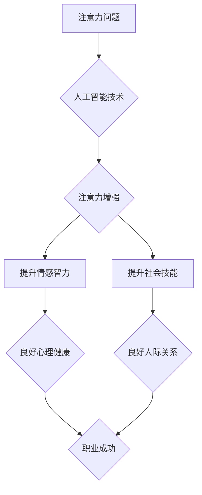

                 

## 人类注意力增强：提升情感智力和社会技能

> 关键词：注意力增强、情感智力、社会技能、深度学习、神经网络、脑机接口、可穿戴设备、人类-计算机交互

## 1. 背景介绍

在当今信息爆炸的时代，人类面临着前所未有的注意力挑战。来自社交媒体、电子邮件、新闻推送等各种信息源的不断轰炸，使得我们难以集中精力，专注于重要的事情。注意力力的下降不仅影响了学习、工作效率，也损害了我们的情感健康和社会关系。

情感智力和社会技能是人类社会发展的重要基石。情感智力是指识别、理解和管理自身情绪以及他人情绪的能力，而社会技能是指与他人有效沟通、建立关系和合作的能力。然而，注意力力的下降会直接影响我们的情感感知、情绪调节和社交互动，从而导致情感智力和社会技能的下降。

近年来，人工智能技术取得了飞速发展，为解决注意力问题和提升情感智力和社会技能提供了新的思路和方法。

## 2. 核心概念与联系

### 2.1 注意力增强

注意力增强是指通过技术手段帮助人们提高注意力集中能力、过滤无关信息、增强记忆力和认知效率。

### 2.2 情感智力和社会技能

情感智力和社会技能是人类重要的软技能，它们与我们的心理健康、人际关系和职业成功密切相关。

### 2.3 人工智能技术

人工智能技术，特别是深度学习和神经网络技术，为注意力增强、情感识别和社交机器人等领域提供了强大的工具。

**核心概念与联系流程图**



## 3. 核心算法原理 & 具体操作步骤

### 3.1 算法原理概述

注意力增强算法通常基于深度学习和神经网络，通过训练模型识别和过滤干扰信息，帮助用户集中注意力。常见的算法包括：

* **Transformer网络:** Transformer网络是一种强大的深度学习模型，能够捕捉序列数据中的长距离依赖关系，在自然语言处理和机器翻译领域取得了突破性进展。
* **注意力机制:** 注意力机制是Transformer网络的核心组成部分，它允许模型在处理序列数据时，对不同位置的元素赋予不同的权重，从而突出重要信息。
* **Recurrent Neural Networks (RNNs):** RNNs是一种专门用于处理序列数据的深度学习模型，能够学习时间序列中的模式和趋势。

### 3.2 算法步骤详解

1. **数据收集和预处理:** 收集大量注意力相关的数据，例如用户浏览记录、眼动追踪数据、脑电波数据等，并进行预处理，例如文本清洗、数据归一化等。
2. **模型构建:** 根据选定的算法，构建深度学习模型，例如Transformer网络或RNNs。
3. **模型训练:** 使用训练数据训练模型，调整模型参数，使其能够准确识别和过滤干扰信息。
4. **模型评估:** 使用测试数据评估模型的性能，例如准确率、召回率、F1-score等。
5. **模型部署:** 将训练好的模型部署到实际应用场景中，例如可穿戴设备、软件应用程序等。

### 3.3 算法优缺点

**优点:**

* **高精度:** 深度学习算法能够学习复杂的模式和关系，实现高精度的注意力识别和过滤。
* **可扩展性:** 深度学习模型可以轻松扩展到处理更大的数据集和更复杂的场景。
* **个性化定制:** 可以根据用户的需求和习惯，定制个性化的注意力增强策略。

**缺点:**

* **数据依赖:** 深度学习算法需要大量的数据进行训练，数据质量和数量直接影响模型性能。
* **计算资源:** 训练深度学习模型需要大量的计算资源和时间。
* **黑盒效应:** 深度学习模型的内部机制复杂，难以解释其决策过程。

### 3.4 算法应用领域

注意力增强算法在以下领域具有广泛的应用前景:

* **教育:** 帮助学生集中注意力，提高学习效率。
* **医疗:** 辅助医生诊断疾病，提高医疗效率。
* **游戏:** 增强游戏体验，提高玩家沉浸感。
* **工作:** 帮助员工提高工作效率，减少疲劳。

## 4. 数学模型和公式 & 详细讲解 & 举例说明

### 4.1 数学模型构建

注意力机制的核心是计算每个输入元素的权重，这些权重决定了模型对每个元素的关注程度。常用的注意力机制模型包括：

* **Scaled Dot-Product Attention:**

$$
\text{Attention}(Q, K, V) = \text{softmax}\left(\frac{Q K^T}{\sqrt{d_k}}\right) V
$$

其中：

* $Q$ 是查询矩阵
* $K$ 是键矩阵
* $V$ 是值矩阵
* $d_k$ 是键向量的维度
* $\text{softmax}$ 是归一化函数

* **Multi-Head Attention:**

Multi-Head Attention 将Scaled Dot-Product Attention应用于多个头，每个头学习不同的注意力模式，从而提高模型的表达能力。

### 4.2 公式推导过程

Scaled Dot-Product Attention 的公式推导过程如下：

1. 计算查询矩阵 $Q$ 和键矩阵 $K$ 的点积，并进行缩放操作：

$$
\text{score} = \frac{Q K^T}{\sqrt{d_k}}
$$

2. 对点积结果应用 softmax 函数进行归一化，得到每个元素的注意力权重：

$$
\text{attention} = \text{softmax}(\text{score})
$$

3. 将注意力权重与值矩阵 $V$ 进行加权求和，得到最终的输出：

$$
\text{output} = \text{attention} V
$$

### 4.3 案例分析与讲解

假设我们有一个句子 "The cat sat on the mat"，我们想使用Scaled Dot-Product Attention 来计算每个单词的注意力权重。

1. 将句子转换为词嵌入向量，得到查询矩阵 $Q$、键矩阵 $K$ 和值矩阵 $V$。
2. 计算 $Q$ 和 $K$ 的点积，并进行缩放操作。
3. 对点积结果应用 softmax 函数，得到每个单词的注意力权重。
4. 将注意力权重与 $V$ 进行加权求和，得到最终的输出向量。

通过分析输出向量，我们可以了解模型对每个单词的关注程度，例如，模型可能对 "cat" 和 "sat" 两个单词给予更高的注意力权重，因为它们是句子的核心信息。

## 5. 项目实践：代码实例和详细解释说明

### 5.1 开发环境搭建

* Python 3.7+
* TensorFlow 2.0+
* PyTorch 1.0+
* Jupyter Notebook

### 5.2 源代码详细实现

```python
import tensorflow as tf

# 定义输入数据
input_data = tf.random.normal(shape=(10, 50))

# 定义查询矩阵、键矩阵和值矩阵
query = tf.keras.layers.Dense(64, activation='relu')(input_data)
key = tf.keras.layers.Dense(64, activation='relu')(input_data)
value = tf.keras.layers.Dense(64, activation='relu')(input_data)

# 计算注意力权重
attention_weights = tf.keras.layers.Lambda(lambda x: tf.nn.softmax(tf.matmul(x[0], x[1], transpose_b=True) / tf.math.sqrt(64)))([query, key])

# 计算注意力输出
attention_output = tf.matmul(attention_weights, value)

# 打印注意力输出
print(attention_output)
```

### 5.3 代码解读与分析

* 代码首先定义了输入数据、查询矩阵、键矩阵和值矩阵。
* 然后，使用 Lambda 层计算注意力权重，并使用 softmax 函数进行归一化。
* 最后，使用矩阵乘法计算注意力输出，并打印输出结果。

### 5.4 运行结果展示

运行代码后，会输出一个注意力输出矩阵，其中每个元素代表了模型对相应输入元素的关注程度。

## 6. 实际应用场景

### 6.1 可穿戴设备

注意力增强算法可以集成到可穿戴设备中，例如智能手表、智能眼镜等，实时监测用户的注意力状态，并提供个性化的提醒和干预措施。

### 6.2 软件应用程序

注意力增强算法可以应用于各种软件应用程序中，例如学习软件、办公软件、游戏等，帮助用户集中注意力，提高效率。

### 6.3 教育领域

注意力增强算法可以帮助学生集中注意力，提高学习效率，例如，可以根据学生的注意力状态动态调整学习内容和难度。

### 6.4 未来应用展望

未来，注意力增强技术将更加智能化、个性化和融合化。例如，可以结合脑机接口技术，直接读取用户的脑电波信号，更精准地识别和调节注意力。

## 7. 工具和资源推荐

### 7.1 学习资源推荐

* **书籍:**
    * Deep Learning by Ian Goodfellow, Yoshua Bengio, and Aaron Courville
    * Attention Is All You Need by Vaswani et al.
* **在线课程:**
    * TensorFlow Tutorials
    * PyTorch Tutorials
* **博客和论坛:**
    * TensorFlow Blog
    * PyTorch Forum

### 7.2 开发工具推荐

* **深度学习框架:** TensorFlow, PyTorch
* **编程语言:** Python
* **可视化工具:** Matplotlib, Seaborn

### 7.3 相关论文推荐

* Attention Is All You Need (Vaswani et al., 2017)
* Transformer-XL: Attentive Language Modeling Beyond Millions of Tokens (Dai et al., 2019)
* BERT: Pre-training of Deep Bidirectional Transformers for Language Understanding (Devlin et al., 2018)

## 8. 总结：未来发展趋势与挑战

### 8.1 研究成果总结

近年来，注意力增强技术取得了显著进展，为解决注意力问题和提升情感智力和社会技能提供了新的思路和方法。

### 8.2 未来发展趋势

未来，注意力增强技术将朝着以下方向发展:

* **更精准的注意力识别:** 利用脑机接口技术、眼动追踪技术等，实现更精准的注意力识别。
* **更个性化的注意力增强策略:** 根据用户的需求和习惯，定制个性化的注意力增强策略。
* **更广泛的应用场景:** 将注意力增强技术应用于更多领域，例如医疗、教育、游戏等。

### 8.3 面临的挑战

注意力增强技术还面临着一些挑战:

* **数据隐私和安全:** 注意力增强技术需要收集大量用户数据，如何保护用户隐私和数据安全是一个重要问题。
* **算法解释性和可信度:** 深度学习模型的内部机制复杂，难以解释其决策过程，如何提高算法的解释性和可信度是一个关键挑战。
* **伦理问题:** 注意力增强技术可能会被滥用，例如，用于控制用户的行为或思想，如何避免这些伦理问题是一个需要认真思考的问题。

### 8.4 研究展望

未来，我们需要继续深入研究注意力增强技术，解决上述挑战，并将其应用于更多领域，为人类社会带来更多福祉。

## 9. 附录：常见问题与解答

**Q1: 注意力增强技术真的有效吗？**

A1: 目前，已有大量研究表明注意力增强技术能够有效提高注意力集中能力、过滤干扰信息和提升学习效率。

**Q2: 注意力增强技术会让人变得依赖吗？**

A2: 注意力增强技术应该作为辅助工具使用，而不是替代人类自身的注意力训练。过度依赖注意力增强技术可能会导致注意力能力下降。

**Q3: 注意力增强技术会侵犯隐私吗？**

A3: 注意力增强技术需要收集用户数据，因此需要采取措施保护用户隐私和数据安全。

**作者：禅与计算机程序设计艺术 / Zen and the Art of Computer Programming**<end_of_turn>

