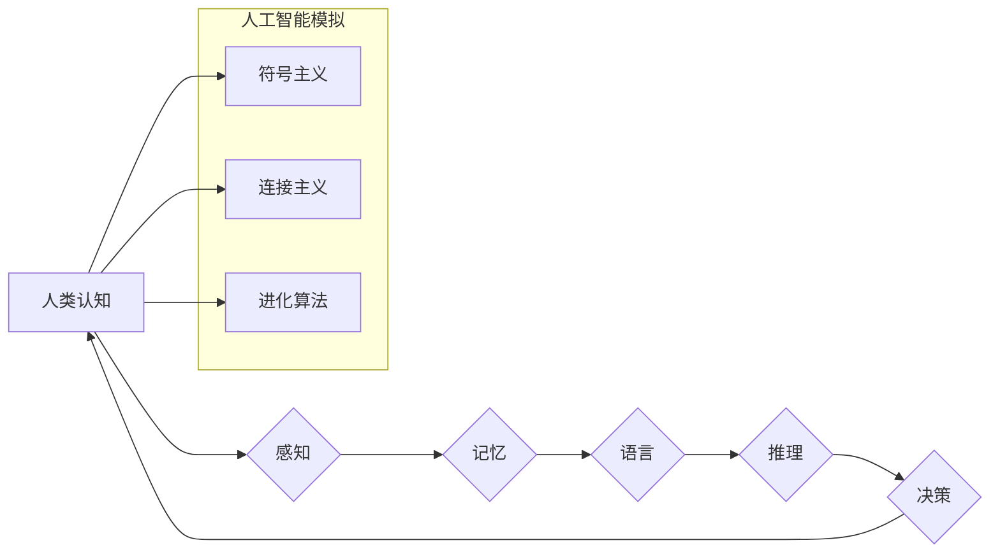

                 

## 人类计算：探索人类认知的边界

> 关键词：人工智能、认知科学、神经网络、机器学习、深度学习、计算模型、人类模拟、未来趋势

## 1. 背景介绍

人类文明的进步离不开对自身认知的探索和理解。从古希腊哲学家对“灵魂”的思考，到现代神经科学对大脑结构和功能的深入研究，我们一直在试图揭开人类思维的奥秘。而随着人工智能技术的飞速发展，我们开始用计算模型来模拟和理解人类认知过程。

人工智能领域近年来取得了令人瞩目的成就，例如在图像识别、自然语言处理、游戏策略等方面展现出强大的能力。这些成就离不开对人类认知机制的借鉴和模拟。例如，深度学习算法的灵感来源于大脑神经网络的结构和功能，而自然语言处理模型则借鉴了人类语言理解和生成机制。

然而，尽管人工智能取得了显著进展，但与人类的认知能力相比，仍然存在着巨大的差距。人类能够灵活地适应新的环境，进行复杂的推理和决策，并拥有丰富的创造力和情感理解能力，这些能力目前人工智能还难以完全模拟。

因此，探索人类计算的边界，理解人类认知的本质，对于推动人工智能技术发展至关重要。

## 2. 核心概念与联系

### 2.1 人类认知的本质

人类认知是一个复杂而多层次的过程，涉及感知、记忆、语言、推理、决策等多个方面。

* **感知:** 人类通过五官接收外界信息，并将其转化为神经信号。
* **记忆:** 人类能够存储和检索信息，形成知识和经验。
* **语言:** 人类通过语言交流思想和情感。
* **推理:** 人类能够从已知信息中推导出新的结论。
* **决策:** 人类能够在面对选择时做出判断。

### 2.2 人工智能的模拟

人工智能试图通过计算模型来模拟和实现人类认知功能。常见的模拟方法包括：

* **符号主义:** 使用符号和规则来表示知识和执行推理。
* **连接主义:** 借鉴神经网络的结构和功能，使用大量连接的节点来模拟大脑的运作方式。
* **进化算法:** 通过模拟自然选择的过程，不断优化算法参数，使其能够解决特定问题。

### 2.3 人类计算与人工智能的联系

人类计算和人工智能是相互关联的两个概念。人类计算是指人类利用自身认知能力进行计算和推理，而人工智能则是试图通过计算机程序模拟和实现人类认知功能。

**Mermaid 流程图**



## 3. 核心算法原理 & 具体操作步骤

### 3.1 算法原理概述

深度学习算法是目前人工智能领域最具代表性的算法之一，其灵感来源于大脑神经网络的结构和功能。深度学习算法通过多层神经网络来学习数据特征，并进行复杂的模式识别和预测。

### 3.2 算法步骤详解

1. **数据预处理:** 将原始数据转换为深度学习算法可以处理的格式，例如归一化、编码等。
2. **网络结构设计:** 根据具体任务选择合适的网络结构，例如卷积神经网络、循环神经网络等。
3. **参数初始化:** 为网络中的每个参数赋予初始值。
4. **前向传播:** 将输入数据通过网络层层传递，最终得到输出结果。
5. **反向传播:** 计算输出结果与真实值的误差，并根据误差反向调整网络参数。
6. **优化算法:** 使用优化算法，例如梯度下降法，来更新网络参数，使得模型的预测精度不断提高。
7. **模型评估:** 使用测试数据评估模型的性能，并根据评估结果进行模型调优。

### 3.3 算法优缺点

**优点:**

* 能够学习复杂的数据特征，并进行高精度预测。
* 适用于多种类型的数据，例如图像、文本、音频等。
* 自动学习特征，无需人工特征工程。

**缺点:**

* 需要大量的训练数据。
* 计算资源需求高，训练时间长。
* 模型解释性差，难以理解模型的决策过程。

### 3.4 算法应用领域

深度学习算法已广泛应用于各个领域，例如：

* **图像识别:** 人脸识别、物体检测、图像分类等。
* **自然语言处理:** 机器翻译、文本摘要、情感分析等。
* **语音识别:** 语音转文本、语音助手等。
* **推荐系统:** 商品推荐、内容推荐等。
* **医疗诊断:** 疾病诊断、影像分析等。

## 4. 数学模型和公式 & 详细讲解 & 举例说明

### 4.1 数学模型构建

深度学习算法的核心是神经网络模型。神经网络模型由多个层组成，每层包含多个神经元。神经元之间通过连接进行信息传递，每个连接都有一个权重。

**神经元模型:**

$$
y = f(w_1x_1 + w_2x_2 + ... + w_nx_n + b)
$$

其中：

* $y$ 是神经元的输出值。
* $x_1, x_2, ..., x_n$ 是输入神经元的输出值。
* $w_1, w_2, ..., w_n$ 是连接权重。
* $b$ 是偏置项。
* $f$ 是激活函数，例如 sigmoid 函数、ReLU 函数等。

### 4.2 公式推导过程

深度学习算法的训练过程是通过反向传播算法来更新网络参数的。反向传播算法的核心是计算误差梯度，并根据梯度更新网络参数。

**误差函数:**

$$
E = \frac{1}{2} \sum_{i=1}^{N} (y_i - \hat{y}_i)^2
$$

其中：

* $E$ 是误差函数。
* $N$ 是样本数量。
* $y_i$ 是真实值。
* $\hat{y}_i$ 是预测值。

**梯度下降法:**

$$
w_{new} = w_{old} - \alpha \frac{\partial E}{\partial w}
$$

其中：

* $w_{new}$ 是更新后的权重。
* $w_{old}$ 是旧的权重。
* $\alpha$ 是学习率。
* $\frac{\partial E}{\partial w}$ 是权重对误差函数的偏导数。

### 4.3 案例分析与讲解

例如，在图像分类任务中，我们可以使用卷积神经网络来学习图像特征。卷积神经网络的结构包含多个卷积层、池化层和全连接层。

* **卷积层:** 使用卷积核对图像进行卷积运算，提取图像特征。
* **池化层:** 对卷积层的输出进行池化操作，降低特征维度，提高模型鲁棒性。
* **全连接层:** 将池化层的输出连接到全连接层，进行分类决策。

通过训练数据，卷积神经网络可以学习到图像的特征表示，并将其用于分类任务。

## 5. 项目实践：代码实例和详细解释说明

### 5.1 开发环境搭建

* **操作系统:** Ubuntu 18.04 或更高版本
* **编程语言:** Python 3.6 或更高版本
* **深度学习框架:** TensorFlow 或 PyTorch
* **其他工具:** Jupyter Notebook、Git

### 5.2 源代码详细实现

以下是一个使用 TensorFlow 实现图像分类的简单代码示例：

```python
import tensorflow as tf

# 定义模型结构
model = tf.keras.models.Sequential([
    tf.keras.layers.Conv2D(32, (3, 3), activation='relu', input_shape=(28, 28, 1)),
    tf.keras.layers.MaxPooling2D((2, 2)),
    tf.keras.layers.Conv2D(64, (3, 3), activation='relu'),
    tf.keras.layers.MaxPooling2D((2, 2)),
    tf.keras.layers.Flatten(),
    tf.keras.layers.Dense(10, activation='softmax')
])

# 编译模型
model.compile(optimizer='adam',
              loss='sparse_categorical_crossentropy',
              metrics=['accuracy'])

# 训练模型
model.fit(x_train, y_train, epochs=5)

# 评估模型
loss, accuracy = model.evaluate(x_test, y_test)
print('Test loss:', loss)
print('Test accuracy:', accuracy)
```

### 5.3 代码解读与分析

* **模型结构:** 代码定义了一个简单的卷积神经网络模型，包含两个卷积层、两个池化层和一个全连接层。
* **编译模型:** 使用 Adam 优化器、交叉熵损失函数和准确率指标来编译模型。
* **训练模型:** 使用训练数据训练模型，训练 epochs=5 次。
* **评估模型:** 使用测试数据评估模型的性能，输出测试损失和准确率。

### 5.4 运行结果展示

运行上述代码后，会输出模型的训练过程和测试结果。

## 6. 实际应用场景

深度学习算法已广泛应用于各个领域，例如：

* **医疗诊断:** 辅助医生诊断疾病，例如癌症、糖尿病等。
* **金融风险控制:** 识别欺诈交易、评估信用风险等。
* **智能交通:** 自动驾驶、交通流量预测等。
* **个性化推荐:** 商品推荐、内容推荐等。

### 6.4 未来应用展望

随着人工智能技术的不断发展，深度学习算法将在更多领域得到应用，例如：

* **药物研发:** 预测药物的有效性、副作用等。
* **材料科学:** 设计新型材料、预测材料性能等。
* **教育:** 个性化学习、智能辅导等。

## 7. 工具和资源推荐

### 7.1 学习资源推荐

* **书籍:**
    * 深度学习 (Deep Learning) - Ian Goodfellow, Yoshua Bengio, Aaron Courville
    * 人工神经网络 (Artificial Neural Networks) - Simon Haykin
* **在线课程:**
    * Coursera: 深度学习 Specialization
    * Udacity: 深度学习 Nanodegree
    * fast.ai: 深度学习课程

### 7.2 开发工具推荐

* **深度学习框架:** TensorFlow, PyTorch, Keras
* **数据处理工具:** Pandas, NumPy
* **可视化工具:** Matplotlib, Seaborn

### 7.3 相关论文推荐

* **AlexNet: ImageNet Classification with Deep Convolutional Neural Networks** - Alex Krizhevsky, Ilya Sutskever, Geoffrey E. Hinton
* **Deep Residual Learning for Image Recognition** - Kaiming He, Xiangyu Zhang, Shaoqing Ren, Jian Sun
* **Attention Is All You Need** - Ashish Vaswani, Noam Shazeer, Niki Parmar, Jakob Uszkoreit, Llion Jones, Aidan N Gomez, Łukasz Kaiser, Illia Polosukhin

## 8. 总结：未来发展趋势与挑战

### 8.1 研究成果总结

近年来，深度学习算法取得了令人瞩目的成就，在图像识别、自然语言处理、语音识别等领域取得了突破性进展。这些成果离不开对人类认知机制的借鉴和模拟，以及海量数据和计算资源的支持。

### 8.2 未来发展趋势

* **模型更深、更广:** 研究更深层次、更广范围的神经网络模型，以提高模型的表达能力和泛化能力。
* **数据更丰富、更智能:** 探索新的数据来源，并开发更智能的数据处理和分析方法。
* **算法更高效、更鲁棒:** 研究更有效的训练算法和正则化方法，提高模型的训练效率和鲁棒性。
* **解释性更强:** 开发更有效的模型解释方法，提高模型的透明度和可信度。

### 8.3 面临的挑战

* **数据偏差:** 深度学习模型容易受到训练数据偏差的影响，导致模型的公平性和可靠性问题。
* **计算资源:** 训练大型深度学习模型需要大量的计算资源，这对于资源有限的机构和个人来说是一个挑战。
* **安全性和隐私:** 深度学习模型的训练和应用可能涉及到敏感数据，需要考虑数据安全和隐私保护问题。

### 8.4 研究展望

未来，人类计算研究将继续探索人类认知的奥秘，并推动人工智能技术的进步。通过更深入地理解人类认知机制，我们可以开发出更智能、更安全、更可靠的人工智能系统，为人类社会带来更多福祉。

## 9. 附录：常见问题与解答

**Q1: 深度学习算法真的能模拟人类大脑吗？**

A1: 目前深度学习算法虽然取得了显著进展，但与人类大脑的复杂性相比，仍然存在着巨大的差距。人类大脑拥有数十亿的神经元和数万亿的连接，而深度学习模型的规模仍然相对较小。此外，人类大脑还具有许多高级认知能力，例如创造力、情感理解、道德判断等，这些能力目前人工智能还难以完全模拟。

**Q2: 深度学习算法需要多少数据才能训练？**

A2: 深度学习算法需要大量的训练数据才能达到良好的性能。一般来说，训练数据量越多，模型的性能越好。但是，数据量并不是唯一的因素，数据质量、数据分布等因素也至关重要。

**Q3: 深度学习算法的训练过程很耗时，如何提高训练效率？**

A3: 提高深度学习算法的训练效率可以通过多种方法实现，例如：

* 使用更有效的训练算法，例如梯度下降变种算法。
* 使用硬件加速，例如GPU、TPU等。
* 使用模型压缩技术，例如权重剪枝、量化等。


作者：禅与计算机程序设计艺术 / Zen and the Art of Computer Programming<end_of_turn>

