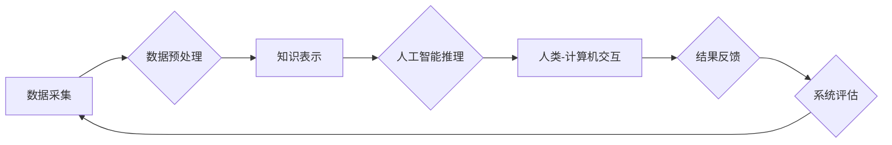

                 

## 人类计算：推动科技进步的引擎

> 关键词： 人工智能、计算模型、人类认知、数据驱动、科技进步

### 1. 背景介绍

科技进步源于对世界本质的探索和理解，而人类计算作为一种独特的计算模式，正在深刻地影响着科技发展方向。传统计算机以其强大的逻辑运算能力和数据处理速度，推动了信息技术革命。然而，随着人工智能的兴起，我们开始意识到，人类的认知能力和创造力在解决复杂问题、理解模糊信息和进行创新决策方面具有独特的优势。

人类计算是指利用人类的智慧和经验，结合计算机技术，共同完成复杂任务的过程。它融合了人类的直觉、创造力和批判性思维，以及计算机的逻辑推理、数据处理和存储能力。这种融合模式，为解决传统计算机难以处理的复杂问题提供了新的思路和方法。

### 2. 核心概念与联系

**2.1 人类计算的本质**

人类计算的核心概念在于将人类的认知能力与计算机技术相结合，形成一个协同工作系统。

* **人类因素:** 包括人类的知识、经验、直觉、创造力和批判性思维等。
* **计算因素:** 包括计算机的逻辑运算能力、数据处理速度、存储容量和算法模型等。

**2.2 人类计算的架构**

人类计算的架构通常包括以下几个关键部分：

* **数据采集和预处理:** 收集来自各种来源的人类数据，并进行清洗、格式化和预处理，以便计算机能够理解和处理。
* **知识表示和推理:** 将人类知识和经验转化为计算机可理解的形式，并利用人工智能算法进行推理和分析。
* **人类-计算机交互:** 提供用户友好的交互界面，方便人类与计算机进行沟通和协作。
* **结果反馈和评估:** 将计算结果反馈给人类，并进行评估和改进，以不断优化人类计算系统。

**Mermaid 流程图**



**2.3 人类计算的优势**

* **解决复杂问题:** 人类计算能够处理传统计算机难以处理的复杂问题，例如需要理解模糊信息、进行创造性思考和做出主观判断的问题。
* **提高决策效率:** 人类计算可以帮助人类更快、更准确地做出决策，尤其是在需要综合考虑多种因素和潜在风险的情况下。
* **促进创新:** 人类计算可以激发人类的创造力，帮助人们发现新的知识、产生新的想法和开发新的技术。

### 3. 核心算法原理 & 具体操作步骤

**3.1 算法原理概述**

人类计算的核心算法原理是将人类的认知过程模拟成计算机可执行的算法。这些算法通常基于以下几个方面：

* **知识图谱:** 建立人类知识的结构化表示，以便计算机能够理解和推理。
* **机器学习:** 利用大量数据训练机器学习模型，使其能够学习人类的认知模式和决策规则。
* **深度学习:** 使用多层神经网络模拟人类大脑的结构和功能，实现更复杂的认知任务。

**3.2 算法步骤详解**

1. **数据收集和预处理:** 收集来自各种来源的人类数据，例如文本、图像、音频和视频，并进行清洗、格式化和预处理。
2. **知识表示:** 将人类知识和经验转化为计算机可理解的形式，例如知识图谱、规则库和语义网络。
3. **模型训练:** 利用机器学习或深度学习算法，训练模型以模拟人类的认知过程。
4. **推理和决策:** 将新的数据输入到训练好的模型中，进行推理和决策，并输出结果。
5. **反馈和评估:** 收集用户反馈，评估模型的性能，并进行模型更新和改进。

**3.3 算法优缺点**

**优点:**

* 能够解决传统计算机难以处理的复杂问题。
* 提高决策效率和准确性。
* 促进创新和知识发现。

**缺点:**

* 数据依赖性强，需要大量高质量的数据进行训练。
* 模型解释性差，难以理解模型的决策过程。
* 计算资源消耗大，需要强大的计算能力进行训练和推理。

**3.4 算法应用领域**

* **医疗诊断:** 利用人类计算模型分析患者的病历、影像数据和基因信息，辅助医生进行诊断和治疗决策。
* **金融风险管理:** 分析市场数据、客户行为和交易模式，识别潜在的金融风险，并制定相应的风险控制策略。
* **法律决策支持:** 分析法律法规、案例判决和诉讼文件，为律师提供法律决策支持。
* **教育个性化学习:** 根据学生的学习进度、兴趣和能力，定制个性化的学习方案和教学内容。

### 4. 数学模型和公式 & 详细讲解 & 举例说明

**4.1 数学模型构建**

人类计算的数学模型通常基于概率论、统计学和信息论等学科。

* **概率论:** 用于描述人类认知过程中的不确定性和随机性。
* **统计学:** 用于分析人类数据，提取特征和模式。
* **信息论:** 用于量化人类知识和信息的表达和传递。

**4.2 公式推导过程**

例如，在机器学习领域，常用的算法之一是支持向量机（SVM）。SVM的目标是找到一个最佳的超平面，将不同类别的数据点分开。

$$
\min_{w,b} \frac{1}{2} ||w||^2 + C \sum_{i=1}^{n} \xi_i
$$

$$
y_i (w^T x_i + b) \geq 1 - \xi_i
$$

其中：

* $w$ 是超平面的权重向量。
* $b$ 是超平面的截距。
* $x_i$ 是第 $i$ 个数据点。
* $y_i$ 是第 $i$ 个数据点的类别标签。
* $\xi_i$ 是松弛变量，用于容忍分类错误。
* $C$ 是惩罚参数，用于控制分类错误的惩罚程度。

**4.3 案例分析与讲解**

例如，在图像识别领域，可以使用卷积神经网络（CNN）进行人类计算。CNN可以学习图像的特征，并将其用于识别物体、场景和人脸等。

### 5. 项目实践：代码实例和详细解释说明

**5.1 开发环境搭建**

* 操作系统：Linux 或 macOS
* 编程语言：Python
* 深度学习框架：TensorFlow 或 PyTorch
* 其他工具：Git、Jupyter Notebook

**5.2 源代码详细实现**

以下是一个简单的图像分类示例代码，使用 TensorFlow 框架实现：

```python
import tensorflow as tf

# 定义模型结构
model = tf.keras.models.Sequential([
  tf.keras.layers.Conv2D(32, (3, 3), activation='relu', input_shape=(28, 28, 1)),
  tf.keras.layers.MaxPooling2D((2, 2)),
  tf.keras.layers.Conv2D(64, (3, 3), activation='relu'),
  tf.keras.layers.MaxPooling2D((2, 2)),
  tf.keras.layers.Flatten(),
  tf.keras.layers.Dense(10, activation='softmax')
])

# 编译模型
model.compile(optimizer='adam',
              loss='sparse_categorical_crossentropy',
              metrics=['accuracy'])

# 训练模型
model.fit(x_train, y_train, epochs=5)

# 评估模型
loss, accuracy = model.evaluate(x_test, y_test)
print('Test loss:', loss)
print('Test accuracy:', accuracy)
```

**5.3 代码解读与分析**

* 该代码定义了一个简单的卷积神经网络模型，用于图像分类任务。
* 模型包含两个卷积层、两个最大池化层、一个扁平化层和一个全连接层。
* 模型使用 Adam 优化器、交叉熵损失函数和准确率指标进行训练。
* 训练过程使用训练数据进行迭代训练，并评估模型在测试数据上的性能。

**5.4 运行结果展示**

训练完成后，可以将模型应用于新的图像数据进行分类。

### 6. 实际应用场景

**6.1 医疗诊断辅助**

* 利用人类计算模型分析患者的病历、影像数据和基因信息，辅助医生进行诊断和治疗决策。
* 例如，可以利用人类计算模型识别肺癌、乳腺癌和其他疾病的早期症状。

**6.2 金融风险管理**

* 分析市场数据、客户行为和交易模式，识别潜在的金融风险，并制定相应的风险控制策略。
* 例如，可以利用人类计算模型预测股票价格波动、识别欺诈交易和评估贷款风险。

**6.3 法律决策支持**

* 分析法律法规、案例判决和诉讼文件，为律师提供法律决策支持。
* 例如，可以利用人类计算模型搜索相关法律案例、分析法律风险和预测诉讼结果。

**6.4 教育个性化学习**

* 根据学生的学习进度、兴趣和能力，定制个性化的学习方案和教学内容。
* 例如，可以利用人类计算模型推荐个性化的学习资源、评估学生的学习效果和提供个性化的学习建议。

**6.5 未来应用展望**

* 人类计算将与其他新兴技术，例如虚拟现实、增强现实和区块链技术相结合，创造出更加智能、高效和创新的应用场景。
* 例如，可以利用人类计算模型构建虚拟助手、增强现实教学系统和去中心化学习平台。

### 7. 工具和资源推荐

**7.1 学习资源推荐**

* **书籍:**
    * 《深度学习》 by Ian Goodfellow, Yoshua Bengio, and Aaron Courville
    * 《机器学习》 by Tom Mitchell
* **在线课程:**
    * Coursera: Machine Learning by Andrew Ng
    * edX: Artificial Intelligence by Columbia University

**7.2 开发工具推荐**

* **编程语言:** Python
* **深度学习框架:** TensorFlow, PyTorch
* **数据处理工具:** Pandas, NumPy

**7.3 相关论文推荐**

* **AlphaGo论文:** Silver, D., et al. "Mastering the game of Go with deep neural networks and tree search." Nature 529.7587 (2016): 484-489.
* **BERT论文:** Devlin, Jacob, et al. "BERT: Pre-training of deep bidirectional transformers for language understanding." arXiv preprint arXiv:1810.04805 (2018).

### 8. 总结：未来发展趋势与挑战

**8.1 研究成果总结**

人类计算在人工智能、医疗诊断、金融风险管理、法律决策支持和教育个性化学习等领域取得了显著成果。

**8.2 未来发展趋势**

* **模型解释性增强:** 研究更可解释的人工智能模型，以便更好地理解模型的决策过程。
* **跨模态学习:** 研究跨越文本、图像、音频和视频等不同模态的数据融合和学习。
* **边缘计算:** 将人类计算模型部署到边缘设备，实现更快速的响应和更低的延迟。

**8.3 面临的挑战**

* **数据隐私和安全:** 人类计算需要处理大量个人数据，因此数据隐私和安全问题尤为重要。
* **算法偏见:** 人工智能模型可能存在算法偏见，导致不公平的结果。
* **伦理问题:** 人类计算的应用可能引发伦理问题，例如人工智能的责任和透明度。

**8.4 研究展望**

未来，人类计算将继续朝着更智能、更安全、更可解释的方向发展，并为人类社会带来更多福祉。


### 9. 附录：常见问题与解答

**9.1 如何选择合适的算法模型？**

选择合适的算法模型取决于具体的应用场景和数据特点。例如，对于图像分类任务，可以使用卷积神经网络；对于文本分类任务，可以使用循环神经网络或 Transformer 模型。

**9.2 如何解决数据偏见问题？**

数据偏见问题可以通过以下方法解决：

* 使用更全面、更均衡的数据集进行训练。
* 使用算法去偏见技术，例如对抗训练和公平学习。
* 定期评估模型的公平性，并进行模型调整。

**9.3 如何确保人类计算的安全性？**

确保人类计算的安全性可以通过以下方法实现：

* 使用安全的机器学习算法和数据处理技术。
* 对模型进行安全评估和漏洞检测。
* 建立完善的人工智能伦理规范和监管机制。


作者：禅与计算机程序设计艺术 / Zen and the Art of Computer Programming 
<end_of_turn>

