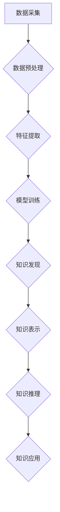

                 

## 人类认知的局限性与知识发现引擎的突破

> 关键词：知识发现、人工智能、机器学习、深度学习、认知局限、数据挖掘、知识图谱、推理引擎

## 1. 背景介绍

人类文明的进步离不开对知识的不断发现和积累。从古至今，人类通过观察、思考、实验等方式不断探索世界，并将其所知整理成各种形式的知识体系。然而，人类的认知能力毕竟有限，受限于记忆容量、思维模式和经验范围等因素，难以全面、深入地理解复杂世界。随着信息爆炸时代的到来，海量数据涌现，人类难以有效地从其中发现有价值的知识。

知识发现（Knowledge Discovery，KD）作为人工智能领域的重要分支，旨在从海量数据中自动发现隐藏的模式、规律和知识。它利用机器学习、数据挖掘、统计分析等技术，帮助人类突破认知局限，挖掘数据背后的价值。

## 2. 核心概念与联系

知识发现引擎的核心是将人类的知识发现过程自动化，并通过算法和模型实现对数据的智能分析和理解。

**2.1 核心概念**

* **数据挖掘 (Data Mining):** 从大规模数据中提取有价值信息的过程，包括模式识别、关联规则发现、分类预测等。
* **机器学习 (Machine Learning):** 使计算机能够从数据中学习，并根据学习到的知识进行预测或决策的过程。
* **深度学习 (Deep Learning):** 一种基于多层神经网络的机器学习方法，能够学习更复杂的特征和模式。
* **知识图谱 (Knowledge Graph):** 以实体和关系为节点的图结构，用于表示和存储知识。
* **推理引擎 (Reasoning Engine):** 基于逻辑规则和知识图谱，进行知识推理和推导的系统。

**2.2 架构图**



**2.3 联系**

知识发现引擎将上述核心概念有机结合，实现从数据到知识的完整流程：

1. **数据采集:** 从各种数据源收集原始数据。
2. **数据预处理:** 对数据进行清洗、转换、整合等处理，使其适合模型训练。
3. **特征提取:** 从数据中提取有价值的特征，用于模型学习。
4. **模型训练:** 利用机器学习算法，训练模型以识别数据中的模式和规律。
5. **知识发现:** 通过模型预测和分析，发现隐藏的知识和洞察。
6. **知识表示:** 将发现的知识以结构化的形式表示，例如知识图谱。
7. **知识推理:** 利用推理引擎，基于知识图谱进行逻辑推理和推导，扩展和深化知识。
8. **知识应用:** 将发现的知识应用于实际问题，例如决策支持、预测分析、个性化推荐等。

## 3. 核心算法原理 & 具体操作步骤

### 3.1 算法原理概述

知识发现引擎的核心算法包括数据挖掘算法、机器学习算法和深度学习算法。

* **数据挖掘算法:** 主要用于发现数据中的模式、关联规则和异常值，例如关联规则挖掘算法（Apriori）、分类算法（决策树、支持向量机）、聚类算法（K-means）。
* **机器学习算法:** 主要用于训练模型，使模型能够从数据中学习，并根据学习到的知识进行预测或决策，例如线性回归、逻辑回归、随机森林、神经网络。
* **深度学习算法:** 是一种更高级的机器学习方法，利用多层神经网络学习更复杂的特征和模式，例如卷积神经网络（CNN）、循环神经网络（RNN）。

### 3.2 算法步骤详解

**数据挖掘算法:**

1. **数据预处理:** 清洗、转换、整合数据，使其适合算法处理。
2. **特征选择:** 选择与目标相关的特征，提高算法效率和准确性。
3. **模式发现:** 利用算法挖掘数据中的模式，例如关联规则、分类规则、聚类结构。
4. **结果评估:** 评估挖掘结果的质量和有效性，例如准确率、召回率、F1-score。

**机器学习算法:**

1. **数据预处理:** 清洗、转换、整合数据，使其适合模型训练。
2. **特征工程:** 对数据进行特征提取和转换，创造更有效的特征。
3. **模型选择:** 选择合适的机器学习模型，例如线性回归、逻辑回归、决策树等。
4. **模型训练:** 利用训练数据训练模型，学习数据中的模式和规律。
5. **模型评估:** 利用测试数据评估模型的性能，例如准确率、召回率、F1-score。
6. **模型调参:** 根据评估结果，调整模型参数，提高模型性能。

**深度学习算法:**

1. **数据预处理:** 清洗、转换、整合数据，使其适合模型训练。
2. **数据增强:** 利用各种技术增强训练数据，提高模型泛化能力。
3. **模型设计:** 设计深度神经网络结构，例如CNN、RNN等。
4. **模型训练:** 利用训练数据训练模型，学习数据中的复杂特征和模式。
5. **模型评估:** 利用测试数据评估模型的性能，例如准确率、召回率、F1-score。
6. **模型调参:** 根据评估结果，调整模型参数，提高模型性能。

### 3.3 算法优缺点

| 算法类型 | 优点 | 缺点 |
|---|---|---|
| 数据挖掘算法 | 易于理解和实现，能够发现数据中的隐含模式 | 难以处理高维数据，对数据质量要求较高 |
| 机器学习算法 | 能够学习数据中的复杂模式，性能优于传统算法 | 需要大量训练数据，训练时间较长 |
| 深度学习算法 | 能够学习更复杂的特征和模式，性能优于传统算法和机器学习算法 | 需要大量训练数据和计算资源，训练时间较长，解释性较差 |

### 3.4 算法应用领域

* **商业智能:** 发现市场趋势、客户行为模式、产品销售规律等。
* **医疗保健:** 诊断疾病、预测患者风险、辅助医疗决策等。
* **金融科技:** 风险评估、欺诈检测、投资策略优化等。
* **教育科技:** 个性化学习推荐、学生成绩预测、教学质量评估等。
* **科学研究:** 数据分析、模式识别、知识发现等。

## 4. 数学模型和公式 & 详细讲解 & 举例说明

### 4.1 数学模型构建

知识发现引擎的数学模型通常基于统计学、概率论和机器学习理论。

**4.1.1 概率模型:**

* **贝叶斯网络:** 用于表示随机变量之间的依赖关系，并进行概率推理。
* **隐马尔可夫模型 (HMM):** 用于处理序列数据，例如语音识别、文本分析等。

**4.1.2 机器学习模型:**

* **线性回归:** 用于预测连续变量，例如房价预测、股票价格预测等。
* **逻辑回归:** 用于预测分类变量，例如客户流失预测、垃圾邮件分类等。
* **支持向量机 (SVM):** 用于分类和回归，能够处理高维数据。

### 4.2 公式推导过程

**4.2.1 贝叶斯定理:**

$$P(A|B) = \frac{P(B|A)P(A)}{P(B)}$$

其中：

* $P(A|B)$ 是在已知事件 B 发生的情况下，事件 A 发生的概率。
* $P(B|A)$ 是在已知事件 A 发生的情况下，事件 B 发生的概率。
* $P(A)$ 是事件 A 发生的概率。
* $P(B)$ 是事件 B 发生的概率。

**4.2.2 线性回归模型:**

$$y = \beta_0 + \beta_1x_1 + \beta_2x_2 + ... + \beta_nx_n + \epsilon$$

其中：

* $y$ 是预测变量。
* $x_1, x_2, ..., x_n$ 是解释变量。
* $\beta_0, \beta_1, \beta_2, ..., \beta_n$ 是模型参数。
* $\epsilon$ 是误差项。

### 4.3 案例分析与讲解

**4.3.1 贝叶斯网络案例:**

假设我们想要预测一个患者是否患有某种疾病，已知其年龄、性别、家族病史等信息。我们可以构建一个贝叶斯网络，将这些信息作为节点，并定义它们之间的依赖关系。然后，利用贝叶斯定理，根据患者的具体信息，计算出其患病概率。

**4.3.2 线性回归案例:**

假设我们想要预测房价，已知房屋面积、位置、楼层等信息。我们可以构建一个线性回归模型，将这些信息作为解释变量，并训练模型以预测房价。

## 5. 项目实践：代码实例和详细解释说明

### 5.1 开发环境搭建

* **操作系统:** Linux/macOS/Windows
* **编程语言:** Python
* **库依赖:** pandas, numpy, scikit-learn, TensorFlow/PyTorch

### 5.2 源代码详细实现

```python
# 导入必要的库
import pandas as pd
from sklearn.model_selection import train_test_split
from sklearn.linear_model import LinearRegression

# 加载数据
data = pd.read_csv('house_price.csv')

# 选择特征和目标变量
features = ['area', 'location', 'floor']
target = 'price'

# 将数据分割为训练集和测试集
X_train, X_test, y_train, y_test = train_test_split(data[features], data[target], test_size=0.2)

# 创建线性回归模型
model = LinearRegression()

# 训练模型
model.fit(X_train, y_train)

# 预测测试集数据
y_pred = model.predict(X_test)

# 评估模型性能
from sklearn.metrics import mean_squared_error
mse = mean_squared_error(y_test, y_pred)
print(f'Mean Squared Error: {mse}')
```

### 5.3 代码解读与分析

* **数据加载:** 使用 pandas 库加载数据文件。
* **特征选择:** 选择与目标变量相关的特征。
* **数据分割:** 将数据分割为训练集和测试集，用于模型训练和评估。
* **模型创建:** 创建线性回归模型。
* **模型训练:** 使用训练数据训练模型。
* **模型预测:** 使用训练好的模型预测测试集数据。
* **模型评估:** 使用均方误差 (MSE) 评估模型性能。

### 5.4 运行结果展示

运行代码后，会输出测试集预测结果和均方误差值。

## 6. 实际应用场景

### 6.1 商业智能

* **市场趋势分析:** 利用知识发现引擎分析市场数据，发现消费趋势、竞争对手动态等，为企业制定营销策略提供依据。
* **客户行为分析:** 分析客户购买行为、浏览记录等数据，了解客户需求和偏好，提供个性化服务和产品推荐。
* **产品销售预测:** 利用历史销售数据和市场趋势预测未来产品销售量，帮助企业优化库存管理和生产计划。

### 6.2 医疗保健

* **疾病诊断:** 利用患者症状、病史、检查结果等数据，辅助医生进行疾病诊断。
* **风险预测:** 分析患者健康数据，预测其患病风险，进行提前预防和干预。
* **药物研发:** 利用生物数据和临床试验数据，加速药物研发和新药发现。

### 6.3 金融科技

* **欺诈检测:** 分析交易数据，识别异常交易行为，防止金融欺诈。
* **风险评估:** 分析客户信用记录、财务状况等数据，评估其贷款风险。
* **投资策略优化:** 分析市场数据和投资组合数据，优化投资策略，提高投资收益。

### 6.4 未来应用展望

随着人工智能技术的不断发展，知识发现引擎将在更多领域得到应用，例如：

* **个性化教育:** 根据学生的学习情况和兴趣，提供个性化学习内容和教学方法。
* **智能制造:** 利用传感器数据和机器学习算法，实现智能生产、质量控制和故障诊断。
* **自动驾驶:** 利用图像识别、路径规划等技术，实现自动驾驶汽车的智能决策和控制。

## 7. 工具和资源推荐

### 7.1 学习资源推荐

* **书籍:**
    * 《数据挖掘：概念与技术》
    * 《机器学习》
    * 《深度学习》
* **在线课程:**
    * Coursera: 数据科学、机器学习、深度学习
    * edX: 数据挖掘、人工智能
    * Udacity: 机器学习工程师、深度学习工程师

### 7.2 开发工具推荐

* **Python:** 广泛应用于数据科学和机器学习领域，拥有丰富的库和工具。
* **R:** 专注于统计分析和数据可视化，适合进行数据探索和分析。
* **Spark:** 用于大规模数据处理，可以处理海量数据进行知识发现。

### 7.3 相关论文推荐

* **《A Survey of Knowledge Discovery and Data Mining》**
* **《Deep Learning》**
* **《Knowledge Graphs》**

## 8. 总结：未来发展趋势与挑战

### 8.1 研究成果总结

知识发现引擎已经取得了显著的成果，在商业智能、医疗保健、金融科技等领域得到了广泛应用。

### 8.2 未来发展趋势

* **更强大的模型:** 研究更强大的机器学习和深度学习模型，能够学习更复杂的知识和模式。
* **更智能的推理:** 研究更智能的推理引擎，能够进行更复杂的逻辑推理和知识推导。
* **更丰富的知识表示:** 研究更丰富的知识表示形式，例如知识图谱、语义网络等，能够更好地表达和组织知识。
* **更个性化的应用:** 开发更个性化的知识发现应用，满足不同用户的需求。

### 8.3 面临的挑战

* **数据质量:** 知识发现引擎依赖于高质量的数据，而现实世界的数据往往存在噪声、缺失和不一致等问题。
* **算法解释性:** 许多机器学习和深度学习模型的决策过程难以解释，这限制了其在一些领域应用的推广。
* **知识可信度:** 知识发现引擎发现的知识可能存在偏差或错误，需要进行有效验证和评估。

### 8.4 研究展望

未来，知识发现引擎将继续朝着更智能、更强大、更可信的方向发展，为人类社会带来更多价值。


## 9. 附录：常见问题与解答

**Q1: 知识发现引擎和数据挖掘有什么区别？**

**A1:** 知识发现引擎是数据挖掘的扩展，它不仅能够发现数据中的模式和规律，还可以进行知识表示、推理和应用。

**Q2: 如何评估知识发现引擎的性能？**

**A2:** 评估知识发现引擎的性能需要根据具体应用场景和任务类型选择合适的指标，例如准确率、召回率、F1-score、AUC等。

**Q3: 知识发现引擎需要哪些数据才能进行知识发现？**

**A3:** 知识发现引擎需要各种类型的数据，例如文本数据、图像数据、音频数据、传感器数据等，具体数据类型取决于具体的应用场景。

**Q4: 知识发现引擎的应用领域有哪些？**

**A4:** 知识发现引擎的应用领域非常广泛，例如商业智能、医疗保健、金融科技、教育科技、科学研究等。

**Q5: 如何学习知识发现引擎？**

**A5:** 可以通过阅读相关书籍、参加在线课程、学习开源项目等方式学习知识发现引擎。


作者：禅与计算机程序设计艺术 / Zen and the Art of Computer Programming<end_of_turn>

