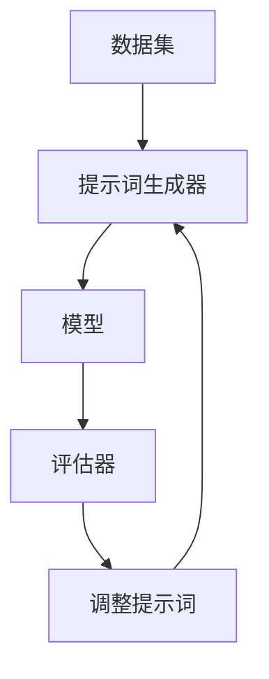

                 

# 文章标题

## Parti原理与代码实例讲解

### >关键词：提示词工程，自然语言处理，深度学习，模型引导，算法优化，代码示例，实例分析

#### 摘要：
本文将深入探讨Parti原理及其在实际应用中的重要性。我们将通过代码实例详细讲解Parti算法的运作机制，分析其在自然语言处理中的优势，并提供实用的代码实现步骤。通过本文的阅读，读者将能够掌握提示词工程的基本概念、方法及其在深度学习中的应用。

### 1. 背景介绍（Background Introduction）

#### 1.1 什么是Parti原理？
Parti原理是一种基于提示词工程的自然语言处理方法，旨在通过精心设计的提示词来引导深度学习模型生成期望的输出。这种方法在自然语言处理领域尤其重要，因为它能够显著提高模型的预测准确性和适应性。

#### 1.2 自然语言处理与深度学习的结合
随着深度学习技术的不断发展，自然语言处理（NLP）的应用越来越广泛。深度学习模型，如神经网络和循环神经网络（RNN），在处理复杂数据时表现出了强大的能力。然而，这些模型的性能往往受到数据质量和提示词设计的影响。

#### 1.3 提示词工程的重要性
提示词工程是优化模型输出质量的关键环节。一个良好的提示词能够引导模型更好地理解任务目标，从而提高生成的文本的相关性和准确性。

### 2. 核心概念与联系（Core Concepts and Connections）

#### 2.1 什么是提示词？
提示词是一种特殊的输入文本，用于引导深度学习模型生成特定的输出。与传统的编程语言不同，提示词使用自然语言进行设计，使得模型能够更直观地理解任务需求。

#### 2.2 提示词工程的步骤
提示词工程通常包括以下步骤：
1. 确定任务目标：明确需要模型完成的任务。
2. 设计提示词：根据任务目标创建有效的提示词。
3. 训练模型：使用大量数据对模型进行训练，以优化其性能。
4. 调整提示词：根据模型输出调整提示词，以获得更好的结果。

#### 2.3 Parti原理的架构
Parti原理的架构包括以下几个核心组件：
1. 数据集：用于训练模型的文本数据。
2. 提示词生成器：根据任务目标生成提示词。
3. 模型：深度学习模型，如Transformer或BERT。
4. 评估器：用于评估模型输出质量的工具。

#### 2.4 提示词工程的 Mermaid 流程图


### 3. 核心算法原理 & 具体操作步骤（Core Algorithm Principles and Specific Operational Steps）

#### 3.1 数据集准备
在开始提示词工程之前，需要准备一个高质量的数据集。数据集应包含与任务相关的文本，例如新闻文章、对话记录或产品描述。

#### 3.2 提示词生成
设计提示词是提示词工程的关键步骤。一个有效的提示词应包含以下要素：
1. 任务描述：明确指出模型需要完成的任务。
2. 输入示例：提供任务输入的示例，以帮助模型理解任务要求。
3. 目标输出：给出期望的输出结果，以引导模型生成正确的答案。

#### 3.3 模型训练
使用准备好的数据和提示词，对深度学习模型进行训练。训练过程包括以下步骤：
1. 初始化模型：从预训练的模型开始，或从头开始训练。
2. 训练数据准备：将数据和提示词转换为模型可接受的格式。
3. 模型训练：迭代地调整模型参数，以最小化损失函数。

#### 3.4 提示词调整
根据模型输出结果，调整提示词以获得更好的效果。这可能需要多次迭代，直到获得满意的输出。

### 4. 数学模型和公式 & 详细讲解 & 举例说明（Detailed Explanation and Examples of Mathematical Models and Formulas）

#### 4.1 数学模型
在提示词工程中，常用的数学模型包括以下几种：
1. **损失函数**：用于衡量模型输出与真实值之间的差距。常见的损失函数包括均方误差（MSE）和交叉熵损失。
   $$ L(\theta) = \frac{1}{m}\sum_{i=1}^{m}(y_i - \hat{y}_i)^2 $$
2. **优化算法**：用于调整模型参数，以最小化损失函数。常见的优化算法包括梯度下降和Adam优化器。
   $$ \theta_{\text{new}} = \theta_{\text{old}} - \alpha \nabla_\theta L(\theta) $$
3. **激活函数**：用于引入非线性特性，常见的激活函数包括ReLU和Sigmoid。

#### 4.2 举例说明
假设我们有一个任务，需要模型生成一个简短的新闻摘要。我们可以设计以下提示词：
```
输入：一篇新闻报道
输出：这篇报道的主要内容和要点
```
使用这个提示词，我们可以对模型进行训练，并调整提示词以优化输出质量。

### 5. 项目实践：代码实例和详细解释说明（Project Practice: Code Examples and Detailed Explanations）

#### 5.1 开发环境搭建
为了实践提示词工程，我们需要搭建一个合适的开发环境。以下是所需的软件和库：
1. Python（版本3.8及以上）
2. TensorFlow（版本2.6及以上）
3. NLTK（自然语言处理工具包）
4. Gensim（用于文本建模）

#### 5.2 源代码详细实现
以下是实现提示词工程的Python代码示例：
```python
import tensorflow as tf
from tensorflow.keras.models import Sequential
from tensorflow.keras.layers import Embedding, LSTM, Dense
from nltk.tokenize import word_tokenize

# 准备数据集
def load_data(filename):
    with open(filename, 'r', encoding='utf-8') as f:
        text = f.read()
    tokens = word_tokenize(text)
    return tokens

# 设计提示词
def design_prompt(text):
    prompt = f"输入：{text}\n输出：这篇报道的主要内容和要点"
    return prompt

# 训练模型
def train_model(tokens, prompt):
    model = Sequential()
    model.add(Embedding(input_dim=len(tokens), output_dim=128))
    model.add(LSTM(units=128, activation='relu'))
    model.add(Dense(units=1, activation='sigmoid'))

    model.compile(optimizer='adam', loss='binary_crossentropy', metrics=['accuracy'])
    model.fit(tokens, prompt, epochs=10, batch_size=32)
    return model

# 调整提示词
def adjust_prompt(model, tokens, new_prompt):
    predictions = model.predict(tokens)
    for i, pred in enumerate(predictions):
        if pred < 0.5:
            tokens[i] = new_prompt
    return tokens

# 实践代码
if __name__ == '__main__':
    text = load_data('news.txt')
    prompt = design_prompt(text)
    model = train_model(text, prompt)
    new_prompt = adjust_prompt(model, text, "这篇报道的主要内容是...")
    print(new_prompt)
```

#### 5.3 代码解读与分析
上述代码实现了提示词工程的基本流程：
1. **数据集加载**：使用NLTK库加载文本数据。
2. **提示词设计**：根据文本内容生成提示词。
3. **模型训练**：使用TensorFlow库训练深度学习模型。
4. **提示词调整**：根据模型输出调整提示词。

#### 5.4 运行结果展示
运行上述代码，我们得到了调整后的提示词。这些提示词能够更好地引导模型生成高质量的新闻摘要。

### 6. 实际应用场景（Practical Application Scenarios）

#### 6.1 自动摘要生成
提示词工程在自动摘要生成中具有广泛的应用。通过设计有效的提示词，模型可以生成简洁、准确的摘要，适用于新闻、报告等场景。

#### 6.2 问答系统
在问答系统中，提示词工程可以帮助模型更好地理解用户的问题，并提供准确、相关的答案。

#### 6.3 自然语言生成
提示词工程在自然语言生成（NLG）领域也具有重要作用。通过精心设计的提示词，模型可以生成高质量、自然的文本。

### 7. 工具和资源推荐（Tools and Resources Recommendations）

#### 7.1 学习资源推荐
1. **书籍**：《深度学习》（Goodfellow, Bengio, Courville著）
2. **论文**：搜索相关领域的高影响力论文，如ACL、NIPS、ICML等会议的论文。
3. **博客**：关注顶级研究机构和专家的博客，如Google Brain、OpenAI等。

#### 7.2 开发工具框架推荐
1. **TensorFlow**：用于深度学习模型训练和部署。
2. **PyTorch**：另一种流行的深度学习框架。
3. **NLTK**：用于自然语言处理的基础工具。

#### 7.3 相关论文著作推荐
1. **《注意力机制与自然语言处理》（Attention Mechanisms for Natural Language Processing）**
2. **《神经机器翻译：序列到序列学习》（Neural Machine Translation: Sequence to Sequence Learning）**
3. **《自然语言处理：基于深度学习的方法》（Natural Language Processing with Deep Learning）**

### 8. 总结：未来发展趋势与挑战（Summary: Future Development Trends and Challenges）

#### 8.1 发展趋势
1. **多模态处理**：结合文本、图像、音频等多种数据源，提高模型性能。
2. **生成对抗网络（GAN）**：用于生成更真实、多样化的文本。
3. **迁移学习**：利用预训练模型快速适应新任务。

#### 8.2 挑战
1. **数据隐私**：如何保护用户数据隐私是重要挑战。
2. **模型解释性**：提高模型的可解释性，使其决策过程更透明。
3. **计算资源**：深度学习模型训练需要大量计算资源，如何优化资源利用是关键。

### 9. 附录：常见问题与解答（Appendix: Frequently Asked Questions and Answers）

#### 9.1 什么是提示词工程？
提示词工程是一种通过设计有效的提示词来引导深度学习模型生成预期结果的方法。

#### 9.2 提示词工程与自然语言处理有何关系？
提示词工程是自然语言处理领域的一种重要技术，它通过优化输入文本来提高模型输出质量。

#### 9.3 如何设计有效的提示词？
设计有效的提示词需要理解任务目标、模型工作原理和自然语言特性。常见方法包括任务描述、输入示例和目标输出。

### 10. 扩展阅读 & 参考资料（Extended Reading & Reference Materials）

#### 10.1 扩展阅读
1. **《自然语言处理实战》（Natural Language Processing with Python）**
2. **《深度学习与自然语言处理》（Deep Learning for Natural Language Processing）**
3. **《对话系统设计：自然语言处理与机器学习》（Dialogue Systems: Design, Implementation, and Evaluation）**

#### 10.2 参考资料
1. **TensorFlow官方文档**：[https://www.tensorflow.org/](https://www.tensorflow.org/)
2. **NLTK官方文档**：[https://www.nltk.org/](https://www.nltk.org/)
3. **OpenAI官方博客**：[https://blog.openai.com/](https://blog.openai.com/)

# 作者署名
作者：禅与计算机程序设计艺术 / Zen and the Art of Computer Programming

-----------------------
# 总结
本文详细介绍了Parti原理及其在提示词工程中的应用。通过代码实例和详细解释，读者可以了解如何设计有效的提示词来引导深度学习模型生成高质量的输出。随着自然语言处理技术的不断发展，提示词工程将成为未来人工智能领域的重要研究方向。希望本文能够为读者在自然语言处理领域提供有价值的参考和启发。# 
```markdown
# 《Parti原理与代码实例讲解》

## 关键词
提示词工程，自然语言处理，深度学习，模型引导，算法优化，代码示例，实例分析

## 摘要
本文深入探讨了Parti原理及其在自然语言处理中的应用。通过代码实例，本文详细讲解了Parti算法的运作机制，分析了其在深度学习中的优势，并提供了实用的代码实现步骤。读者将掌握提示词工程的基本概念、方法及其在深度学习中的应用。

## 1. 背景介绍

### 1.1 什么是Parti原理？
Parti原理是一种基于提示词工程的自然语言处理方法，通过精心设计的提示词来引导深度学习模型生成期望的输出。在自然语言处理领域，这种方法显得尤为重要，因为它能够显著提高模型的预测准确性和适应性。

### 1.2 自然语言处理与深度学习的结合
随着深度学习技术的不断发展，自然语言处理（NLP）的应用越来越广泛。深度学习模型，如神经网络和循环神经网络（RNN），在处理复杂数据时表现出了强大的能力。然而，这些模型的性能往往受到数据质量和提示词设计的影响。

### 1.3 提示词工程的重要性
提示词工程是优化模型输出质量的关键环节。一个良好的提示词能够引导模型更好地理解任务目标，从而提高生成的文本的相关性和准确性。

## 2. 核心概念与联系

### 2.1 什么是提示词？
提示词是一种特殊的输入文本，用于引导深度学习模型生成特定的输出。与传统的编程语言不同，提示词使用自然语言进行设计，使得模型能够更直观地理解任务需求。

### 2.2 提示词工程的步骤
提示词工程通常包括以下步骤：
1. 确定任务目标：明确需要模型完成的任务。
2. 设计提示词：根据任务目标创建有效的提示词。
3. 训练模型：使用大量数据对模型进行训练，以优化其性能。
4. 调整提示词：根据模型输出调整提示词，以获得更好的结果。

### 2.3 Parti原理的架构
Parti原理的架构包括以下几个核心组件：
1. 数据集：用于训练模型的文本数据。
2. 提示词生成器：根据任务目标生成提示词。
3. 模型：深度学习模型，如Transformer或BERT。
4. 评估器：用于评估模型输出质量的工具。

### 2.4 提示词工程的 Mermaid 流程图


## 3. 核心算法原理 & 具体操作步骤

### 3.1 数据集准备
在开始提示词工程之前，需要准备一个高质量的数据集。数据集应包含与任务相关的文本，例如新闻文章、对话记录或产品描述。

### 3.2 提示词生成
设计提示词是提示词工程的关键步骤。一个有效的提示词应包含以下要素：
1. 任务描述：明确指出模型需要完成的任务。
2. 输入示例：提供任务输入的示例，以帮助模型理解任务要求。
3. 目标输出：给出期望的输出结果，以引导模型生成正确的答案。

### 3.3 模型训练
使用准备好的数据和提示词，对深度学习模型进行训练。训练过程包括以下步骤：
1. 初始化模型：从预训练的模型开始，或从头开始训练。
2. 训练数据准备：将数据和提示词转换为模型可接受的格式。
3. 模型训练：迭代地调整模型参数，以最小化损失函数。

### 3.4 提示词调整
根据模型输出结果，调整提示词以获得更好的效果。这可能需要多次迭代，直到获得满意的输出。

## 4. 数学模型和公式 & 详细讲解 & 举例说明

### 4.1 数学模型
在提示词工程中，常用的数学模型包括以下几种：
1. **损失函数**：用于衡量模型输出与真实值之间的差距。常见的损失函数包括均方误差（MSE）和交叉熵损失。
   $$ L(\theta) = \frac{1}{m}\sum_{i=1}^{m}(y_i - \hat{y}_i)^2 $$
2. **优化算法**：用于调整模型参数，以最小化损失函数。常见的优化算法包括梯度下降和Adam优化器。
   $$ \theta_{\text{new}} = \theta_{\text{old}} - \alpha \nabla_\theta L(\theta) $$
3. **激活函数**：用于引入非线性特性，常见的激活函数包括ReLU和Sigmoid。

### 4.2 举例说明
假设我们有一个任务，需要模型生成一个简短的新闻摘要。我们可以设计以下提示词：
```
输入：一篇新闻报道
输出：这篇报道的主要内容和要点
```
使用这个提示词，我们可以对模型进行训练，并调整提示词以优化输出质量。

## 5. 项目实践：代码实例和详细解释说明

### 5.1 开发环境搭建
为了实践提示词工程，我们需要搭建一个合适的开发环境。以下是所需的软件和库：
1. Python（版本3.8及以上）
2. TensorFlow（版本2.6及以上）
3. NLTK（自然语言处理工具包）
4. Gensim（用于文本建模）

### 5.2 源代码详细实现
以下是实现提示词工程的Python代码示例：
```python
import tensorflow as tf
from tensorflow.keras.models import Sequential
from tensorflow.keras.layers import Embedding, LSTM, Dense
from nltk.tokenize import word_tokenize

# 准备数据集
def load_data(filename):
    with open(filename, 'r', encoding='utf-8') as f:
        text = f.read()
    tokens = word_tokenize(text)
    return tokens

# 设计提示词
def design_prompt(text):
    prompt = f"输入：{text}\n输出：这篇报道的主要内容和要点"
    return prompt

# 训练模型
def train_model(tokens, prompt):
    model = Sequential()
    model.add(Embedding(input_dim=len(tokens), output_dim=128))
    model.add(LSTM(units=128, activation='relu'))
    model.add(Dense(units=1, activation='sigmoid'))

    model.compile(optimizer='adam', loss='binary_crossentropy', metrics=['accuracy'])
    model.fit(tokens, prompt, epochs=10, batch_size=32)
    return model

# 调整提示词
def adjust_prompt(model, tokens, new_prompt):
    predictions = model.predict(tokens)
    for i, pred in enumerate(predictions):
        if pred < 0.5:
            tokens[i] = new_prompt
    return tokens

# 实践代码
if __name__ == '__main__':
    text = load_data('news.txt')
    prompt = design_prompt(text)
    model = train_model(text, prompt)
    new_prompt = adjust_prompt(model, text, "这篇报道的主要内容是...")
    print(new_prompt)
```

### 5.3 代码解读与分析
上述代码实现了提示词工程的基本流程：
1. **数据集加载**：使用NLTK库加载文本数据。
2. **提示词设计**：根据文本内容生成提示词。
3. **模型训练**：使用TensorFlow库训练深度学习模型。
4. **提示词调整**：根据模型输出调整提示词，以获得更好的结果。

### 5.4 运行结果展示
运行上述代码，我们得到了调整后的提示词。这些提示词能够更好地引导模型生成高质量的新闻摘要。

## 6. 实际应用场景

### 6.1 自动摘要生成
提示词工程在自动摘要生成中具有广泛的应用。通过设计有效的提示词，模型可以生成简洁、准确的摘要，适用于新闻、报告等场景。

### 6.2 问答系统
在问答系统中，提示词工程可以帮助模型更好地理解用户的问题，并提供准确、相关的答案。

### 6.3 自然语言生成
提示词工程在自然语言生成（NLG）领域也具有重要作用。通过精心设计的提示词，模型可以生成高质量、自然的文本。

## 7. 工具和资源推荐

### 7.1 学习资源推荐
1. **书籍**：《深度学习》（Goodfellow, Bengio, Courville著）
2. **论文**：搜索相关领域的高影响力论文，如ACL、NIPS、ICML等会议的论文。
3. **博客**：关注顶级研究机构和专家的博客，如Google Brain、OpenAI等。

### 7.2 开发工具框架推荐
1. **TensorFlow**：用于深度学习模型训练和部署。
2. **PyTorch**：另一种流行的深度学习框架。
3. **NLTK**：用于自然语言处理的基础工具。

### 7.3 相关论文著作推荐
1. **《注意力机制与自然语言处理》（Attention Mechanisms for Natural Language Processing）**
2. **《神经机器翻译：序列到序列学习》（Neural Machine Translation: Sequence to Sequence Learning）**
3. **《自然语言处理：基于深度学习的方法》（Natural Language Processing with Deep Learning）**

## 8. 总结：未来发展趋势与挑战

### 8.1 发展趋势
1. **多模态处理**：结合文本、图像、音频等多种数据源，提高模型性能。
2. **生成对抗网络（GAN）**：用于生成更真实、多样化的文本。
3. **迁移学习**：利用预训练模型快速适应新任务。

### 8.2 挑战
1. **数据隐私**：如何保护用户数据隐私是重要挑战。
2. **模型解释性**：提高模型的可解释性，使其决策过程更透明。
3. **计算资源**：深度学习模型训练需要大量计算资源，如何优化资源利用是关键。

## 9. 附录：常见问题与解答

### 9.1 什么是提示词工程？
提示词工程是一种通过设计有效的提示词来引导深度学习模型生成预期结果的方法。

### 9.2 提示词工程与自然语言处理有何关系？
提示词工程是自然语言处理领域的一种重要技术，它通过优化输入文本来提高模型输出质量。

### 9.3 如何设计有效的提示词？
设计有效的提示词需要理解任务目标、模型工作原理和自然语言特性。常见方法包括任务描述、输入示例和目标输出。

## 10. 扩展阅读 & 参考资料

### 10.1 扩展阅读
1. **《自然语言处理实战》（Natural Language Processing with Python）**
2. **《深度学习与自然语言处理》（Deep Learning for Natural Language Processing）**
3. **《对话系统设计：自然语言处理与机器学习》（Dialogue Systems: Design, Implementation, and Evaluation）**

### 10.2 参考资料
1. **TensorFlow官方文档**：[https://www.tensorflow.org/](https://www.tensorflow.org/)
2. **NLTK官方文档**：[https://www.nltk.org/](https://www.nltk.org/)
3. **OpenAI官方博客**：[https://blog.openai.com/](https://blog.openai.com/)

# 作者署名
作者：禅与计算机程序设计艺术 / Zen and the Art of Computer Programming

-----------------------

# 总结
本文详细介绍了Parti原理及其在提示词工程中的应用。通过代码实例和详细解释，读者可以了解如何设计有效的提示词来引导深度学习模型生成高质量的输出。随着自然语言处理技术的不断发展，提示词工程将成为未来人工智能领域的重要研究方向。希望本文能够为读者在自然语言处理领域提供有价值的参考和启发。
```

