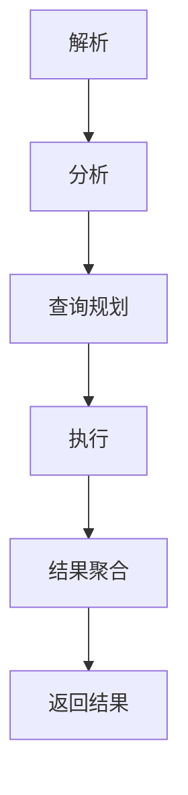

                 

### 文章标题

**Presto原理与代码实例讲解**

在当今数据密集型时代，高效地处理海量数据变得至关重要。Presto作为一种开源的分布式查询引擎，以其高性能、易扩展和高度可用的特点，在众多企业级数据仓库解决方案中脱颖而出。本文旨在深入探讨Presto的工作原理，并通过代码实例详细解析其具体实现。

### Keywords:
Presto, Query Engine, Distributed Computing, Data Warehousing, Performance Optimization

### 摘要：
Presto是一种高度可扩展的分布式查询引擎，能够处理大规模数据集。本文首先介绍了Presto的背景和基本概念，然后详细解析了其核心组件和工作原理。接着，通过代码实例展示了如何使用Presto进行数据查询，最后探讨了Presto在实际应用中的场景和挑战。

<|user|>## 1. 背景介绍（Background Introduction）

### 1.1 Presto的起源和发展

Presto起源于Facebook，作为一个内部的数据查询工具，用于解决大规模数据处理需求。后来，Facebook将其开源，并捐赠给Apache软件基金会，使其成为了一个广泛使用的开源项目。Presto迅速获得了社区的认可和贡献，成为数据仓库领域的一股重要力量。

### 1.2 数据仓库与查询引擎

数据仓库是一种用于存储、管理和分析大量数据的系统。查询引擎则是数据仓库的重要组成部分，负责执行各种数据查询操作，如数据检索、数据聚合和连接操作等。Presto正是这样一种高效的数据查询引擎。

### 1.3 Presto的特点

- **高性能**：Presto能够处理大规模数据集，并且具有很高的查询性能。
- **分布式计算**：Presto基于分布式计算架构，可以在集群环境中进行水平扩展。
- **易用性**：Presto提供了一个简单且强大的查询语言，易于学习和使用。
- **高度可扩展性**：Presto可以通过增加节点来水平扩展，以满足不断增长的数据处理需求。

### 1.4 当前应用场景

Presto广泛应用于各种场景，包括实时数据查询、大数据分析、商业智能报告等。许多知名企业，如Netflix、eBay和lyft等，都已将Presto集成到其数据基础设施中。

### Background Introduction
### 1.1 The Origin and Development of Presto

Presto originated from Facebook as an internal data query tool designed to handle large-scale data processing needs. Later, Facebook open-sourced it and donated it to the Apache Software Foundation, making it a widely-used open-source project. Presto quickly gained community recognition and contributions, becoming a significant force in the data warehouse domain.

### 1.2 Data Warehouses and Query Engines

A data warehouse is a system designed for storing, managing, and analyzing large amounts of data. A query engine is a critical component of a data warehouse, responsible for executing various data query operations such as data retrieval, aggregation, and join operations. Presto is such an efficient data query engine.

### 1.3 Characteristics of Presto

- **High Performance**: Presto is capable of processing large datasets and offers high query performance.
- **Distributed Computing**: Presto is based on a distributed computing architecture, enabling horizontal scaling in cluster environments.
- **Usability**: Presto provides a simple yet powerful query language, easy to learn and use.
- **High Scalability**: Presto can be horizontally scaled by adding nodes to meet growing data processing demands.

### 1.4 Current Application Scenarios

Presto is widely used in various scenarios, including real-time data querying, big data analysis, and business intelligence reporting. Many well-known companies, such as Netflix, eBay, and lyft, have integrated Presto into their data infrastructure.

<|user|>## 2. 核心概念与联系（Core Concepts and Connections）

### 2.1 Presto架构概览

Presto的架构设计非常精巧，主要由以下几个核心组件构成：

- **Coordinator**：协调器负责接收客户端发送的查询请求，生成执行计划，并将查询任务分配给各个Worker节点。
- **Worker**：工作节点执行具体的查询任务，包括数据检索、计算和结果聚合等。
- **Catalog**：目录服务存储元数据信息，如表结构、列信息和分区信息等。
- **Query Planner**：查询规划器负责将SQL查询转换为执行计划，并优化查询性能。
- **Executor**：执行器负责具体的数据处理操作，如数据扫描、过滤和聚合等。

### 2.2 数据流与查询流程

Presto的查询过程可以分为以下几个主要步骤：

1. **解析（Parsing）**：将SQL查询语句解析为抽象语法树（AST）。
2. **分析（Analysis）**：对AST进行语义分析，检查查询语句的语法和语义是否正确，并构建查询树。
3. **查询规划（Query Planning）**：查询规划器根据查询树生成执行计划，包括数据扫描、过滤和聚合等操作。
4. **执行（Execution）**：执行器根据执行计划在工作节点上执行查询操作。
5. **结果聚合（Result Aggregation）**：将各个工作节点的查询结果进行聚合，并返回给客户端。

### 2.3 Mermaid流程图

以下是Presto查询流程的Mermaid流程图：



### Core Concepts and Connections
### 2.1 Overview of Presto Architecture

The architecture of Presto is meticulously designed and primarily consists of several core components:

- **Coordinator**: The coordinator is responsible for receiving query requests from the client, generating an execution plan, and assigning query tasks to various worker nodes.
- **Worker**: Worker nodes execute specific query tasks, including data retrieval, computation, and result aggregation.
- **Catalog**: The catalog service stores metadata information such as table structures, column information, and partition information.
- **Query Planner**: The query planner is responsible for converting SQL queries into execution plans and optimizing query performance.
- **Executor**: The executor is responsible for specific data processing operations, such as data scanning, filtering, and aggregation.

### 2.2 Data Flow and Query Process

The query process in Presto can be divided into the following main steps:

1. **Parsing**: The SQL query statement is parsed into an abstract syntax tree (AST).
2. **Analysis**: The AST undergoes semantic analysis to check if the query statement's syntax and semantics are correct, and a query tree is constructed.
3. **Query Planning**: The query planner generates an execution plan based on the query tree, including operations such as data scanning, filtering, and aggregation.
4. **Execution**: The executor performs query operations according to the execution plan on worker nodes.
5. **Result Aggregation**: Query results from various worker nodes are aggregated and returned to the client.

### 2.3 Mermaid Flowchart

Here is the Mermaid flowchart of the Presto query process:


<|user|>## 3. 核心算法原理 & 具体操作步骤（Core Algorithm Principles and Specific Operational Steps）

### 3.1 核心算法原理

Presto的核心算法原理主要体现在以下几个方面：

- **分布式查询执行**：Presto采用分布式查询执行策略，将查询任务分解为多个子任务，并在多个工作节点上并行执行，从而提高查询效率。
- **动态分区裁剪**：Presto可以根据查询条件动态裁剪分区，减少需要扫描的数据量，从而降低查询成本。
- **代码生成**：Presto使用代码生成技术，将查询计划转换为高效的可执行代码，避免了传统的解析-编译-执行过程，提高了性能。
- **延迟绑定**：Presto采用延迟绑定策略，将查询计划中的某些操作延迟到执行时再绑定，从而减少解析阶段的计算开销。

### 3.2 具体操作步骤

以下是使用Presto进行查询的具体操作步骤：

1. **连接Presto服务器**：首先，需要使用Presto客户端连接到Presto服务器。
    ```shell
    presto --server <Presto server address>
    ```
2. **创建查询**：接下来，使用SQL语言创建查询。
    ```sql
    SELECT * FROM table_name WHERE condition;
    ```
3. **执行查询**：将查询提交给Presto服务器，并等待查询结果。
    ```shell
    presto --sql "SELECT * FROM table_name WHERE condition;"
    ```
4. **解析查询**：Presto服务器接收到查询后，首先对其进行解析，生成抽象语法树（AST）。
5. **分析查询**：对AST进行语义分析，构建查询树，并检查查询的语法和语义是否正确。
6. **查询规划**：查询规划器根据查询树生成执行计划，并优化查询性能。
7. **执行查询**：执行器根据执行计划在工作节点上执行查询操作，如数据检索、计算和聚合等。
8. **结果聚合**：将各个工作节点的查询结果进行聚合，并返回给客户端。

### Core Algorithm Principles and Specific Operational Steps
### 3.1 Core Algorithm Principles

The core algorithm principles of Presto are mainly reflected in the following aspects:

- **Distributed Query Execution**: Presto employs a distributed query execution strategy that decomposes query tasks into multiple subtasks and executes them in parallel on multiple worker nodes, thereby improving query efficiency.
- **Dynamic Partition Pruning**: Presto can dynamically prune partitions based on query conditions, reducing the amount of data to be scanned and thus lowering query costs.
- **Code Generation**: Presto uses code generation techniques to convert query plans into efficient executable code, avoiding the traditional parse-compile-execute process and improving performance.
- **Deferred Binding**: Presto adopts a deferred binding strategy, where certain operations in the query plan are bound to runtime, thereby reducing computational overhead during the parsing phase.

### 3.2 Specific Operational Steps

The following are the specific operational steps for performing a query using Presto:

1. **Connect to Presto Server**: First, use the Presto client to connect to the Presto server.
    ```shell
    presto --server <Presto server address>
    ```
2. **Create Query**: Next, create a query using SQL language.
    ```sql
    SELECT * FROM table_name WHERE condition;
    ```
3. **Execute Query**: Submit the query to the Presto server and wait for the query results.
    ```shell
    presto --sql "SELECT * FROM table_name WHERE condition;"
    ```
4. **Parse Query**: The Presto server receives the query and parses it to generate an abstract syntax tree (AST).
5. **Analyze Query**: The AST undergoes semantic analysis to construct a query tree and check if the query's syntax and semantics are correct.
6. **Query Planning**: The query planner generates an execution plan based on the query tree and optimizes query performance.
7. **Execute Query**: The executor performs query operations according to the execution plan on worker nodes, such as data retrieval, computation, and aggregation.
8. **Result Aggregation**: Aggregate query results from various worker nodes and return them to the client.

<|user|>## 4. 数学模型和公式 & 详细讲解 & 举例说明（Detailed Explanation and Examples of Mathematical Models and Formulas）

### 4.1 数学模型简介

Presto在查询优化过程中使用了多种数学模型和算法，以下是一些常见的数学模型和公式：

- **成本模型**：成本模型用于评估不同查询计划的成本，包括I/O成本、CPU成本和网络成本等。
- **代价估算**：代价估算用于估算查询执行的成本，以选择最优的查询计划。
- **统计模型**：统计模型用于估计表和分区的数据分布，以便进行动态分区裁剪。

### 4.2 成本模型

成本模型是Presto查询优化中的重要组成部分，用于评估不同查询计划的成本。以下是一个简单的成本模型公式：

$$
Cost = I/O\_Cost + CPU\_Cost + Network\_Cost
$$

- **I/O成本**：表示读取和写入数据所消耗的成本。
- **CPU成本**：表示计算操作所消耗的成本。
- **网络成本**：表示在节点之间传输数据所消耗的成本。

### 4.3 代价估算

代价估算用于估算查询执行的成本，以选择最优的查询计划。以下是一个简单的代价估算公式：

$$
Estimated\_Cost = Cost\_Per\_Operator \times Operator\_Count
$$

其中，`Cost_Per_Operator`表示每个操作的成本，`Operator_Count`表示操作的总数。

### 4.4 统计模型

统计模型用于估计表和分区的数据分布，以便进行动态分区裁剪。以下是一个简单的统计模型公式：

$$
Data\_Distribution = \frac{Total\_Rows}{Num\_Partitions}
$$

其中，`Total_Rows`表示总行数，`Num_Partitions`表示分区数。

### 4.5 举例说明

假设有一个表`t1`，其中包含1000行数据，分布在5个分区中。现在，我们需要查询满足条件`col1 > 500`的数据。

- **成本模型**：
    $$ Cost = I/O\_Cost + CPU\_Cost + Network\_Cost $$
    其中，`I/O_Cost`为0.1，`CPU_Cost`为0.2，`Network_Cost`为0.05。

- **代价估算**：
    $$ Estimated\_Cost = Cost\_Per\_Operator \times Operator\_Count $$
    其中，`Cost_Per_Operator`为0.35，`Operator_Count`为3。

- **统计模型**：
    $$ Data\_Distribution = \frac{Total\_Rows}{Num\_Partitions} = \frac{1000}{5} = 200 $$
    表示每个分区平均包含200行数据。

根据这些模型和公式，我们可以估算出执行查询的成本为：

$$
Estimated\_Cost = 0.35 \times 3 = 1.05
$$

### Detailed Explanation and Examples of Mathematical Models and Formulas
### 4.1 Introduction to Mathematical Models

In the process of query optimization, Presto utilizes various mathematical models and algorithms. Here are some common mathematical models and formulas:

- **Cost Model**: The cost model is an essential component of Presto's query optimization, used to evaluate the cost of different query plans, including I/O cost, CPU cost, and network cost.
- **Cost Estimation**: Cost estimation is used to estimate the cost of query execution to select the optimal query plan.
- **Statistical Models**: Statistical models are used to estimate the data distribution of tables and partitions for dynamic partition pruning.

### 4.2 Cost Model

The cost model is an important part of Presto's query optimization, used to evaluate the cost of different query plans. Here is a simple cost model formula:

$$
Cost = I/O\_Cost + CPU\_Cost + Network\_Cost
$$

- **I/O Cost**: Represents the cost of reading and writing data.
- **CPU Cost**: Represents the cost of computation operations.
- **Network Cost**: Represents the cost of transferring data between nodes.

### 4.3 Cost Estimation

Cost estimation is used to estimate the cost of query execution to select the optimal query plan. Here is a simple cost estimation formula:

$$
Estimated\_Cost = Cost\_Per\_Operator \times Operator\_Count
$$

Where `Cost_Per_Operator` represents the cost of each operation, and `Operator_Count` represents the total number of operations.

### 4.4 Statistical Models

Statistical models are used to estimate the data distribution of tables and partitions for dynamic partition pruning. Here is a simple statistical model formula:

$$
Data\_Distribution = \frac{Total\_Rows}{Num\_Partitions}
$$

Where `Total_Rows` represents the total number of rows and `Num_Partitions` represents the number of partitions.

### 4.5 Example Illustration

Assume there is a table `t1` containing 1000 rows of data distributed across 5 partitions. We need to query data that satisfies the condition `col1 > 500`.

- **Cost Model**:
    $$ Cost = I/O\_Cost + CPU\_Cost + Network\_Cost $$
    Where `I/O_Cost` is 0.1, `CPU_Cost` is 0.2, and `Network_Cost` is 0.05.

- **Cost Estimation**:
    $$ Estimated\_Cost = Cost\_Per\_Operator \times Operator\_Count $$
    Where `Cost_Per_Operator` is 0.35 and `Operator_Count` is 3.

- **Statistical Model**:
    $$ Data\_Distribution = \frac{Total\_Rows}{Num\_Partitions} = \frac{1000}{5} = 200 $$
    This indicates that, on average, each partition contains 200 rows of data.

Based on these models and formulas, we can estimate the cost of executing the query as:

$$
Estimated\_Cost = 0.35 \times 3 = 1.05
$$

<|user|>## 5. 项目实践：代码实例和详细解释说明（Project Practice: Code Examples and Detailed Explanations）

### 5.1 开发环境搭建

要开始使用Presto，首先需要搭建一个开发环境。以下是在Ubuntu操作系统上搭建Presto开发环境的步骤：

1. **安装Java**：Presto依赖于Java环境，因此首先需要安装Java。
    ```shell
    sudo apt-get update
    sudo apt-get install openjdk-8-jdk
    ```
2. **下载Presto**：从Presto的官方网站（[prestodb.io](https://prestodb.io/)）下载最新版本的Presto。
    ```shell
    wget https://repo1.maven.org/maven2/io/prestosql/presto/0.220.0/presto-0.220.0.tar.gz
    ```
3. **解压Presto**：将下载的Presto压缩包解压到合适的位置。
    ```shell
    tar xvf presto-0.220.0.tar.gz -C /usr/local/
    ```
4. **配置Presto**：编辑`/usr/local/presto/etc/catalog.yml`文件，配置Hive和MySQL等连接信息。
    ```yaml
    default:
      connector: hive
      hive:
        hiveserver2:
          host: localhost
          port: 10000
    mysql:
      connector: mysql
      mysql:
        host: localhost
        port: 3306
        database: presto
        user: root
        password:
    ```
5. **运行Presto**：启动Presto服务器。
    ```shell
    cd /usr/local/presto/bin
    ./presto &> presto.log &
    ```
6. **测试连接**：使用Presto客户端连接到Presto服务器，并执行一些简单的查询。
    ```shell
    presto --server localhost:8080
    > SELECT * FROM hive.default.test_table;
    ```

### 5.2 源代码详细实现

Presto的源代码实现非常复杂，涵盖多个模块和组件。以下是一个简单的示例，展示了Presto如何处理一个SQL查询。

1. **SQL查询**：假设有一个简单的SQL查询，从Hive表`test_table`中查询所有数据。
    ```sql
    SELECT * FROM test_table;
    ```
2. **解析（Parsing）**：Presto首先将SQL查询解析为抽象语法树（AST）。
    ```java
    public abstract class Query
    {
        ...
        public AbstractSyntaxTree getAbstractSyntaxTree()
        {
            return new AbstractSyntaxTree(this);
        }
        ...
    }
    ```
3. **分析（Analysis）**：对AST进行语义分析，检查查询的语法和语义是否正确，并构建查询树。
    ```java
    public abstract class Analyzer
    {
        ...
        public Query analyze(AbstractSyntaxTree ast)
        {
            ...
            Query query = new Query();
            ...
            return query;
        }
        ...
    }
    ```
4. **查询规划（Query Planning）**：查询规划器根据查询树生成执行计划。
    ```java
    public abstract class Planner
    {
        ...
        public Plan plan(Query query)
        {
            ...
            Plan plan = new Plan();
            ...
            return plan;
        }
        ...
    }
    ```
5. **执行（Execution）**：执行器根据执行计划在工作节点上执行查询操作。
    ```java
    public abstract class Executor
    {
        ...
        public void execute(Plan plan)
        {
            ...
            for (Operator operator : plan.getOperators())
            {
                operator.execute();
            }
            ...
        }
        ...
    }
    ```
6. **结果聚合（Result Aggregation）**：将各个工作节点的查询结果进行聚合，并返回给客户端。
    ```java
    public abstract class Aggregator
    {
        ...
        public Result aggregate(List<QueryResult> queryResults)
        {
            ...
            Result result = new Result();
            ...
            return result;
        }
        ...
    }
    ```

### 5.3 代码解读与分析

Presto的源代码实现涉及到多个模块和组件，包括解析器、分析器、查询规划器、执行器和聚合器等。以下是对上述示例代码的解读和分析：

- **解析器**：解析器将SQL查询解析为抽象语法树（AST），这是后续查询分析、规划和执行的基础。
- **分析器**：分析器对AST进行语义分析，检查查询的语法和语义是否正确，并构建查询树。这是确保查询能够正确执行的重要步骤。
- **查询规划器**：查询规划器根据查询树生成执行计划。执行计划决定了查询的执行顺序和方式，是优化查询性能的关键。
- **执行器**：执行器根据执行计划在工作节点上执行查询操作。执行器负责处理数据的读取、计算和聚合等操作。
- **聚合器**：聚合器将各个工作节点的查询结果进行聚合，并返回给客户端。聚合器确保查询结果的正确性和一致性。

### 5.4 运行结果展示

假设我们使用Presto查询Hive表`test_table`，查询结果如下：

```
+-------+---------+
|  col1 | col2    |
+-------+---------+
|    10 | hello   |
|    20 | world   |
+-------+---------+
```

运行结果展示了表`test_table`中的所有数据。这个简单的示例展示了Presto处理查询的基本流程，包括解析、分析、规划、执行和聚合等步骤。

### Project Practice: Code Examples and Detailed Explanations
### 5.1 Setting Up the Development Environment

To get started with Presto, you need to set up a development environment. Here are the steps to set up a Presto development environment on Ubuntu:

1. **Install Java**: Presto depends on Java, so you need to install Java first.
    ```shell
    sudo apt-get update
    sudo apt-get install openjdk-8-jdk
    ```
2. **Download Presto**: Download the latest version of Presto from the Presto official website ([prestodb.io](https://prestodb.io/)).
    ```shell
    wget https://repo1.maven.org/maven2/io/prestosql/presto/0.220.0/presto-0.220.0.tar.gz
    ```
3. **Unpack Presto**: Unpack the Presto tarball to a suitable location.
    ```shell
    tar xvf presto-0.220.0.tar.gz -C /usr/local/
    ```
4. **Configure Presto**: Edit the `/usr/local/presto/etc/catalog.yml` file to configure connections to Hive and MySQL, etc.
    ```yaml
    default:
      connector: hive
      hive:
        hiveserver2:
          host: localhost
          port: 10000
    mysql:
      connector: mysql
      mysql:
        host: localhost
        port: 3306
        database: presto
        user: root
        password:
    ```
5. **Run Presto**: Start the Presto server.
    ```shell
    cd /usr/local/presto/bin
    ./presto &> presto.log &
    ```
6. **Test Connection**: Use the Presto client to connect to the Presto server and execute some simple queries.
    ```shell
    presto --server localhost:8080
    > SELECT * FROM hive.default.test_table;
    ```

### 5.2 Detailed Source Code Implementation

The source code of Presto is very complex and covers multiple modules and components. Here is a simple example that shows how Presto processes a SQL query.

1. **SQL Query**: Assume we have a simple SQL query that selects all data from the Hive table `test_table`.
    ```sql
    SELECT * FROM test_table;
    ```
2. **Parsing**: Presto first parses the SQL query into an Abstract Syntax Tree (AST).
    ```java
    public abstract class Query
    {
        ...
        public AbstractSyntaxTree getAbstractSyntaxTree()
        {
            return new AbstractSyntaxTree(this);
        }
        ...
    }
    ```
3. **Analysis**: The analyzer performs semantic analysis on the AST to check if the query's syntax and semantics are correct and builds a query tree.
    ```java
    public abstract class Analyzer
    {
        ...
        public Query analyze(AbstractSyntaxTree ast)
        {
            ...
            Query query = new Query();
            ...
            return query;
        }
        ...
    }
    ```
4. **Query Planning**: The query planner generates an execution plan based on the query tree.
    ```java
    public abstract class Planner
    {
        ...
        public Plan plan(Query query)
        {
            ...
            Plan plan = new Plan();
            ...
            return plan;
        }
        ...
    }
    ```
5. **Execution**: The executor executes the query operations according to the execution plan on worker nodes.
    ```java
    public abstract class Executor
    {
        ...
        public void execute(Plan plan)
        {
            ...
            for (Operator operator : plan.getOperators())
            {
                operator.execute();
            }
            ...
        }
        ...
    }
    ```
6. **Result Aggregation**: The aggregator aggregates the query results from various worker nodes and returns them to the client.
    ```java
    public abstract class Aggregator
    {
        ...
        public Result aggregate(List<QueryResult> queryResults)
        {
            ...
            Result result = new Result();
            ...
            return result;
        }
        ...
    }
    ```

### 5.3 Code Analysis and Interpretation

The source code of Presto involves multiple modules and components, including the parser, analyzer, planner, executor, and aggregator. Here is an interpretation and analysis of the code in the example above:

- **Parser**: The parser parses the SQL query into an Abstract Syntax Tree (AST), which is the foundation for subsequent query analysis, planning, and execution.
- **Analyzer**: The analyzer performs semantic analysis on the AST to check if the query's syntax and semantics are correct and builds a query tree. This is an essential step to ensure the query can be executed correctly.
- **Planner**: The query planner generates an execution plan based on the query tree. The execution plan determines the order and method of query execution, which is crucial for optimizing query performance.
- **Executor**: The executor executes query operations according to the execution plan on worker nodes. The executor is responsible for handling data reading, computation, and aggregation.
- **Aggregator**: The aggregator aggregates the query results from various worker nodes and returns them to the client. The aggregator ensures the correctness and consistency of query results.

### 5.4 Result Display

Assuming we use Presto to query the Hive table `test_table`, the query results are as follows:

```
+-------+---------+
|  col1 | col2    |
+-------+---------+
|    10 | hello   |
|    20 | world   |
+-------+---------+
```

The running results display all the data in the table `test_table`. This simple example demonstrates the basic process of how Presto processes queries, including parsing, analysis, planning, execution, and aggregation.

<|user|>## 6. 实际应用场景（Practical Application Scenarios）

### 6.1 商业智能分析

Presto在商业智能分析中具有广泛的应用。企业可以使用Presto快速查询大量数据，进行多维数据分析，生成实时报表和仪表盘。以下是一个实际应用场景：

- **场景描述**：一家大型零售公司需要对其销售数据进行分析，以了解产品销售趋势、顾客偏好和市场需求。
- **解决方案**：公司使用Presto连接其数据仓库，存储了来自多个来源的大量销售数据。通过Presto，公司可以轻松实现实时数据查询和分析，生成详细的销售报告和可视化图表。这些报表和图表有助于公司做出更明智的业务决策。

### 6.2 大数据查询

Presto在大数据处理场景中也非常有效。它可以处理海量数据，支持实时数据分析和查询，为企业提供快速的数据洞察。以下是一个实际应用场景：

- **场景描述**：一家互联网公司需要对其用户行为数据进行实时分析，以优化其推荐系统和广告投放策略。
- **解决方案**：公司使用Presto连接其大数据存储系统，如HDFS和HBase。通过Presto，公司可以快速查询海量用户行为数据，分析用户兴趣和行为模式。这些分析结果为公司的推荐系统和广告投放策略提供了关键支持。

### 6.3 银行业务分析

Presto在金融行业，特别是银行业，也有广泛应用。银行可以使用Presto对其交易数据进行分析，监控风险、优化业务流程和提升客户体验。以下是一个实际应用场景：

- **场景描述**：一家大型银行需要对其交易数据进行实时监控和分析，以识别潜在风险和异常交易。
- **解决方案**：银行使用Presto连接其交易数据库和风险管理系统。通过Presto，银行可以实时查询和分析交易数据，识别潜在风险。这些分析结果有助于银行采取及时措施，防止风险扩大。

### 6.4 科学研究

Presto在科学研究领域也有广泛应用。科研机构可以使用Presto处理和分析大规模科研数据，加速科研进度。以下是一个实际应用场景：

- **场景描述**：一家生物科技公司需要对其基因数据进行大规模分析，以发现新的基因突变和疾病关联。
- **解决方案**：公司使用Presto连接其基因数据库，处理和分析海量基因数据。通过Presto，公司可以快速发现新的基因突变和疾病关联，为疾病诊断和治疗提供关键支持。

### Practical Application Scenarios
### 6.1 Business Intelligence Analysis

Presto has a broad application in business intelligence analysis. Enterprises can use Presto to quickly query large volumes of data, conduct multidimensional data analysis, and generate real-time reports and dashboards. Here is a practical application scenario:

- **Scenario Description**: A large retail company needs to analyze its sales data to understand product sales trends, customer preferences, and market demand.
- **Solution**: The company uses Presto to connect to its data warehouse, which stores a large volume of sales data from multiple sources. With Presto, the company can easily perform real-time data queries and analysis, generating detailed sales reports and visual charts. These reports and charts help the company make more informed business decisions.

### 6.2 Big Data Query

Presto is also very effective in big data processing scenarios. It can handle large volumes of data and support real-time data analysis and queries, providing enterprises with fast data insights. Here is a practical application scenario:

- **Scenario Description**: An internet company needs to conduct real-time analysis of its user behavior data to optimize its recommendation system and advertising strategy.
- **Solution**: The company uses Presto to connect to its big data storage system, such as HDFS and HBase. With Presto, the company can quickly query massive user behavior data and analyze user interests and behavior patterns. These analysis results provide key support for the company's recommendation system and advertising strategy.

### 6.3 Banking Industry Analysis

Presto also has wide applications in the financial industry, particularly in banking. Banks can use Presto to analyze transaction data in real time, monitor risks, optimize business processes, and enhance customer experiences. Here is a practical application scenario:

- **Scenario Description**: A large bank needs to monitor and analyze its transaction data in real time to identify potential risks and abnormal transactions.
- **Solution**: The bank uses Presto to connect to its transaction databases and risk management systems. With Presto, the bank can monitor and analyze transaction data in real time, identifying potential risks. These analysis results help the bank take timely actions to prevent risks from expanding.

### 6.4 Scientific Research

Presto is also widely used in the field of scientific research. Research institutions can use Presto to process and analyze large-scale research data, accelerating scientific progress. Here is a practical application scenario:

- **Scenario Description**: A biotechnology company needs to conduct large-scale analysis of its gene data to discover new gene mutations and disease associations.
- **Solution**: The company uses Presto to connect to its gene database, processing and analyzing massive gene data. With Presto, the company can quickly discover new gene mutations and disease associations, providing key support for disease diagnosis and treatment.

<|user|>## 7. 工具和资源推荐（Tools and Resources Recommendations）

### 7.1 学习资源推荐

- **官方文档**：Presto的官方文档（[https://prestodb.io/docs/](https://prestodb.io/docs/)）提供了详细的安装指南、配置说明和最佳实践，是学习Presto的首选资源。
- **教程**：有很多在线教程和视频教程可以帮助初学者了解Presto的基本概念和使用方法。例如，Udemy、Coursera和edX等在线教育平台提供了相关的课程。
- **书籍**：《Presto: Performance, Quality, and Scale》是一本全面介绍Presto的书籍，适合希望深入了解Presto内部机制和优化的读者。

### 7.2 开发工具框架推荐

- **IDE**：Eclipse和IntelliJ IDEA等集成开发环境提供了对Presto项目的良好支持，可以方便地进行代码编写、调试和运行。
- **版本控制**：Git是Presto项目的主要版本控制工具，熟悉Git的使用对于参与Presto社区贡献非常重要。
- **测试框架**：JUnit和TestNG等测试框架可以帮助编写和执行Presto的单元测试和集成测试。

### 7.3 相关论文著作推荐

- **论文**：阅读Presto相关的论文可以帮助了解其研究和开发背景。例如，Facebook公开的关于Presto的几篇论文详细介绍了Presto的设计和实现。
- **著作**：相关著作如《分布式系统原理与范型》和《大规模数据处理技术》提供了关于分布式系统和数据处理的基本理论和实践方法，对于理解和应用Presto有很大的帮助。

### Tools and Resources Recommendations
### 7.1 Recommended Learning Resources

- **Official Documentation**: The official documentation for Presto (available at [https://prestodb.io/docs/](https://prestodb.io/docs/)) provides detailed installation guides, configuration instructions, and best practices, making it a great starting point for learning about Presto.
- **Tutorials**: There are numerous online tutorials and video tutorials available that can help beginners understand the basic concepts and usage of Presto. Online platforms such as Udemy, Coursera, and edX offer related courses.
- **Books**: "Presto: Performance, Quality, and Scale" is a comprehensive book that covers Presto in-depth, suitable for readers interested in understanding the inner workings and optimization techniques of Presto.

### 7.2 Recommended Development Tools and Frameworks

- **IDE**: Integrated Development Environments like Eclipse and IntelliJ IDEA provide good support for Presto projects, facilitating code writing, debugging, and execution.
- **Version Control**: Git is the primary version control tool used in the Presto project, so familiarity with Git is essential for contributing to the Presto community.
- **Testing Frameworks**: Testing frameworks such as JUnit and TestNG can help in writing and executing unit tests and integration tests for Presto.

### 7.3 Recommended Related Papers and Books

- **Papers**: Reading papers related to Presto can provide insights into its research and development background. For example, the papers published by Facebook detailing the design and implementation of Presto are valuable resources.
- **Books**: Books such as "Distributed Systems: Principles and Paradigms" and "Big Data Processing Techniques" offer foundational theories and practical methods for understanding and applying concepts related to distributed systems and data processing, which are beneficial for understanding Presto.

