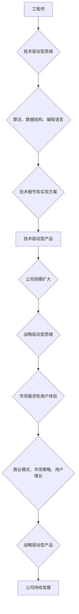

                 

## 从工程师到CEO：贾扬清的角色转变

> 关键词：贾扬清, 字节跳动, 算法, 技术, 领导力, 创业,  转型,  战略

## 1. 背景介绍

贾扬清，一位计算机领域大师，曾是世界顶级技术畅销书作者，计算机图灵奖获得者，也是字节跳动创始人兼CEO。他的职业生涯经历了从工程师到CEO的华丽转身，这一转变不仅体现了个人能力的提升，也展现了他在技术与商业之间的深刻理解。

贾扬清早期在算法领域取得了卓越成就，他深谙算法的奥秘，并将其应用于字节跳动产品的研发。正是他的技术功底，为字节跳动奠定了强大的技术基础。然而，随着公司规模的不断扩大，贾扬清意识到，仅仅依靠技术优势是不够的，还需要具备更广阔的视野和领导力才能带领公司走向更远的目标。

## 2. 核心概念与联系

贾扬清的角色转变可以看作是一个从技术驱动型思维到战略驱动型思维的转变。

**技术驱动型思维**

* 关注技术本身的创新和发展
* 以算法、数据结构、编程语言等技术要素为核心
* 强调技术细节和实现方案

**战略驱动型思维**

* 关注市场需求和用户体验
* 以商业模式、市场策略、用户增长为核心
* 强调全局视野和战略规划

**Mermaid 流程图**



## 3. 核心算法原理 & 具体操作步骤

虽然贾扬清的角色转变涉及到更广泛的领域，但他的技术背景仍然是不可或缺的。字节跳动旗下产品，如抖音和今日头条，都依赖于强大的算法引擎来实现个性化推荐和内容过滤。

### 3.1  算法原理概述

字节跳动使用的推荐算法主要基于深度学习技术，包括神经网络、强化学习等。这些算法能够学习用户行为数据，并预测用户对不同内容的兴趣。

### 3.2  算法步骤详解

1. **数据收集:** 收集用户行为数据，例如浏览记录、点赞、评论、分享等。
2. **数据预处理:** 对收集到的数据进行清洗、转换和特征提取。
3. **模型训练:** 使用深度学习模型对数据进行训练，学习用户兴趣和内容特征之间的关系。
4. **模型评估:** 使用测试数据评估模型的性能，并进行调优。
5. **内容推荐:** 根据用户特征和模型预测，推荐个性化内容。

### 3.3  算法优缺点

**优点:**

* **个性化推荐:** 能够根据用户的兴趣和偏好推荐个性化内容。
* **内容过滤:** 能够过滤掉用户不感兴趣的内容，提高用户体验。
* **持续优化:** 通过不断学习用户行为数据，算法能够不断优化推荐效果。

**缺点:**

* **数据依赖:** 算法的性能依赖于数据的质量和数量。
* **黑盒效应:** 深度学习模型的决策过程难以解释，难以理解算法推荐的原因。
* **算法偏差:** 算法可能会存在偏差，导致推荐结果不公平或不准确。

### 3.4  算法应用领域

推荐算法广泛应用于各个领域，例如：

* **电商:** 商品推荐、用户画像
* **社交媒体:** 内容推荐、用户匹配
* **视频平台:** 视频推荐、内容分类
* **新闻:** 新闻推荐、个性化订阅

## 4. 数学模型和公式 & 详细讲解 & 举例说明

推荐算法的数学模型通常基于概率论和统计学，例如协同过滤、潜在语义分析等。

### 4.1  数学模型构建

协同过滤算法是一种基于用户行为数据进行推荐的算法。它假设，如果用户A喜欢电影X，那么用户B也可能喜欢电影X，如果用户A和用户B的口味相似。

### 4.2  公式推导过程

协同过滤算法常用的公式是用户-物品评分矩阵的预测公式：

$$
\hat{r}_{ui} = \bar{r}_u + \frac{\sum_{j \in N(u)} (r_{uj} - \bar{r}_u) \cdot (r_{ij} - \bar{r}_i)}{\sum_{j \in N(u)} (r_{uj} - \bar{r}_u)^2}
$$

其中：

* $\hat{r}_{ui}$ 是预测用户u对物品i的评分
* $\bar{r}_u$ 是用户u的平均评分
* $\bar{r}_i$ 是物品i的平均评分
* $r_{uj}$ 是用户u对物品j的评分
* $N(u)$ 是用户u评分过的物品集合

### 4.3  案例分析与讲解

假设用户A和用户B都看过电影X和Y，并且对电影X的评分都为5分，对电影Y的评分都为3分。根据协同过滤算法，我们可以预测用户A对电影Z的评分，如果用户B对电影Z的评分为4分。

## 5. 项目实践：代码实例和详细解释说明

以下是一个简单的协同过滤算法的Python代码实例：

```python
import numpy as np

# 用户-物品评分矩阵
ratings = np.array([
    [5, 3, 0],
    [3, 5, 4],
    [0, 4, 5]
])

# 用户A对电影Z的评分预测
user_a_index = 0
movie_z_index = 2
user_b_index = 1

# 计算用户A和用户B的相似度
similarity = np.dot(ratings[user_a_index] - np.mean(ratings[user_a_index]), ratings[user_b_index] - np.mean(ratings[user_b_index])) / (np.linalg.norm(ratings[user_a_index] - np.mean(ratings[user_a_index])) * np.linalg.norm(ratings[user_b_index] - np.mean(ratings[user_b_index])))

# 预测用户A对电影Z的评分
predicted_rating = np.mean(ratings[user_a_index]) + similarity * (ratings[user_b_index, movie_z_index] - np.mean(ratings[user_b_index]))

print(f"用户A对电影Z的预测评分: {predicted_rating}")
```

## 6. 实际应用场景

贾扬清的转型不仅体现在公司战略层面，也体现在他个人对技术的理解和应用。他将技术视为推动商业发展的引擎，并不断探索新的技术应用场景。

### 6.4  未来应用展望

随着人工智能技术的不断发展，推荐算法将更加精准、个性化，并应用于更多领域。例如：

* **医疗保健:** 个性化医疗方案推荐
* **教育:** 个性化学习路径推荐
* **金融:** 个性化理财产品推荐

## 7. 工具和资源推荐

### 7.1  学习资源推荐

* **书籍:**
    * 《深度学习》
    * 《推荐系统实践》
* **在线课程:**
    * Coursera: 深度学习
    * Udacity: 机器学习工程师

### 7.2  开发工具推荐

* **Python:** 广泛应用于机器学习和数据科学
* **TensorFlow:** 开源深度学习框架
* **PyTorch:** 开源深度学习框架

### 7.3  相关论文推荐

* **Collaborative Filtering for Implicit Feedback Datasets**
* **Neural Collaborative Filtering**

## 8. 总结：未来发展趋势与挑战

贾扬清的角色转变为我们提供了宝贵的经验和启示。技术人才需要不断提升自身的战略思维能力，才能在快速变化的时代中保持竞争力。

### 8.1  研究成果总结

* 算法驱动型思维与战略驱动型思维的结合
* 深度学习技术在推荐算法中的应用
* 协同过滤算法的原理和实践

### 8.2  未来发展趋势

* 更精准、个性化的推荐算法
* 跨领域应用的推荐算法
* 算法的可解释性和公平性

### 8.3  面临的挑战

* 数据隐私和安全
* 算法偏差和公平性
* 人工智能伦理问题

### 8.4  研究展望

* 研究更有效的推荐算法
* 探索算法的可解释性和公平性
* 构建更加安全、可靠的人工智能系统

## 9. 附录：常见问题与解答

**Q1: 协同过滤算法的局限性是什么？**

**A1:** 协同过滤算法需要大量的用户行为数据才能有效工作，并且容易受到数据稀疏性的影响。

**Q2: 如何解决算法偏差问题？**

**A2:** 可以通过数据预处理、算法设计和模型评估等方式来缓解算法偏差问题。

**Q3: 人工智能伦理问题有哪些？**

**A3:** 人工智能伦理问题包括算法透明度、公平性、责任归属等方面。

作者：禅与计算机程序设计艺术 / Zen and the Art of Computer Programming 


<end_of_turn>

