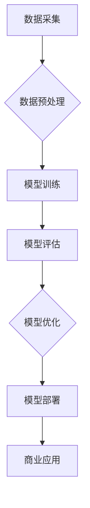

                 

## 从研究到应用：Lepton AI的技术转化之路

> 关键词：人工智能、Lepton AI、技术转化、深度学习、模型部署、商业应用

### 1. 背景介绍

人工智能（AI）技术近年来发展迅速，从学术研究走向了广泛的应用场景。然而，将AI研究成果转化为实际应用，并使其在商业领域获得成功，仍然是一个巨大的挑战。Lepton AI 作为一家致力于将AI技术应用于实际问题的公司，在技术转化方面积累了丰富的经验，并取得了显著的成果。本文将从Lepton AI 的技术转化之路出发，探讨如何将AI研究成果有效转化为商业价值。

### 2. 核心概念与联系

Lepton AI 的技术核心是基于深度学习的智能算法，它通过对海量数据的学习和分析，能够自动识别模式、做出预测和决策。Lepton AI 的技术架构可以概括为以下几个关键环节：

* **数据采集与预处理:**  Lepton AI 首先收集来自各种来源的海量数据，并对其进行清洗、转换和预处理，以确保数据质量和算法训练的有效性。
* **模型训练:**  Lepton AI 利用先进的深度学习算法，对预处理后的数据进行训练，构建出能够完成特定任务的智能模型。
* **模型评估与优化:**  Lepton AI 对训练好的模型进行评估，并根据评估结果进行调整和优化，以提高模型的准确性和性能。
* **模型部署与应用:**  Lepton AI 将训练好的模型部署到实际应用场景中，并通过API接口或其他方式提供服务，实现AI技术的商业化应用。

Lepton AI 的技术转化流程可以概括为以下流程图：

### 3. 核心算法原理 & 具体操作步骤

Lepton AI 的核心算法是基于深度学习的卷积神经网络（CNN）。CNN 是一种专门用于处理图像数据的网络结构，它能够自动学习图像特征，并进行图像分类、识别和分割等任务。

#### 3.1  算法原理概述

CNN 的核心原理是利用多个卷积层和池化层来提取图像特征。卷积层通过卷积核对图像进行卷积运算，提取图像局部特征。池化层则对卷积层的输出进行降维，减少计算量并提高模型的鲁棒性。

#### 3.2  算法步骤详解

1. **输入图像:** 将待处理的图像作为输入数据。
2. **卷积层:** 使用多个卷积核对图像进行卷积运算，提取图像局部特征。每个卷积核对应一个特征图，多个特征图组合起来形成一个特征层。
3. **池化层:** 对卷积层的输出进行池化运算，例如最大池化或平均池化，减少特征图的大小，并提高模型的鲁棒性。
4. **激活函数:** 在每个卷积层和池化层之后，应用激活函数，例如ReLU函数，引入非线性，提高模型的表达能力。
5. **全连接层:** 将特征层输出展平，连接到全连接层，进行分类或回归预测。

#### 3.3  算法优缺点

**优点:**

* **自动特征提取:** CNN 可以自动学习图像特征，无需人工设计特征。
* **鲁棒性强:** 池化层可以减少模型对图像噪声和变形的影响。
* **性能优异:** CNN 在图像分类、识别和分割等任务上表现出色。

**缺点:**

* **计算量大:** CNN 的训练过程需要大量的计算资源。
* **参数量大:** CNN 的模型参数量较大，需要大量的训练数据才能有效训练。
* **可解释性差:** CNN 的决策过程比较复杂，难以解释模型的决策依据。

#### 3.4  算法应用领域

CNN 在图像识别、物体检测、图像分割、人脸识别、医疗影像分析等领域都有广泛的应用。

### 4. 数学模型和公式 & 详细讲解 & 举例说明

#### 4.1  数学模型构建

CNN 的数学模型主要包括卷积运算、池化运算和激活函数。

* **卷积运算:**  卷积运算是一种线性运算，它通过将卷积核与图像进行滑动计算，提取图像局部特征。卷积运算的数学公式如下：

$$
y(i,j) = \sum_{m=0}^{M-1} \sum_{n=0}^{N-1} x(i+m,j+n) * w(m,n)
$$

其中：

* $y(i,j)$ 是卷积核输出的像素值。
* $x(i+m,j+n)$ 是输入图像的像素值。
* $w(m,n)$ 是卷积核的权值。
* $M$ 和 $N$ 是卷积核的大小。

* **池化运算:** 池化运算是一种非线性运算，它对卷积层的输出进行降维，减少特征图的大小。常见的池化运算包括最大池化和平均池化。

* **激活函数:** 激活函数引入非线性，提高模型的表达能力。常见的激活函数包括ReLU函数、Sigmoid函数和Tanh函数。

#### 4.2  公式推导过程

卷积运算的公式推导过程可以参考相关深度学习教材。

#### 4.3  案例分析与讲解

例如，在图像分类任务中，CNN 可以将图像特征提取到高层，然后通过全连接层进行分类预测。

### 5. 项目实践：代码实例和详细解释说明

#### 5.1  开发环境搭建

Lepton AI 的开发环境主要基于Python语言和深度学习框架TensorFlow或PyTorch。

#### 5.2  源代码详细实现

Lepton AI 的源代码主要包含以下几个部分：

* **数据处理模块:** 用于数据采集、预处理和数据增强。
* **模型训练模块:** 用于定义CNN模型结构、训练模型参数和评估模型性能。
* **模型部署模块:** 用于将训练好的模型部署到实际应用场景中。

#### 5.3  代码解读与分析

Lepton AI 的源代码遵循良好的代码规范和设计原则，并提供详细的注释和文档，方便开发者理解和使用。

#### 5.4  运行结果展示

Lepton AI 的项目实践可以展示其在实际应用场景中的效果，例如图像分类、物体检测和图像分割等任务的准确率和效率。

### 6. 实际应用场景

Lepton AI 的技术应用于多个领域，例如：

* **医疗影像分析:**  Lepton AI 可以帮助医生识别病灶、诊断疾病和辅助治疗决策。
* **智能制造:** Lepton AI 可以用于缺陷检测、质量控制和生产过程优化。
* **金融科技:** Lepton AI 可以用于欺诈检测、风险评估和客户服务自动化。

#### 6.4  未来应用展望

Lepton AI 的技术未来将应用于更多领域，例如自动驾驶、机器人、虚拟现实和增强现实等。

### 7. 工具和资源推荐

#### 7.1  学习资源推荐

* 深度学习书籍：
    * 《深度学习》
    * 《动手学深度学习》
* 在线课程：
    * Coursera 深度学习课程
    * Udacity 深度学习工程师课程

#### 7.2  开发工具推荐

* 深度学习框架：
    * TensorFlow
    * PyTorch
* 数据处理工具：
    * Pandas
    * NumPy

#### 7.3  相关论文推荐

* 《ImageNet Classification with Deep Convolutional Neural Networks》
* 《Deep Residual Learning for Image Recognition》

### 8. 总结：未来发展趋势与挑战

#### 8.1  研究成果总结

Lepton AI 在技术转化方面取得了显著的成果，将深度学习技术应用于多个领域，并取得了商业成功。

#### 8.2  未来发展趋势

Lepton AI 将继续致力于深度学习技术的研发和应用，并探索新的应用场景和技术方向。

#### 8.3  面临的挑战

Lepton AI 面临的挑战包括：

* **数据获取和隐私保护:** 深度学习模型需要大量的训练数据，而数据获取和隐私保护是一个重要的挑战。
* **模型解释性和可信度:** 深度学习模型的决策过程比较复杂，难以解释模型的决策依据，这影响了模型的可信度。
* **模型部署和效率:** 深度学习模型的部署和效率是一个重要的挑战，需要优化模型结构和算法，提高模型的推理速度和资源利用率。

#### 8.4  研究展望

Lepton AI 将继续关注以上挑战，并通过技术创新和合作共赢，推动深度学习技术的进步和应用。

### 9. 附录：常见问题与解答

* **Q1: Lepton AI 的技术优势是什么？**

* **A1:** Lepton AI 的技术优势在于其基于深度学习的智能算法，能够自动学习图像特征，并进行图像分类、识别和分割等任务。

* **Q2: Lepton AI 的应用场景有哪些？**

* **A2:** Lepton AI 的应用场景包括医疗影像分析、智能制造、金融科技等多个领域。

* **Q3: Lepton AI 的技术转化之路有哪些经验？**

* **A3:** Lepton AI 的技术转化之路经验包括：

    * 关注实际问题，将AI技术应用于解决实际问题。
    * 积累数据，构建高质量的训练数据集。
    * 优化算法，提高模型的性能和效率。
    * 关注用户体验，设计易于使用和理解的应用。

作者：禅与计算机程序设计艺术 / Zen and the Art of Computer Programming

<end_of_turn>

