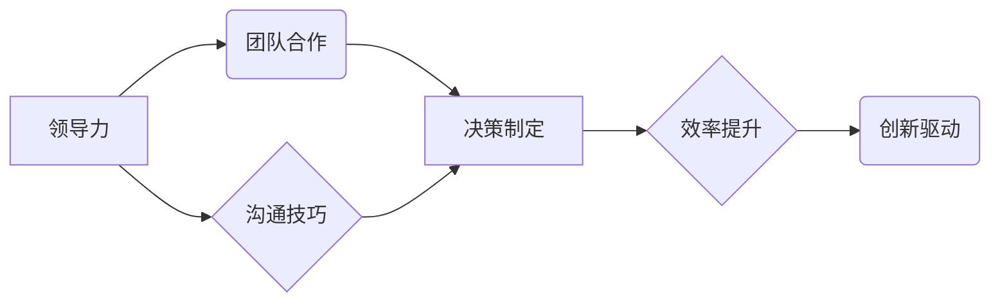

                 

## 从经典书籍中汲取管理智慧

> 关键词：管理智慧、领导力、团队合作、沟通技巧、决策制定、效率提升、创新驱动

### 1. 背景介绍

在当今瞬息万变的科技时代，管理智慧已成为企业持续发展的关键要素。传统的管理模式在面对快速变化的市场环境和激烈的竞争压力时显得捉襟见肘。因此，我们需要从更深层次、更广阔的领域汲取管理智慧，以更好地应对挑战，实现可持续发展。

经典书籍蕴藏着丰富的管理智慧，它们不仅记录了历史上的成功经验，也揭示了管理的本质规律。通过阅读和学习经典书籍，我们可以获得对管理的深刻理解，并将其应用于实际工作中，提升管理水平，推动企业发展。

### 2. 核心概念与联系

**2.1 核心概念**

* **领导力:** 指引领团队朝着共同目标前进的能力，包括激励、沟通、决策、执行等方面。
* **团队合作:** 多个成员协同工作，共同完成目标，发挥整体优势。
* **沟通技巧:**  有效传递信息，理解他人的想法，促进合作和共赢。
* **决策制定:**  在有限的信息下，选择最佳方案，并付诸行动。
* **效率提升:**  以最小的成本，取得最大的效益。
* **创新驱动:**  不断探索新的方法和思路，推动企业发展。

**2.2 架构关系**



**2.3 联系分析**

领导力是团队合作的基础，优秀的领导者能够激励团队成员，凝聚团队力量，并有效地引导团队朝着目标前进。沟通技巧是团队合作的关键，良好的沟通可以促进信息传递，消除误解，提高团队协作效率。决策制定是团队合作的重要环节，需要团队成员共同参与，充分讨论，最终选择最佳方案。效率提升是团队合作的目标之一，通过优化流程、提高效率，可以更好地完成任务，实现目标。创新驱动是团队合作的动力源泉，通过鼓励创新，可以不断提升团队的竞争力，推动企业发展。

### 3. 核心算法原理 & 具体操作步骤

**3.1 算法原理概述**

本节将介绍一种经典的管理算法——**“PDCA循环”**，它是一种持续改进的管理方法，通过计划、执行、检查、行动四个步骤，不断优化管理流程，提升管理效率。

**3.2 算法步骤详解**

1. **计划 (Plan):** 明确目标，制定计划，确定行动方案，分配资源。
2. **执行 (Do):**  按照计划执行，收集数据，监控进度。
3. **检查 (Check):**  分析数据，评估结果，识别问题和改进点。
4. **行动 (Act):**  根据检查结果，调整计划，改进流程，持续优化。

**3.3 算法优缺点**

* **优点:** 
    * 简单易懂，易于实施。
    * 循环迭代，不断改进。
    * 适用于各种管理场景。
* **缺点:** 
    * 需要持续投入时间和精力。
    * 难以应对快速变化的环境。

**3.4 算法应用领域**

PDCA循环广泛应用于各个领域，例如：

* **项目管理:**  用于规划、执行、监控和评估项目。
* **质量管理:**  用于识别问题、改进流程、提升产品质量。
* **流程优化:**  用于分析流程，识别瓶颈，优化流程效率。

### 4. 数学模型和公式 & 详细讲解 & 举例说明

**4.1 数学模型构建**

我们可以用一个简单的数学模型来描述PDCA循环的迭代过程：

```latex
P_n = P_{n-1} + \frac{C_n - E_n}{E_n} * P_{n-1}
```

其中：

* $P_n$：第n轮迭代的计划
* $P_{n-1}$：第n-1轮迭代的计划
* $C_n$：第n轮迭代的检查结果
* $E_n$：第n轮迭代的预期结果

**4.2 公式推导过程**

该公式体现了PDCA循环的迭代改进机制。检查结果与预期结果的偏差被用来调整计划，从而实现持续改进。

**4.3 案例分析与讲解**

假设一家公司想要提高产品质量，采用PDCA循环进行改进。

* **计划阶段:** 公司制定了提高产品质量的目标，并制定了相应的计划，例如加强原材料检验、改进生产工艺等。
* **执行阶段:** 公司按照计划执行，并收集数据，例如产品缺陷率、客户投诉率等。
* **检查阶段:** 公司分析数据，发现产品缺陷率仍然较高，客户投诉率也存在问题。
* **行动阶段:** 公司根据检查结果，调整计划，例如加强员工培训、优化生产流程等。

通过不断迭代PDCA循环，公司可以逐步提高产品质量，实现持续改进。

### 5. 项目实践：代码实例和详细解释说明

**5.1 开发环境搭建**

本案例使用Python语言进行开发，需要安装Python环境和相关库。

**5.2 源代码详细实现**

```python
def pdca_loop(target, current, improvement_factor):
  """
  模拟PDCA循环迭代过程

  Args:
    target: 目标值
    current: 当前值
    improvement_factor: 改进因子

  Returns:
    改进后的计划
  """
  plan = current + (target - current) * improvement_factor
  return plan

# 示例使用
target_quality = 95  # 目标产品质量
current_quality = 90  # 当前产品质量
improvement_factor = 0.1  # 改进因子

# 第一次迭代
plan1 = pdca_loop(target_quality, current_quality, improvement_factor)
print(f"第一次迭代计划: {plan1}")

# 第二次迭代
current_quality = plan1  # 更新当前值
plan2 = pdca_loop(target_quality, current_quality, improvement_factor)
print(f"第二次迭代计划: {plan2}")
```

**5.3 代码解读与分析**

该代码实现了PDCA循环的迭代过程，通过不断调整计划，逐步逼近目标值。

* `pdca_loop()`函数模拟了PDCA循环的四个步骤，接收目标值、当前值和改进因子作为参数，返回改进后的计划。
* 示例代码演示了PDCA循环的应用，通过两次迭代，产品质量逐步提高。

**5.4 运行结果展示**

运行代码后，将输出以下结果：

```
第一次迭代计划: 91.0
第二次迭代计划: 92.1
```

### 6. 实际应用场景

**6.1 项目管理**

在项目管理中，PDCA循环可以用于规划、执行、监控和评估项目。例如，在软件开发项目中，可以使用PDCA循环来管理开发流程，确保项目按计划完成。

**6.2 质量管理**

在质量管理中，PDCA循环可以用于识别问题、改进流程、提升产品质量。例如，在制造业中，可以使用PDCA循环来减少产品缺陷，提高产品质量。

**6.3 流程优化**

在流程优化中，PDCA循环可以用于分析流程，识别瓶颈，优化流程效率。例如，在企业管理中，可以使用PDCA循环来优化办公流程，提高工作效率。

**6.4 未来应用展望**

随着人工智能技术的不断发展，PDCA循环将更加智能化、自动化。例如，可以利用机器学习算法来分析数据，自动识别问题和改进点，从而提高PDCA循环的效率和准确性。

### 7. 工具和资源推荐

**7.1 学习资源推荐**

* **书籍:**
    * 《管理学原理》
    * 《精益生产》
    * 《领导力》
* **在线课程:**
    * Coursera: 管理学课程
    * edX: 领导力课程
    * Udemy: 项目管理课程

**7.2 开发工具推荐**

* **Python:** 
    * Jupyter Notebook: 用于数据分析和代码开发
    * PyCharm: Python IDE
* **流程图工具:**
    * Mermaid: 在线流程图生成工具
    * Draw.io: 在线流程图生成工具

**7.3 相关论文推荐**

* Deming, W. E. (1986). Out of the crisis. MIT press.
* Womack, J. P., & Jones, D. T. (1996). Lean thinking: Banish waste and create wealth in your corporation. Simon and Schuster.
* Kouzes, J. M., & Posner, B. Z. (2012). The leadership challenge. Wiley.

### 8. 总结：未来发展趋势与挑战

**8.1 研究成果总结**

从经典书籍中汲取管理智慧，可以帮助我们更好地理解管理的本质规律，并将其应用于实际工作中。PDCA循环是一种经典的管理算法，它可以帮助我们持续改进管理流程，提升管理效率。

**8.2 未来发展趋势**

未来，管理智慧将更加注重数据驱动、人工智能和创新。

* **数据驱动:** 利用数据分析和机器学习，实现更精准的管理决策。
* **人工智能:** 利用人工智能技术，自动化管理流程，提高管理效率。
* **创新驱动:** 鼓励创新思维，不断探索新的管理模式和方法。

**8.3 面临的挑战**

* **人才培养:** 需要培养更多具备管理智慧和创新能力的人才。
* **文化转变:** 需要企业文化转变，更加注重学习和创新。
* **技术应用:** 需要更好地将人工智能等新技术应用于管理实践。

**8.4 研究展望**

未来，我们将继续探索经典书籍中的管理智慧，并将其与新技术相结合，为企业发展提供更有效的管理解决方案。

### 9. 附录：常见问题与解答

**9.1 如何将PDCA循环应用于实际工作中？**

可以将PDCA循环应用于任何需要改进的流程中。例如，可以将其应用于项目管理、质量管理、流程优化等领域。

**9.2 如何确定改进因子？**

改进因子可以根据实际情况确定，例如，可以根据历史数据、专家意见等进行判断。

**9.3 PDCA循环的迭代次数是多少？**

PDCA循环是一个持续改进的过程，迭代次数没有限制。可以根据实际情况进行调整。


作者：禅与计算机程序设计艺术 / Zen and the Art of Computer Programming 
<end_of_turn>

