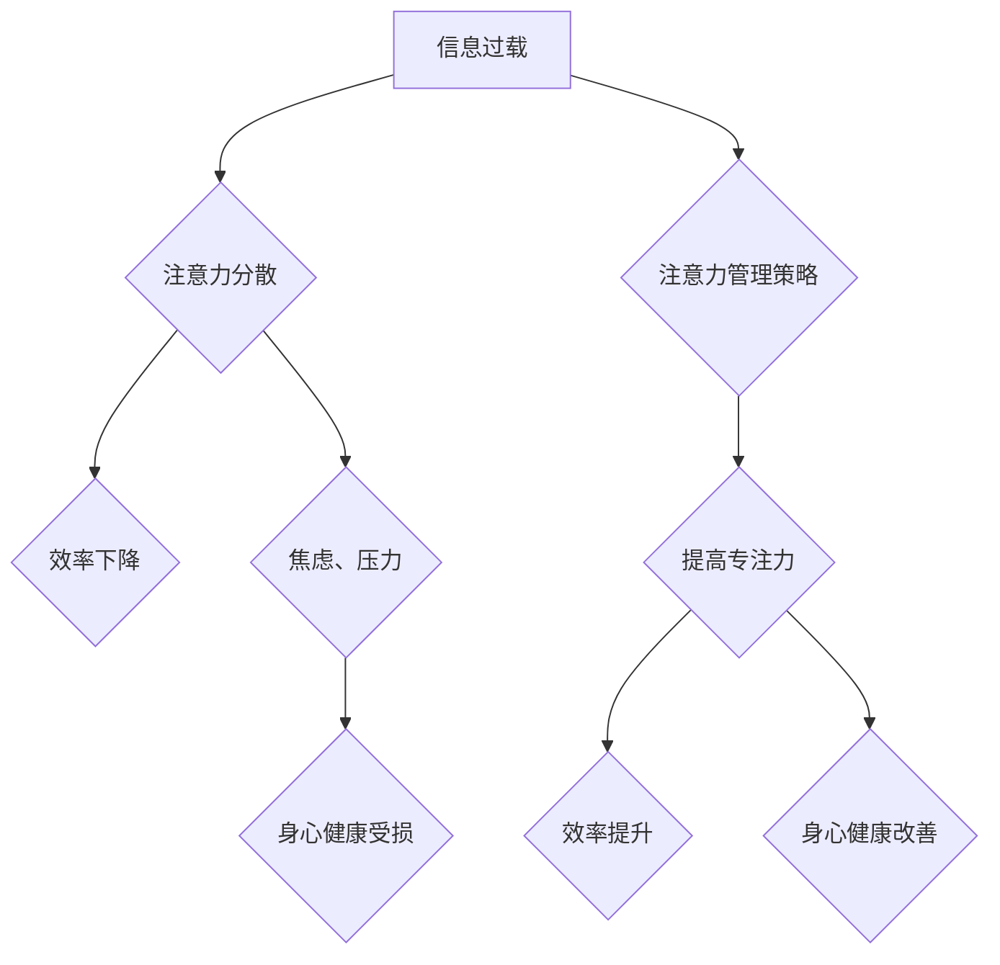

                 

## 信息时代的注意力管理策略：如何在干扰的世界中保持专注

> 关键词：注意力管理、专注力、干扰、信息过载、认知科学、深度工作、时间管理、效率提升

### 1. 背景介绍

在当今信息爆炸的时代，我们被来自各个方向的信息和干扰所包围。手机、社交媒体、电子邮件、新闻推送等，无时无刻不在争夺我们的注意力。这种信息过载和持续的干扰，严重损害了我们的专注力，影响了工作效率和生活质量。

根据一项研究，人类的平均注意力持续时间仅为 8 秒，而金鱼的注意力持续时间为 9 秒。这意味着，我们比金鱼的注意力更短，而且在信息时代，我们的注意力持续时间还在不断缩短。

这种注意力碎片化现象，不仅影响了我们的工作效率，也导致了焦虑、压力、睡眠障碍等问题。因此，学习如何有效地管理注意力，如何在干扰的世界中保持专注，成为了当今社会面临的重大挑战。

### 2. 核心概念与联系

**2.1 认知科学视角**

从认知科学的角度来看，注意力是一种有限的资源，它可以被分配到不同的任务或刺激上。当我们面对多个任务或刺激时，我们的注意力会自动地分配到最紧急或最相关的任务或刺激上。

**2.2 干扰与注意力**

干扰是指任何能够分散我们注意力的因素，包括外部干扰（如噪音、手机铃声）和内部干扰（如焦虑、思绪飘忽）。

**2.3 深度工作与专注力**

深度工作是指专注于一项任务，排除所有干扰，全身心投入，直到完成任务。深度工作是提高效率、创造力和解决复杂问题的关键。

**2.4 注意力管理策略**

注意力管理策略是指一系列方法和技巧，旨在帮助我们控制和引导注意力，提高专注力，减少干扰。

**Mermaid 流程图**



### 3. 核心算法原理 & 具体操作步骤

**3.1 算法原理概述**

注意力管理算法的核心原理是基于认知科学和心理学的研究，旨在通过识别和分析干扰因素，并提供相应的策略和工具，帮助用户提高专注力。

**3.2 算法步骤详解**

1. **识别干扰因素:** 首先，需要识别哪些因素会分散用户的注意力。这可以通过用户行为数据、环境监测和自我评估等方式进行。
2. **分析干扰模式:** 分析干扰因素的类型、频率、强度和时间分布，了解干扰的规律和特点。
3. **制定个性化策略:** 根据用户的干扰模式和需求，制定个性化的注意力管理策略，包括时间管理、环境控制、认知训练等。
4. **提供工具支持:** 开发相应的工具和应用程序，帮助用户执行注意力管理策略，例如番茄工作法计时器、专注模式、噪音屏蔽等。
5. **持续评估和优化:** 定期评估注意力管理策略的有效性，根据用户的反馈和数据调整策略，不断优化注意力管理效果。

**3.3 算法优缺点**

**优点:**

* **个性化定制:** 算法可以根据用户的具体情况制定个性化的策略，提高策略的针对性和有效性。
* **数据驱动:** 算法基于用户行为数据和环境监测数据，能够更准确地识别干扰因素和分析干扰模式。
* **持续优化:** 算法可以持续评估和优化策略，不断提高注意力管理效果。

**缺点:**

* **数据隐私:** 算法需要收集用户的行为数据和环境数据，可能会引发数据隐私方面的担忧。
* **算法复杂度:** 算法的开发和维护需要一定的技术难度。
* **用户接受度:** 一些用户可能对算法的个性化推荐和数据收集感到不适。

**3.4 算法应用领域**

注意力管理算法可以应用于以下领域:

* **教育:** 帮助学生提高学习效率和专注力。
* **工作:** 帮助员工提高工作效率和专注力，减少工作压力。
* **健康:** 帮助用户缓解焦虑、压力和睡眠障碍等问题。
* **娱乐:** 帮助用户更好地沉浸在游戏、电影等娱乐体验中。

### 4. 数学模型和公式 & 详细讲解 & 举例说明

**4.1 数学模型构建**

注意力可以被视为一个有限的资源，其分配可以被数学模型表示。一个简单的模型可以将注意力视为一个正态分布，其峰值代表着当前关注的任务或刺激，而分布的宽度代表着注意力范围。

**4.2 公式推导过程**

注意力分配模型可以利用以下公式进行描述:

$$A(t) = \frac{1}{\sigma \sqrt{2\pi}} * e^{-\frac{(t - \mu)^2}{2\sigma^2}}$$

其中:

* $A(t)$ 代表着在时间 $t$ 时刻的注意力水平。
* $\mu$ 代表着注意力峰值的时间点。
* $\sigma$ 代表着注意力分布的宽度。

**4.3 案例分析与讲解**

假设一个用户正在阅读一篇文章，文章的标题吸引了他的注意力，此时 $\mu$ 对应着文章标题出现的时间点，$\sigma$ 较小，表示注意力集中在标题上。随着用户阅读文章，注意力会逐渐扩展到文章内容，$\mu$ 会逐渐向文章内容出现的时间点移动，$\sigma$ 会逐渐增大，表示注意力范围扩大。

### 5. 项目实践：代码实例和详细解释说明

**5.1 开发环境搭建**

* 操作系统: Windows/macOS/Linux
* 编程语言: Python
* 开发工具: VS Code/PyCharm

**5.2 源代码详细实现**

```python
import time

class Timer:
    def __init__(self, duration):
        self.duration = duration
        self.start_time = None

    def start(self):
        self.start_time = time.time()

    def is_finished(self):
        if self.start_time is None:
            return False
        return time.time() - self.start_time >= self.duration

    def reset(self):
        self.start_time = None

# 使用示例
timer = Timer(duration=25 * 60)  # 设置番茄工作法时间为25分钟
timer.start()

while not timer.is_finished():
    # 进行深度工作
    print("专注工作中...")
    time.sleep(1)

print("休息时间到!")
```

**5.3 代码解读与分析**

该代码实现了一个简单的番茄工作法计时器。

* `Timer` 类负责管理计时器。
* `__init__` 方法初始化计时器，设置工作时间。
* `start` 方法记录开始时间。
* `is_finished` 方法判断计时器是否结束。
* `reset` 方法重置计时器。

**5.4 运行结果展示**

运行该代码后，程序会持续打印 "专注工作中..." 的信息，直到计时器结束。计时器结束时，程序会打印 "休息时间到!" 的信息。

### 6. 实际应用场景

**6.1 工作场景**

* **深度工作:** 使用番茄工作法计时器，专注于一项任务，排除所有干扰，提高工作效率。
* **会议管理:** 设置会议时间限制，避免会议拖延，提高会议效率。
* **项目管理:** 使用任务管理工具，规划工作任务，分配时间，提高项目进度。

**6.2 学习场景**

* **专注学习:** 使用番茄工作法计时器，专注于学习内容，提高学习效率。
* **知识管理:** 使用笔记软件，记录学习内容，整理知识，提高知识复习效率。
* **在线学习:** 使用在线学习平台，选择合适的学习课程，提高学习效果。

**6.3 生活场景**

* **阅读:** 使用阅读计时器，设定阅读时间，提高阅读专注力。
* **运动:** 使用运动计时器，设定运动时间，提高运动效率。
* **睡眠:** 使用睡眠监测器，记录睡眠时间，改善睡眠质量。

**6.4 未来应用展望**

随着人工智能技术的不断发展，注意力管理策略将更加智能化、个性化和自动化。未来，我们可以期待以下应用场景:

* **智能干扰屏蔽:** 基于用户行为数据和环境监测数据，智能识别和屏蔽干扰因素。
* **个性化注意力训练:** 基于用户的认知能力和注意力模式，提供个性化的注意力训练方案。
* **沉浸式体验:** 利用虚拟现实和增强现实技术，创造沉浸式的学习、工作和娱乐体验，提高注意力和专注力。

### 7. 工具和资源推荐

**7.1 学习资源推荐**

* **书籍:**
    * 《深度工作》
    * 《专注力》
    * 《信息时代》
* **网站:**
    * **Zen Habits:** https://zenhabits.net/
    * **Mind Tools:** https://www.mindtools.com/
    * **The Muse:** https://www.themuse.com/

**7.2 开发工具推荐**

* **番茄工作法计时器:**
    * **Forest:** https://www.forestapp.cc/
    * **Focus To-Do:** https://www.focus-to-do.com/
* **任务管理工具:**
    * **Todoist:** https://todoist.com/
    * **Asana:** https://asana.com/
    * **Trello:** https://trello.com/

**7.3 相关论文推荐**

* **The Impact of Information Overload on Cognitive Performance:** https://www.researchgate.net/publication/263187218_The_Impact_of_Information_Overload_on_Cognitive_Performance
* **Attention and Cognitive Control:** https://www.ncbi.nlm.nih.gov/pmc/articles/PMC3698107/

### 8. 总结：未来发展趋势与挑战

**8.1 研究成果总结**

注意力管理策略的研究取得了显著进展，已经形成了较为完善的理论体系和实践方法。

**8.2 未来发展趋势**

未来，注意力管理策略将更加智能化、个性化和自动化，并与其他技术领域融合发展，例如人工智能、虚拟现实和增强现实技术。

**8.3 面临的挑战**

注意力管理策略面临着以下挑战:

* **数据隐私:** 算法需要收集用户的行为数据和环境数据，可能会引发数据隐私方面的担忧。
* **算法伦理:** 算法的开发和应用需要遵循伦理原则，避免造成负面影响。
* **用户接受度:** 一些用户可能对算法的个性化推荐和数据收集感到不适。

**8.4 研究展望**

未来，需要进一步研究注意力管理策略的有效性、安全性、伦理性和可持续性，并探索新的注意力管理方法和技术，帮助人们更好地应对信息时代带来的挑战，提高生活和工作质量。

### 9. 附录：常见问题与解答

**9.1 如何提高注意力集中度？**

* **设定明确的目标:** 明确自己想要专注于什么，并设定具体的目标。
* **消除干扰:** 找到一个安静的环境，关闭手机和社交媒体通知。
* **使用番茄工作法:** 将工作时间分成25分钟的间隔，并在每个间隔结束后休息5分钟。
* **进行认知训练:** 通过冥想、瑜伽等练习，提高注意力和专注力。

**9.2 如何应对信息过载？**

* **筛选信息:** 只关注重要的信息，过滤掉无关的信息。
* **设定时间限制:** 限制每天接触信息的时长。
* **使用信息管理工具:** 使用笔记软件、阅读管理工具等，整理和管理信息。
* **培养断网习惯:** 定期断开网络连接，休息和放松。


作者：禅与计算机程序设计艺术 / Zen and the Art of Computer Programming 
<end_of_turn>

