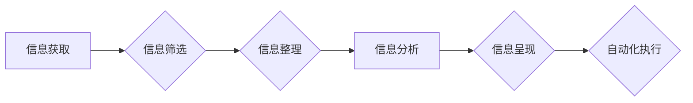

                 

## 信息简化的工具和自动化技术：利用技术简化你的生活和工作

> 关键词：信息简化、自动化技术、人工智能、流程自动化、机器学习、数据分析、效率提升、生活工作

### 1. 背景介绍

在当今信息爆炸的时代，我们每天都被海量的信息淹没。从新闻推送到邮件通知，从社交媒体动态到工作报告，信息无处不在，却往往难以有效地处理和利用。这不仅导致了信息过载，还严重影响了我们的工作效率和生活质量。

为了应对这一挑战，信息简化和自动化技术应运而生。它们利用人工智能、机器学习等先进技术，帮助我们自动筛选、整理、分析和处理信息，从而解放我们的时间和精力，让我们能够更专注于创造和思考。

### 2. 核心概念与联系

**2.1 信息简化**

信息简化是指通过去除冗余信息、提取关键信息和进行信息重组，使信息更加简洁、易懂和易于理解的过程。它旨在帮助我们快速获取所需信息，并做出更明智的决策。

**2.2 自动化技术**

自动化技术是指利用计算机程序和算法，自动执行重复性任务或复杂流程的过程。它可以帮助我们提高工作效率、降低成本和减少人为错误。

**2.3 核心概念联系**

信息简化和自动化技术相互补充，共同构成了一个强大的信息处理体系。

* 信息简化为自动化技术提供高质量的输入数据，使其能够更准确地执行任务。
* 自动化技术则可以帮助我们实现信息简化的目标，例如自动分类、自动摘要和自动翻译等。

**Mermaid 流程图**



### 3. 核心算法原理 & 具体操作步骤

**3.1 算法原理概述**

信息简化和自动化技术通常基于以下核心算法：

* **自然语言处理 (NLP)**：用于理解和处理人类语言，例如文本分类、情感分析和机器翻译。
* **机器学习 (ML)**：用于从数据中学习模式和规律，例如推荐系统、欺诈检测和图像识别。
* **深度学习 (DL)**：一种更高级的机器学习方法，能够处理更复杂的数据，例如语音识别、图像生成和自然语言生成。

**3.2 算法步骤详解**

**信息简化算法步骤：**

1. **信息采集**: 从各种来源收集所需信息，例如文本文件、网页、数据库等。
2. **数据预处理**: 对收集到的信息进行清洗、格式化和转换，使其能够被算法理解。
3. **特征提取**: 从信息中提取关键特征，例如关键词、主题、情感等。
4. **信息聚合**: 将提取到的特征进行聚合和分析，生成简化的信息表示。
5. **信息呈现**: 将简化的信息以可读的方式呈现给用户，例如摘要、图表、列表等。

**自动化技术算法步骤：**

1. **流程识别**: 分析需要自动化的业务流程，识别关键步骤和决策点。
2. **规则定义**: 根据流程识别结果，定义自动化规则，例如条件判断、数据转换和系统调用等。
3. **流程自动化**: 利用自动化工具和平台，将定义的规则转化为可执行的程序代码。
4. **流程监控**: 对自动化流程进行监控和管理，及时发现和解决问题。

**3.3 算法优缺点**

**信息简化算法：**

* **优点**: 可以有效减少信息冗余，提高信息获取效率。
* **缺点**: 算法的准确性和有效性取决于训练数据和算法模型的质量。

**自动化技术算法：**

* **优点**: 可以提高工作效率，降低成本，减少人为错误。
* **缺点**: 需要投入一定的开发和维护成本，并且可能无法处理所有类型的任务。

**3.4 算法应用领域**

* **信息简化算法**: 新闻聚合、邮件分类、文档摘要、知识图谱构建等。
* **自动化技术算法**: 工业自动化、流程审批、客户服务机器人、数据分析等。

### 4. 数学模型和公式 & 详细讲解 & 举例说明

**4.1 数学模型构建**

信息简化和自动化技术中常用的数学模型包括：

* **概率模型**: 用于描述信息之间的关系和概率分布，例如贝叶斯网络和隐马尔可夫模型。
* **统计模型**: 用于分析数据中的统计特征和模式，例如线性回归和逻辑回归。
* **图论模型**: 用于表示信息之间的连接和关系，例如知识图谱和社交网络。

**4.2 公式推导过程**

例如，在文本分类任务中，可以使用朴素贝叶斯算法进行分类。朴素贝叶斯算法基于贝叶斯定理，计算每个类别下文本出现的概率，并选择概率最高的类别作为分类结果。

**贝叶斯定理**:

$$P(A|B) = \frac{P(B|A)P(A)}{P(B)}$$

其中：

* $P(A|B)$ 是在已知事件 B 发生的情况下，事件 A 发生的概率。
* $P(B|A)$ 是在已知事件 A 发生的情况下，事件 B 发生的概率。
* $P(A)$ 是事件 A 发生的概率。
* $P(B)$ 是事件 B 发生的概率。

**4.3 案例分析与讲解**

假设我们有一个文本分类任务，需要将邮件分类为“工作”和“个人”两类。我们可以使用朴素贝叶斯算法进行分类。

首先，我们需要收集训练数据，例如已分类的邮件。然后，我们可以使用这些数据来计算每个类别下单词出现的概率。例如，在“工作”邮件中，“会议”这个单词出现的概率可能比较高，而在“个人”邮件中，“假期”这个单词出现的概率可能比较高。

当我们收到一封新的邮件时，我们可以计算它属于“工作”和“个人”两类的概率。然后，选择概率最高的类别作为分类结果。

### 5. 项目实践：代码实例和详细解释说明

**5.1 开发环境搭建**

为了实现信息简化和自动化技术，我们可以使用以下开发环境：

* **操作系统**: Linux, macOS, Windows
* **编程语言**: Python, Java, C++
* **开发工具**: IDE, Git, Docker

**5.2 源代码详细实现**

以下是一个简单的 Python 代码示例，演示如何使用自然语言处理库 NLTK 对文本进行分词和词频统计：

```python
import nltk

# 下载 NLTK 数据包
nltk.download('punkt')

# 文本内容
text = "This is a sample text for information simplification."

# 分词
tokens = nltk.word_tokenize(text)

# 词频统计
word_frequencies = nltk.FreqDist(tokens)

# 打印词频统计结果
print(word_frequencies)
```

**5.3 代码解读与分析**

* `nltk.download('punkt')`: 下载 NLTK 的分词数据包。
* `nltk.word_tokenize(text)`: 使用 NLTK 的分词器将文本分割成单词。
* `nltk.FreqDist(tokens)`: 计算每个单词出现的频率。
* `print(word_frequencies)`: 打印词频统计结果。

**5.4 运行结果展示**

运行上述代码后，会输出每个单词出现的频率，例如：

```
FreqDist({'This': 1, 'is': 1, 'a': 1, 'sample': 1, 'text': 1, 'for': 1, 'information': 1, 'simplification.': 1})
```

### 6. 实际应用场景

**6.1 生活场景**

* **智能邮件分类**: 自动将邮件分类为“工作”、“个人”、“促销”等类别，提高邮件管理效率。
* **智能新闻摘要**: 自动生成新闻文章的摘要，帮助我们快速了解新闻内容。
* **智能日程安排**: 自动分析日程安排，提醒重要会议和约会，提高时间管理效率。

**6.2 工作场景**

* **自动化流程**: 自动化重复性任务，例如数据录入、报表生成和文件处理，提高工作效率。
* **智能客服**: 利用聊天机器人自动回答客户常见问题，提高客户服务效率。
* **数据分析**: 利用机器学习算法分析数据，发现隐藏的模式和趋势，帮助我们做出更明智的决策。

**6.3 未来应用展望**

随着人工智能和自动化技术的不断发展，信息简化和自动化技术将在更多领域得到应用，例如：

* **个性化学习**: 根据学生的学习进度和需求，自动生成个性化的学习内容和计划。
* **医疗诊断**: 利用机器学习算法分析患者的病历和检查结果，辅助医生进行诊断。
* **智能家居**: 利用传感器和人工智能算法，自动控制家居设备，提高生活舒适度。

### 7. 工具和资源推荐

**7.1 学习资源推荐**

* **在线课程**: Coursera, edX, Udacity
* **书籍**: 《深度学习》、《机器学习实战》、《自然语言处理入门》
* **博客**: Towards Data Science, Machine Learning Mastery

**7.2 开发工具推荐**

* **Python**: Jupyter Notebook, PyCharm
* **Java**: Eclipse, IntelliJ IDEA
* **C++**: Visual Studio, Code::Blocks

**7.3 相关论文推荐**

* **Transformer**: Attention Is All You Need
* **BERT**: BERT: Pre-training of Deep Bidirectional Transformers for Language Understanding
* **GPT-3**: Language Models are Few-Shot Learners

### 8. 总结：未来发展趋势与挑战

**8.1 研究成果总结**

信息简化和自动化技术取得了显著的进展，例如：

* 自然语言处理技术在文本分类、机器翻译和情感分析等方面取得了突破。
* 机器学习算法在图像识别、语音识别和推荐系统等领域取得了成功。
* 深度学习模型在自然语言生成、图像生成和游戏人工智能等领域展现出强大的潜力。

**8.2 未来发展趋势**

* **更智能的自动化**: 利用人工智能技术，实现更智能、更灵活的自动化流程。
* **更个性化的信息简化**: 根据用户的需求和偏好，提供更个性化的信息简化服务。
* **更广泛的应用场景**: 信息简化和自动化技术将应用于更多领域，例如教育、医疗、金融等。

**8.3 面临的挑战**

* **数据隐私和安全**: 信息简化和自动化技术需要处理大量个人数据，因此数据隐私和安全问题需要得到重视。
* **算法偏见**: 机器学习算法可能会受到训练数据的影响，导致算法偏见问题。
* **伦理问题**: 信息简化和自动化技术可能会对人类社会产生深远的影响，因此需要认真考虑其伦理问题。

**8.4 研究展望**

未来，我们需要继续研究和探索信息简化和自动化技术，使其更加智能、更加安全、更加公平，并最终实现对人类社会的有益贡献。

### 9. 附录：常见问题与解答

**9.1 如何选择合适的自动化工具？**

选择自动化工具需要根据具体的需求和场景进行评估。一些常见的自动化工具包括：

* **UiPath**: 适用于桌面自动化任务。
* **Automation Anywhere**: 适用于企业级自动化任务。
* **Zapier**: 适用于连接不同应用程序的自动化任务。

**9.2 如何解决算法偏见问题？**

解决算法偏见问题需要从多个方面入手，例如：

* 使用更加多样化的训练数据。
* 开发更加公平的算法模型。
* 对算法模型进行定期评估和监控。

**9.3 如何保护数据隐私和安全？**

保护数据隐私和安全需要采取以下措施：

* 采用加密技术保护数据传输和存储。
* 严格控制数据访问权限。
* 定期进行安全审计和漏洞扫描。


作者：禅与计算机程序设计艺术 / Zen and the Art of Computer Programming 
<end_of_turn>

