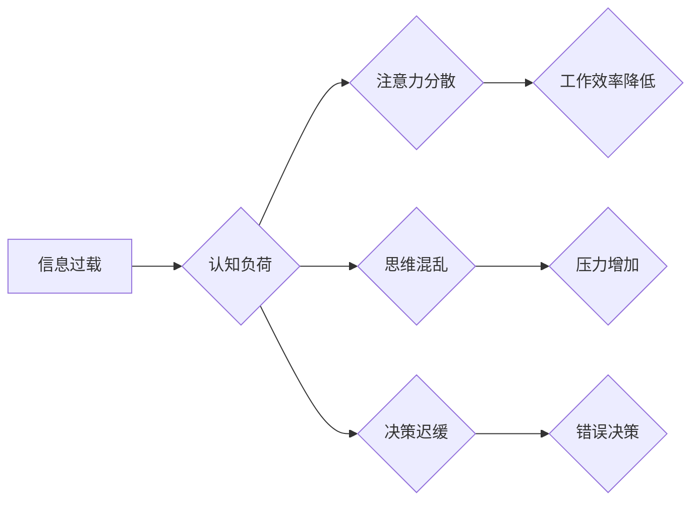

                 

## 信息过载与认知负荷管理：提高决策和问题解决能力的策略

> 关键词：信息过载、认知负荷、决策、问题解决、效率、注意力、专注力、时间管理、数字工具

### 1. 背景介绍

在当今信息爆炸的时代，我们每天都被海量的信息包围。从新闻推送到社交媒体通知，从电子邮件到工作文档，信息源源不断地涌入我们的视野。这种信息过载现象已经成为现代社会普遍面临的挑战，它不仅影响着我们的生活质量，也严重阻碍了我们的决策和问题解决能力。

认知负荷是指个体在处理信息时所经历的心理压力。当信息量超过个体处理能力时，就会产生认知负荷，导致注意力分散、思维混乱、决策迟缓等问题。信息过载是导致认知负荷过高的主要原因之一。

信息过载和认知负荷的负面影响体现在多个方面：

* **降低工作效率:**  信息过载会导致注意力分散，难以集中精力完成任务，从而降低工作效率。
* **增加压力和焦虑:**  处理过多的信息会让人感到压力和焦虑，影响心理健康。
* **阻碍决策能力:**  信息过载会使人难以从海量信息中筛选出关键信息，从而影响决策的准确性和效率。
* **损害创造力:**  信息过载会抑制创造力，让人难以进行深入思考和创新。

### 2. 核心概念与联系

信息过载和认知负荷是相互关联的两个概念。信息过载是指信息量过大，超过个体处理能力的现象，而认知负荷则是指个体在处理信息时所经历的心理压力。

**Mermaid 流程图:**



**核心概念原理和架构:**

信息过载会增加个体的认知负荷，导致注意力分散、思维混乱、决策迟缓等问题。这些问题会进一步影响个体的效率、心理健康和创造力。

### 3. 核心算法原理 & 具体操作步骤

为了应对信息过载和认知负荷的挑战，我们可以采用一些算法和策略来提高决策和问题解决能力。

#### 3.1  算法原理概述

**信息筛选算法:**

信息筛选算法的核心是根据预设的规则和优先级，从海量信息中筛选出重要信息，过滤掉无关信息。

**认知负荷管理算法:**

认知负荷管理算法旨在通过调整工作方式、休息策略和环境因素，降低个体的认知负荷，提高注意力和专注力。

#### 3.2  算法步骤详解

**信息筛选算法步骤:**

1. **定义信息类型和优先级:**  根据个体的需求和目标，明确哪些信息类型是重要的，哪些信息类型可以忽略。
2. **设置信息过滤规则:**  根据定义的信息类型和优先级，设置相应的过滤规则，例如，只接收来自特定发送者的邮件，只关注特定主题的新闻推送等。
3. **使用信息管理工具:**  利用邮件客户端、RSS阅读器、笔记软件等工具，帮助实现信息筛选和管理。

**认知负荷管理算法步骤:**

1. **识别认知负荷的征兆:**  注意观察自己的注意力、专注力、情绪和身体状态，识别认知负荷的征兆，例如，注意力难以集中、头痛、疲劳等。
2. **调整工作方式:**  采用番茄工作法、时间阻塞法等工作方式，将工作时间分成多个短时间段，并安排适当的休息时间。
3. **优化工作环境:**  保持工作环境安静、整洁、舒适，减少干扰和噪音。
4. **进行放松和冥想练习:**  通过深呼吸、冥想等方式，放松身心，缓解压力和焦虑。

#### 3.3  算法优缺点

**信息筛选算法:**

* **优点:**  可以有效减少信息量，提高信息获取效率。
* **缺点:**  可能会漏掉一些重要信息，需要不断调整过滤规则。

**认知负荷管理算法:**

* **优点:**  可以有效降低认知负荷，提高注意力和专注力。
* **缺点:**  需要坚持练习，才能达到最佳效果。

#### 3.4  算法应用领域

信息筛选算法和认知负荷管理算法广泛应用于各个领域，例如：

* **个人生活:**  帮助个人管理邮件、社交媒体、新闻等信息，提高生活效率。
* **企业工作:**  帮助企业员工筛选重要信息，提高工作效率和决策能力。
* **教育领域:**  帮助学生集中注意力，提高学习效率。
* **医疗领域:**  帮助医生快速筛选患者信息，提高诊断效率。

### 4. 数学模型和公式 & 详细讲解 & 举例说明

#### 4.1  数学模型构建

我们可以用以下数学模型来描述信息过载和认知负荷的关系：

$$
C = f(I, P)
$$

其中：

* $C$ 表示认知负荷
* $I$ 表示信息量
* $P$ 表示个体的处理能力

这个模型表明，认知负荷与信息量和个体的处理能力成正比关系。当信息量超过个体的处理能力时，认知负荷就会增加。

#### 4.2  公式推导过程

我们可以进一步推导公式，得到更具体的认知负荷计算方法：

$$
C = \frac{I}{P} \times 100\%
$$

其中：

* $C$ 表示认知负荷百分比

这个公式表明，认知负荷百分比等于信息量除以处理能力，再乘以100%。

#### 4.3  案例分析与讲解

假设一个人每天需要处理100条信息，而他的处理能力为50条信息/小时。

根据公式，他的认知负荷百分比为：

$$
C = \frac{100}{50} \times 100\% = 200\%
$$

这个结果表明，他的认知负荷已经超过了100%，说明他处于信息过载状态，需要采取措施来降低认知负荷。

### 5. 项目实践：代码实例和详细解释说明

#### 5.1  开发环境搭建

为了演示信息筛选算法的实现，我们可以使用Python语言和一些常用的库，例如：

* **requests:** 用于获取网络数据
* **BeautifulSoup4:** 用于解析网页内容
* **pandas:** 用于数据处理和分析

#### 5.2  源代码详细实现

```python
import requests
from bs4 import BeautifulSoup
import pandas as pd

def get_news_data(url):
  response = requests.get(url)
  soup = BeautifulSoup(response.content, 'html.parser')
  # 使用BeautifulSoup解析网页内容，提取新闻标题和链接
  # ...
  return news_data

def filter_news(news_data, keywords):
  filtered_news = []
  for item in news_data:
    if any(keyword in item['title'] for keyword in keywords):
      filtered_news.append(item)
  return filtered_news

# 设置新闻网站URL和关键词
url = 'https://news.example.com/'
keywords = ['人工智能', '机器学习']

# 获取新闻数据
news_data = get_news_data(url)

# 过滤新闻
filtered_news = filter_news(news_data, keywords)

# 打印过滤后的新闻
print(filtered_news)
```

#### 5.3  代码解读与分析

这段代码实现了信息筛选算法的基本功能。

1. `get_news_data()`函数用于获取新闻网站的数据。
2. `filter_news()`函数根据预设的关键词，从新闻数据中筛选出相关信息。
3. 最后，代码打印过滤后的新闻列表。

#### 5.4  运行结果展示

运行这段代码后，会输出包含指定关键词的新闻列表。

### 6. 实际应用场景

信息筛选算法和认知负荷管理算法在现实生活中有着广泛的应用场景：

#### 6.1  个人信息管理

* 使用邮件客户端的过滤器，只接收来自特定发送者的邮件。
* 使用RSS阅读器，订阅感兴趣的主题，过滤掉无关的新闻推送。
* 使用笔记软件，将信息分类整理，方便查找和回顾。

#### 6.2  企业工作效率提升

* 使用项目管理工具，分配任务、跟踪进度，提高团队协作效率。
* 使用知识库，存储和共享公司内部知识，减少重复工作。
* 使用数据分析工具，分析工作数据，发现问题并改进流程。

#### 6.3  教育领域学习效率

* 使用学习管理软件，规划学习计划，跟踪学习进度。
* 使用在线学习平台，选择适合自己的学习内容，提高学习效率。
* 使用番茄工作法，集中注意力学习，避免信息干扰。

#### 6.4  未来应用展望

随着人工智能技术的不断发展，信息筛选算法和认知负荷管理算法将会更加智能化和个性化。未来，我们可以期待：

* 更精准的信息筛选，能够根据个体的兴趣和需求，自动过滤掉无关信息。
* 更有效的认知负荷管理，能够根据个体的状态和疲劳程度，自动调整工作方式和休息时间。
* 更智能的学习和工作助手，能够帮助我们更好地管理信息，提高效率和创造力。

### 7. 工具和资源推荐

#### 7.1  学习资源推荐

* **书籍:**
    * 《信息焦虑症》
    * 《深度工作》
    * 《专注力》
* **在线课程:**
    * Coursera: 信息管理和认知科学课程
    * edX: 人工智能和机器学习课程

#### 7.2  开发工具推荐

* **Python:** 
    * requests
    * BeautifulSoup4
    * pandas
* **Java:** 
    * Apache Spark
    * Hadoop
* **Node.js:** 
    * Express.js
    * MongoDB

#### 7.3  相关论文推荐

* **Information Overload and Cognitive Load: A Review**
* **The Impact of Information Overload on Decision Making**
* **Cognitive Load Theory and its Application to Educational Design**

### 8. 总结：未来发展趋势与挑战

#### 8.1  研究成果总结

信息过载和认知负荷是现代社会面临的重要挑战。通过信息筛选算法和认知负荷管理算法，我们可以有效地应对这些挑战，提高决策和问题解决能力。

#### 8.2  未来发展趋势

未来，信息筛选算法和认知负荷管理算法将会更加智能化和个性化。人工智能技术将进一步推动这些算法的发展，帮助我们更好地管理信息，提高效率和创造力。

#### 8.3  面临的挑战

信息过载和认知负荷的挑战仍然存在，未来还面临着一些挑战：

* **信息爆炸:**  信息量还在不断增长，需要开发更强大的信息筛选算法。
* **个性化需求:**  每个人的信息需求和认知负荷水平不同，需要开发更个性化的管理策略。
* **伦理问题:**  信息筛选算法可能会带来一些伦理问题，例如，信息茧房效应和数据隐私问题。

#### 8.4  研究展望

未来，我们需要继续研究信息筛选算法和认知负荷管理算法，开发更智能、更有效、更安全的解决方案。同时，还需要关注这些算法带来的伦理问题，确保其能够更好地服务于人类社会。

### 9. 附录：常见问题与解答

**Q1: 如何降低认知负荷？**

A1: 

* **专注于当下:**  避免分心，集中注意力于当前的任务。
* **休息和放松:**  定期休息，进行深呼吸、冥想等放松活动。
* **优化工作环境:**  保持工作环境安静、整洁、舒适。
* **合理安排时间:**  使用番茄工作法、时间阻塞法等工作方式，合理安排工作和休息时间。

**Q2: 如何选择合适的工具来管理信息？**

A2:  

* **明确需求:**  首先要明确自己的信息管理需求，例如，需要管理哪些类型的文件，需要哪些功能。
* **了解不同工具的特点:**  不同的工具有不同的特点和功能，需要根据自己的需求选择合适的工具。
* **试用不同工具:**  可以试用不同的工具，体验其使用感受，选择最适合自己的工具。


作者：禅与计算机程序设计艺术 / Zen and the Art of Computer Programming 
<end_of_turn>

