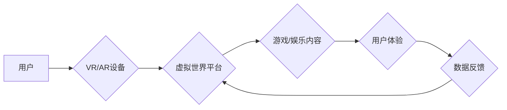

                 

## 元宇宙娱乐：沉浸式体验的极致追求

> 关键词：元宇宙、沉浸式体验、虚拟现实、增强现实、区块链、游戏开发、数字孪生

### 1. 背景介绍

元宇宙概念近年来备受关注，它被描绘成一个由虚拟世界、增强现实和区块链技术融合而成的全新数字空间。在这个空间里，人们可以以虚拟身份参与各种活动，体验与现实世界截然不同的生活方式。其中，元宇宙娱乐作为元宇宙应用的重要组成部分，凭借其沉浸式体验和无限可能，正在成为未来娱乐业的趋势。

传统娱乐模式，如电影、游戏和音乐会，虽然丰富多彩，但都局限于物理空间和时间。元宇宙娱乐则打破了这些限制，为用户提供更加自由、互动和个性化的体验。想象一下，你可以身临其境地参加一场虚拟音乐会，与偶像面对面互动；或者在虚拟世界中与朋友一起探索未知的星球，体验刺激的冒险旅程。

### 2. 核心概念与联系

元宇宙娱乐的核心概念包括虚拟现实（VR）、增强现实（AR）、区块链技术和数字孪生。

* **虚拟现实（VR）**：通过头戴式设备，将用户置身于完全虚拟的环境中，提供身临其境的沉浸式体验。
* **增强现实（AR）**：通过手机或眼镜等设备，将虚拟元素叠加到现实世界中，增强现实世界的感知和互动。
* **区块链技术**：为元宇宙娱乐提供安全、透明和可信赖的平台，保障用户资产和数据安全。
* **数字孪生**：将现实世界中的物体或场景数字化，构建虚拟模型，实现虚拟与现实的同步和交互。

这些核心概念相互关联，共同构成了元宇宙娱乐的完整生态系统。

**元宇宙娱乐架构流程图**



### 3. 核心算法原理 & 具体操作步骤

元宇宙娱乐的实现离不开各种算法的支持，例如：

* **3D建模和渲染算法**：用于构建虚拟世界中的场景和物体，实现逼真的视觉效果。
* **物理模拟算法**：用于模拟物体运动和物理交互，使虚拟世界更加真实可信。
* **人工智能算法**：用于创建虚拟角色，实现智能对话和行为，增强用户体验。

#### 3.1  算法原理概述

3D建模和渲染算法的核心是将三维模型转化为二维图像，并将其显示在屏幕上。常用的算法包括：

* **光栅化渲染**：将三维模型分解成像素，并根据光线照射和材质属性计算每个像素的颜色。
* **射线追踪渲染**：模拟光线在虚拟世界中的传播路径，计算每个像素接收到的光线强度，从而实现更逼真的阴影和反射效果。

物理模拟算法则模拟物体之间的相互作用，例如碰撞、摩擦和重力。常用的算法包括：

* **有限元法**：将物体分割成多个小的单元，并模拟每个单元的变形和运动，从而实现物体整体的物理行为。
* **粒子系统**：将物体分解成多个粒子，并模拟每个粒子的运动和相互作用，从而实现复杂物理效果，例如烟雾、火焰和水流。

#### 3.2  算法步骤详解

以光栅化渲染算法为例，其具体步骤如下：

1. **模型建模**: 使用3D建模软件创建三维模型。
2. **模型转换**: 将模型从世界坐标系转换为屏幕坐标系。
3. **裁剪**: 将模型中的部分剔除，只保留在屏幕可见区域内的部分。
4. **投影**: 将三维模型投影到二维平面上，形成图像。
5. **光栅化**: 将投影后的图像分解成像素，并根据光线照射和材质属性计算每个像素的颜色。
6. **显示**: 将计算出的像素颜色显示在屏幕上。

#### 3.3  算法优缺点

光栅化渲染算法简单易实现，计算效率高，但难以模拟复杂的阴影和反射效果。射线追踪渲染算法则可以实现更逼真的视觉效果，但计算量大，效率较低。

#### 3.4  算法应用领域

3D建模和渲染算法广泛应用于游戏、电影、动画、建筑设计等领域。物理模拟算法则应用于游戏、动画、机器人控制等领域。

### 4. 数学模型和公式 & 详细讲解 & 举例说明

元宇宙娱乐的实现离不开数学模型和公式的支持。例如，在3D建模和渲染中，常用的数学模型包括：

* **向量**：用于表示物体的位置、方向和速度。
* **矩阵**：用于表示物体之间的变换关系，例如旋转、缩放和平移。
* **光线**：用于表示光线在虚拟世界中的传播路径。

#### 4.1  数学模型构建

在构建数学模型时，需要考虑虚拟世界的物理特性和用户体验。例如，在模拟物体运动时，需要考虑重力、摩擦力和碰撞等因素。

#### 4.2  公式推导过程

例如，计算物体在重力作用下的运动轨迹，可以使用牛顿第二定律：

$$F = ma$$

其中，F是物体受到的力，m是物体的质量，a是物体的加速度。

#### 4.3  案例分析与讲解

例如，在模拟一个球体在虚拟世界中滚动的运动轨迹时，可以使用上述公式，并结合物理模拟算法，计算球体在不同时间点的速度和位置。

### 5. 项目实践：代码实例和详细解释说明

以下是一个简单的元宇宙娱乐项目示例，使用Unity游戏引擎开发一个虚拟球场场景。

#### 5.1  开发环境搭建

1. 下载并安装Unity游戏引擎。
2. 安装必要的插件，例如VR插件和AR插件。

#### 5.2  源代码详细实现

```csharp
// 球体脚本
public class Ball : MonoBehaviour
{
    public float speed = 5f;

    void Update()
    {
        // 沿Y轴方向向上移动
        transform.Translate(Vector3.up * speed * Time.deltaTime);
    }
}
```

#### 5.3  代码解读与分析

这段代码定义了一个名为Ball的脚本，该脚本控制球体的运动。

* `speed`变量定义了球体的移动速度。
* `Update()`函数在每帧更新时执行，用于更新球体的运动状态。
* `transform.Translate()`函数用于移动物体，`Vector3.up`表示向上方向，`speed * Time.deltaTime`计算了每帧移动的距离。

#### 5.4  运行结果展示

运行该代码后，球体将在虚拟球场中向上移动。

### 6. 实际应用场景

元宇宙娱乐的应用场景非常广泛，例如：

* **虚拟音乐会**：用户可以身临其境地参加虚拟音乐会，与偶像互动，体验沉浸式的音乐表演。
* **虚拟游戏**：用户可以参与更加真实、互动和沉浸式的虚拟游戏，体验全新的游戏乐趣。
* **虚拟体育赛事**：用户可以观看虚拟体育赛事，体验身临其境的比赛氛围。
* **虚拟旅游**：用户可以虚拟游览世界各地，体验不同的文化和风景。

#### 6.4  未来应用展望

随着元宇宙技术的不断发展，元宇宙娱乐的应用场景将会更加丰富，例如：

* **虚拟社交**：用户可以在虚拟世界中与朋友们互动，参加虚拟聚会，体验更加真实的社交体验。
* **虚拟教育**：用户可以在虚拟世界中学习各种知识，体验更加生动的学习方式。
* **虚拟培训**：用户可以在虚拟世界中进行模拟训练，例如飞行模拟、手术模拟等，提高技能水平。

### 7. 工具和资源推荐

#### 7.1  学习资源推荐

* **Unity官方文档**: https://docs.unity3d.com/
* **Unreal Engine官方文档**: https://docs.unrealengine.com/
* **Metaverse Standards Forum**: https://www.metaversetf.org/

#### 7.2  开发工具推荐

* **Unity**: https://unity.com/
* **Unreal Engine**: https://www.unrealengine.com/
* **Blender**: https://www.blender.org/

#### 7.3  相关论文推荐

* **The Metaverse: A Conceptual Framework**
* **Towards a Framework for Understanding the Metaverse**
* **The Metaverse: Opportunities and Challenges for Business**

### 8. 总结：未来发展趋势与挑战

元宇宙娱乐作为未来娱乐业的重要趋势，具有无限的潜力。随着技术的不断发展，元宇宙娱乐将会更加沉浸、互动和个性化，为用户带来全新的娱乐体验。

#### 8.1  研究成果总结

元宇宙娱乐的研究成果主要集中在以下几个方面：

* **虚拟现实和增强现实技术**：VR和AR技术的不断进步，使得元宇宙娱乐更加逼真和沉浸。
* **人工智能技术**：人工智能技术可以用于创建虚拟角色，实现智能对话和行为，增强用户体验。
* **区块链技术**：区块链技术可以为元宇宙娱乐提供安全、透明和可信赖的平台。

#### 8.2  未来发展趋势

未来元宇宙娱乐的发展趋势包括：

* **更加沉浸式的体验**：VR和AR技术的进一步发展，将带来更加逼真的虚拟世界体验。
* **更加个性化的内容**：人工智能技术将使元宇宙娱乐更加个性化，用户可以根据自己的喜好定制虚拟世界和游戏内容。
* **更加社交化的体验**：元宇宙娱乐将更加注重社交互动，用户可以与朋友们一起在虚拟世界中玩耍、聊天和社交。

#### 8.3  面临的挑战

元宇宙娱乐的发展也面临着一些挑战，例如：

* **技术壁垒**：元宇宙娱乐的技术门槛较高，需要强大的硬件和软件支持。
* **内容匮乏**：元宇宙娱乐的内容目前还比较匮乏，需要更多优质的开发者和内容创作者。
* **用户体验**：元宇宙娱乐的用户体验还需要进一步提升，例如降低眩晕感、提高交互流畅度等。

#### 8.4  研究展望

未来，我们需要继续研究元宇宙娱乐的各个方面，例如：

* **更先进的虚拟现实和增强现实技术**
* **更智能的人工智能算法**
* **更安全的区块链平台**
* **更丰富的元宇宙娱乐内容**
* **更完善的用户体验设计**

只有不断突破技术瓶颈，丰富内容生态，提升用户体验，元宇宙娱乐才能真正实现其无限潜力，成为未来娱乐业的主流趋势。

### 9. 附录：常见问题与解答

* **什么是元宇宙？**

元宇宙是一个由虚拟世界、增强现实和区块链技术融合而成的全新数字空间。

* **元宇宙娱乐有哪些应用场景？**

元宇宙娱乐的应用场景非常广泛，例如虚拟音乐会、虚拟游戏、虚拟体育赛事、虚拟旅游等。

* **元宇宙娱乐的技术难点有哪些？**

元宇宙娱乐的技术难点包括：

* **虚拟现实和增强现实技术的进步**
* **人工智能技术的应用**
* **区块链技术的安全性**
* **用户体验的提升**

* **元宇宙娱乐的未来发展趋势是什么？**

元宇宙娱乐的未来发展趋势包括：

* **更加沉浸式的体验**
* **更加个性化的内容**
* **更加社交化的体验**


作者：禅与计算机程序设计艺术 / Zen and the Art of Computer Programming 
<end_of_turn>

