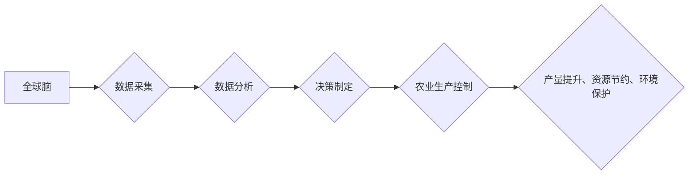

                 

## 全球脑与智慧农业:精准化、智能化的粮食生产

> 关键词：全球脑、智慧农业、人工智能、机器学习、数据分析、精准农业、可持续发展、粮食安全

## 1. 背景介绍

全球人口持续增长，粮食需求不断攀升，而气候变化、资源短缺等因素对农业生产构成严峻挑战。传统农业模式面临着效率低下、资源浪费、环境污染等问题，迫切需要革新。

智慧农业，作为农业现代化发展的重要方向，以信息技术为驱动，通过数据采集、分析和应用，实现农业生产的智能化、精准化和可持续化。其中，全球脑作为一种新型的人工智能架构，具有强大的数据处理能力、学习能力和决策能力，为智慧农业的发展提供了新的机遇。

## 2. 核心概念与联系

### 2.1 全球脑

全球脑是一个由众多分布式计算节点组成的超级智能网络，旨在模拟和超越人类大脑的认知能力。它通过连接海量数据、算法和计算资源，实现对复杂问题的理解、分析和解决。

### 2.2 智慧农业

智慧农业是指利用信息技术、传感器网络、数据分析等手段，对农业生产进行智能化管理和控制，提高生产效率、降低资源消耗、增强环境友好性。

### 2.3 核心概念联系

全球脑与智慧农业的结合，将赋予农业生产更强大的智能化能力。

**Mermaid 流程图**



## 3. 核心算法原理 & 具体操作步骤

### 3.1 算法原理概述

智慧农业中，全球脑可以利用多种算法，例如机器学习、深度学习、强化学习等，对农业数据进行分析和预测。

* **机器学习:** 通过训练模型，从历史数据中学习规律，预测未来产量、病虫害发生等。
* **深度学习:** 利用多层神经网络，提取数据中的复杂特征，实现更精准的预测和识别。
* **强化学习:** 通过试错学习，优化农业生产决策，提高资源利用效率。

### 3.2 算法步骤详解

以机器学习为例，其在智慧农业中的应用步骤如下：

1. **数据采集:** 收集农业生产相关数据，例如土壤湿度、气温、光照、病虫害信息等。
2. **数据预处理:** 对采集到的数据进行清洗、转换、归一化等处理，使其适合模型训练。
3. **模型选择:** 根据具体应用场景，选择合适的机器学习模型，例如线性回归、决策树、支持向量机等。
4. **模型训练:** 利用训练数据，训练选择的机器学习模型，使其能够学习数据中的规律。
5. **模型评估:** 利用测试数据，评估模型的预测精度和泛化能力。
6. **模型部署:** 将训练好的模型部署到实际应用场景中，用于预测和决策。

### 3.3 算法优缺点

**优点:**

* 能够从海量数据中提取规律，实现精准预测和决策。
* 能够自动学习和优化，提高生产效率和资源利用率。
* 能够实时监控和控制农业生产，提高生产安全性。

**缺点:**

* 需要大量的数据进行训练，数据质量直接影响模型性能。
* 模型训练和部署需要一定的技术门槛。
* 算法本身存在一定的局限性，难以解决所有农业问题。

### 3.4 算法应用领域

* **精准播种:** 根据土壤条件、气候预报等数据，精准确定播种时间和密度，提高播种效率和产量。
* **精准施肥:** 根据作物生长需求和土壤肥力等数据，精准施肥，减少肥料浪费，保护环境。
* **精准灌溉:** 根据土壤湿度、气温等数据，精准控制灌溉量和时间，提高水资源利用效率。
* **病虫害监测与防治:** 利用图像识别、传感器数据等，实时监测病虫害发生情况，精准施药，减少农药使用。
* **产量预测:** 根据历史数据和实时监测数据，预测未来产量，帮助农民制定生产计划。

## 4. 数学模型和公式 & 详细讲解 & 举例说明

### 4.1 数学模型构建

在智慧农业中，可以使用数学模型来描述农业生产过程中的各种关系，例如作物生长模型、病虫害传播模型、资源利用模型等。

**作物生长模型:**

一个简单的作物生长模型可以描述作物生长量与时间的关系，例如指数模型：

$$
Y(t) = Y_0 * e^{rt}
$$

其中：

* $Y(t)$ 是作物生长量在时间 $t$ 时刻的值。
* $Y_0$ 是初始生长量。
* $r$ 是生长速率。
* $t$ 是时间。

### 4.2 公式推导过程

该模型的推导过程基于以下假设：

* 作物生长速率与当前生长量成正比。
* 生长环境条件保持稳定。

根据这些假设，我们可以得到以下微分方程：

$$
\frac{dY}{dt} = rY
$$

解这个微分方程，得到指数模型的公式。

### 4.3 案例分析与讲解

假设一个作物初始生长量为 100 克，生长速率为 0.1，那么我们可以使用指数模型计算作物在不同时间点的生长量：

* $t = 1$ 周：$Y(1) = 100 * e^{0.1 * 1} = 110.52$ 克
* $t = 2$ 周：$Y(2) = 100 * e^{0.1 * 2} = 122.14$ 克
* $t = 3$ 周：$Y(3) = 100 * e^{0.1 * 3} = 134.99$ 克

我们可以看到，随着时间的推移，作物生长量呈指数增长。

## 5. 项目实践：代码实例和详细解释说明

### 5.1 开发环境搭建

* 操作系统：Linux 或 Windows
* Python 版本：3.6 或以上
* 必要的库：NumPy、Pandas、Scikit-learn 等

### 5.2 源代码详细实现

以下是一个使用 Scikit-learn 库进行作物产量预测的简单代码示例：

```python
import pandas as pd
from sklearn.model_selection import train_test_split
from sklearn.linear_model import LinearRegression
from sklearn.metrics import mean_squared_error

# 加载数据
data = pd.read_csv('crop_data.csv')

# 选择特征和目标变量
features = ['temperature', 'rainfall', 'soil_moisture']
target = 'yield'

# 将数据分割为训练集和测试集
X_train, X_test, y_train, y_test = train_test_split(data[features], data[target], test_size=0.2)

# 创建线性回归模型
model = LinearRegression()

# 训练模型
model.fit(X_train, y_train)

# 对测试集进行预测
y_pred = model.predict(X_test)

# 计算模型精度
mse = mean_squared_error(y_test, y_pred)
print('Mean Squared Error:', mse)
```

### 5.3 代码解读与分析

* 该代码首先加载数据，然后选择特征和目标变量。
* 使用 `train_test_split` 函数将数据分割为训练集和测试集。
* 创建线性回归模型，并使用 `fit` 方法训练模型。
* 使用训练好的模型对测试集进行预测。
* 计算模型精度，例如使用均方误差 (MSE) 作为评价指标。

### 5.4 运行结果展示

运行该代码后，会输出模型的均方误差值，该值越小，模型的预测精度越高。

## 6. 实际应用场景

### 6.1 智慧温室

利用全球脑和传感器网络，实现温室环境的智能控制，例如温度、湿度、光照等，提高作物产量和品质。

### 6.2 精准灌溉

根据土壤湿度、气温等数据，精准控制灌溉量和时间，减少水资源浪费，提高灌溉效率。

### 6.3 病虫害防控

利用图像识别、传感器数据等，实时监测病虫害发生情况，精准施药，减少农药使用，保护环境。

### 6.4 未来应用展望

* **无人化农业:** 利用全球脑和机器人技术，实现农业生产的无人化操作，提高效率和降低成本。
* **个性化农业:** 根据不同作物和土壤条件，定制化农业生产方案，提高产量和品质。
* **可持续农业:** 利用全球脑优化资源利用，减少环境污染，实现可持续农业发展。

## 7. 工具和资源推荐

### 7.1 学习资源推荐

* **书籍:**
    * 《深度学习》
    * 《机器学习实战》
    * 《人工智能：一种现代方法》
* **在线课程:**
    * Coursera
    * edX
    * Udacity

### 7.2 开发工具推荐

* **Python:** 
    * Jupyter Notebook
    * PyCharm
* **机器学习库:**
    * Scikit-learn
    * TensorFlow
    * PyTorch

### 7.3 相关论文推荐

* **全球脑:**
    * "Global Brain: A Framework for Artificial General Intelligence"
* **智慧农业:**
    * "Precision Agriculture: Technologies and Applications"
    * "The Role of Artificial Intelligence in Smart Agriculture"

## 8. 总结：未来发展趋势与挑战

### 8.1 研究成果总结

全球脑与智慧农业的结合，为农业生产带来了新的机遇和挑战。通过数据分析、机器学习等技术，可以实现农业生产的智能化、精准化和可持续化，提高粮食产量和品质，保障粮食安全。

### 8.2 未来发展趋势

* **更强大的计算能力:** 随着计算技术的进步，全球脑的计算能力将进一步增强，能够处理更复杂的数据，实现更精准的预测和决策。
* **更丰富的传感器数据:** 随着传感器技术的进步，农业生产中收集到的数据将更加丰富，能够提供更全面的信息，支持更智能化的决策。
* **更完善的算法模型:** 随着人工智能技术的进步，将开发出更完善的算法模型，能够更好地理解和模拟农业生产过程。

### 8.3 面临的挑战

* **数据质量:** 农业数据的质量参差不齐，需要进行有效的数据清洗和预处理，才能保证模型的准确性。
* **算法解释性:** 一些深度学习算法的决策过程难以解释，需要开发出更可解释的算法模型。
* **技术普及:** 智慧农业技术的普及需要克服技术门槛和成本问题。

### 8.4 研究展望

未来，全球脑与智慧农业的研究将继续深入，探索更智能、更精准、更可持续的农业生产模式，为解决全球粮食安全问题做出贡献。

## 9. 附录：常见问题与解答

* **Q1: 全球脑与云计算有什么区别？**

* **A1:** 全球脑是一种更高级的计算架构，它不仅拥有强大的计算能力，还具备学习和决策能力，而云计算主要提供计算资源和存储服务。

* **Q2: 智慧农业需要哪些技术支持？**

* **A2:** 智慧农业需要多种技术支持，包括物联网、传感器技术、数据分析、人工智能等。

* **Q3: 智慧农业对农民有什么帮助？**

* **A3:** 智慧农业可以帮助农民提高生产效率、降低生产成本、减少环境污染，最终提高农民收入和生活水平。


作者：禅与计算机程序设计艺术 / Zen and the Art of Computer Programming 
<end_of_turn>

