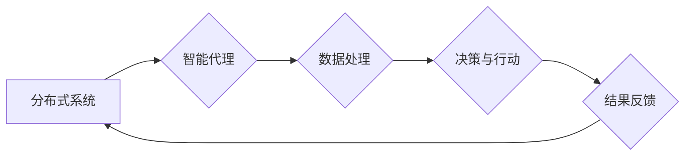

                 

## 分布式认知：探索群体智慧的奥秘

> 关键词：分布式系统、群体智慧、协同计算、机器学习、人工智能、算法设计、数据处理

### 1. 背景介绍

人类文明的进步离不开群体智慧的力量。从古老的部落议事到现代的互联网协作，群体协同始终是推动社会发展的重要驱动力。随着计算机技术和网络技术的飞速发展，分布式计算和人工智能技术也取得了长足进步，为模拟和实现群体智慧提供了新的可能性。

分布式认知，作为一种新兴的计算范式，旨在通过将智能分散到多个个体节点上，并通过协作和信息共享来实现超越单个节点能力的整体智能。它借鉴了生物群体智能的原理，例如蚁群、蜂群和鸟群的集体行为，并将其应用于计算机系统中。

分布式认知的应用领域非常广泛，包括：

* **人工智能：**构建更强大、更灵活的人工智能系统，例如多智能体机器人、协同学习的机器学习算法等。
* **大数据分析：**处理海量数据，发现隐藏的模式和趋势，例如社交网络分析、金融风险预测等。
* **科学计算：**解决复杂科学问题，例如药物研发、气候模拟等。
* **网络安全：**构建更安全的网络防御系统，例如入侵检测、恶意软件识别等。

### 2. 核心概念与联系

**2.1 核心概念**

* **分布式系统：**由多个相互连接的节点组成，每个节点都具有独立的计算能力和存储资源。
* **群体智慧：**指由多个个体通过协作和信息共享而产生的集体智能，其智能水平超越了单个个体的能力。
* **协同计算：**多个节点共同完成一个任务，每个节点负责一部分计算，并通过信息交换来协调工作。
* **智能代理：**具有自主决策和行动能力的软件实体，可以独立执行任务，并与其他代理进行交互。

**2.2 架构图**



**2.3 联系**

分布式认知系统通过将智能分散到多个智能代理中，并通过协同计算和信息共享来实现群体智慧。每个智能代理负责处理一部分数据，并根据自己的知识和经验做出决策。代理们通过信息交换来协调工作，并最终达成一个共同的目标。

### 3. 核心算法原理 & 具体操作步骤

**3.1 算法原理概述**

分布式认知算法的核心思想是通过模拟生物群体智能的原理来实现群体协作。常见的分布式认知算法包括：

* **蚁群算法：**模拟蚂蚁寻找食物的路径优化问题。
* **粒子群算法：**模拟鸟群觅食的行为，通过粒子之间的相互吸引和碰撞来寻找最优解。
* **蜂群算法：**模拟蜜蜂寻找花蜜的行为，通过蜂群的协作和信息共享来找到最佳资源。

这些算法都具有以下特点：

* **并行性：**多个代理可以同时进行计算，提高效率。
* **自适应性：**算法可以根据环境变化自动调整策略。
* **鲁棒性：**即使部分代理失效，系统仍然可以继续运行。

**3.2 算法步骤详解**

以蚁群算法为例，其基本步骤如下：

1. **初始化：**随机生成多个蚂蚁，每个蚂蚁都从起点出发。
2. **路径选择：**每个蚂蚁根据当前位置和已探索过的路径选择下一个节点，选择概率与节点的“吸引力”成正比。
3. **信息更新：**蚂蚁在路径上留下信息素，信息素浓度越高，路径越吸引其他蚂蚁。
4. **迭代：**重复步骤2和3，直到找到最优路径。

**3.3 算法优缺点**

**优点：**

* 能够解决复杂优化问题。
* 并行性强，效率高。
* 自适应性强，能够适应环境变化。

**缺点：**

* 算法参数设置对结果影响较大。
* 算法收敛速度可能较慢。

**3.4 算法应用领域**

* **路径规划：**例如无人驾驶汽车的路径规划、物流配送路线优化等。
* **资源分配：**例如网络资源分配、任务调度等。
* **机器学习：**例如特征选择、参数优化等。

### 4. 数学模型和公式 & 详细讲解 & 举例说明

**4.1 数学模型构建**

蚁群算法的数学模型可以描述为一个状态转移概率模型。每个蚂蚁在每个时间步长都会根据当前状态和环境信息选择下一个状态。状态转移概率可以用以下公式表示：

$$
p_{ij}(t) = \frac{\tau_{ij}^{\alpha} \eta_{ij}^{\beta}}{\sum_{k \in \text{allowed}(i)} \tau_{ik}^{\alpha} \eta_{ik}^{\beta}}
$$

其中：

* $p_{ij}(t)$：蚂蚁从节点 $i$ 到节点 $j$ 的状态转移概率。
* $\tau_{ij}$：节点 $i$ 到节点 $j$ 的信息素浓度。
* $\eta_{ij}$：节点 $i$ 到节点 $j$ 的启发式信息。
* $\alpha$ 和 $\beta$：控制信息素和启发式信息的权重的参数。
* $\text{allowed}(i)$：蚂蚁从节点 $i$ 可以到达的节点集合。

**4.2 公式推导过程**

该公式的推导过程基于以下假设：

* 蚂蚁选择路径的概率与路径的信息素浓度和启发式信息成正比。
* 信息素浓度越高，路径越吸引蚂蚁。
* 启发式信息越高，路径越优。

**4.3 案例分析与讲解**

假设我们有一个地图，需要找到从起点到终点的最短路径。我们可以使用蚁群算法来解决这个问题。

* 信息素浓度可以表示路径的“好坏”程度，初始时所有路径的信息素浓度都相同。
* 启发式信息可以表示路径的长度，越短的路径启发式信息越高。

蚂蚁们会根据信息素浓度和启发式信息选择下一个节点，并留下信息素。随着时间的推移，最短路径的信息素浓度会逐渐升高，其他路径的信息素浓度会逐渐降低。最终，蚂蚁们会倾向于选择最短路径。

### 5. 项目实践：代码实例和详细解释说明

**5.1 开发环境搭建**

* 操作系统：Linux/macOS/Windows
* 编程语言：Python
* 库依赖：NetworkX、matplotlib

**5.2 源代码详细实现**

```python
import networkx as nx
import matplotlib.pyplot as plt

# 创建图
graph = nx.Graph()
graph.add_edges_from([(1, 2), (1, 3), (2, 4), (2, 5), (3, 6), (4, 7), (5, 8)])

# 设置参数
alpha = 1
beta = 2
num_ants = 10
iterations = 100

# 初始化信息素浓度
tau = nx.DiGraph()
for u in graph.nodes():
    for v in graph.neighbors(u):
        tau.add_edge(u, v, weight=1)

# 运行蚁群算法
for i in range(iterations):
    for ant in range(num_ants):
        # 随机选择起点
        start_node = 1
        # 沿着路径移动
        current_node = start_node
        path = [current_node]
        while current_node != 8:
            # 选择下一个节点
            neighbors = graph.neighbors(current_node)
            probabilities = []
            for neighbor in neighbors:
                probability = tau[current_node][neighbor]['weight'] ** alpha * \
                              graph.get_edge_data(current_node, neighbor)['weight'] ** beta
                probabilities.append(probability)
            # 根据概率选择下一个节点
            next_node = np.random.choice(neighbors, p=probabilities / sum(probabilities))
            # 更新路径
            path.append(next_node)
            current_node = next_node
        # 更新信息素浓度
        for j in range(len(path) - 1):
            tau[path[j]][path[j + 1]]['weight'] += 1

# 绘制路径
pos = nx.spring_layout(graph)
nx.draw(graph, pos, with_labels=True)
path_nodes = [node for node in path]
nx.draw_networkx_nodes(graph, pos, path_nodes, node_color='red')
plt.show()
```

**5.3 代码解读与分析**

* 代码首先创建了一个图，并设置了算法参数，例如信息素浓度的权重和启发式信息的权重。
* 然后，代码初始化信息素浓度，并运行蚁群算法。
* 算法的核心是蚂蚁沿着路径移动，并根据信息素浓度和启发式信息选择下一个节点。
* 每次蚂蚁完成一次路径后，都会更新信息素浓度，使最短路径的信息素浓度逐渐升高。
* 最后，代码绘制了最短路径。

**5.4 运行结果展示**

运行代码后，会显示一个图，其中最短路径用红色节点表示。

### 6. 实际应用场景

分布式认知技术在各个领域都有着广泛的应用场景：

* **智能交通：**通过分布式认知算法，可以实现车辆之间的协同通信，优化交通流量，提高道路安全。
* **智慧城市：**分布式认知可以用于城市管理、环境监测、公共安全等方面，提高城市效率和居民生活质量。
* **金融科技：**分布式认知可以用于欺诈检测、风险评估、投资决策等方面，提高金融服务的效率和安全性。

**6.4 未来应用展望**

随着人工智能和分布式计算技术的不断发展，分布式认知技术将有更广泛的应用场景：

* **个性化推荐：**通过分布式认知算法，可以根据用户的行为和偏好，提供更精准的个性化推荐。
* **自动驾驶：**分布式认知可以帮助自动驾驶汽车更好地感知周围环境，做出更安全、更智能的决策。
* **医疗诊断：**分布式认知可以帮助医生更快、更准确地诊断疾病，提高医疗服务质量。

### 7. 工具和资源推荐

**7.1 学习资源推荐**

* **书籍：**
    * 《群体智能》
    * 《分布式计算》
    * 《人工智能》
* **在线课程：**
    * Coursera: Distributed Systems
    * edX: Artificial Intelligence
* **博客和论坛：**
    * Towards Data Science
    * Stack Overflow

**7.2 开发工具推荐**

* **编程语言：**Python, Java, C++
* **分布式计算框架：**Apache Spark, Apache Flink, Kubernetes
* **机器学习库：**TensorFlow, PyTorch, scikit-learn

**7.3 相关论文推荐**

* Ant Colony Optimization: A Metaheuristic Approach to Problem Solving
* Swarm Intelligence: From Nature to Computation
* Distributed Machine Learning: Concepts, Algorithms, and Applications

### 8. 总结：未来发展趋势与挑战

**8.1 研究成果总结**

分布式认知技术在过去几十年取得了长足的进步，已经成功应用于多个领域。

**8.2 未来发展趋势**

* **更强大的算法：**研究人员将继续开发更强大、更灵活的分布式认知算法，以解决更复杂的问题。
* **更广泛的应用场景：**分布式认知技术将应用于更多领域，例如医疗、教育、娱乐等。
* **更智能的系统：**分布式认知系统将变得更加智能，能够更好地理解和响应用户的需求。

**8.3 面临的挑战**

* **数据安全和隐私保护：**分布式认知系统处理大量数据，需要确保数据安全和隐私保护。
* **系统可靠性和可维护性：**分布式系统更加复杂，需要提高系统可靠性和可维护性。
* **算法解释性和可解释性：**分布式认知算法的决策过程往往难以解释，需要提高算法的解释性和可解释性。

**8.4 研究展望**

未来，分布式认知技术将继续朝着更智能、更安全、更可靠的方向发展。研究人员将继续探索新的算法、新的应用场景，并解决技术挑战，推动分布式认知技术的发展。

### 9. 附录：常见问题与解答

**9.1 如何选择合适的分布式认知算法？**

选择合适的分布式认知算法取决于具体应用场景和问题特点。例如，对于路径规划问题，蚁群算法是一个不错的选择；对于资源分配问题，粒子群算法可能更合适。

**9.2 如何保证分布式认知系统的安全性和可靠性？**

保证分布式认知系统的安全性和可靠性需要从多个方面考虑，例如数据加密、身份认证、容错机制等。

**9.3 如何提高分布式认知算法的效率？**

提高分布式认知算法的效率可以从以下几个方面入手：

* 优化算法参数
* 使用更强大的硬件平台
* 采用并行计算技术


作者：禅与计算机程序设计艺术 / Zen and the Art of Computer Programming<end_of_turn>

