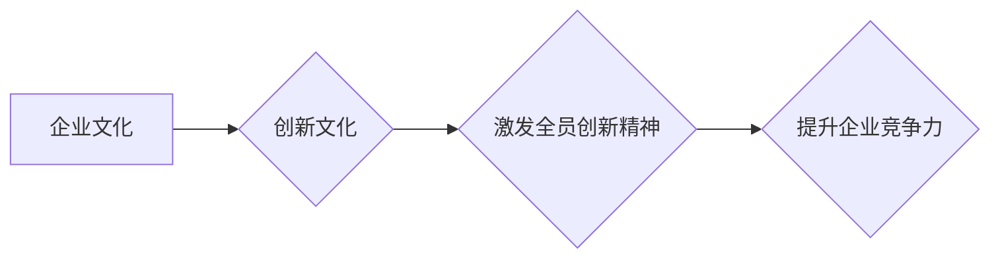

                 

## 创新文化建设：激发全员创新精神

> 关键词：创新文化、企业文化、技术创新、员工激励、协作机制、知识共享、学习型组织

### 1. 背景介绍

在当今瞬息万变的科技时代，创新已成为企业持续发展的生命线。面对激烈的市场竞争和不断涌现的新技术，企业唯有不断创新，才能保持竞争优势，实现可持续发展。然而，创新并非一蹴而就，它需要一个良好的土壤，一个能够激发全员创新精神的文化氛围。

传统的企业文化往往强调稳定、规范和执行力，而创新则需要打破常规、鼓励尝试和容忍失败。因此，构建创新文化，激发全员创新精神，成为企业提升核心竞争力、实现可持续发展的关键。

### 2. 核心概念与联系

#### 2.1 创新文化

创新文化是指一种企业内部普遍存在的价值观、理念、行为模式和制度，它鼓励和支持员工进行创造性思考、提出新想法、尝试新事物，并将其转化为实际成果。

#### 2.2 企业文化

企业文化是指企业在长期发展过程中形成的价值观、理念、行为规范、组织结构、管理模式等一系列共同特征，它影响着企业的经营管理、员工行为和企业形象。

#### 2.3 创新文化与企业文化的关系

创新文化是企业文化的一种重要组成部分，它与企业文化相互影响、相互促进。良好的企业文化能够为创新文化提供基础和保障，而创新文化则能够丰富和提升企业文化的活力。

**Mermaid 流程图**

### 3. 核心算法原理 & 具体操作步骤

#### 3.1 算法原理概述

构建创新文化是一个系统工程，需要从多个方面入手，并采用多种方法和手段。

#### 3.2 算法步骤详解

1. **建立创新理念：** 

   企业领导层要树立创新理念，将其作为企业发展战略的重要组成部分，并将其贯穿于企业的各个层面。

2. **营造创新氛围：** 

   企业要营造鼓励创新、包容失败、尊重个性的工作氛围，让员工敢于提出新想法，敢于尝试新事物。

3. **建立激励机制：** 

   企业要建立完善的创新激励机制，对创新成果给予充分的奖励和肯定，鼓励员工积极参与创新活动。

4. **搭建创新平台：** 

   企业要搭建完善的创新平台，提供员工进行创新活动的资源和支持，例如设立创新实验室、组织创新大赛等。

5. **加强知识共享：** 

   企业要加强内部知识共享，鼓励员工之间互相学习、互相借鉴，促进知识创新。

6. **培养创新人才：** 

   企业要重视人才培养，培养具有创新能力和创造力的员工，为企业创新发展提供人才保障。

#### 3.3 算法优缺点

**优点：**

* 能够激发全员创新精神，提升企业创新能力。
* 能够增强企业核心竞争力，促进企业可持续发展。

**缺点：**

* 构建创新文化需要时间和投入，需要企业领导层和员工共同努力。
* 创新文化建设需要不断完善和调整，需要根据企业实际情况进行定制化设计。

#### 3.4 算法应用领域

构建创新文化适用于所有行业和规模的企业，特别是科技创新型企业、快速发展型企业和面临激烈竞争的企业。

### 4. 数学模型和公式 & 详细讲解 & 举例说明

#### 4.1 数学模型构建

创新文化建设可以看作是一个复杂系统，我们可以用数学模型来描述其内部的相互作用关系。例如，我们可以用以下公式来描述创新文化对企业竞争力的影响：

$$
C = f(I, E, K, T)
$$

其中：

* $C$ 代表企业竞争力
* $I$ 代表创新文化水平
* $E$ 代表企业规模
* $K$ 代表知识资本
* $T$ 代表技术水平

#### 4.2 公式推导过程

这个公式的推导过程比较复杂，需要结合经济学、管理学和社会学等多学科的理论和研究成果。

#### 4.3 案例分析与讲解

我们可以通过一些案例来分析这个公式的应用。例如，一家规模较小的科技创新型企业，其创新文化水平较高，知识资本和技术水平也相对先进，因此其竞争力可能比较强。而一家规模较大的传统企业，其创新文化水平较低，知识资本和技术水平相对落后，因此其竞争力可能比较弱。

### 5. 项目实践：代码实例和详细解释说明

#### 5.1 开发环境搭建

构建创新文化需要多种工具和平台的支持，例如：

* **协作平台：** 比如企业内部的wiki、项目管理工具、在线沟通平台等，可以方便员工进行知识共享、项目协作和沟通交流。
* **创新工具：** 比如头脑风暴工具、创意设计软件、原型制作工具等，可以帮助员工进行创意激发、方案设计和原型验证。
* **数据分析平台：** 可以收集和分析员工创新活动的数据，例如创新提案数量、创新成果转化率等，为创新文化建设提供数据支持。

#### 5.2 源代码详细实现

由于构建创新文化是一个复杂的过程，无法用简单的代码实现。但是，我们可以用代码来实现一些具体的创新工具和平台，例如：

* **在线创新提案系统：** 可以让员工方便地提交创新提案，并进行投票和评审。
* **知识库管理系统：** 可以帮助员工进行知识共享和学习。
* **创新项目管理系统：** 可以帮助团队进行项目协作和管理。

#### 5.3 代码解读与分析

这些代码的实现需要结合具体的业务需求和技术架构进行设计和开发。

#### 5.4 运行结果展示

通过这些工具和平台的运行，可以帮助企业更好地激发员工创新精神，促进创新成果的产生和转化。

### 6. 实际应用场景

#### 6.1 案例分析

许多企业已经成功地构建了创新文化，取得了显著的成果。例如：

* **谷歌：** 谷歌以其开放、包容、鼓励创新的文化而闻名，其员工可以自由地提出新想法，并有机会将其付诸实践。
* **苹果：** 苹果的创新文化强调用户体验和产品设计，其员工对产品细节非常关注，并不断追求卓越。
* **华为：** 华为注重人才培养和知识共享，其员工可以不断学习新技术，并参与到公司的创新项目中。

#### 6.2 未来应用展望

随着科技的不断发展，创新文化将变得越来越重要。未来，企业将更加注重构建学习型组织、知识型组织和创新型组织，以适应不断变化的市场环境和技术发展趋势。

### 7. 工具和资源推荐

#### 7.1 学习资源推荐

* **书籍：** 《创新者的窘境》、《零到一》、《从优秀到卓越》等
* **网站：** 创新者社区、TED演讲、MIT Technology Review等
* **课程：** 线上课程平台上的创新管理、创意思维等课程

#### 7.2 开发工具推荐

* **协作平台：** Slack、Microsoft Teams、Confluence等
* **创新工具：** Miro、Mural、Figma等
* **数据分析平台：** Tableau、Power BI、Google Analytics等

#### 7.3 相关论文推荐

* Clayton M. Christensen, The Innovator's Dilemma
* Eric Ries, The Lean Startup
* Peter Drucker, Innovation and Entrepreneurship

### 8. 总结：未来发展趋势与挑战

#### 8.1 研究成果总结

构建创新文化是一个系统工程，需要从多个方面入手，并采用多种方法和手段。通过对创新文化建设的理论研究和实践探索，我们已经积累了一些宝贵的经验和成果。

#### 8.2 未来发展趋势

未来，创新文化建设将更加注重以下几个方面：

* **个性化定制：** 创新文化建设需要根据企业的实际情况进行定制化设计，不能一刀切。
* **数字化转型：** 数字化技术将更加广泛地应用于创新文化建设，例如利用大数据、人工智能等技术来分析员工创新行为、预测创新趋势等。
* **跨界融合：** 创新文化建设将更加注重跨界融合，例如企业可以与高校、科研机构、创业公司等进行合作，共同推动创新发展。

#### 8.3 面临的挑战

构建创新文化也面临着一些挑战：

* **文化变革：** 创新文化建设需要企业进行文化变革，这需要时间和耐心。
* **人才短缺：** 创新型企业需要大量具有创新能力和创造力的人才，而人才短缺是一个普遍的难题。
* **制度障碍：** 一些传统的制度和机制可能阻碍创新，需要进行改革和创新。

#### 8.4 研究展望

未来，我们还需要继续深入研究创新文化建设的理论和实践，探索更加有效的创新文化建设方法，为企业创新发展提供更多支持。

### 9. 附录：常见问题与解答

#### 9.1 如何建立创新文化？

建立创新文化是一个系统工程，需要从多个方面入手，例如：

* 树立创新理念
* 营造创新氛围
* 建立激励机制
* 搭建创新平台
* 加强知识共享
* 培养创新人才

#### 9.2 创新文化建设需要投入多少时间和资源？

创新文化建设是一个长期的过程，需要持续的投入和努力。具体的时间和资源投入取决于企业的规模、行业、发展阶段等因素。

#### 9.3 创新文化建设有哪些成功案例？

许多企业已经成功地构建了创新文化，例如谷歌、苹果、华为等。

#### 9.4 如何评估创新文化的建设效果？

可以从以下几个方面评估创新文化的建设效果：

* 员工创新提案数量
* 创新成果转化率
* 企业竞争力提升
* 员工满意度

#### 9.5 如何应对创新文化建设的挑战？

* 坚持长期主义，不要急于求成。
* 充分沟通，争取员工的理解和支持。
* 灵活变通，根据实际情况进行调整。

作者：禅与计算机程序设计艺术 / Zen and the Art of Computer Programming 
<end_of_turn>

