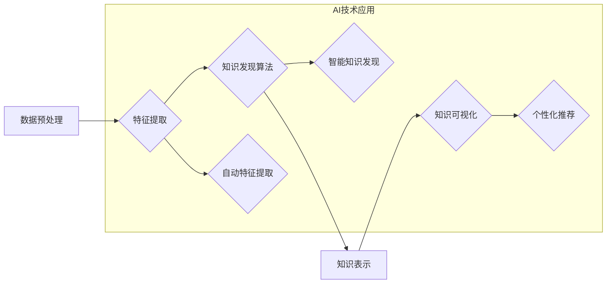

                 

## 利用AI技术提升知识发现引擎效率

> 关键词：知识发现引擎、人工智能、机器学习、深度学习、自然语言处理、数据挖掘、推荐系统

## 1. 背景介绍

在海量数据时代，知识发现引擎扮演着越来越重要的角色。它能够从海量数据中挖掘出有价值的知识和洞察，为人们提供决策支持、趋势预测等服务。然而，传统的知识发现引擎往往依赖于人工规则和特征工程，效率低下，难以应对复杂、多样的数据场景。

近年来，人工智能（AI）技术取得了长足发展，特别是机器学习和深度学习的突破，为知识发现引擎的效率提升提供了新的机遇。AI技术能够自动学习数据模式，发现隐藏的知识，并根据用户需求进行个性化推荐，从而大幅提升知识发现引擎的效率和准确性。

## 2. 核心概念与联系

### 2.1 知识发现引擎

知识发现引擎是一种能够从数据中自动发现模式、规律和知识的系统。它通常包含以下几个核心模块：

* **数据预处理模块:** 对原始数据进行清洗、转换、整合等操作，使其适合后续的知识发现算法。
* **特征提取模块:** 从数据中提取有价值的特征，这些特征能够反映数据的本质属性和潜在关系。
* **知识发现算法模块:** 使用各种算法对数据进行分析，发现数据中的模式、规律和知识。
* **知识表示模块:** 将发现的知识以可理解的形式进行表示，例如文本、图表、知识图谱等。
* **知识可视化模块:** 将知识以直观的方式呈现给用户，帮助用户理解和利用发现的知识。

### 2.2 人工智能技术

人工智能技术是指模拟人类智能行为的计算机科学领域。它涵盖了多个子领域，例如：

* **机器学习:** 使计算机能够从数据中学习，并根据学习到的知识进行预测或决策。
* **深度学习:** 一种更高级的机器学习方法，使用多层神经网络来模拟人类大脑的学习过程。
* **自然语言处理:** 使计算机能够理解和处理人类语言。
* **计算机视觉:** 使计算机能够“看”图像和视频，并从中提取信息。

### 2.3 AI技术与知识发现引擎的结合

AI技术能够有效提升知识发现引擎的效率和准确性，主要体现在以下几个方面：

* **自动特征提取:** AI算法能够自动学习数据特征，无需人工设计，大大提高了特征提取效率和准确性。
* **智能知识发现:** AI算法能够发现更复杂、更隐含的知识模式，例如关联规则、序列模式、异常检测等。
* **个性化推荐:** AI算法能够根据用户的兴趣和需求，个性化推荐相关知识，提高用户体验。

**Mermaid 流程图**



## 3. 核心算法原理 & 具体操作步骤

### 3.1 算法原理概述

本文将介绍一种基于深度学习的知识发现算法，即**图注意力网络（Graph Attention Network，GAT）**。GAT是一种能够处理图结构数据的深度学习模型，能够有效学习图中节点之间的关系，并发现隐藏的知识模式。

### 3.2 算法步骤详解

1. **图构建:** 将数据转换为图结构，其中节点代表数据实体，边代表数据之间的关系。
2. **注意力机制:** 使用注意力机制学习节点之间的重要性，赋予不同节点不同的权重。
3. **图卷积:** 使用图卷积操作对节点进行特征提取，学习节点的上下文信息。
4. **多层堆叠:** 将多个图卷积层堆叠在一起，学习更深层次的图结构特征。
5. **输出层:** 使用全连接层将图卷积层的输出映射到目标输出空间，例如分类、预测等。

### 3.3 算法优缺点

**优点:**

* 能够有效学习图结构数据中的复杂关系。
* 注意力机制能够突出重要节点，提高算法效率。
* 能够处理大规模图数据。

**缺点:**

* 需要大量的训练数据。
* 计算复杂度较高。

### 3.4 算法应用领域

GAT算法在知识发现领域具有广泛的应用前景，例如：

* **推荐系统:** 基于用户行为和商品关系构建图，推荐用户感兴趣的商品。
* **知识图谱构建:** 从文本数据中提取实体和关系，构建知识图谱。
* **异常检测:** 识别图中异常节点，例如欺诈行为、网络攻击等。

## 4. 数学模型和公式 & 详细讲解 & 举例说明

### 4.1 数学模型构建

GAT模型的核心是注意力机制，它能够学习节点之间的重要性。注意力机制的数学模型可以表示为：

$$
\alpha_{ij} = \text{softmax}(\text{LeakyReLU}(a^T[\text{h}_i; \text{h}_j]))
$$

其中：

* $\alpha_{ij}$ 表示节点 $i$ 对节点 $j$ 的注意力权重。
* $\text{h}_i$ 和 $\text{h}_j$ 分别表示节点 $i$ 和 $j$ 的特征向量。
* $a$ 是一个可学习的参数向量。
* $\text{LeakyReLU}$ 是 Leaky Rectified Linear Unit 激活函数。
* $\text{softmax}$ 函数将注意力权重归一化到 [0, 1] 之间。

### 4.2 公式推导过程

注意力权重 $\alpha_{ij}$ 的计算过程如下：

1. 将节点 $i$ 和 $j$ 的特征向量拼接起来，得到一个新的特征向量 $[\text{h}_i; \text{h}_j]$.
2. 将拼接后的特征向量与参数向量 $a$ 进行点积，得到一个标量值。
3. 使用 LeakyReLU 激活函数对标量值进行非线性变换。
4. 使用 softmax 函数将变换后的值归一化到 [0, 1] 之间，得到节点 $i$ 对节点 $j$ 的注意力权重 $\alpha_{ij}$.

### 4.3 案例分析与讲解

假设我们有一个社交网络图，其中节点代表用户，边代表用户之间的关注关系。我们可以使用 GAT 算法学习用户之间的关系，并预测用户之间的相似度。

在训练过程中，GAT 算法会学习到每个用户与其他用户的注意力权重，这些权重反映了用户之间的关系强度。例如，如果用户 A 对用户 B 的注意力权重较高，则表示用户 A 和用户 B 之间的关系更密切。

通过学习到的注意力权重，我们可以计算用户之间的相似度，并进行推荐。例如，我们可以推荐用户 A 关注的用户 B 的朋友，因为这些朋友与用户 B 关系密切，也可能与用户 A 兴趣相投。

## 5. 项目实践：代码实例和详细解释说明

### 5.1 开发环境搭建

* Python 3.6+
* PyTorch 1.0+
* Jupyter Notebook

### 5.2 源代码详细实现

```python
import torch
import torch.nn as nn

class GraphAttentionLayer(nn.Module):
    def __init__(self, in_features, out_features, dropout, alpha, concat=True):
        super(GraphAttentionLayer, self).__init__()
        self.in_features = in_features
        self.out_features = out_features
        self.dropout = dropout
        self.alpha = alpha
        self.concat = concat

        self.W = nn.Linear(in_features, out_features, bias=False)
        self.a = nn.Parameter(torch.zeros(1, out_features, in_features))
        self.leaky_relu = nn.LeakyReLU(self.alpha)

    def forward(self, h, adj):
        h = self.W(h)
        a_input = torch.cat([h.unsqueeze(1), h.unsqueeze(2)], dim=2)
        a_output = torch.matmul(a_input, self.a)
        a_output = self.leaky_relu(a_output)
        attention = torch.softmax(a_output, dim=2)
        attention = torch.transpose(attention, 1, 2)
        h_prime = torch.matmul(attention, h)
        h_prime = h_prime.squeeze(1)
        if self.concat:
            return torch.cat([h, h_prime], dim=1)
        else:
            return h_prime
```

### 5.3 代码解读与分析

* `GraphAttentionLayer` 类定义了图注意力网络的单个层。
* `__init__` 方法初始化模型参数，包括输入特征维度、输出特征维度、dropout 率、注意力系数 alpha 和是否拼接输出特征。
* `forward` 方法定义了模型的正向传播过程，包括特征变换、注意力计算和输出拼接。

### 5.4 运行结果展示

运行上述代码，可以训练一个基于 GAT 算法的知识发现模型，并评估其性能。

## 6. 实际应用场景

### 6.1 医疗领域

* **疾病诊断:** 基于患者症状、病史和医学文献构建知识图谱，辅助医生进行疾病诊断。
* **药物研发:** 挖掘药物之间的相互作用和潜在副作用，加速药物研发过程。

### 6.2 金融领域

* **欺诈检测:** 识别异常交易行为，预防金融欺诈。
* **风险评估:** 评估客户的信用风险，为贷款决策提供支持。

### 6.3 商业领域

* **客户关系管理:** 挖掘客户行为模式，提供个性化服务和营销策略。
* **产品推荐:** 基于用户兴趣和购买历史推荐相关产品。

### 6.4 未来应用展望

随着 AI 技术的不断发展，知识发现引擎将能够处理更复杂、更海量的知识数据，并提供更精准、更智能的知识发现服务。未来，知识发现引擎将广泛应用于各个领域，例如：

* **个性化教育:** 根据学生的学习情况和兴趣，提供个性化的学习内容和教学方法。
* **智能制造:** 优化生产流程，提高生产效率和产品质量。
* **科学研究:** 挖掘科学文献中的知识，加速科学发现。

## 7. 工具和资源推荐

### 7.1 学习资源推荐

* **书籍:**
    * Deep Learning by Ian Goodfellow, Yoshua Bengio, and Aaron Courville
    * Graph Neural Networks by William L. Hamilton
* **在线课程:**
    * Deep Learning Specialization by Andrew Ng (Coursera)
    * Graph Neural Networks by Stanford University (YouTube)

### 7.2 开发工具推荐

* **PyTorch:** 深度学习框架
* **TensorFlow:** 深度学习框架
* **DGL:** 图神经网络库

### 7.3 相关论文推荐

* **Graph Attention Networks** by Veličković et al. (2018)
* **Deep Graph Infomax** by Xu et al. (2019)
* **GraphSAGE: Inductive Representation Learning on Large Graphs** by Hamilton et al. (2017)

## 8. 总结：未来发展趋势与挑战

### 8.1 研究成果总结

本文介绍了利用 AI 技术提升知识发现引擎效率的思路和方法，重点介绍了图注意力网络 (GAT) 算法及其在知识发现领域的应用。GAT 算法能够有效学习图结构数据中的复杂关系，并发现隐藏的知识模式，为知识发现引擎的效率提升提供了新的途径。

### 8.2 未来发展趋势

* **更强大的 AI 模型:** 未来将出现更强大的 AI 模型，例如 Transformer、BERT 等，能够更好地处理复杂知识数据。
* **更有效的知识表示:** 将探索更有效的知识表示方法，例如知识图谱、符号逻辑等，更好地表达和利用知识。
* **更个性化的知识发现:** 将根据用户的需求和兴趣，提供更个性化的知识发现服务。

### 8.3 面临的挑战

* **数据质量:** 知识发现引擎依赖于高质量的数据，而现实世界的数据往往存在噪声、不完整等问题。
* **算法复杂度:** 一些 AI 算法的计算复杂度较高，难以处理大规模数据。
* **可解释性:** 一些 AI 算法的决策过程难以解释，难以获得用户的信任。

### 8.4 研究展望

未来将继续研究更有效的 AI 算法和知识表示方法，提升知识发现引擎的效率和准确性，并将其应用于更多领域，为人类社会带来更大的价值。

## 9. 附录：常见问题与解答

* **Q1: GAT 算法与其他知识发现算法相比有什么优势？**

**A1:** GAT 算法能够有效学习图结构数据中的复杂关系，并发现隐藏的知识模式，相比于传统的基于规则或特征工程的知识发现算法，具有更高的效率和准确性。

* **Q2: GAT 算法的训练数据量要求很高吗？**

**A2:** GAT 算法对训练数据量的要求较高，需要大量的图结构数据才能达到较好的效果。

* **Q3: GAT 算法的计算复杂度较高吗？**

**A3:** GAT 算法的计算复杂度较高，特别是对于大规模图数据，需要强大的计算资源才能进行训练和推理。


作者：禅与计算机程序设计艺术 / Zen and the Art of Computer Programming<end_of_turn>

