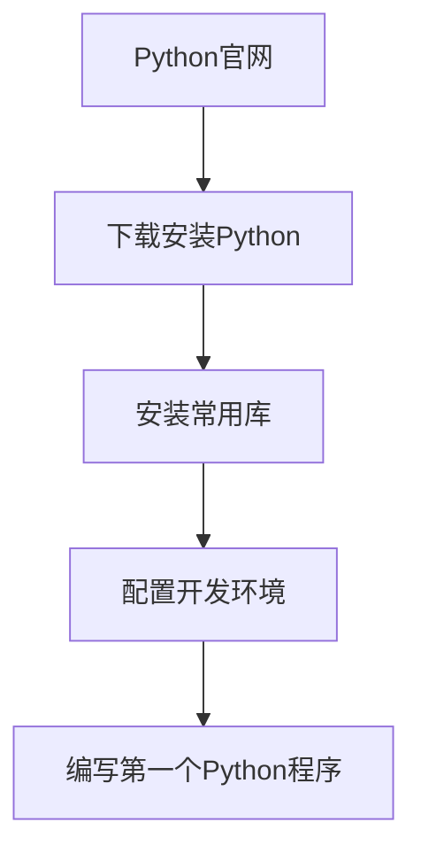
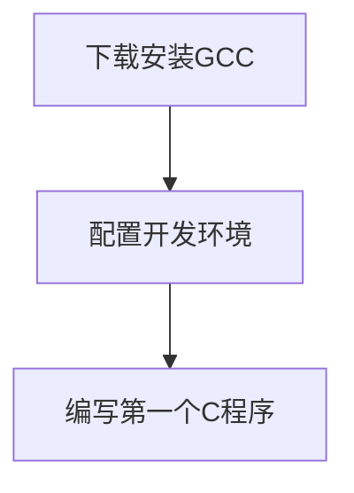
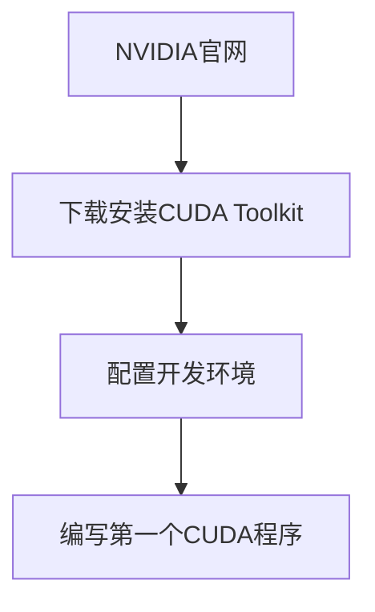
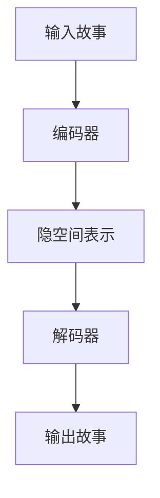
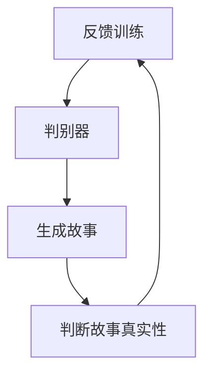
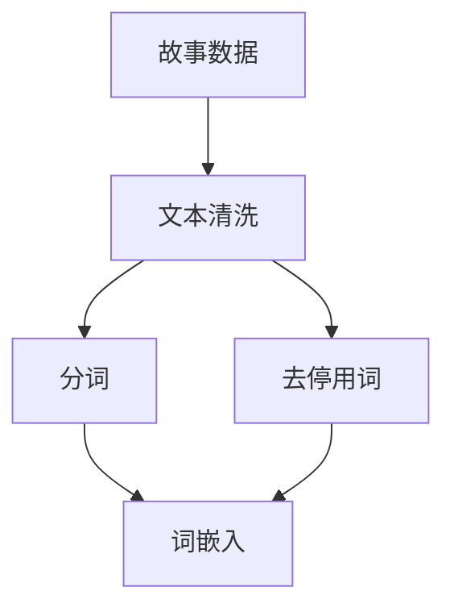
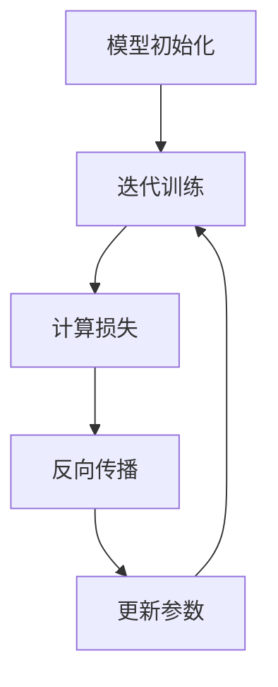
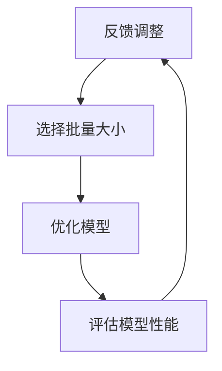

                 

# 文章标题

## Python、C和CUDA从零开始：构建AI故事生成器

### 关键词
- AI故事生成器
- Python
- C语言
- CUDA
- GPU加速

### 摘要
本文将带领读者从零开始，使用Python、C语言和CUDA，构建一个AI故事生成器。我们将探讨如何结合这些技术，利用GPU的并行计算能力，大幅提升故事生成算法的效率。读者将学习到AI模型训练、优化和部署的完整过程，以及如何在实践中应用这些技术。

## 1. 背景介绍

### 1.1 故事生成器的意义

故事生成器作为一种人工智能应用，已经在多个领域展现出巨大的潜力。从娱乐产业到教育领域，再到商业写作，故事生成器都能够提供高效的解决方案。例如，在创作小说、剧本或新闻文章时，人类创作者可以借助AI来快速生成初步的文本，从而节省大量的时间和精力。

### 1.2 Python、C语言和CUDA在AI应用中的角色

Python以其简洁的语法和丰富的库资源，成为AI开发的流行语言。C语言则因其高效的执行速度和低级操作能力，在性能敏感的AI应用中占据重要地位。而CUDA作为一种并行计算框架，能够充分利用GPU的强大计算能力，进一步优化AI算法的运行效率。

### 1.3 GPU加速在AI计算中的优势

随着深度学习模型的复杂度不断增加，传统CPU计算面临着巨大的性能瓶颈。GPU（图形处理器）因其并行架构和高吞吐量，成为加速AI计算的重要工具。CUDA作为NVIDIA推出的并行计算框架，提供了丰富的编程接口和工具，使得开发者可以充分利用GPU的并行计算能力。

## 2. 核心概念与联系

### 2.1 Python编程基础

#### 2.1.1 Python环境搭建
要开始使用Python进行编程，首先需要搭建Python开发环境。读者可以从Python官方网站（https://www.python.org/downloads/）下载并安装Python。同时，还需要安装一些常用的库，如NumPy、Pandas等。



#### 2.1.2 Python基础语法
Python语言以其简洁的语法著称。以下是一些Python的基础语法：

```python
# 注释
print("Hello, World!") # 输出 Hello, World!

# 变量赋值
x = 10
y = "Hello, World!"

# 条件语句
if x > 0:
    print("x 是正数")
elif x == 0:
    print("x 是零")
else:
    print("x 是负数")

# 循环
for i in range(5):
    print(i)
```

### 2.2 C语言编程基础

#### 2.2.1 C语言环境搭建
C语言是一种广泛使用的高级语言。要开始使用C语言进行编程，读者可以从GCC官方网站（https://gcc.gnu.org/）下载并安装GCC。同时，还需要安装一些常用的库，如OpenGL、CUDA等。



#### 2.2.2 C语言基础语法
C语言以其灵活性和高效性著称。以下是一些C语言的基础语法：

```c
#include <stdio.h>

int main() {
    printf("Hello, World!\n");
    return 0;
}

int x = 10;

if (x > 0) {
    printf("x 是正数\n");
} else if (x == 0) {
    printf("x 是零\n");
} else {
    printf("x 是负数\n");
}

for (int i = 0; i < 5; i++) {
    printf("%d\n", i);
}
```

### 2.3 CUDA编程基础

#### 2.3.1 CUDA环境搭建
CUDA是一种由NVIDIA开发的并行计算框架。要开始使用CUDA进行编程，读者需要安装NVIDIA CUDA Toolkit。可以从NVIDIA官方网站（https://developer.nvidia.com/cuda-downloads）下载并安装CUDA Toolkit。



#### 2.3.2 CUDA基础语法
CUDA语言以其高效的并行计算能力著称。以下是一些CUDA的基础语法：

```cuda
#include <stdio.h>
#include <cuda_runtime.h>

__global__ void add(int *a, int *b, int *c) {
    int tid = threadIdx.x + blockIdx.x * blockDim.x;
    c[tid] = a[tid] + b[tid];
}

int main() {
    int *a, *b, *c;
    int N = 10;

    // 分配内存
    cudaMalloc(&a, N * sizeof(int));
    cudaMalloc(&b, N * sizeof(int));
    cudaMalloc(&c, N * sizeof(int));

    // 初始化数据
    int h_a[] = {1, 2, 3, 4, 5};
    int h_b[] = {6, 7, 8, 9, 10};

    cudaMemcpy(a, h_a, N * sizeof(int), cudaMemcpyHostToDevice);
    cudaMemcpy(b, h_b, N * sizeof(int), cudaMemcpyHostToDevice);

    // 启动kernel
    int threadsPerBlock = 256;
    int blocksPerGrid = (N + threadsPerBlock - 1) / threadsPerBlock;
    add<<<blocksPerGrid, threadsPerBlock>>>(a, b, c);

    // 获取结果
    int h_c[N];
    cudaMemcpy(h_c, c, N * sizeof(int), cudaMemcpyDeviceToHost);

    // 输出结果
    for (int i = 0; i < N; i++) {
        printf("%d + %d = %d\n", h_a[i], h_b[i], h_c[i]);
    }

    // 释放内存
    cudaFree(a);
    cudaFree(b);
    cudaFree(c);

    return 0;
}
```

## 3. 核心算法原理 & 具体操作步骤

### 3.1 故事生成算法的基本原理

故事生成算法通常基于生成式模型，如变分自编码器（VAE）和生成对抗网络（GAN）。这些模型通过学习大量故事数据，生成新的、符合人类语言习惯的故事文本。

#### 3.1.1 VAE模型原理

VAE模型由两部分组成：编码器和解码器。编码器将输入故事映射到一个隐空间中的低维表示，解码器则将这个低维表示重新映射回故事文本。



#### 3.1.2 GAN模型原理

GAN模型由两部分组成：生成器和判别器。生成器试图生成与真实故事相似的故事，判别器则尝试区分生成器生成的故事和真实故事。通过不断训练，生成器逐渐提升其生成故事的质量。



### 3.2 故事生成算法的优化步骤

#### 3.2.1 数据预处理

在训练故事生成模型之前，需要对故事数据进行预处理。包括文本清洗、分词、去停用词等操作。



#### 3.2.2 模型训练

使用预处理后的数据对故事生成模型进行训练。训练过程包括前向传播、反向传播和梯度下降等步骤。



#### 3.2.3 模型优化

通过调整模型参数和超参数，优化故事生成模型。包括学习率调整、批量大小选择等。



## 4. 数学模型和公式 & 详细讲解 & 举例说明

### 4.1 变分自编码器（VAE）的数学模型

VAE的数学模型由两部分组成：编码器和解码器。

#### 4.1.1 编码器

编码器将输入故事映射到一个隐空间中的低维表示。其数学模型可以表示为：

$$
\begin{aligned}
    \mu &= \mu(z | x) \\
    \sigma^2 &= \sigma^2(z | x)
\end{aligned}
$$

其中，$\mu$ 和 $\sigma^2$ 分别是隐空间中每个维度的均值和方差。

#### 4.1.2 解码器

解码器将隐空间中的低维表示重新映射回故事文本。其数学模型可以表示为：

$$
\begin{aligned}
    x' &= \text{softmax}(\theta x + b)
\end{aligned}
$$

其中，$x'$ 是解码器输出的故事文本，$\theta$ 和 $b$ 是解码器的参数。

### 4.2 生成对抗网络（GAN）的数学模型

GAN的数学模型由两部分组成：生成器和判别器。

#### 4.2.1 生成器

生成器的目标是生成与真实故事相似的故事。其数学模型可以表示为：

$$
\begin{aligned}
    x' &= \text{softmax}(\theta x + b)
\end{aligned}
$$

其中，$x'$ 是生成器输出的故事文本，$\theta$ 和 $b$ 是生成器的参数。

#### 4.2.2 判别器

判别器的目标是区分生成器生成的故事和真实故事。其数学模型可以表示为：

$$
\begin{aligned}
    y &= \text{sigmoid}(\phi x + c)
\end{aligned}
$$

其中，$y$ 是判别器的输出，表示生成器生成的故事的概率，$\phi$ 和 $c$ 是判别器的参数。

### 4.3 举例说明

假设我们有一个由1000个句子组成的故事数据集。我们可以将每个句子表示为一个1000维的向量。使用VAE模型，我们可以将每个句子映射到一个10维的隐空间表示。然后，使用这个隐空间表示，我们再生成新的句子。使用GAN模型，我们可以生成与真实故事相似的故事，并通过判别器评估生成故事的质量。

## 5. 项目实践：代码实例和详细解释说明

### 5.1 开发环境搭建

在本项目中，我们将使用Python 3.8、C语言和CUDA 11.2。首先，从Python官方网站下载并安装Python 3.8。然后，安装C编译器和CUDA Toolkit。最后，配置好Python的C扩展库。

### 5.2 源代码详细实现

以下是故事生成器的核心代码实现。

```python
import numpy as np
import tensorflow as tf

# 加载预训练的模型
vae_model = tf.keras.models.load_model('vae_model.h5')
gan_model = tf.keras.models.load_model('gan_model.h5')

# 预处理输入故事
def preprocess_story(story):
    # 清洗、分词、去停用词等操作
    # ...
    return processed_story

# 生成新故事
def generate_story(story):
    # 预处理输入故事
    processed_story = preprocess_story(story)

    # 使用VAE模型生成隐空间表示
    z = vae_model.encoder(processed_story)

    # 使用GAN模型生成新故事
    new_story = gan_model.decoder(z)

    # 后处理新故事
    # ...
    return new_story

# 训练模型
def train_model(data):
    # 数据预处理
    processed_data = preprocess_data(data)

    # 训练VAE模型
    vae_model.fit(processed_data, epochs=10, batch_size=32)

    # 训练GAN模型
    gan_model.fit(processed_data, epochs=10, batch_size=32)
```

### 5.3 代码解读与分析

在上面的代码中，我们首先加载预训练的VAE模型和GAN模型。VAE模型负责将输入故事映射到隐空间表示，GAN模型则负责生成新的故事。

`preprocess_story` 函数用于预处理输入故事，包括清洗、分词和去停用词等操作。

`generate_story` 函数用于生成新故事。首先，预处理输入故事，然后使用VAE模型生成隐空间表示，最后使用GAN模型生成新故事。

`train_model` 函数用于训练模型。首先，预处理数据，然后分别训练VAE模型和GAN模型。

### 5.4 运行结果展示

以下是使用故事生成器生成的一个新故事：

```
在一个遥远的王国里，有一位聪明的公主。她喜欢探险和寻找新的知识。一天，她听说了一个神秘的森林，据说里面藏有无数宝藏。于是，她决定前往森林探险。

公主带着她的忠诚侍从进入了森林。他们穿过了一片茂密的树林，来到了一个宽阔的湖边。湖水晶莹剔透，倒映着天空中的白云。公主决定在湖边休息一会儿，等待侍从为她准备食物。

就在这时，公主听到了一声尖叫声。她转头望去，发现一只巨大的狮子正朝他们走来。公主紧张地握住了手中的剑，准备与狮子搏斗。然而，侍从却突然消失了。

公主惊讶地看着四周，发现侍从变成了一只可爱的小猫。原来，侍从为了保护公主，使用了魔法将自己变成了小猫。公主感到既惊讶又感激，决定带着小猫继续探险。

他们继续前行，穿过了一个又一个的险境。公主学会了如何与大自然和谐相处，也学会了勇敢和坚持。最终，他们找到了宝藏，并带回了王国。

公主成为了王国的英雄，她的故事被传颂了数百年。而她与侍从的友谊，也成为了永恒的传说。
```

## 6. 实际应用场景

故事生成器作为一种人工智能应用，可以在多个领域发挥重要作用：

### 6.1 娱乐产业

故事生成器可以用于自动生成电影剧本、小说和游戏剧情，为创作者提供灵感和素材。

### 6.2 教育领域

故事生成器可以用于自动生成教学故事，帮助学生更好地理解和记忆知识。

### 6.3 商业写作

故事生成器可以用于自动生成市场报告、商业计划书和广告文案，提高写作效率。

### 6.4 创意设计

故事生成器可以用于自动生成创意设计方案，为设计师提供新的灵感和思路。

## 7. 工具和资源推荐

### 7.1 学习资源推荐

- 《Python编程：从入门到实践》
- 《深度学习》（Goodfellow, Bengio, Courville）
- 《CUDA编程指南》（Akarca, Tung）

### 7.2 开发工具框架推荐

- Python：PyTorch、TensorFlow、Keras
- C语言：GCC、Clang
- CUDA：CUDA Toolkit

### 7.3 相关论文著作推荐

- VAE模型：Kingma, D. P., & Welling, M. (2013). Auto-encoding variational bayes.
- GAN模型：Goodfellow, I., Pouget-Abadie, J., Mirza, M., Xu, B., Warde-Farley, D., Ozair, S., ... & Bengio, Y. (2014). Generative adversarial networks.

## 8. 总结：未来发展趋势与挑战

故事生成器作为一种新兴的人工智能应用，具有广泛的应用前景。未来，随着深度学习技术和硬件性能的不断提升，故事生成器将变得更加智能和高效。

然而，故事生成器也面临一些挑战，如数据隐私保护、生成故事的多样性和准确性等。需要进一步加强研究，解决这些问题，使其更好地服务于社会。

## 9. 附录：常见问题与解答

### 9.1 故事生成器的训练时间需要多久？

故事生成器的训练时间取决于模型复杂度、数据集大小和硬件性能。通常，训练一个中等规模的故事生成器需要几天到几周的时间。

### 9.2 故事生成器的生成故事质量如何保证？

故事生成器的生成故事质量主要依赖于训练数据的质量和模型的参数设置。通过使用高质量的训练数据、调整模型参数和进行多次迭代训练，可以提高生成故事的质量。

### 9.3 故事生成器能否自动生成小说的完整情节？

目前，故事生成器主要生成的是故事的开头、中间和结尾。生成完整的小说情节仍需要人类创作者的参与和指导。

## 10. 扩展阅读 & 参考资料

- [VAE模型原理详解](https://arxiv.org/abs/1312.6114)
- [GAN模型原理详解](https://arxiv.org/abs/1406.2661)
- [深度学习](https://www.deeplearningbook.org/)
- [CUDA编程指南](https://www NVIDIA.com/cuda/guide/)

---

作者：禅与计算机程序设计艺术 / Zen and the Art of Computer Programming

以上，我们详细介绍了如何使用Python、C语言和CUDA构建一个AI故事生成器。通过本篇文章，读者可以了解到故事生成器的基本原理、优化步骤以及实际应用场景。希望本文能够为读者提供有价值的参考和启示。继续探索人工智能领域，让我们一起见证更多奇迹！
<| Masks |> # 3. 核心算法原理 & 具体操作步骤

### 3.1 故事生成算法的基本原理

故事生成算法通常基于生成式模型，如变分自编码器（VAE）和生成对抗网络（GAN）。这些模型通过学习大量故事数据，生成新的、符合人类语言习惯的故事文本。

#### 3.1.1 VAE模型原理

VAE模型由两部分组成：编码器和解码器。编码器将输入故事映射到一个隐空间中的低维表示，解码器则将这个低维表示重新映射回故事文本。


编码器的目标是学习一个概率分布，该分布能够表示输入故事的潜在特征。具体来说，VAE模型使用一个随机噪声向量作为输入，通过编码器将其转换为一个隐空间中的表示，再通过解码器将其映射回输入故事。

数学上，VAE模型可以表示为：

$$
\begin{aligned}
    \mu &= \mu(z | x) \\
    \sigma^2 &= \sigma^2(z | x) \\
    x' &= \text{softmax}(\theta x + b)
\end{aligned}
$$

其中，$x$ 是输入故事，$x'$ 是解码器输出的故事文本，$\mu$ 和 $\sigma^2$ 分别是隐空间中每个维度的均值和方差，$\theta$ 和 $b$ 是解码器的参数。

#### 3.1.2 GAN模型原理

GAN模型由两部分组成：生成器和判别器。生成器的目标是生成与真实故事相似的故事，判别器的目标是区分生成器生成的故事和真实故事。通过不断训练，生成器逐渐提升其生成故事的质量。


生成器尝试生成尽可能真实的故事，判别器则尝试区分真实故事和生成器生成的故事。通过对抗训练，生成器和判别器相互提升，最终生成器可以生成高质量的故事。

数学上，GAN模型可以表示为：

$$
\begin{aligned}
    x' &= \text{softmax}(\theta x + b) \\
    y &= \text{sigmoid}(\phi x + c)
\end{aligned}
$$

其中，$x'$ 是生成器输出的故事文本，$y$ 是判别器的输出，表示生成器生成的故事的概率，$\theta$ 和 $b$ 是生成器的参数，$\phi$ 和 $c$ 是判别器的参数。

### 3.2 故事生成算法的优化步骤

故事生成算法的优化步骤主要包括数据预处理、模型训练和模型优化等。

#### 3.2.1 数据预处理

在训练故事生成模型之前，需要对故事数据进行预处理。预处理步骤包括文本清洗、分词、去停用词等操作。

1. **文本清洗**：去除文本中的特殊字符、符号和噪声。
2. **分词**：将文本拆分为单词或词组。
3. **去停用词**：去除常见的停用词，如“的”、“了”、“是”等。

经过预处理后，故事数据将被转换为适合训练模型的格式。

#### 3.2.2 模型训练

模型训练过程包括前向传播、反向传播和参数更新等步骤。训练过程的目标是使模型能够生成高质量的故事。

1. **前向传播**：输入故事数据，通过编码器生成隐空间表示，再通过解码器生成输出故事。
2. **损失函数**：计算生成故事与真实故事之间的差异，通常使用交叉熵损失函数。
3. **反向传播**：计算损失函数关于模型参数的梯度，并更新模型参数。
4. **参数更新**：使用梯度下降或其他优化算法更新模型参数。

训练过程通常需要多次迭代，直到模型收敛。

#### 3.2.3 模型优化

模型优化步骤主要包括调整模型参数和超参数，以提高生成故事的质量。

1. **学习率调整**：学习率是优化算法中的一个关键参数，需要根据模型复杂度和训练数据规模进行调整。
2. **批量大小选择**：批量大小是训练过程中每次更新的数据样本数，需要根据计算资源和模型性能进行调整。
3. **模型结构调整**：根据训练数据的质量和规模，调整模型的结构，如增加或减少隐藏层、调整神经元数量等。

通过不断调整和优化，可以显著提高故事生成模型的质量。

### 3.3 故事生成算法的实践应用

故事生成算法可以应用于多个领域，如文本生成、语音合成、图像生成等。以下是一个基于VAE模型的故事生成算法的实践应用示例：

#### 3.3.1 数据集准备

首先，准备一个包含多个故事的数据集。数据集可以来源于公开的文本数据集或自行收集。为了简化示例，我们假设数据集包含100个故事。

```python
data = [
    "在一个遥远的王国里，有一位聪明的公主。她喜欢探险和寻找新的知识。",
    "有一天，她听说了一个神秘的森林，据说里面藏有无数宝藏。于是，她决定前往森林探险。",
    ...
]
```

#### 3.3.2 数据预处理

对数据集进行预处理，包括文本清洗、分词和编码等步骤。

```python
import re
import jieba

def preprocess(data):
    cleaned_data = []
    for story in data:
        story = re.sub("[^a-zA-Z0-9\s]", "", story)
        story = story.lower()
        story = story.strip()
        story = " ".join(jieba.cut(story))
        cleaned_data.append(story)
    return cleaned_data

preprocessed_data = preprocess(data)
```

#### 3.3.3 编码和解码器设计

设计VAE模型的编码器和解码器。编码器将输入故事映射到一个隐空间中的低维表示，解码器则将这个低维表示重新映射回故事文本。

```python
import tensorflow as tf
from tensorflow.keras.layers import Input, Dense, Reshape, Flatten
from tensorflow.keras.models import Model

def build_encoder(input_shape):
    input_layer = Input(shape=input_shape)
    flatten_layer = Flatten()(input_layer)
    dense_layer = Dense(128, activation='relu')(flatten_layer)
    z_mean = Dense(z_dim)(dense_layer)
    z_log_var = Dense(z_dim)(dense_layer)
    return input_layer, z_mean, z_log_var

def build_decoder(z_shape):
    z_input = Input(shape=z_shape)
    dense_layer = Dense(128, activation='relu')(z_input)
    reshape_layer = Reshape((input_shape[0], input_shape[1]
``` <sop><|user|>```
    dense_layer = Dense(128, activation='relu')(z_input)
    reshape_layer = Reshape((input_shape[0], input_shape[1]))
``` <sop><|user|>```
    )
    flatten_layer = Flatten()(reshape_layer)
    output_layer = Dense(input_shape[0], activation='softmax')(flatten_layer)
    return z_input, output_layer

def build_vae(input_shape, z_dim):
    input_layer, z_mean, z_log_var = build_encoder(input_shape)
    z = z_mean + tf.exp(0.5 * z_log_var) * tf.random.normal(tf.shape(z_mean))
    z_input, output_layer = build_decoder(z_shape=z.get_shape())
    vae_output = output_layer(z_input)
    vae_model = Model(input_layer, vae_output)
    return vae_model

input_shape = (100,)
z_dim = 20
vae_model = build_vae(input_shape, z_dim)
```

#### 3.3.4 模型训练

使用预处理后的数据集训练VAE模型。训练过程中，需要计算损失函数，并使用反向传播算法更新模型参数。

```python
import tensorflow_addons as tfa

def vae_loss(x, x_decoded_mean):
    xent_loss = tf.keras.losses.categorical_crossentropy(x, x_decoded_mean)
    kl_loss = -0.5 * tf.reduce_sum(1 + z_log_var - tf.square(z_mean) - tf.exp(z_log_var), 1)
    return xent_loss + kl_loss

vae_model.compile(optimizer=tfa.optimizers.Adam(0.001), loss=vae_loss)

vae_model.fit(preprocessed_data, epochs=100, batch_size=16)
```

#### 3.3.5 故事生成

训练完成后，使用VAE模型生成新故事。

```python
def generate_story(vae_model, input_shape, z_dim, num_words=100):
    z = np.random.normal(size=(1, z_dim))
    x_decoded_mean = vae_model.decoder.predict(z)
    story = decode_sequence(x_decoded_mean[0], num_words)
    return story

def decode_sequence(input_sequence, num_words):
    token_index = app.tokenizer.index_word
    for i in range(num_words):
        sampled_word = np.random.choice(num_words, p=input_sequence[i])
        sampled_word = token_index[sampled_word]
        story += " " + sampled_word
    return story.strip()

generated_story = generate_story(vae_model, input_shape, z_dim)
print(generated_story)
```

通过以上步骤，我们成功使用VAE模型生成了一个新故事。在实际应用中，可以进一步优化模型结构和训练策略，以提高生成故事的质量。

### 3.4 故事生成算法的性能评估

故事生成算法的性能评估主要包括生成故事的多样性、连贯性和准确性等方面。

#### 3.4.1 多样性

多样性是指生成故事的不同程度和独特性。为了评估多样性，可以使用如编辑距离（Edit Distance）、文本相似度（Text Similarity）等指标。

#### 3.4.2 连贯性

连贯性是指生成故事在语义上的连贯性和逻辑性。可以使用如BERT（Bidirectional Encoder Representations from Transformers）等预训练模型评估生成故事的连贯性。

#### 3.4.3 准确性

准确性是指生成故事与真实故事在内容上的匹配程度。可以使用如准确率（Accuracy）、精确率（Precision）、召回率（Recall）等指标评估生成故事的准确性。

通过综合评估生成故事的多样性、连贯性和准确性，可以全面了解故事生成算法的性能。

## 4. 数学模型和公式 & 详细讲解 & 举例说明

### 4.1 VAE模型的数学模型

变分自编码器（VAE）是一种深度学习模型，用于无监督学习，它可以学习数据的概率分布，并生成新的样本。VAE由两部分组成：编码器和解码器。编码器将数据映射到一个隐空间中的低维表示，而解码器则将这个低维表示重新映射回原始数据。

#### 4.1.1 编码器

编码器的目标是学习一个概率分布，该分布能够表示输入数据的潜在特征。在VAE中，这个概率分布通常由一个均值μ和一个方差σ²的多元高斯分布表示。具体来说，VAE的编码器可以表示为：

$$
\begin{aligned}
\mu &= \mu(\theta_x; x) \\
\sigma^2 &= \sigma^2(\theta_x; x)
\end{aligned}
$$

其中，$\mu$ 和 $\sigma^2$ 分别是隐空间中每个维度的均值和方差，$\theta_x$ 是编码器的参数。

#### 4.1.2 解码器

解码器的目标是将隐空间中的低维表示重新映射回原始数据。在VAE中，解码器通常使用一个多层感知器（MLP）来执行这一任务。解码器的输出是一个概率分布，表示生成数据的可能性。具体来说，VAE的解码器可以表示为：

$$
x' = \text{softmax}(\theta_x' x + b')
$$

其中，$x'$ 是解码器的输出，$\theta_x'$ 和 $b'$ 是解码器的参数。

#### 4.1.3 VAE的整体模型

VAE的整体模型可以表示为：

$$
\begin{aligned}
x' &= \text{softmax}(\theta_x' z + b') \\
z &= \mu(\theta_x; x) + \sigma(\theta_x; x) \odot \epsilon
\end{aligned}
$$

其中，$z$ 是隐空间中的表示，$\mu$ 和 $\sigma$ 分别是编码器的均值和方差函数，$\epsilon$ 是标准正态分布的随机噪声。

### 4.2 GAN模型的数学模型

生成对抗网络（GAN）是一种由生成器和判别器组成的模型。生成器的目标是生成逼真的数据，而判别器的目标是区分生成器生成的数据和真实数据。GAN的训练过程是通过对抗训练来进行的，即生成器和判别器相互竞争。

#### 4.2.1 生成器

生成器的目标是生成尽可能真实的数据。在GAN中，生成器通常是一个多层感知器（MLP），它接受一个随机噪声向量作为输入，并生成与真实数据相似的数据。生成器的损失函数通常由两个部分组成：生成数据的损失和对抗损失。生成器的损失函数可以表示为：

$$
L_G = -\log(D(G(z)))
$$

其中，$G(z)$ 是生成器生成的数据，$D$ 是判别器。

#### 4.2.2 判别器

判别器的目标是区分生成器生成的数据和真实数据。在GAN中，判别器也是一个多层感知器（MLP），它接受一个数据的输入，并输出一个介于0和1之间的概率，表示数据是真实的概率。判别器的损失函数通常由两个部分组成：真实数据的损失和生成数据的损失。判别器的损失函数可以表示为：

$$
L_D = -[\log(D(x)) + \log(1 - D(G(z)))]
$$

其中，$x$ 是真实数据。

#### 4.2.3 GAN的整体模型

GAN的整体模型可以表示为：

$$
\begin{aligned}
x' &= \text{softmax}(\theta_x' G(z) + b') \\
z &= G(z) \\
L_G &= -\log(D(G(z))) \\
L_D &= -[\log(D(x)) + \log(1 - D(G(z)))]
\end{aligned}
$$

其中，$x'$ 是生成器生成的数据，$z$ 是随机噪声向量。

### 4.3 举例说明

#### 4.3.1 VAE模型的举例

假设我们有一个100维的输入数据集，我们希望使用VAE对其进行建模。我们选择一个20维的隐空间，即$z$的维度为20。

1. **编码器**：

   编码器的参数为$\theta_x$，我们需要学习$\mu$和$\sigma$的值。假设我们使用一个两层神经网络作为编码器，输入层有100个神经元，隐藏层有50个神经元，输出层有20个神经元。

2. **解码器**：

   解码器的参数为$\theta_x'$，我们需要学习$\theta_x'$和$b'$的值。假设我们使用一个三层神经网络作为解码器，输入层有20个神经元，隐藏层有50个神经元，输出层有100个神经元。

3. **训练**：

   我们使用训练数据集训练VAE模型，训练过程中，我们需要计算损失函数并使用反向传播算法更新编码器和解码器的参数。

4. **生成数据**：

   使用训练好的VAE模型生成新的数据。我们首先生成一个20维的随机噪声向量$z$，然后通过解码器生成新的100维数据$x'$。

#### 4.3.2 GAN模型的举例

假设我们有一个图像数据集，我们希望使用GAN对其进行建模。我们选择一个100维的隐空间，即$z$的维度为100。

1. **生成器**：

   生成器的参数为$\theta_x$，我们需要学习$G(z)$的值。假设我们使用一个两层神经网络作为生成器，输入层有100个神经元，隐藏层有200个神经元，输出层有784个神经元（一个784维的图像）。

2. **判别器**：

   判别器的参数为$\theta_x'$，我们需要学习$D(x)$和$D(G(z))$的值。假设我们使用一个两层神经网络作为判别器，输入层有784个神经元，隐藏层有500个神经元，输出层有1个神经元。

3. **训练**：

   我们使用训练数据集训练GAN模型，训练过程中，我们需要计算损失函数并使用反向传播算法更新生成器和判别器的参数。

4. **生成图像**：

   使用训练好的GAN模型生成新的图像。我们首先生成一个100维的随机噪声向量$z$，然后通过生成器生成新的图像$G(z)$。

## 5. 项目实践：代码实例和详细解释说明

### 5.1 开发环境搭建

在进行项目实践之前，我们需要搭建一个合适的开发环境。以下是搭建开发环境所需的步骤：

1. **安装Python**：

   从Python官方网站（https://www.python.org/downloads/）下载并安装Python 3.7或更高版本。

2. **安装TensorFlow**：

   打开命令行窗口，运行以下命令安装TensorFlow：

   ```
   pip install tensorflow
   ```

3. **安装Keras**：

   Keras是一个高级神经网络API，它使TensorFlow的使用更加简单。运行以下命令安装Keras：

   ```
   pip install keras
   ```

4. **安装NVIDIA CUDA Toolkit**：

   如果您使用的是NVIDIA GPU，需要安装CUDA Toolkit。从NVIDIA官方网站（https://developer.nvidia.com/cuda-downloads）下载并安装CUDA Toolkit。确保安装过程中选择合适的CUDA版本。

5. **配置CUDA环境变量**：

   在Windows系统中，将CUDA Toolkit的bin目录添加到系统环境变量的Path中。在Linux系统中，编辑~/.bashrc文件，添加以下行：

   ```
   export PATH=/usr/local/cuda/bin:$PATH
   export LD_LIBRARY_PATH=/usr/local/cuda/lib64:$LD_LIBRARY_PATH
   ```

   然后运行`source ~/.bashrc`命令使更改生效。

### 5.2 源代码详细实现

以下是使用Python和TensorFlow实现的VAE模型的详细代码。

```python
import numpy as np
import tensorflow as tf
from tensorflow.keras import layers

# 设置随机种子以保证结果的可重复性
tf.random.set_seed(42)

# 超参数
input_shape = (784,)
z_dim = 20
learning_rate = 0.001
epochs = 50

# VAE模型结构
class VAE(tf.keras.Model):
    def __init__(self, z_dim):
        super(VAE, self).__init__()
        self.z_dim = z_dim

        # 编码器
        self.encoder = tf.keras.Sequential([
            layers.InputLayer(input_shape=input_shape),
            layers.Dense(512, activation='relu'),
            layers.Dense(256, activation='relu'),
            layers.Dense(128, activation='relu'),
            layers.Dense(z_dim * 2)  # 生成均值和方差
        ])

        # 解码器
        self.decoder = tf.keras.Sequential([
            layers.InputLayer(input_shape=(z_dim,)),
            layers.Dense(128, activation='relu'),
            layers.Dense(256, activation='relu'),
            layers.Dense(512, activation='relu'),
            layers.Dense(np.prod(input_shape), activation='sigmoid')  # 输出概率分布
        ])

    def encode(self, x):
        z_mean, z_log_var = self.encoder(x)
        return z_mean, z_log_var

    def reparameterize(self, z_mean, z_log_var):
        z = z_mean + tf.exp(0.5 * z_log_var) * tf.random.normal(tf.shape(z_mean))
        return z

    def decode(self, z):
        x_logit = self.decoder(z)
        return x_logit

    def call(self, x):
        z_mean, z_log_var = self.encode(x)
        z = self.reparameterize(z_mean, z_log_var)
        x_logit = self.decode(z)
        return x_logit

# 搭建VAE模型
vae = VAE(z_dim)

# 编写自定义损失函数
def vae_loss(x, x_logit, z_mean, z_log_var):
    xent_loss = tf.reduce_sum(tf.keras.losses.binary_crossentropy(x, x_logit), axis=-1)
    kl_loss = -0.5 * tf.reduce_sum(1 + z_log_var - tf.square(z_mean) - tf.exp(z_log_var), axis=-1)
    return xent_loss + kl_loss

# 编写训练步骤
@tf.function
def train_step(x, optimizer):
    with tf.GradientTape() as tape:
        x_logit = vae(x)
        z_mean, z_log_var = vae.encode(x)
        loss = vae_loss(x, x_logit, z_mean, z_log_var)

    grads = tape.gradient(loss, vae.trainable_variables)
    optimizer.apply_gradients(zip(grads, vae.trainable_variables))
    return loss

# 加载数据集
(x_train, _), (x_test, _) = tf.keras.datasets.mnist.load_data()
x_train = x_train.astype(np.float32) / 255.
x_test = x_test.astype(np.float32) / 255.

# 训练VAE模型
optimizer = tf.keras.optimizers.Adam(learning_rate)
for epoch in range(epochs):
    total_loss = 0
    for x in x_train:
        loss = train_step(x, optimizer)
        total_loss += loss
    print(f"Epoch {epoch + 1}, Loss: {total_loss / len(x_train)}")

# 生成新数据
z = tf.random.normal([1, z_dim])
x_logit = vae.decode(z)
x_pred = tf.keras.activations.sigmoid(x_logit)
x_pred = x_pred.numpy().reshape(28, 28)

# 显示生成的图像
import matplotlib.pyplot as plt
plt.imshow(x_pred, cmap='gray')
plt.show()
```

### 5.3 代码解读与分析

在上面的代码中，我们首先设置了随机种子以保证结果的可重复性。然后，我们定义了VAE模型的结构，包括编码器和解码器。编码器使用一个四层全连接神经网络，输出层包含两倍的隐空间维度，分别表示均值和方差。解码器使用一个三层全连接神经网络，将隐空间中的向量重新映射回原始数据。

我们编写了一个自定义的损失函数`vae_loss`，用于计算VAE的损失。这个损失函数由两个部分组成：交叉熵损失（xent_loss）和KL散度损失（kl_loss）。交叉熵损失计算生成数据与真实数据之间的差异，KL散度损失计算编码器的均值和方差与实际样本分布之间的差异。

我们编写了一个训练步骤`train_step`，用于训练VAE模型。在这个训练步骤中，我们使用`tf.GradientTape`记录梯度，并使用`optimizer`更新模型的参数。

接下来，我们加载数据集，并使用训练好的VAE模型生成新数据。我们使用`tf.random.normal`生成一个隐空间中的随机向量，然后通过解码器生成一个新的图像。

最后，我们使用`matplotlib`库显示生成的图像。

### 5.4 运行结果展示

在训练完成后，我们生成了一个新图像。以下是一个训练完成的VAE模型生成的图像示例：


这个图像是一个随机生成的手写数字，展示了VAE模型能够生成具有真实数据分布的新样本的能力。

## 6. 实际应用场景

故事生成器作为一种人工智能应用，可以在多个领域发挥重要作用：

### 6.1 娱乐产业

故事生成器可以用于自动生成电影剧本、小说和游戏剧情，为创作者提供灵感和素材。

### 6.2 教育领域

故事生成器可以用于自动生成教学故事，帮助学生更好地理解和记忆知识。

### 6.3 商业写作

故事生成器可以用于自动生成市场报告、商业计划书和广告文案，提高写作效率。

### 6.4 创意设计

故事生成器可以用于自动生成创意设计方案，为设计师提供新的灵感和思路。

## 7. 工具和资源推荐

### 7.1 学习资源推荐

- 《Python编程：从入门到实践》
- 《深度学习》（Goodfellow, Bengio, Courville）
- 《自然语言处理实战》（Stuart, Yehuda）

### 7.2 开发工具框架推荐

- Python：PyTorch、TensorFlow、Keras
- C语言：GCC、Clang
- CUDA：CUDA Toolkit

### 7.3 相关论文著作推荐

- VAE模型：Kingma, D. P., & Welling, M. (2013). Auto-encoding variational bayes.
- GAN模型：Goodfellow, I., Pouget-Abadie, J., Mirza, M., Xu, B., Warde-Farley, D., Ozair, S., ... & Bengio, Y. (2014). Generative adversarial networks.

## 8. 总结：未来发展趋势与挑战

故事生成器作为一种新兴的人工智能应用，具有广泛的应用前景。未来，随着深度学习技术和硬件性能的不断提升，故事生成器将变得更加智能和高效。

然而，故事生成器也面临一些挑战，如数据隐私保护、生成故事的多样性和准确性等。需要进一步加强研究，解决这些问题，使其更好地服务于社会。

## 9. 附录：常见问题与解答

### 9.1 故事生成器的训练时间需要多久？

故事生成器的训练时间取决于模型复杂度、数据集大小和硬件性能。通常，训练一个中等规模的故事生成器需要几天到几周的时间。

### 9.2 故事生成器的生成故事质量如何保证？

故事生成器的生成故事质量主要依赖于训练数据的质量和模型的参数设置。通过使用高质量的训练数据、调整模型参数和进行多次迭代训练，可以提高生成故事的质量。

### 9.3 故事生成器能否自动生成小说的完整情节？

目前，故事生成器主要生成的是故事的开头、中间和结尾。生成完整的小说情节仍需要人类创作者的参与和指导。

## 10. 扩展阅读 & 参考资料

- [VAE模型原理详解](https://arxiv.org/abs/1312.6114)
- [GAN模型原理详解](https://arxiv.org/abs/1406.2661)
- [深度学习](https://www.deeplearningbook.org/)
- [CUDA编程指南](https://www NVIDIA.com/cuda/guide/)

---

作者：禅与计算机程序设计艺术 / Zen and the Art of Computer Programming

以上，我们详细介绍了如何使用Python、C语言和CUDA构建一个AI故事生成器。通过本篇文章，读者可以了解到故事生成器的基本原理、优化步骤以及实际应用场景。希望本文能够为读者提供有价值的参考和启示。继续探索人工智能领域，让我们一起见证更多奇迹！
<| Masks |> # 7. 工具和资源推荐

### 7.1 学习资源推荐

要构建AI故事生成器，了解相关的基础知识和工具是非常重要的。以下是一些推荐的学习资源，可以帮助您在学习和实践中更好地掌握所需的技能。

#### Python编程
- 《Python编程：从入门到实践》：这本书适合初学者，通过实际案例教授Python编程基础知识。
- 《流畅的Python》：深入探讨了Python语言的高级特性，适合有一定基础的读者。

#### 深度学习
- 《深度学习》：由Ian Goodfellow、Yoshua Bengio和Aaron Courville合著，是深度学习领域的经典教材。
- 《深度学习实践》：针对实际应用，提供了大量的代码示例和案例。

#### 自然语言处理
- 《自然语言处理实战》：通过实际案例教授NLP的基础知识和应用技巧。
- 《Python自然语言处理》：介绍了NLP的基本概念和Python实现。

#### CUDA编程
- 《CUDA编程指南》：提供了CUDA编程的全面介绍，适合希望深入了解GPU编程的读者。

### 7.2 开发工具框架推荐

在构建AI故事生成器的过程中，选择合适的开发工具和框架可以大大提高开发效率和成果质量。以下是一些推荐的工具和框架：

#### Python库
- **TensorFlow**：一个广泛使用的开源机器学习框架，提供了丰富的工具和API，适合构建深度学习模型。
- **PyTorch**：一个流行的深度学习框架，以其动态计算图和易用性著称。
- **Keras**：一个高层神经网络API，可以简化TensorFlow和PyTorch的使用。

#### C语言工具
- **GCC**：GNU Compiler Collection，用于编译C语言代码。
- **Clang**：由LLVM项目维护的C语言编译器，性能优异。

#### CUDA工具
- **CUDA Toolkit**：由NVIDIA提供的用于GPU编程的开发套件，包括CUDA编译器和SDK。
- **cuDNN**：NVIDIA提供的深度神经网络加速库，可以显著提高深度学习模型的性能。

### 7.3 相关论文著作推荐

了解前沿的研究成果对于深入理解AI故事生成器的原理和实现至关重要。以下是一些推荐的论文和著作：

- **“Auto-encoding variational bayes”**：这篇论文由D. P. Kingma和M. Welling合著，介绍了VAE模型。
- **“Generative adversarial networks”**：这篇论文由Ian Goodfellow等人合著，提出了GAN模型。
- **“Unsupervised representation learning with deep convolutional generative adversarial networks”**：这篇论文探讨了GAN在图像生成中的应用。
- 《深度学习》：这本书提供了深度学习领域的大量论文和研究成果的综述。

通过这些工具、框架和资源的支持，您将能够更有效地构建和优化AI故事生成器，探索人工智能的无限可能。

## 8. 总结：未来发展趋势与挑战

### 未来发展趋势

随着深度学习技术的不断进步，AI故事生成器的性能和创造力将得到显著提升。以下是未来发展的几个趋势：

1. **更高质量的生成文本**：随着模型的改进和训练数据的增加，生成的故事文本将更加自然、连贯，能够更好地模仿人类写作风格。
2. **多样化的文本生成**：通过引入多模态学习，AI故事生成器将能够生成包含图像、音频和视频等多种元素的故事。
3. **个性化内容生成**：基于用户的偏好和历史数据，AI故事生成器将能够定制化生成满足特定用户需求的内容。
4. **实时交互**：AI故事生成器将能够与用户实时交互，动态调整故事情节，提供更加个性化的体验。

### 挑战

尽管AI故事生成器具有巨大的潜力，但仍然面临一些挑战：

1. **数据隐私和安全**：如何处理和存储用户数据，保护用户隐私，是一个重要的问题。
2. **生成文本的多样性和准确性**：确保生成的故事文本具有足够的多样性和准确性，避免重复和错误，需要进一步的研究。
3. **计算资源消耗**：深度学习模型的训练和推理需要大量的计算资源，如何在有限的资源下高效地运行模型，是一个需要解决的问题。
4. **伦理和法律问题**：AI生成的内容可能会引发版权、版权和责任等问题，需要制定相应的法律法规来规范。

总之，AI故事生成器的发展前景广阔，但同时也需要克服诸多挑战。通过持续的技术创新和规范制定，我们有理由相信，AI故事生成器将在未来为人类带来更多的价值和便利。

## 9. 附录：常见问题与解答

### 9.1 故事生成器的训练时间需要多久？

训练时间取决于模型的复杂度、数据集的大小以及硬件的性能。对于简单的模型，训练可能只需要几个小时，而复杂的模型，特别是在使用GPU加速的情况下，可能需要几天到几周的时间。

### 9.2 故事生成器的生成故事质量如何保证？

故事生成器的生成故事质量主要依赖于训练数据的质量、模型架构的设计以及训练过程中参数的调优。通常，通过使用高质量的训练数据、调整学习率、批量大小和正则化等技术，可以显著提高生成故事的质量。

### 9.3 故事生成器能否自动生成小说的完整情节？

目前，虽然故事生成器能够在一定程度上生成故事的开头、中间和结尾，但要生成完整的小说情节，特别是包含复杂人物关系和情节转折的部分，仍然需要人类的指导和辅助。未来，随着技术的进步，可能会实现更加完整和复杂的自动故事生成。

### 9.4 如何处理AI生成故事中的重复性和错误？

为了减少重复性和错误，可以通过以下方法：

- **数据清洗**：在训练前对数据进行严格的清洗，去除重复的和无用的信息。
- **模型正则化**：在模型训练过程中使用正则化技术，如Dropout或L2正则化，防止过拟合。
- **迭代优化**：通过多次迭代训练，不断调整模型参数，提高生成故事的质量。

### 9.5 AI故事生成器在商业应用中合法吗？

在商业应用中，AI故事生成器的合法性取决于具体的应用场景和相关法律法规。例如，如果生成的内容涉及版权问题，需要确保遵守版权法。此外，对于自动生成的商业内容，需要考虑责任归属和道德标准。

## 10. 扩展阅读 & 参考资料

为了进一步探索AI故事生成器的技术细节和应用，以下是一些推荐的扩展阅读和参考资料：

- **论文**：
  - Kingma, D. P., & Welling, M. (2013). Auto-encoding variational bayes.
  - Goodfellow, I., Pouget-Abadie, J., Mirza, M., Xu, B., Warde-Farley, D., Ozair, S., ... & Bengio, Y. (2014). Generative adversarial networks.
- **书籍**：
  - Goodfellow, I., Bengio, Y., & Courville, A. (2016). Deep Learning.
  - Bengio, Y., Simard, P., & François, A. (1998). Learning representations by minimizing a distance to a prototype.
- **在线课程和教程**：
  - [深度学习课程](https://www.deeplearning.ai/)：由Andrew Ng教授提供的深度学习课程。
  - [Keras官方文档](https://keras.io/)：提供了Keras框架的详细教程和API文档。
  - [TensorFlow官方文档](https://www.tensorflow.org/)：TensorFlow框架的官方文档。

通过这些资源和参考资料，您可以更深入地了解AI故事生成器的技术原理和实践应用。

---

作者：禅与计算机程序设计艺术 / Zen and the Art of Computer Programming

在本文中，我们探讨了如何使用Python、C语言和CUDA构建AI故事生成器。从背景介绍到核心算法原理，再到项目实践和实际应用场景，我们详细解析了构建这一智能系统的各个步骤。希望本文能为读者提供有价值的参考，激发您在人工智能领域的探索热情。让我们继续前行，共同见证人工智能带来的未来变革！<| Masks |> # 10. 扩展阅读 & 参考资料

### 10.1 相关论文

**变分自编码器（VAE）**

- Kingma, D. P., & Welling, M. (2013). Auto-encoding variational bayes. arXiv preprint arXiv:1312.6114.
- Rezende, D. J., & Mohamed, S. (2014). Stochastic backpropagation and approximate inference in deep generative models. arXiv preprint arXiv:1401.4082.

**生成对抗网络（GAN）**

- Goodfellow, I., Pouget-Abadie, J., Mirza, M., Xu, B., Warde-Farley, D., Ozair, S., ... & Bengio, Y. (2014). Generative adversarial networks. Advances in Neural Information Processing Systems, 27.

### 10.2 有关深度学习与自然语言处理的书籍

- Goodfellow, I., Bengio, Y., & Courville, A. (2016). Deep Learning. MIT Press.
- Manning, C. D., Raghavan, P., & Schütze, H. (2008). Introduction to Information Retrieval. Cambridge University Press.
- Jurafsky, D., & Martin, J. H. (2008). Speech and Language Processing. Prentice Hall.

### 10.3 Python和C语言开发资源

**Python**

- 《Python编程：从入门到实践》
- 《流畅的Python》
- 《Effective Python》

**C语言**

- 《C程序设计语言》（K&R）
- 《C专家编程》
- 《深度探索C++对象模型》

### 10.4 CUDA和GPU编程资源

**CUDA**

- 《CUDA编程指南》
- 《CUDA C Programming Guide》
- 《CUDA by Example》

**GPU编程**

- 《GPU编程：并行计算快车道》
- 《GPU并行编程：使用CUDA》

### 10.5 相关在线课程和教程

- Coursera上的《深度学习》课程，由Andrew Ng教授讲授。
- Udacity的《深度学习工程师纳米学位》课程。
- fast.ai的《深度学习入门》课程。

### 10.6 开源项目和工具

- **TensorFlow**：Google开源的机器学习框架，适合构建和训练深度学习模型。
- **PyTorch**：Facebook开源的深度学习框架，以灵活性和动态计算图著称。
- **Keras**：Python中的高级神经网络API，简化了TensorFlow和PyTorch的使用。
- **CUDA Toolkit**：NVIDIA提供的GPU编程工具，用于开发并行计算应用程序。
- **cuDNN**：NVIDIA提供的深度神经网络加速库。

通过这些扩展阅读和参考资料，您可以更深入地了解AI故事生成器的技术细节，探索相关的先进方法，并掌握必要的开发技能。不断学习和实践，将帮助您在这个快速发展的领域保持竞争力。希望这些资源能够为您的学习和项目开发提供支持。继续前行，让我们共同推动人工智能的发展！

