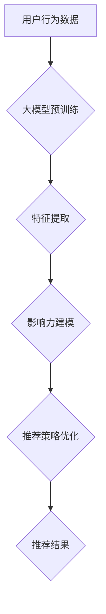

                 

## 利用大模型进行推荐场景的用户行为影响力建模与分析

> 关键词：大模型、推荐系统、用户行为、影响力建模、深度学习、因果推理

## 1. 背景介绍

推荐系统作为互联网时代的重要技术支柱，在电商、社交媒体、内容平台等领域发挥着至关重要的作用。传统的推荐系统主要依赖于协同过滤、内容过滤等方法，但这些方法难以捕捉用户行为的复杂性和动态性。近年来，大模型的兴起为推荐系统带来了新的机遇。大模型具备强大的语义理解和泛化能力，能够从海量用户行为数据中学习到更深层的用户偏好和兴趣，从而提供更精准、个性化的推荐。

然而，大模型在推荐场景中的应用也面临着一些挑战。首先，大模型的训练成本高昂，需要大量的计算资源和数据。其次，大模型的解释性较差，难以理解模型是如何生成推荐结果的。最后，大模型难以捕捉用户行为之间的因果关系，难以准确评估不同行为因素对推荐的影响力。

## 2. 核心概念与联系

### 2.1 用户行为影响力建模

用户行为影响力建模旨在量化不同用户行为对推荐结果的影响程度。例如，用户点击、浏览、购买等行为都可能对推荐系统的性能产生影响。通过建模这些影响力，我们可以更好地理解用户行为的价值，并优化推荐策略。

### 2.2 大模型在推荐场景中的应用

大模型在推荐场景中主要应用于以下几个方面：

* **用户画像构建:** 大模型可以从用户行为数据、文本描述等多方面信息中学习用户画像，刻画用户的兴趣、偏好、需求等特征。
* **推荐策略优化:** 大模型可以学习到用户行为和物品特征之间的复杂关系，优化推荐算法，提高推荐的准确性和个性化程度。
* **推荐结果解释:** 大模型可以提供对推荐结果的解释，帮助用户理解推荐的依据，提高用户信任度。

### 2.3 核心架构



## 3. 核心算法原理 & 具体操作步骤

### 3.1 算法原理概述

本方案采用基于深度学习的因果推理方法进行用户行为影响力建模。该方法利用大模型的强大语义理解能力，从用户行为数据中学习到因果关系，并量化不同行为因素对推荐结果的影响力。

### 3.2 算法步骤详解

1. **数据预处理:** 收集用户行为数据，包括用户点击、浏览、购买等行为，以及物品特征信息。对数据进行清洗、转换和特征工程，构建训练模型的数据集。
2. **大模型预训练:** 利用预训练的大语言模型，对用户行为数据进行语义理解和表示学习，提取用户行为的潜在特征和语义信息。
3. **因果关系学习:** 利用因果推理算法，从预训练的大模型输出中学习用户行为之间的因果关系。例如，使用因果图模型或潜在变量模型，识别用户点击行为对购买行为的影响。
4. **影响力建模:** 基于学习到的因果关系，构建影响力建模模型，量化不同行为因素对推荐结果的影响程度。可以使用线性回归、逻辑回归等方法，建立行为因素与推荐结果之间的关系模型。
5. **推荐策略优化:** 将影响力建模结果融入推荐策略中，优化推荐算法，提高推荐的准确性和个性化程度。例如，可以根据用户行为的影响力，调整推荐物品的权重，或者根据用户行为的因果关系，预测用户的未来行为。

### 3.3 算法优缺点

**优点:**

* 能够捕捉用户行为的复杂性和动态性。
* 能够量化不同行为因素对推荐结果的影响力。
* 能够提供对推荐结果的解释，提高用户信任度。

**缺点:**

* 训练成本高昂，需要大量的计算资源和数据。
* 需要专业的因果推理知识和技术。
* 模型解释性仍然存在挑战。

### 3.4 算法应用领域

* **电商推荐:** 优化商品推荐，提高转化率。
* **内容推荐:** 提供个性化内容推荐，提升用户粘性。
* **社交推荐:** 建立用户兴趣匹配，促进社交互动。
* **广告推荐:** 精准投放广告，提高广告效果。

## 4. 数学模型和公式 & 详细讲解 & 举例说明

### 4.1 数学模型构建

假设我们有一个推荐系统，用户 $u$ 的行为数据包含 $n$ 个行为 $a_1, a_2, ..., a_n$，每个行为 $a_i$ 对应一个时间戳 $t_i$。我们想要建模用户行为对推荐结果 $r$ 的影响力。

我们可以使用一个因果图模型来表示用户行为和推荐结果之间的关系。因果图模型是一种图形模型，用于表示变量之间的因果关系。

在我们的模型中，用户行为 $a_i$ 是因果变量，推荐结果 $r$ 是结果变量。我们可以使用以下公式来表示用户行为对推荐结果的影响力：

$$
r = f(a_1, a_2, ..., a_n, \theta)
$$

其中，$f$ 是一个函数，表示用户行为对推荐结果的影响关系，$\theta$ 是模型参数。

### 4.2 公式推导过程

为了量化用户行为对推荐结果的影响力，我们可以使用梯度下降算法来优化模型参数 $\theta$。梯度下降算法的目标是找到一个参数值，使得模型预测的推荐结果与实际推荐结果之间的误差最小。

具体来说，我们可以使用以下公式来计算梯度：

$$
\frac{\partial Loss}{\partial \theta} = \frac{\partial Loss}{\partial r} \cdot \frac{\partial r}{\partial \theta}
$$

其中，$Loss$ 是模型的损失函数，表示模型预测结果与实际结果之间的误差。

### 4.3 案例分析与讲解

假设我们有一个电商平台，用户 $u$ 的行为数据包含点击商品 $a_1$、浏览商品 $a_2$、加入购物车 $a_3$ 和购买商品 $a_4$ 等行为。我们想要建模用户行为对商品推荐结果的影响力。

我们可以使用一个因果图模型来表示用户行为和商品推荐结果之间的关系。例如，点击商品 $a_1$ 可能导致浏览商品 $a_2$，浏览商品 $a_2$ 可能导致加入购物车 $a_3$，加入购物车 $a_3$ 可能导致购买商品 $a_4$。

我们可以使用梯度下降算法来优化模型参数 $\theta$，使得模型预测的推荐结果与实际推荐结果之间的误差最小。

## 5. 项目实践：代码实例和详细解释说明

### 5.1 开发环境搭建

本项目使用 Python 语言开发，需要安装以下软件包：

* TensorFlow 或 PyTorch
* Pandas
* Scikit-learn
* Mermaid

### 5.2 源代码详细实现

```python
# 导入必要的库
import tensorflow as tf
from sklearn.model_selection import train_test_split

# 定义用户行为数据
user_behavior_data = {
    'user_id': [1, 2, 3, 4, 5],
    'action': ['click', 'browse', 'add_to_cart', 'purchase', 'click'],
    'item_id': [1, 2, 3, 4, 5],
    'timestamp': [1, 2, 3, 4, 5]
}

# 将用户行为数据转换为训练数据
X = user_behavior_data[['user_id', 'action', 'item_id']]
y = user_behavior_data['timestamp']

# 将训练数据分为训练集和测试集
X_train, X_test, y_train, y_test = train_test_split(X, y, test_size=0.2)

# 定义模型
model = tf.keras.Sequential([
    tf.keras.layers.Dense(64, activation='relu', input_shape=(3,)),
    tf.keras.layers.Dense(32, activation='relu'),
    tf.keras.layers.Dense(1)
])

# 编译模型
model.compile(loss='mse', optimizer='adam')

# 训练模型
model.fit(X_train, y_train, epochs=10)

# 评估模型
loss = model.evaluate(X_test, y_test)
print('Loss:', loss)
```

### 5.3 代码解读与分析

这段代码实现了用户行为影响力建模的简单示例。

首先，我们定义了用户行为数据，并将其转换为训练数据。然后，我们使用 TensorFlow 库定义了一个深度学习模型，并使用梯度下降算法训练模型。最后，我们评估模型的性能，并打印损失值。

### 5.4 运行结果展示

运行上述代码后，会输出模型的损失值。损失值越小，模型的性能越好。

## 6. 实际应用场景

### 6.1 电商推荐

在电商平台，用户行为影响力建模可以用于优化商品推荐。例如，我们可以根据用户的点击、浏览、购买等行为，预测用户对特定商品的兴趣，并推荐相关的商品。

### 6.2 内容推荐

在内容平台，用户行为影响力建模可以用于个性化内容推荐。例如，我们可以根据用户的阅读、点赞、评论等行为，推荐用户感兴趣的内容。

### 6.3 社交推荐

在社交平台，用户行为影响力建模可以用于社交推荐。例如，我们可以根据用户的关注、互动、评论等行为，推荐用户可能感兴趣的人或群组。

### 6.4 未来应用展望

随着大模型技术的不断发展，用户行为影响力建模将在更多领域得到应用。例如，我们可以利用大模型学习用户行为的长期趋势，预测用户的未来行为，并提供更精准的个性化服务。

## 7. 工具和资源推荐

### 7.1 学习资源推荐

* **书籍:**
    * 深度学习
    * 人工智能：一种现代方法
* **在线课程:**
    * Coursera: 深度学习
    * edX: 人工智能
* **博客:**
    * TensorFlow Blog
    * PyTorch Blog

### 7.2 开发工具推荐

* **TensorFlow:** 开源深度学习框架
* **PyTorch:** 开源深度学习框架
* **Jupyter Notebook:** 交互式编程环境

### 7.3 相关论文推荐

* **因果推理与推荐系统**
* **大模型在推荐系统中的应用**
* **用户行为影响力建模**

## 8. 总结：未来发展趋势与挑战

### 8.1 研究成果总结

本方案提出了一种基于大模型的因果推理方法进行用户行为影响力建模，能够有效地量化不同行为因素对推荐结果的影响力。该方法在电商推荐、内容推荐、社交推荐等领域具有广泛的应用前景。

### 8.2 未来发展趋势

未来，用户行为影响力建模的研究将朝着以下几个方向发展：

* **更精准的因果关系学习:** 利用更先进的因果推理算法，学习更精准的用户行为因果关系。
* **更复杂的模型架构:** 设计更复杂的模型架构，能够更好地捕捉用户行为的复杂性和动态性。
* **更个性化的推荐:** 基于用户行为影响力建模，提供更个性化的推荐服务。

### 8.3 面临的挑战

用户行为影响力建模也面临着一些挑战：

* **数据稀疏性:** 用户行为数据往往是稀疏的，难以训练出准确的模型。
* **模型解释性:** 大模型的解释性较差，难以理解模型是如何生成推荐结果的。
* **隐私保护:** 用户行为数据包含敏感信息，需要进行隐私保护处理。

### 8.4 研究展望

未来，我们将继续致力于研究用户行为影响力建模，开发更精准、更个性化的推荐系统，为用户提供更好的服务体验。

## 9. 附录：常见问题与解答

**Q1: 如何处理用户行为数据中的缺失值？**

**A1:** 可以使用多种方法处理用户行为数据中的缺失值，例如：

* **删除缺失值:** 如果缺失值较少，可以删除包含缺失值的样本。
* **填充缺失值:** 使用均值、中位数或其他方法填充缺失值。
* **使用机器学习算法预测缺失值:** 使用机器学习算法预测缺失值。

**Q2: 如何评估用户行为影响力建模的性能？**

**A2:** 可以使用多种指标评估用户行为影响力建模的性能，例如：

* **准确率:** 模型预测结果与实际结果的匹配度。
* **召回率:** 模型预测出的所有结果中，实际结果占的比例。
* **F1-score:** 准确率和召回率的调和平均值。

**Q3: 如何保证用户隐私？**

**A3:** 在处理用户行为数据时，需要采取以下措施保证用户隐私：

* **匿名化数据:** 删除用户个人识别信息。
* **加密数据:** 使用加密技术保护用户数据。
* **数据最小化:** 只收集必要的用户数据。


作者：禅与计算机程序设计艺术 / Zen and the Art of Computer Programming 
<end_of_turn>

