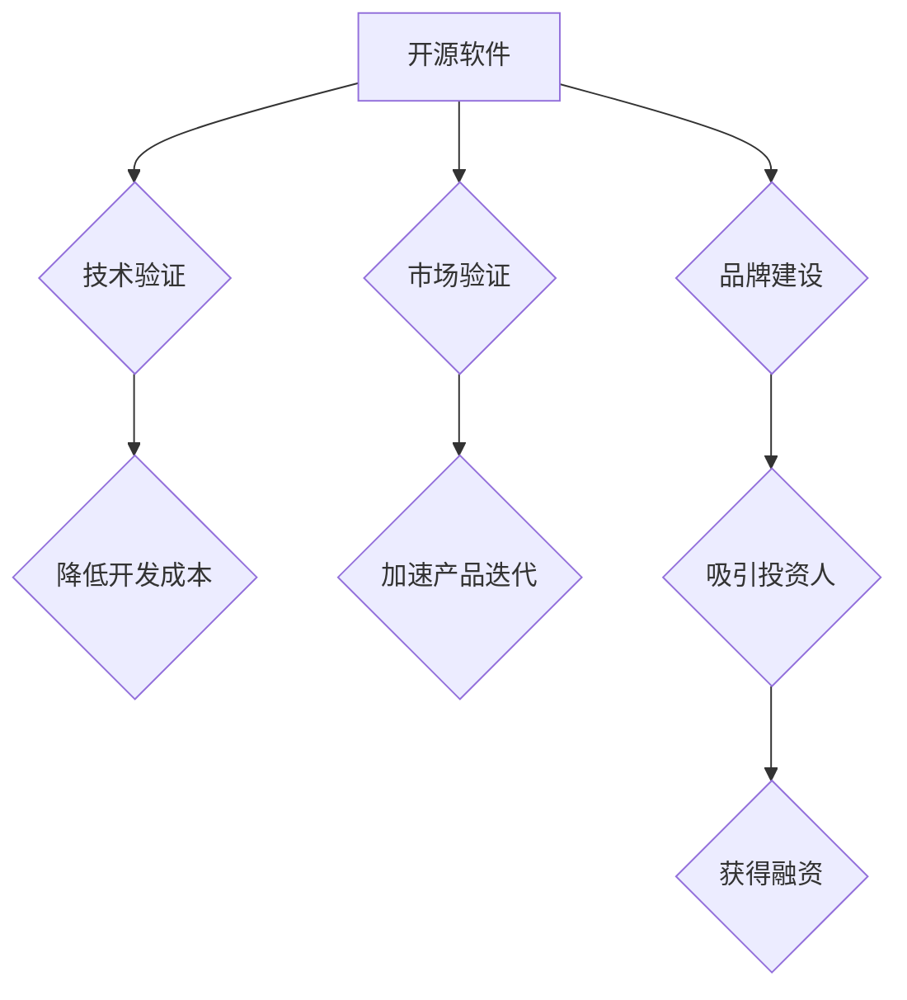

                 

## 利用开源影响力获得风险投资和融资

> 关键词：开源软件, 风险投资, 融资, 社区影响力, 技术验证, IP 价值

### 1. 背景介绍

在当今科技创新的快速发展环境下，风险投资和融资已成为众多科技初创公司发展壮大的重要驱动力。然而，在激烈的市场竞争中，如何有效地吸引投资人的目光，并获得融资支持，成为创业者面临的重大挑战。开源软件，作为一种开放、共享的软件开发模式，近年来在科技领域展现出强大的影响力，并逐渐成为一种重要的融资筹码。

开源软件的优势在于其开放性、透明性和社区驱动，这使得它能够快速迭代、不断改进，并积累庞大的用户群体和开发者社区。对于科技初创公司而言，开源软件可以作为一种技术验证、市场验证和品牌建设的有效工具，从而提升其融资吸引力。

### 2. 核心概念与联系

#### 2.1 开源软件的本质

开源软件是指源代码公开可供任何人免费使用、修改和再发布的软件。其核心价值在于开放共享，鼓励社区参与和协作，从而推动软件的快速发展和创新。

#### 2.2 风险投资与融资

风险投资是指投资于具有高成长潜力的初创公司，并期望获得高回报的投资方式。融资则是企业通过各种方式筹集资金，以支持其发展壮大的过程。

#### 2.3 开源软件与融资的联系

开源软件可以为科技初创公司带来以下融资优势：

* **技术验证:** 开源项目可以作为技术实力的证明，展示公司在特定领域的专业能力和技术水平。
* **市场验证:** 开源项目的活跃用户群体和社区反馈可以证明产品的市场需求和商业价值。
* **品牌建设:** 开源项目可以提升公司的品牌知名度和声誉，吸引更多用户和投资者的关注。
* **降低开发成本:** 利用开源组件和框架可以降低开发成本，提高开发效率。
* **加速产品迭代:** 开源社区的反馈和贡献可以加速产品的迭代和改进。

**Mermaid 流程图**

### 3. 核心算法原理 & 具体操作步骤

#### 3.1 算法原理概述

开源软件的成功与否取决于其社区生态的建设和维护。社区生态的建设需要遵循以下核心算法原理：

* **开放共享:** 源代码公开，鼓励社区成员参与贡献。
* **协作共建:** 鼓励社区成员互相帮助、共同解决问题。
* **透明度和可信度:** 开发过程透明公开，代码审查机制完善。
* **持续改进:** 持续迭代更新，根据社区反馈进行改进。

#### 3.2 算法步骤详解

1. **项目启动:** 确定开源项目的目标和方向，并发布项目宣言和代码仓库。
2. **社区建设:** 积极招募社区成员，建立沟通平台，组织线上线下活动。
3. **贡献管理:** 建立完善的贡献流程，包括代码审查、测试和发布。
4. **文档编写:** 提供详细的项目文档，包括使用指南、API 文档和开发指南。
5. **维护更新:** 定期发布新版本，修复bug，并根据社区反馈进行改进。

#### 3.3 算法优缺点

**优点:**

* **快速迭代:** 社区成员的共同参与可以加速软件的迭代和改进。
* **降低开发成本:** 利用社区成员的贡献可以降低开发成本。
* **提升软件质量:** 多人参与的代码审查和测试可以提升软件质量。
* **建立品牌影响力:** 开源项目可以提升公司的品牌知名度和声誉。

**缺点:**

* **社区管理难度:** 建立和维护一个活跃的社区需要投入大量的时间和精力。
* **知识产权风险:** 开源软件的知识产权保护需要谨慎处理。
* **商业模式挑战:** 如何从开源项目中获得商业收益是一个挑战。

#### 3.4 算法应用领域

开源软件的应用领域非常广泛，包括：

* **操作系统:** Linux, Android
* **数据库:** MySQL, PostgreSQL
* **编程语言:** Python, Java
* **Web 服务器:** Apache, Nginx
* **开发工具:** Git, Eclipse

### 4. 数学模型和公式 & 详细讲解 & 举例说明

#### 4.1 数学模型构建

开源软件社区的规模和活跃度可以用以下数学模型来描述：

* **社区规模:** N = f(T, C, I)
    * N: 社区规模
    * T: 项目活跃度
    * C: 社区参与度
    * I: 项目影响力

* **社区活跃度:** A = g(C, N, I)
    * A: 社区活跃度
    * C: 社区参与度
    * N: 社区规模
    * I: 项目影响力

#### 4.2 公式推导过程

以上模型的具体推导过程需要考虑多个因素，例如社区成员的贡献、项目更新频率、社区活动数量等。

#### 4.3 案例分析与讲解

例如，一个开源项目拥有大量的用户贡献、活跃的社区讨论和广泛的媒体报道，其社区规模和活跃度都较高。

$$
N = f(T, C, I) = f(high, high, high) = large
$$

$$
A = g(C, N, I) = g(high, large, high) = high
$$

### 5. 项目实践：代码实例和详细解释说明

#### 5.1 开发环境搭建

开源软件的开发环境搭建通常需要以下步骤：

1. 安装必要的软件工具，例如代码编辑器、版本控制系统和编译器。
2. 下载项目代码并将其克隆到本地。
3. 配置项目环境变量和依赖库。
4. 启动项目服务器或测试环境。

#### 5.2 源代码详细实现

开源软件的源代码实现通常使用特定编程语言编写，并遵循一定的编码规范和设计模式。

#### 5.3 代码解读与分析

开源软件的代码解读需要理解其设计思想、功能模块和交互逻辑。

#### 5.4 运行结果展示

开源软件的运行结果展示通常包括其功能演示、性能测试和用户反馈。

### 6. 实际应用场景

#### 6.1 开源软件在融资中的应用

开源软件可以作为科技初创公司融资的重要筹码，例如：

* **技术验证:** 展示公司的技术实力和创新能力。
* **市场验证:** 证明产品的市场需求和商业价值。
* **品牌建设:** 提升公司的品牌知名度和声誉。

#### 6.2 成功案例分析

例如，开源数据库 MySQL 的成功案例证明了开源软件在融资中的重要作用。MySQL 的开源模式吸引了大量的用户和开发者，并最终被 Oracle 收购，获得了巨额的融资回报。

#### 6.3 未来应用展望

随着开源软件的不断发展，其在融资中的应用场景将更加广泛，例如：

* **云计算平台:** 开源云计算平台可以吸引更多的用户和开发者，从而获得更多的融资支持。
* **人工智能:** 开源人工智能框架可以加速人工智能技术的普及，并为相关公司带来更多的融资机会。

### 7. 工具和资源推荐

#### 7.1 学习资源推荐

* **开源社区网站:** GitHub, GitLab, SourceForge
* **开源软件文档:** Apache, Linux Foundation, Mozilla
* **开源软件教程:** Udemy, Coursera, edX

#### 7.2 开发工具推荐

* **代码编辑器:** Visual Studio Code, Atom, Sublime Text
* **版本控制系统:** Git, SVN
* **构建工具:** Maven, Gradle

#### 7.3 相关论文推荐

* **The Economics of Open Source Software**
* **Open Source Software Development: A Review**
* **The Impact of Open Source Software on Innovation**

### 8. 总结：未来发展趋势与挑战

#### 8.1 研究成果总结

开源软件已经成为科技创新领域的重要力量，其开放共享的模式推动了软件的快速发展和普及。开源软件的成功案例证明了其在融资中的重要作用，并为科技初创公司提供了新的发展机遇。

#### 8.2 未来发展趋势

未来，开源软件将继续发展壮大，并呈现以下趋势：

* **更广泛的应用场景:** 开源软件将应用于更多领域，例如云计算、人工智能、物联网等。
* **更强大的社区生态:** 开源社区将更加活跃，并吸引更多开发者和用户参与。
* **更完善的商业模式:** 开源软件的商业模式将更加成熟，并提供更多盈利机会。

#### 8.3 面临的挑战

开源软件的发展也面临一些挑战，例如：

* **知识产权保护:** 如何有效保护开源软件的知识产权是一个重要问题。
* **社区治理:** 如何建立一个高效、公平、透明的社区治理机制是一个挑战。
* **商业化模式:** 如何将开源软件商业化，并获得可持续的盈利模式是一个难题。

#### 8.4 研究展望

未来研究方向包括：

* **开源软件的商业化模式创新:** 研究新的开源商业模式，并探索开源软件的盈利途径。
* **开源社区治理机制的优化:** 研究更有效的社区治理机制，并提高社区的参与度和凝聚力。
* **开源软件的知识产权保护:** 研究新的知识产权保护机制，并有效保护开源软件的权益。

### 9. 附录：常见问题与解答

#### 9.1 如何参与开源项目？

参与开源项目可以从以下几个方面开始：

* **阅读项目文档:** 了解项目的目标、功能和开发规范。
* **贡献代码:** 根据项目需求，提交代码修改或新功能实现。
* **测试代码:** 帮助测试代码的稳定性和功能性。
* **参与社区讨论:** 在项目论坛或邮件列表中参与讨论，分享经验和解决问题。

#### 9.2 开源软件的许可证有哪些？

常见的开源软件许可证包括：

* **GPL (GNU General Public License):** 要求软件的修改版本也必须开源。
* **MIT License:** 许可证较为宽松，允许商业用途和修改不开源。
* **Apache License:** 类似于 MIT License，但对贡献者有更严格的著作权声明要求。

#### 9.3 开源软件的商业模式有哪些？

开源软件的商业模式可以包括：

* **商业支持:** 提供付费的软件支持、培训和咨询服务。
* **企业版:** 提供付费的企业版软件，包含额外的功能和支持。
* **云服务:** 提供基于开源软件的云计算服务。
* **周边产品:** 开发基于开源软件的周边产品，例如硬件设备或插件。

作者：禅与计算机程序设计艺术 / Zen and the Art of Computer Programming 
<end_of_turn>

