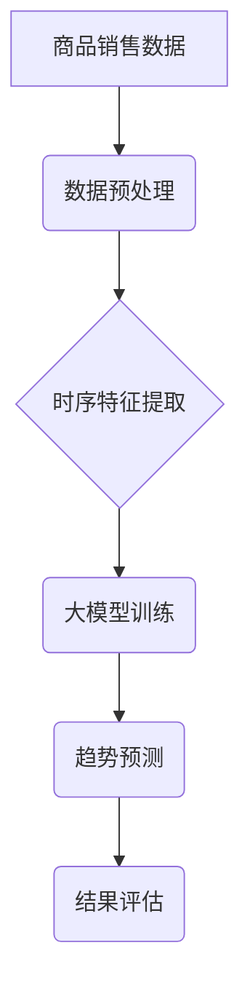

                 

## 大模型在商品趋势预测中的时序分析应用

> 关键词：大模型、时序分析、商品趋势预测、机器学习、深度学习、自然语言处理、数据挖掘

## 1. 背景介绍

在当今数据爆炸的时代，商品趋势预测已成为商业决策的关键环节。准确预测商品的未来销量和流行趋势，可以帮助企业优化库存管理、制定有效的营销策略、开发更符合市场需求的产品，从而提升竞争力。传统商品趋势预测方法主要依赖于专家经验和统计分析，但这些方法往往难以捕捉到复杂的数据模式和非线性关系。

近年来，随着深度学习技术的快速发展，大模型在各个领域展现出强大的应用潜力。大模型拥有海量参数和强大的学习能力，能够从海量数据中提取更深层的特征和模式，从而实现更精准的商品趋势预测。

## 2. 核心概念与联系

### 2.1 时序分析

时序分析是指对时间序列数据进行分析和预测的技术。商品趋势预测本质上就是对商品销售数据进行时序分析，识别出销售数据的规律性变化，并预测未来的销售趋势。

### 2.2 大模型

大模型是指参数规模庞大、训练数据量巨大的深度学习模型。大模型通常具有以下特点：

* **参数规模巨大:** 大模型拥有数亿甚至数十亿个参数，能够学习到更复杂的特征表示。
* **训练数据量庞大:** 大模型需要大量的训练数据才能发挥其强大的学习能力。
* **泛化能力强:** 大模型能够将从训练数据中学习到的知识应用到新的数据上，具有较强的泛化能力。

### 2.3 核心概念架构



## 3. 核心算法原理 & 具体操作步骤

### 3.1 算法原理概述

大模型在商品趋势预测中的时序分析应用主要基于以下算法原理：

* **循环神经网络 (RNN):** RNN 是一种能够处理序列数据的深度学习模型，能够学习时间序列中的依赖关系。
* **长短期记忆网络 (LSTM):** LSTM 是 RNN 的一种改进型，能够更好地处理长序列数据，并克服 RNN 的梯度消失问题。
* **Transformer:** Transformer 是一种基于注意力机制的深度学习模型，能够捕捉到序列数据中的长距离依赖关系，并取得了在自然语言处理领域的突破性进展。

### 3.2 算法步骤详解

1. **数据收集和预处理:** 收集历史商品销售数据，并进行清洗、格式化和特征工程等预处理操作。
2. **时序特征提取:** 从原始数据中提取时序特征，例如移动平均值、趋势、季节性等。
3. **大模型训练:** 使用 RNN、LSTM 或 Transformer 等模型对提取的时序特征进行训练，学习商品销售趋势的规律。
4. **趋势预测:** 将训练好的模型应用于新的数据，预测未来的商品销售趋势。
5. **结果评估:** 使用指标如均方误差 (MSE) 或平均绝对误差 (MAE) 对预测结果进行评估。

### 3.3 算法优缺点

**优点:**

* 能够捕捉到复杂的数据模式和非线性关系。
* 具有较强的预测精度。
* 可以处理海量数据。

**缺点:**

* 训练成本高，需要大量的计算资源和训练数据。
* 模型解释性较差，难以理解模型的决策过程。
* 对数据质量要求较高，数据噪声和异常值会影响预测结果。

### 3.4 算法应用领域

大模型在商品趋势预测中的时序分析应用不仅限于电商平台，还可以应用于以下领域:

* **零售行业:** 预测商品需求，优化库存管理，制定促销策略。
* **制造业:** 预测产品需求，优化生产计划，降低库存成本。
* **金融行业:** 预测股票价格、汇率等金融指标，辅助投资决策。
* **医疗行业:** 预测疾病流行趋势，优化医疗资源配置。

## 4. 数学模型和公式 & 详细讲解 & 举例说明

### 4.1 数学模型构建

假设我们有时间序列数据 $X = \{x_1, x_2, ..., x_T\}$, 其中 $x_t$ 表示时间 $t$ 的观测值。我们的目标是预测未来 $K$ 个时间步的观测值 $X' = \{x_{T+1}, x_{T+2}, ..., x_{T+K}\}$.

我们可以使用以下数学模型来表示商品趋势预测问题:

$$
\hat{X'} = f(X, \theta)
$$

其中:

* $\hat{X'}$ 是预测的未来观测值序列。
* $X$ 是历史观测值序列。
* $\theta$ 是模型参数。
* $f$ 是模型函数，例如 RNN、LSTM 或 Transformer。

### 4.2 公式推导过程

由于篇幅限制，这里不再详细推导 RNN、LSTM 或 Transformer 的公式。

### 4.3 案例分析与讲解

假设我们使用 LSTM 模型进行商品趋势预测。

* 训练数据: 过去 1 年的商品销售数据。
* 预测目标: 预测未来 3 个月的商品销售数据。

训练完成后，我们可以将未来 3 个月的历史数据作为输入，模型会根据训练到的知识预测未来 3 个月的商品销售数据。

## 5. 项目实践：代码实例和详细解释说明

### 5.1 开发环境搭建

* Python 3.x
* TensorFlow 或 PyTorch 深度学习框架
* NumPy、Pandas 等数据处理库

### 5.2 源代码详细实现

```python
import tensorflow as tf

# 定义 LSTM 模型
model = tf.keras.Sequential([
    tf.keras.layers.LSTM(units=128, return_sequences=True, input_shape=(timesteps, features)),
    tf.keras.layers.LSTM(units=64),
    tf.keras.layers.Dense(units=1)
])

# 编译模型
model.compile(loss='mse', optimizer='adam')

# 训练模型
model.fit(X_train, y_train, epochs=10, batch_size=32)

# 预测未来数据
predictions = model.predict(X_test)
```

### 5.3 代码解读与分析

* 我们使用 TensorFlow 框架构建了一个 LSTM 模型。
* 模型包含两层 LSTM 层和一层全连接层。
* 损失函数为均方误差 (MSE)，优化器为 Adam 优化器。
* 我们使用训练数据训练模型，并使用测试数据评估模型的性能。

### 5.4 运行结果展示

* 使用测试数据预测的商品销售数据与实际销售数据进行比较，并计算预测精度指标。

## 6. 实际应用场景

### 6.1 电商平台

* 预测商品销量，优化库存管理。
* 推送个性化商品推荐，提高用户转化率。
* 预判市场趋势，开发新品。

### 6.2 零售行业

* 预测商品需求，优化采购计划。
* 调整商品陈列，提高销售额。
* 预测促销效果，制定营销策略。

### 6.3 其他行业

* 预测金融指标，辅助投资决策。
* 预测疾病流行趋势，优化医疗资源配置。
* 预测天气变化，辅助农业生产。

### 6.4 未来应用展望

随着大模型技术的不断发展，其在商品趋势预测中的应用场景将更加广泛。未来，大模型将能够:

* 更加精准地预测商品趋势。
* 识别出更细粒度的商品趋势。
* 结合其他数据源，例如社交媒体数据和用户行为数据，进行更全面的趋势分析。

## 7. 工具和资源推荐

### 7.1 学习资源推荐

* **书籍:**
    * Deep Learning by Ian Goodfellow, Yoshua Bengio, and Aaron Courville
    * Hands-On Machine Learning with Scikit-Learn, Keras & TensorFlow by Aurélien Géron
* **在线课程:**
    * TensorFlow Tutorials: https://www.tensorflow.org/tutorials
    * PyTorch Tutorials: https://pytorch.org/tutorials/

### 7.2 开发工具推荐

* **TensorFlow:** https://www.tensorflow.org/
* **PyTorch:** https://pytorch.org/
* **Keras:** https://keras.io/

### 7.3 相关论文推荐

* **Attention Is All You Need:** https://arxiv.org/abs/1706.03762
* **Long Short-Term Memory:** https://arxiv.org/abs/1409.2329

## 8. 总结：未来发展趋势与挑战

### 8.1 研究成果总结

大模型在商品趋势预测中的时序分析应用取得了显著的成果，能够提高预测精度，并为商业决策提供更精准的数据支持。

### 8.2 未来发展趋势

* 模型规模和复杂度将进一步提升，能够捕捉到更深层的特征和模式。
* 模型训练效率将得到提高，降低训练成本。
* 模型解释性将得到增强，提高模型的可信度和可解释性。

### 8.3 面临的挑战

* 数据质量问题: 大模型对数据质量要求较高，数据噪声和异常值会影响预测结果。
* 计算资源限制: 训练大模型需要大量的计算资源，这对于一些小型企业来说是一个挑战。
* 模型解释性问题: 大模型的决策过程往往难以理解，这可能会导致模型的可信度和可解释性问题。

### 8.4 研究展望

未来研究将重点关注以下几个方面:

* 开发更鲁棒的模型，能够更好地应对数据质量问题。
* 探索更有效的训练方法，降低训练成本。
* 研究模型解释性技术，提高模型的可信度和可解释性。


## 9. 附录：常见问题与解答

* **Q: 大模型的训练成本很高，如何降低训练成本?**

* **A:** 可以使用模型压缩技术，例如剪枝和量化，降低模型参数量和计算复杂度。还可以使用分布式训练技术，将模型训练任务分发到多个机器上进行并行训练。

* **Q: 如何评估大模型的预测精度?**

* **A:** 可以使用均方误差 (MSE)、平均绝对误差 (MAE) 等指标来评估模型的预测精度。

* **Q: 大模型的决策过程难以理解，如何提高模型的可解释性?**

* **A:** 可以使用模型解释技术，例如 LIME 和 SHAP，来解释模型的决策过程。

作者：禅与计算机程序设计艺术 / Zen and the Art of Computer Programming 


<end_of_turn>

