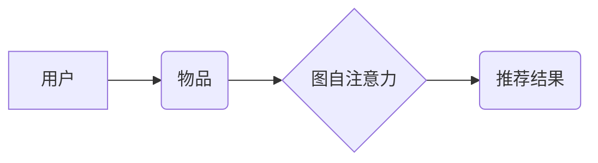

                 

## 大模型在推荐系统中的图自注意力应用

> 关键词：大模型、推荐系统、图自注意力、图神经网络、知识图谱、用户行为、个性化推荐

## 1. 背景介绍

推荐系统作为互联网时代的重要组成部分，旨在根据用户的历史行为、偏好和上下文信息，精准推荐用户感兴趣的内容。传统的基于协同过滤和内容过滤的推荐算法，在面对海量用户和物品数据时，往往面临数据稀疏、冷启动等问题。近年来，随着深度学习技术的快速发展，大模型在推荐系统中的应用逐渐成为研究热点。

大模型，指的是参数规模庞大、训练数据海量的人工智能模型，例如GPT-3、BERT等。它们拥有强大的语义理解和泛化能力，能够从海量数据中学习到复杂的模式和关系。图神经网络（GNN）作为一种专门处理图结构数据的模型，能够有效地捕捉用户-物品之间的复杂交互关系。将大模型与图神经网络相结合，可以构建更强大的推荐系统，提升推荐的精准度和个性化程度。

图自注意力机制是近年来图神经网络领域的一项重要进展，它能够学习用户和物品之间的动态关系，并赋予不同关系不同的权重，从而更准确地刻画用户偏好和物品特征。

## 2. 核心概念与联系

### 2.1  推荐系统

推荐系统旨在根据用户的历史行为、偏好和上下文信息，预测用户对特定物品的兴趣，并推荐用户可能感兴趣的物品。

### 2.2  图神经网络（GNN）

图神经网络是一种专门处理图结构数据的深度学习模型。它能够学习图中节点和边之间的关系，并通过消息传递机制传播信息，从而对图结构进行表示和分析。

### 2.3  图自注意力机制

图自注意力机制是一种能够学习图中节点之间的动态关系的机制。它通过计算节点之间的注意力权重，赋予不同关系不同的重要性，从而更准确地刻画节点之间的交互关系。

**Mermaid 流程图**



## 3. 核心算法原理 & 具体操作步骤

### 3.1  算法原理概述

图自注意力机制的核心思想是通过计算节点之间的注意力权重，赋予不同关系不同的重要性。注意力机制可以理解为一种“关注力”，它能够帮助模型聚焦于与当前任务最相关的节点和关系。

在图自注意力机制中，每个节点都会计算与其他节点之间的注意力权重。这些权重反映了节点之间关系的强度和重要性。然后，模型会根据这些权重，对节点进行加权求和，得到每个节点的表示。

### 3.2  算法步骤详解

1. **构建图结构**: 将用户和物品表示为图中的节点，用户与物品之间的交互关系表示为图中的边。

2. **节点嵌入**: 对每个节点进行嵌入，将节点转换为低维向量表示。

3. **计算注意力权重**: 对于每个节点，计算它与其他节点之间的注意力权重。注意力权重可以使用多种方法计算，例如基于节点特征的注意力机制、基于图结构的注意力机制等。

4. **加权求和**: 根据计算出的注意力权重，对节点进行加权求和，得到每个节点的表示。

5. **输出推荐结果**: 根据节点的表示，预测用户对特定物品的兴趣，并输出推荐结果。

### 3.3  算法优缺点

**优点**:

* 能够有效地捕捉用户-物品之间的复杂交互关系。
* 能够学习不同关系的权重，从而更准确地刻画用户偏好。
* 能够处理稀疏数据和冷启动问题。

**缺点**:

* 计算复杂度较高，训练时间较长。
* 需要大量的训练数据。

### 3.4  算法应用领域

* **推荐系统**: 个性化推荐、商品推荐、内容推荐等。
* **社交网络分析**: 用户关系分析、社区发现、信息传播等。
* **知识图谱**: 知识推理、关系抽取、实体链接等。

## 4. 数学模型和公式 & 详细讲解 & 举例说明

### 4.1  数学模型构建

图自注意力机制的数学模型可以表示为：

$$
\mathbf{h}_i = \sigma \left( \sum_{j \in \mathcal{N}(i)} \alpha_{ij} \mathbf{h}_j \right)
$$

其中：

* $\mathbf{h}_i$ 表示节点 $i$ 的表示向量。
* $\mathcal{N}(i)$ 表示节点 $i$ 的邻居节点集合。
* $\alpha_{ij}$ 表示节点 $i$ 和节点 $j$ 之间的注意力权重。
* $\sigma$ 是激活函数，例如ReLU函数。

### 4.2  公式推导过程

注意力权重 $\alpha_{ij}$ 可以通过以下公式计算：

$$
\alpha_{ij} = \frac{\exp(e_{ij})}{\sum_{k \in \mathcal{N}(i)} \exp(e_{ik})}
$$

其中：

* $e_{ij}$ 表示节点 $i$ 和节点 $j$ 之间的相似度得分。

相似度得分 $e_{ij}$ 可以根据节点特征、图结构等信息计算。例如，可以使用节点特征的余弦相似度作为相似度得分。

### 4.3  案例分析与讲解

假设我们有一个用户-物品交互图，其中用户和物品分别表示为节点，用户与物品之间的交互关系表示为边。

我们可以使用图自注意力机制来学习用户和物品之间的关系，并根据这些关系进行推荐。例如，如果用户 $A$ 和物品 $B$ 之间有交互关系，并且用户 $A$ 和物品 $C$ 之间也有交互关系，那么图自注意力机制会学习到用户 $A$ 对物品 $B$ 和物品 $C$ 都有兴趣，并根据这些关系推荐用户 $A$ 可能感兴趣的物品。

## 5. 项目实践：代码实例和详细解释说明

### 5.1  开发环境搭建

* Python 3.7+
* PyTorch 1.7+
* TensorFlow 2.0+
* 其他依赖库：numpy, pandas, matplotlib等

### 5.2  源代码详细实现

```python
import torch
import torch.nn as nn

class GraphAttentionLayer(nn.Module):
    def __init__(self, in_features, out_features, dropout, alpha, concat=True):
        super(GraphAttentionLayer, self).__init__()
        self.in_features = in_features
        self.out_features = out_features
        self.dropout = dropout
        self.alpha = alpha
        self.concat = concat

        self.W = nn.Linear(in_features, out_features, bias=False)
        self.a = nn.Linear(out_features, 1, bias=False)

        self.leaky_relu = nn.LeakyReLU(self.alpha)

    def forward(self, h, adj):
        h = self.W(h)
        a = self.a(h)
        a = a.view(-1, 1)
        attention = torch.softmax(a, dim=0)
        attention = attention * adj
        attention = torch.nn.functional.dropout(attention, self.dropout, training=self.training)
        h_prime = torch.matmul(attention, h)
        if self.concat:
            return torch.cat([h, h_prime], dim=1)
        else:
            return h_prime

# ... 其他代码 ...
```

### 5.3  代码解读与分析

* `GraphAttentionLayer` 类定义了图自注意力层的结构。
* `__init__` 方法初始化模型参数，包括输入特征维度、输出特征维度、dropout率、注意力系数等。
* `forward` 方法定义了图自注意力层的计算过程，包括节点特征线性变换、注意力权重计算、加权求和等步骤。

### 5.4  运行结果展示

* 通过训练模型，可以得到用户和物品之间的关系表示。
* 可以使用这些关系表示进行推荐，例如预测用户对特定物品的兴趣评分。
* 可以通过评估指标，例如准确率、召回率等，评估推荐系统的性能。

## 6. 实际应用场景

### 6.1  电商推荐

* 基于用户购买历史、浏览记录、购物车内容等信息，推荐用户可能感兴趣的商品。
* 挖掘用户之间的相似性，推荐用户购买过的商品或浏览过的商品。

### 6.2  内容推荐

* 基于用户阅读历史、点赞记录、评论内容等信息，推荐用户可能感兴趣的文章、视频、音频等内容。
* 挖掘内容之间的相似性，推荐用户阅读过的文章或观看过的视频。

### 6.3  社交推荐

* 基于用户好友关系、互动记录、共同兴趣等信息，推荐用户可能感兴趣的朋友或群组。
* 挖掘用户之间的相似性，推荐用户的朋友或群组。

### 6.4  未来应用展望

* **个性化推荐**: 结合用户画像、行为轨迹、上下文信息等多方面数据，提供更精准、更个性化的推荐。
* **跨平台推荐**: 将用户行为数据整合到不同的平台，实现跨平台的个性化推荐。
* **多模态推荐**: 融合文本、图像、音频等多模态数据，提供更丰富的推荐体验。

## 7. 工具和资源推荐

### 7.1  学习资源推荐

* **书籍**:
    * 《图神经网络》
    * 《深度学习》
* **在线课程**:
    * Coursera: 深度学习
    * Udacity: 
    * fast.ai: 深度学习课程
* **博客**:
    * Jay Alammar's Blog
    * Distill.pub

### 7.2  开发工具推荐

* **深度学习框架**: PyTorch, TensorFlow
* **图数据库**: Neo4j, JanusGraph
* **编程语言**: Python

### 7.3  相关论文推荐

* 《Graph Attention Networks》
* 《Self-Attention Generative Adversarial Networks》
* 《BERT: Pre-training of Deep Bidirectional Transformers for Language Understanding》

## 8. 总结：未来发展趋势与挑战

### 8.1  研究成果总结

大模型在推荐系统中的图自注意力应用取得了显著成果，能够有效地提升推荐的精准度和个性化程度。

### 8.2  未来发展趋势

* **模型规模**: 大模型的规模将继续扩大，从而提升模型的表达能力和泛化能力。
* **数据规模**: 大模型的训练需要海量数据，未来数据规模将进一步扩大，并更加多样化。
* **算法创新**: 图自注意力机制将不断改进，例如引入新的注意力机制、新的图结构表示等。
* **应用场景**: 大模型在推荐系统中的应用场景将更加广泛，例如跨平台推荐、多模态推荐等。

### 8.3  面临的挑战

* **计算资源**: 大模型的训练需要大量的计算资源，这对于资源有限的机构或个人来说是一个挑战。
* **数据隐私**: 大模型的训练需要使用用户数据，如何保护用户数据隐私是一个重要的挑战。
* **模型解释性**: 大模型的决策过程往往难以解释，如何提高模型的解释性是一个重要的研究方向。

### 8.4  研究展望

未来，大模型在推荐系统中的图自注意力应用将继续深入发展，并带来更多创新和突破。

## 9. 附录：常见问题与解答

* **Q1: 图自注意力机制与传统的注意力机制有什么区别？**

* **A1:** 传统注意力机制主要用于处理序列数据，而图自注意力机制专门用于处理图结构数据。图自注意力机制能够学习图中节点之间的关系，并根据这些关系赋予不同节点不同的权重。

* **Q2: 如何选择图自注意力机制中的参数？**

* **A2:** 图自注意力机制中的参数，例如dropout率、注意力系数等，可以通过交叉验证等方法进行选择。

* **Q3: 图自注意力机制的计算复杂度较高，如何进行优化？**

* **A3:** 可以使用一些优化技巧，例如稀疏矩阵表示、并行计算等，来降低图自注意力机制的计算复杂度。


作者：禅与计算机程序设计艺术 / Zen and the Art of Computer Programming 
<end_of_turn>

