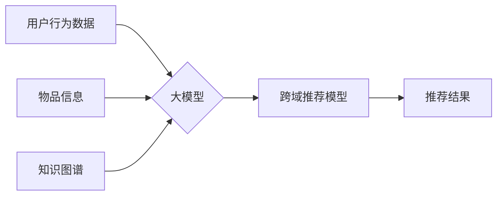

                 

## 大模型在跨域推荐中的应用

> 关键词：大模型、跨域推荐、知识图谱、多模态学习、迁移学习、个性化推荐

## 1. 背景介绍

推荐系统作为互联网时代的重要组成部分，在电商、社交媒体、内容平台等领域发挥着至关重要的作用。传统的推荐系统主要依赖用户行为数据，例如点击、购买、评分等，通过协同过滤、内容过滤等算法进行用户兴趣建模和推荐。然而，随着用户行为数据的稀疏性和冷启动问题日益突出，传统的推荐系统面临着新的挑战。

大模型的出现为跨域推荐提供了新的思路和可能性。大模型，例如GPT-3、BERT等，拥有强大的语义理解和文本生成能力，能够学习和理解跨域知识，并将其应用于推荐任务中。跨域推荐是指将不同领域的用户行为和物品信息进行融合，实现跨领域的用户兴趣建模和推荐。例如，将用户在电商平台的购买记录与用户在社交媒体上的兴趣爱好进行结合，为用户推荐更精准的商品。

## 2. 核心概念与联系

**2.1 核心概念**

* **大模型:** 指参数量巨大、训练数据海量的人工智能模型，具备强大的泛化能力和跨领域知识迁移能力。
* **跨域推荐:** 指将不同领域的用户行为和物品信息进行融合，实现跨领域的用户兴趣建模和推荐。
* **知识图谱:**  一种结构化的知识表示形式，将实体和关系以图的形式表示，能够有效地存储和推理跨域知识。

**2.2 架构图**



**2.3 联系**

大模型可以学习和理解跨域知识，知识图谱可以提供丰富的跨域知识，两者结合可以为跨域推荐提供更强大的支持。大模型可以利用知识图谱中的实体和关系，构建更精准的用户兴趣模型，并进行跨域推荐。

## 3. 核心算法原理 & 具体操作步骤

**3.1 算法原理概述**

跨域推荐算法的核心是融合不同领域的用户行为和物品信息，构建更全面的用户兴趣模型。大模型可以学习用户在不同领域的兴趣偏好，并将其应用于跨域推荐。常见的跨域推荐算法包括：

* **迁移学习:** 利用已训练好的模型在源域上的知识迁移到目标域，提高跨域推荐的性能。
* **多模态学习:** 将不同模态的数据（例如文本、图像、视频）进行融合，构建更丰富的用户兴趣模型。
* **知识增强推荐:** 利用知识图谱中的实体和关系，增强推荐系统的准确性和个性化程度。

**3.2 算法步骤详解**

1. **数据预处理:** 收集不同领域的用户信息和物品信息，并进行清洗、转换和特征提取。
2. **模型训练:** 利用大模型进行模型训练，例如BERT、GPT-3等，学习用户在不同领域的兴趣偏好。
3. **跨域知识融合:** 利用知识图谱中的实体和关系，将不同领域的知识进行融合，构建更全面的用户兴趣模型。
4. **推荐模型构建:** 基于训练好的大模型和融合后的跨域知识，构建跨域推荐模型，例如基于用户的协同过滤、基于内容的过滤等。
5. **推荐结果输出:** 根据用户的历史行为和兴趣偏好，输出个性化的推荐结果。

**3.3 算法优缺点**

* **优点:** 能够有效地解决传统推荐系统面临的稀疏性和冷启动问题，提高推荐的准确性和个性化程度。
* **缺点:** 需要大量的训练数据和计算资源，模型训练和部署成本较高。

**3.4 算法应用领域**

* **电商推荐:** 为用户推荐跨领域商品，例如根据用户的阅读兴趣推荐相关的书籍和电子产品。
* **内容推荐:** 为用户推荐跨领域内容，例如根据用户的新闻阅读兴趣推荐相关的视频和音频内容。
* **社交推荐:** 为用户推荐跨领域好友，例如根据用户的兴趣爱好推荐相关的用户。

## 4. 数学模型和公式 & 详细讲解 & 举例说明

**4.1 数学模型构建**

假设我们有一个用户集合U，物品集合I，用户-物品交互矩阵R，其中R(u,i)表示用户u对物品i的交互行为。

**用户兴趣模型:**

我们可以使用大模型学习用户u在不同领域d的兴趣向量，表示为：

$$
h_u^d = f_\theta(u, d)
$$

其中，$f_\theta$是参数为$\theta$的大模型，输入为用户u和领域d，输出为用户u在领域d的兴趣向量$h_u^d$。

**跨域推荐模型:**

我们可以使用一个跨域推荐模型，将不同领域的用户兴趣向量进行融合，预测用户u对物品i的交互行为：

$$
\hat{R}(u, i) = g_\phi(h_u^1, h_u^2, ..., h_u^D, i)
$$

其中，$g_\phi$是参数为$\phi$的跨域推荐模型，输入为用户u在所有领域d的兴趣向量和物品i的信息，输出为用户u对物品i的交互行为预测值$\hat{R}(u, i)$。

**4.2 公式推导过程**

具体的公式推导过程取决于所使用的跨域推荐算法。例如，如果使用迁移学习，可以将源域模型的参数进行微调，使其适应目标域的数据。如果使用多模态学习，可以将不同模态的数据进行融合，构建更丰富的用户兴趣模型。

**4.3 案例分析与讲解**

假设我们有一个电商平台，用户在平台上购买商品的同时，也会在社交媒体上分享自己的兴趣爱好。我们可以利用大模型学习用户的购买记录和社交媒体兴趣爱好，构建跨域用户兴趣模型。

例如，如果用户在电商平台购买了大量的运动装备，并在社交媒体上分享了跑步和健身的兴趣爱好，我们可以推断出用户的兴趣偏好是运动类商品。

## 5. 项目实践：代码实例和详细解释说明

**5.1 开发环境搭建**

* Python 3.7+
* PyTorch/TensorFlow
* CUDA Toolkit
* 其他必要的库，例如transformers、networkx等

**5.2 源代码详细实现**

```python
# 导入必要的库
import torch
from transformers import BertModel

# 定义跨域推荐模型
class CrossDomainRecommender(torch.nn.Module):
    def __init__(self, bert_model_name, num_users, num_items):
        super(CrossDomainRecommender, self).__init__()
        self.bert = BertModel.from_pretrained(bert_model_name)
        self.fc = torch.nn.Linear(768, num_items)

    def forward(self, user_ids, item_ids):
        # 获取用户和物品的bert嵌入
        user_embeddings = self.bert(input_ids=user_ids)[0]
        item_embeddings = self.bert(input_ids=item_ids)[0]
        # 计算用户和物品之间的相似度
        similarity = torch.matmul(user_embeddings, item_embeddings.T)
        # 通过全连接层输出预测结果
        predictions = self.fc(similarity)
        return predictions

# 实例化模型
model = CrossDomainRecommender(bert_model_name='bert-base-uncased', num_users=1000, num_items=10000)

# 训练模型
# ...

# 预测推荐结果
user_id = 123
item_ids = torch.tensor([456, 789, 1011])
predictions = model(user_id, item_ids)
```

**5.3 代码解读与分析**

* 该代码实现了一个基于BERT的大模型跨域推荐模型。
* 模型首先使用BERT模型获取用户和物品的文本嵌入。
* 然后，计算用户和物品之间的相似度。
* 最后，通过全连接层输出预测结果。

**5.4 运行结果展示**

运行结果将展示用户对不同物品的预测交互行为，例如点击、购买等。

## 6. 实际应用场景

**6.1 电商推荐**

* 为用户推荐跨领域商品，例如根据用户的阅读兴趣推荐相关的书籍和电子产品。
* 利用用户在电商平台的购买记录和社交媒体上的兴趣爱好，为用户推荐更精准的商品。

**6.2 内容推荐**

* 为用户推荐跨领域内容，例如根据用户的新闻阅读兴趣推荐相关的视频和音频内容。
* 利用用户在不同平台的浏览记录和兴趣偏好，为用户推荐更个性化的内容。

**6.3 社交推荐**

* 为用户推荐跨领域好友，例如根据用户的兴趣爱好推荐相关的用户。
* 利用用户在社交媒体上的互动记录和兴趣偏好，为用户推荐更合适的社交伙伴。

**6.4 未来应用展望**

* 大模型在跨域推荐领域的应用前景广阔，未来将会有更多创新应用场景出现。
* 例如，可以利用大模型学习用户的个性化需求，为用户提供更精准的定制化推荐。
* 还可以利用大模型进行跨语言、跨文化推荐，为全球用户提供更丰富的推荐服务。

## 7. 工具和资源推荐

**7.1 学习资源推荐**

* **书籍:**
    * 《深度学习》
    * 《自然语言处理》
    * 《推荐系统》
* **在线课程:**
    * Coursera: 深度学习
    * edX: 自然语言处理
    * fast.ai: 深度学习
* **博客和网站:**
    * Towards Data Science
    * Machine Learning Mastery
    * Analytics Vidhya

**7.2 开发工具推荐**

* **Python:** 
    * PyTorch
    * TensorFlow
    * scikit-learn
* **深度学习框架:**
    * TensorFlow
    * PyTorch
    * Keras
* **数据处理工具:**
    * Pandas
    * NumPy

**7.3 相关论文推荐**

* **BERT:** Devlin et al. (2018). BERT: Pre-training of Deep Bidirectional Transformers for Language Understanding.
* **迁移学习:** Pan et al. (2010). A Survey on Transfer Learning.
* **多模态学习:** Kiela et al. (2018). Multimodal Learning with Deep Neural Networks.

## 8. 总结：未来发展趋势与挑战

**8.1 研究成果总结**

大模型在跨域推荐领域取得了显著的成果，能够有效地解决传统推荐系统面临的挑战，提高推荐的准确性和个性化程度。

**8.2 未来发展趋势**

* **模型规模和能力的提升:** 未来大模型的规模和能力将进一步提升，能够学习更复杂的跨域知识，提供更精准的推荐。
* **多模态学习的深入研究:** 多模态学习将成为跨域推荐的重要研究方向，能够融合不同模态的数据，构建更丰富的用户兴趣模型。
* **个性化推荐的增强:** 未来将更加注重用户个性化的需求，利用大模型学习用户的细粒度兴趣偏好，提供更精准的定制化推荐。

**8.3 面临的挑战**

* **数据稀疏性和冷启动问题:** 跨域推荐需要大量的跨域数据，而这些数据往往稀疏且难以获取。
* **模型训练和部署成本:** 大模型的训练和部署成本较高，需要强大的计算资源和技术支持。
* **伦理和隐私问题:** 大模型的应用需要考虑伦理和隐私问题，例如数据安全、算法公平性等。

**8.4 研究展望**

未来跨域推荐的研究将更加注重以下方面:

* **高效的跨域知识融合方法:** 研究更有效的跨域知识融合方法，能够更好地利用跨域知识，提高推荐的准确性。
* **可解释性增强:** 研究大模型的推荐机制，提高推荐结果的可解释性，增强用户对推荐结果的信任。
* **隐私保护:** 研究隐私保护技术，保障用户数据的安全和隐私。


## 9. 附录：常见问题与解答

**9.1 如何选择合适的跨域推荐算法？**

选择合适的跨域推荐算法需要根据具体应用场景和数据特点进行选择。例如，如果数据稀疏，可以使用迁移学习算法；如果数据多模态，可以使用多模态学习算法。

**9.2 如何评估跨域推荐模型的性能？**

常用的评估指标包括准确率、召回率、F1-score等。

**9.3 如何解决跨域推荐中的数据稀疏问题？**

可以使用数据增强技术，例如文本生成、图像合成等，增加训练数据量。

**9.4 如何保证跨域推荐模型的公平性？**

需要关注算法设计和数据选择，避免算法偏见和数据偏差，确保推荐结果公平公正。


作者：禅与计算机程序设计艺术 / Zen and the Art of Computer Programming 
<end_of_turn>

