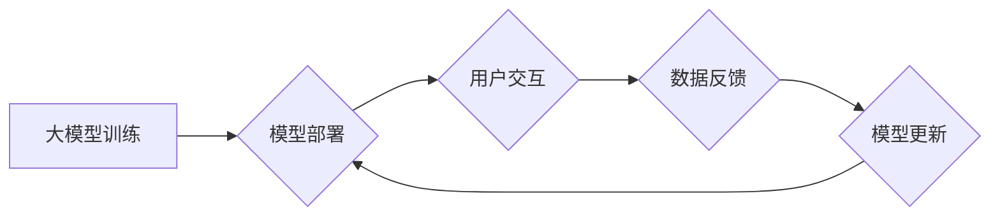

                 

## 大模型推荐中的模型更新与在线学习技术创新

> 关键词：大模型、模型更新、在线学习、推荐系统、迁移学习、知识蒸馏、联邦学习

## 1. 背景介绍

推荐系统作为连接用户需求与信息资源的重要桥梁，在电商、社交媒体、内容平台等领域发挥着至关重要的作用。随着大模型技术的蓬勃发展，大模型在推荐系统中的应用也日益广泛。大模型凭借其强大的语义理解和泛化能力，能够学习到更丰富的用户偏好和物品特征，从而提供更精准、个性化的推荐结果。

然而，大模型的训练成本高昂，且需要海量数据进行训练和更新。传统的离线训练方式难以满足推荐系统对实时性和动态性的需求。因此，如何高效地更新大模型，并使其能够适应不断变化的用户需求和数据分布，成为一个亟待解决的关键问题。

在线学习技术为大模型的动态更新提供了新的思路。在线学习能够在数据流式更新的情况下，实时地调整模型参数，从而实现模型的在线迭代和优化。

## 2. 核心概念与联系

### 2.1 模型更新

模型更新是指在训练完成后，根据新的数据或反馈信息，对模型参数进行调整的过程。其目的是为了提高模型的性能，使其能够更好地适应新的数据分布和用户需求。

### 2.2 在线学习

在线学习是一种机器学习方法，其特点是能够在数据流式更新的情况下，实时地调整模型参数。与传统的离线学习方法不同，在线学习不需要等待所有数据都收集完毕，而是能够在每次收到新数据时，即时地更新模型参数。

### 2.3 核心概念联系

大模型推荐中的模型更新与在线学习技术紧密相连。在线学习技术为大模型的动态更新提供了高效的解决方案。通过在线学习，大模型能够实时地适应新的数据分布和用户需求，从而提供更精准、个性化的推荐结果。

**Mermaid 流程图**



## 3. 核心算法原理 & 具体操作步骤

### 3.1 算法原理概述

在线学习算法的核心思想是利用梯度下降法，在每次收到新数据时，根据新数据的反馈信息，对模型参数进行微调。

### 3.2 算法步骤详解

1. **初始化模型参数:**  首先，需要对模型参数进行初始化。

2. **接收新数据:**  在线学习算法需要不断接收新的数据。

3. **计算梯度:**  对于每个新数据，计算模型预测结果与真实值的误差，并根据误差计算模型参数的梯度。

4. **更新模型参数:**  利用梯度下降法，根据计算出的梯度，对模型参数进行微调。

5. **重复步骤2-4:**  不断接收新数据，计算梯度，更新模型参数，直到模型性能达到预期目标。

### 3.3 算法优缺点

**优点:**

* **实时性:** 在线学习能够实时地更新模型参数，从而适应不断变化的数据分布和用户需求。
* **效率:** 在线学习不需要等待所有数据都收集完毕，能够节省时间和资源。
* **动态性:** 在线学习能够根据用户的反馈信息，动态地调整模型参数，从而提高模型的个性化程度。

**缺点:**

* **数据质量:** 在线学习算法对数据质量要求较高，如果数据存在噪声或偏差，可能会导致模型性能下降。
* **参数更新:** 参数更新需要谨慎控制，过大的更新幅度可能会导致模型不稳定，过小的更新幅度则可能会导致模型收敛速度慢。
* **冷启动问题:**  对于新用户或新物品，由于缺乏历史数据，在线学习算法可能难以准确地进行推荐。

### 3.4 算法应用领域

在线学习算法广泛应用于推荐系统、搜索引擎、自然语言处理等领域。

## 4. 数学模型和公式 & 详细讲解 & 举例说明

### 4.1 数学模型构建

在线学习算法通常基于梯度下降法，其目标是最小化模型预测结果与真实值的误差。

假设模型的预测结果为 $y_i$, 真实值为 $t_i$, 损失函数为 $L(y_i, t_i)$, 则模型的目标函数为:

$$
J = \sum_{i=1}^{N} L(y_i, t_i)
$$

其中 $N$ 为样本数量。

### 4.2 公式推导过程

利用梯度下降法，模型参数的更新规则为:

$$
\theta = \theta - \eta \nabla J
$$

其中 $\theta$ 为模型参数， $\eta$ 为学习率， $\nabla J$ 为目标函数 $J$ 的梯度。

### 4.3 案例分析与讲解

假设我们使用在线学习算法训练一个电影推荐模型。

* 模型预测结果为用户对电影的评分，真实值为用户实际给出的评分。
* 损失函数为均方误差 (MSE)。
* 学习率为 0.01。

当模型收到新的用户评分数据时，会计算模型预测结果与真实值的误差，并根据误差更新模型参数。

## 5. 项目实践：代码实例和详细解释说明

### 5.1 开发环境搭建

* Python 3.7+
* TensorFlow 2.0+
* PyTorch 1.0+

### 5.2 源代码详细实现

```python
import tensorflow as tf

# 定义模型
model = tf.keras.Sequential([
    tf.keras.layers.Dense(64, activation='relu'),
    tf.keras.layers.Dense(10, activation='softmax')
])

# 定义损失函数和优化器
loss_fn = tf.keras.losses.CategoricalCrossentropy()
optimizer = tf.keras.optimizers.Adam(learning_rate=0.01)

# 在线学习训练
def train_step(x, y):
    with tf.GradientTape() as tape:
        predictions = model(x)
        loss = loss_fn(y, predictions)
    gradients = tape.gradient(loss, model.trainable_variables)
    optimizer.apply_gradients(zip(gradients, model.trainable_variables))
    return loss

# 训练循环
for epoch in range(10):
    for batch in data_loader:
        x, y = batch
        loss = train_step(x, y)
        print(f'Epoch: {epoch}, Loss: {loss.numpy()}')
```

### 5.3 代码解读与分析

* 代码首先定义了一个简单的深度学习模型。
* 然后定义了损失函数和优化器。
* `train_step` 函数定义了在线学习的训练步骤，包括计算损失、计算梯度和更新模型参数。
* 训练循环迭代训练模型，并打印每个批次的损失值。

### 5.4 运行结果展示

训练完成后，可以将模型应用于新的数据，进行预测。

## 6. 实际应用场景

### 6.1 个性化推荐

在线学习可以根据用户的历史行为和反馈信息，实时地调整模型参数，从而提供更个性化的推荐结果。

### 6.2 内容过滤

在线学习可以用于过滤垃圾信息和恶意内容，并根据用户的偏好，推荐更优质的内容。

### 6.3 搜索结果优化

在线学习可以根据用户的搜索历史和反馈信息，实时地调整搜索结果的排序，从而提供更相关的搜索结果。

### 6.4 未来应用展望

在线学习技术在推荐系统中的应用前景广阔。未来，随着大模型技术的不断发展，在线学习技术将更加成熟和完善，能够为用户提供更精准、个性化、实时化的推荐服务。

## 7. 工具和资源推荐

### 7.1 学习资源推荐

* **在线学习算法:**
    * Andrew Ng 的机器学习课程: https://www.coursera.org/learn/machine-learning
    * Stanford CS229: Machine Learning: http://cs229.stanford.edu/
* **大模型推荐:**
    * Recommender Systems Handbook: https://www.amazon.com/Recommender-Systems-Handbook-Recommendation-Technology/dp/1491959272
    * ACM Transactions on Information Systems (TOIS): https://dl.acm.org/journal/tois

### 7.2 开发工具推荐

* **TensorFlow:** https://www.tensorflow.org/
* **PyTorch:** https://pytorch.org/
* **Scikit-learn:** https://scikit-learn.org/

### 7.3 相关论文推荐

* **Personalized Federated Learning for Recommendation Systems:** https://arxiv.org/abs/2006.09282
* **Knowledge Distillation for Recommender Systems:** https://arxiv.org/abs/1907.09697
* **Online Learning for Recommender Systems:** https://arxiv.org/abs/1706.06041

## 8. 总结：未来发展趋势与挑战

### 8.1 研究成果总结

大模型推荐中的模型更新与在线学习技术取得了显著的进展，为推荐系统的精准度、个性化程度和实时性带来了提升。

### 8.2 未来发展趋势

* **更强大的大模型:**  随着模型规模和训练数据的不断增长，大模型的推荐能力将进一步提升。
* **更有效的在线学习算法:**  研究人员将继续探索更有效的在线学习算法，以提高模型的收敛速度和泛化能力。
* **联邦学习的应用:**  联邦学习能够在保护用户隐私的前提下，实现大模型的联合训练和更新，有望成为大模型推荐的重要技术之一。

### 8.3 面临的挑战

* **数据质量:**  在线学习算法对数据质量要求较高，如何保证数据质量和可靠性仍然是一个挑战。
* **模型复杂度:**  大模型的复杂度较高，其参数更新和训练过程需要大量的计算资源。
* **公平性与可解释性:**  大模型推荐系统需要保证推荐结果的公平性和可解释性，避免出现歧视或不可理解的推荐行为。

### 8.4 研究展望

未来，大模型推荐的研究将继续朝着更精准、更个性化、更安全、更可解释的方向发展。


## 9. 附录：常见问题与解答

### 9.1 Q1: 在线学习与离线学习有什么区别？

**A1:** 在线学习能够在数据流式更新的情况下，实时地调整模型参数，而离线学习需要等待所有数据都收集完毕，才能进行模型训练。

### 9.2 Q2: 在线学习算法有哪些优缺点？

**A2:** 在线学习算法的优点是实时性、效率和动态性，缺点是数据质量要求高、参数更新需要谨慎控制和冷启动问题。

### 9.3 Q3: 如何选择合适的在线学习算法？

**A3:** 选择合适的在线学习算法需要考虑数据的特点、模型的复杂度和应用场景等因素。

### 9.4 Q4: 大模型推荐中的模型更新与在线学习技术有哪些应用场景？

**A4:** 大模型推荐中的模型更新与在线学习技术广泛应用于个性化推荐、内容过滤、搜索结果优化等场景。


作者：禅与计算机程序设计艺术 / Zen and the Art of Computer Programming 
<end_of_turn>

