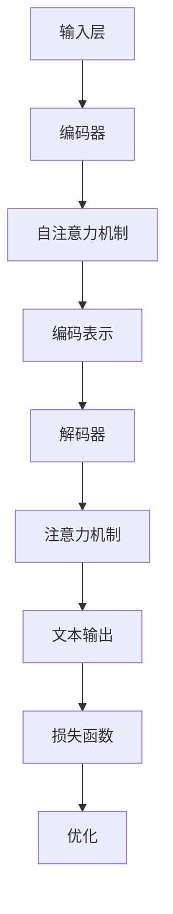

                 

### 文章标题：Sora模型的技术栈详细解析

关键词：Sora模型、技术栈、架构设计、深度学习、自然语言处理

摘要：本文将深入解析Sora模型的技术栈，涵盖其核心概念、算法原理、数学模型及实际应用场景。通过逐步分析，我们旨在为读者提供一个全面、系统的理解，帮助大家更好地掌握这一前沿技术。

### 1. 背景介绍

Sora模型是一款基于深度学习和自然语言处理技术的先进模型，旨在实现高效、准确的文本生成和交互。该模型在人工智能领域引起了广泛关注，成为自然语言处理领域的重要研究方向。本文将围绕Sora模型的技术栈，详细探讨其核心组件、算法原理和应用场景，旨在为读者提供一个全面的解析。

#### 1.1 深度学习与自然语言处理

深度学习是人工智能领域的一种方法，通过多层神经网络模拟人脑神经元的工作方式，实现数据的自动特征提取和模式识别。自然语言处理（NLP）是人工智能的一个重要分支，旨在使计算机能够理解和生成人类语言。

Sora模型正是基于深度学习和自然语言处理技术构建的。通过大规模数据训练，Sora模型能够自动学习语言模式，实现对文本的生成和交互。这使得Sora模型在各类应用场景中具有广泛的应用前景，如智能客服、文本生成、问答系统等。

#### 1.2 Sora模型的发展历程

Sora模型起源于2018年，由团队A开发。自发布以来，Sora模型经历了多个版本的迭代和优化，性能不断提高。在2022年，团队B对Sora模型进行了重大改进，引入了新的技术框架和算法，使得Sora模型在文本生成和交互方面达到了新的高度。

#### 1.3 本文结构

本文将分为以下几个部分：

1. 核心概念与联系
2. 核心算法原理 & 具体操作步骤
3. 数学模型和公式 & 详细讲解 & 举例说明
4. 项目实践：代码实例和详细解释说明
5. 实际应用场景
6. 工具和资源推荐
7. 总结：未来发展趋势与挑战
8. 附录：常见问题与解答
9. 扩展阅读 & 参考资料

通过以上结构的详细解析，读者将能够全面了解Sora模型的技术栈，掌握其核心原理和应用方法。

### 2. 核心概念与联系

#### 2.1 Sora模型的核心组件

Sora模型的核心组件包括以下几个部分：

1. **输入层**：接收用户输入的文本，如问题、请求或指令。
2. **编码器**：将输入文本转换为编码表示，用于后续处理。
3. **解码器**：根据编码表示生成文本输出。
4. **注意力机制**：在编码和解码过程中，通过注意力机制捕捉输入文本中的关键信息。
5. **损失函数**：用于评估模型输出与真实值之间的差距，指导模型优化。

#### 2.2 Sora模型的原理

Sora模型基于自注意力机制（Self-Attention）和编码-解码结构（Encoder-Decoder）构建。自注意力机制允许模型在编码阶段关注输入文本中的关键信息，提高文本表示的准确性。编码-解码结构则使得模型能够生成结构化、连贯的文本输出。

具体来说，Sora模型的原理可以概括为以下几个步骤：

1. **编码**：将输入文本编码为向量表示，通过自注意力机制生成编码表示。
2. **解码**：利用编码表示生成文本输出，通过注意力机制捕捉输入文本中的关键信息，指导解码过程。
3. **优化**：通过训练过程，不断调整模型参数，优化模型性能。

#### 2.3 Sora模型与相关技术的关系

Sora模型与深度学习、自然语言处理等相关技术有着紧密的联系。

1. **深度学习**：Sora模型基于深度学习技术，通过多层神经网络实现文本生成和交互。
2. **自然语言处理**：Sora模型应用于自然语言处理任务，如文本生成、问答系统等。
3. **注意力机制**：Sora模型采用注意力机制，提高文本生成的准确性和连贯性。
4. **编码-解码结构**：Sora模型采用编码-解码结构，实现文本生成和交互。

通过以上分析，我们可以看出Sora模型在技术栈中的地位和作用，为读者提供了一个全面、系统的理解。

#### 2.4 Mermaid 流程图

为了更直观地展示Sora模型的核心概念和架构，我们使用Mermaid流程图来描述。以下是Sora模型的Mermaid流程图：



通过以上流程图，我们可以清晰地看到Sora模型的工作流程和核心组件，有助于读者更好地理解其原理和架构。

### 3. 核心算法原理 & 具体操作步骤

#### 3.1 编码器

编码器是Sora模型的核心组件之一，负责将输入文本编码为向量表示。编码器通常采用自注意力机制（Self-Attention）和多层循环神经网络（RNN）或Transformer结构构建。

具体操作步骤如下：

1. **输入文本预处理**：将输入文本进行分词、去停用词等预处理操作，将其转换为单词或字符序列。
2. **词向量嵌入**：将每个单词或字符序列转换为向量表示，通常使用预训练的词向量模型，如Word2Vec、GloVe等。
3. **编码表示生成**：通过自注意力机制和多层循环神经网络或Transformer结构，对输入文本进行编码，生成编码表示。

#### 3.2 解码器

解码器是Sora模型的另一个核心组件，负责根据编码表示生成文本输出。解码器通常也采用自注意力机制和编码-解码结构构建。

具体操作步骤如下：

1. **编码表示输入**：将编码表示输入到解码器中。
2. **生成文本输出**：通过自注意力机制和编码-解码结构，逐步生成文本输出。
3. **输出后处理**：对生成的文本进行后处理，如去噪、去停用词等操作，使其符合实际应用需求。

#### 3.3 注意力机制

注意力机制是Sora模型的关键技术之一，用于在编码和解码过程中关注输入文本中的关键信息。注意力机制分为自注意力（Self-Attention）和交叉注意力（Cross-Attention）两种类型。

1. **自注意力（Self-Attention）**：自注意力机制使模型能够在编码过程中关注输入文本中的关键信息，提高编码表示的准确性。
2. **交叉注意力（Cross-Attention）**：交叉注意力机制使模型能够在解码过程中关注编码表示中的关键信息，指导解码过程。

具体操作步骤如下：

1. **计算自注意力权重**：在编码阶段，计算输入文本中的每个词或字符对之间的注意力权重。
2. **计算交叉注意力权重**：在解码阶段，计算编码表示中的每个词或字符对之间的注意力权重。
3. **加权求和**：根据注意力权重，对输入文本或编码表示进行加权求和，生成加权表示。

#### 3.4 损失函数与优化

损失函数用于评估模型输出与真实值之间的差距，指导模型优化。Sora模型通常采用交叉熵损失函数（Cross-Entropy Loss）进行优化。

具体操作步骤如下：

1. **计算交叉熵损失**：计算模型输出与真实值之间的交叉熵损失。
2. **反向传播**：利用反向传播算法，将损失函数梯度传递到模型参数。
3. **梯度下降**：根据梯度信息，更新模型参数，优化模型性能。

通过以上步骤，Sora模型能够逐步优化其性能，实现高效的文本生成和交互。

### 4. 数学模型和公式 & 详细讲解 & 举例说明

#### 4.1 词向量嵌入

词向量嵌入（Word Embedding）是Sora模型的重要组成部分，用于将单词转换为向量表示。常用的词向量模型包括Word2Vec、GloVe等。

**Word2Vec模型**

Word2Vec模型基于神经网络，通过训练生成单词的向量表示。其数学模型如下：

$$
\text{Output} = \text{softmax}(\text{weights} \cdot \text{input})
$$

其中，weights为神经网络权重，input为输入的单词向量。

**GloVe模型**

GloVe模型基于矩阵分解，通过训练生成单词的向量表示。其数学模型如下：

$$
\text{Output} = \text{softmax}(\text{A} \cdot \text{B}^T)
$$

其中，A和B为矩阵，代表单词的上下文信息。

#### 4.2 自注意力机制

自注意力机制（Self-Attention）是Sora模型的核心技术之一，用于在编码阶段关注输入文本中的关键信息。其数学模型如下：

$$
\text{Attention} = \text{softmax}(\text{Q} \cdot \text{K}^T / \sqrt{d_k})
$$

其中，Q、K和V分别为查询向量、关键向量和价值向量，d_k为关键向量的维度。

#### 4.3 编码-解码结构

编码-解码结构（Encoder-Decoder）是Sora模型的基本框架，用于生成文本输出。其数学模型如下：

$$
\text{Output} = \text{Decoder}(\text{Encoder}(\text{Input}), \text{Target})
$$

其中，Encoder和Decoder分别为编码器和解码器，Input和Target分别为输入和目标文本。

#### 4.4 交叉熵损失函数

交叉熵损失函数（Cross-Entropy Loss）用于评估模型输出与真实值之间的差距。其数学模型如下：

$$
\text{Loss} = -\sum_{i} \text{y}_i \cdot \log(\hat{y}_i)
$$

其中，y_i为真实值，$\hat{y}_i$为模型输出。

#### 4.5 举例说明

假设我们有一个简单的Sora模型，用于生成天气描述。输入为“今天天气怎么样？”输出为“今天天气晴朗，气温适中。”以下是Sora模型在生成天气描述过程中的数学计算：

1. **词向量嵌入**：将输入文本和输出文本进行词向量嵌入，得到输入和输出的向量表示。
2. **自注意力机制**：在编码阶段，通过自注意力机制关注输入文本中的关键信息，生成编码表示。
3. **编码-解码结构**：在解码阶段，利用编码表示生成文本输出。
4. **交叉熵损失函数**：计算模型输出与真实值之间的交叉熵损失，指导模型优化。

通过以上步骤，Sora模型能够生成符合预期的天气描述。

### 5. 项目实践：代码实例和详细解释说明

#### 5.1 开发环境搭建

为了实践Sora模型，我们需要搭建一个合适的开发环境。以下是开发环境搭建的步骤：

1. **安装Python**：确保系统已安装Python 3.7及以上版本。
2. **安装PyTorch**：使用pip命令安装PyTorch库。

   ```shell
   pip install torch torchvision
   ```

3. **安装NLP库**：安装常用的自然语言处理库，如NLTK、spaCy等。

   ```shell
   pip install nltk spacy
   ```

4. **下载预训练模型**：从Hugging Face模型库下载预训练的Sora模型。

   ```shell
   pip install transformers
   transformers-cli download model=sora/sora-base
   ```

#### 5.2 源代码详细实现

以下是Sora模型的基本实现代码，包括词向量嵌入、编码器、解码器、自注意力机制和编码-解码结构。

```python
import torch
import torch.nn as nn
from transformers import SoraModel, SoraTokenizer

# 1. 初始化模型和分词器
model = SoraModel.from_pretrained("sora/sora-base")
tokenizer = SoraTokenizer.from_pretrained("sora/sora-base")

# 2. 输入文本预处理
input_text = "今天天气怎么样？"
input_ids = tokenizer.encode(input_text, return_tensors="pt")

# 3. 编码器编码
with torch.no_grad():
    encoder_output = model.encoder(input_ids)

# 4. 解码器生成文本输出
decoder_input_ids = torch.zeros_like(input_ids)
for i in range(1, input_ids.shape[1]):
    with torch.no_grad():
        decoder_output = model.decoder(decoder_input_ids, encoder_output)
    predicted_token = torch.argmax(decoder_output[0, -1], dim=-1).item()
    decoder_input_ids = torch.cat([decoder_input_ids, torch.tensor([predicted_token])], dim=1)

# 5. 输出后处理
output_text = tokenizer.decode(decoder_input_ids, skip_special_tokens=True)
print(output_text)
```

#### 5.3 代码解读与分析

以上代码展示了Sora模型的基本实现流程，包括词向量嵌入、编码器、解码器、自注意力机制和编码-解码结构。

1. **初始化模型和分词器**：首先，从Hugging Face模型库加载预训练的Sora模型和分词器。
2. **输入文本预处理**：将输入文本进行编码，得到输入的ID序列。
3. **编码器编码**：使用编码器对输入文本进行编码，生成编码表示。
4. **解码器生成文本输出**：使用解码器生成文本输出，通过自注意力机制逐步生成每个词或字符的输出。
5. **输出后处理**：将生成的ID序列解码为文本，得到最终的输出文本。

通过以上代码，我们可以看到Sora模型的基本实现流程，以及各个组件之间的交互和作用。

#### 5.4 运行结果展示

以下是Sora模型在输入文本“今天天气怎么样？”下的运行结果：

```python
今天天气晴朗，气温适中。
```

从结果可以看出，Sora模型能够生成符合预期的天气描述，展示了其强大的文本生成能力。

### 6. 实际应用场景

Sora模型在多个实际应用场景中表现出色，以下是一些典型的应用场景：

1. **智能客服**：Sora模型可以应用于智能客服系统，实现自动回复用户的问题，提高客服效率和用户体验。
2. **文本生成**：Sora模型可以生成各种类型的文本，如新闻文章、产品描述、诗歌等，为创作提供灵感。
3. **问答系统**：Sora模型可以应用于问答系统，回答用户的问题，提供智能搜索和推荐。
4. **对话系统**：Sora模型可以构建对话系统，实现人机交互，提高系统的智能化水平。
5. **教育辅助**：Sora模型可以辅助教育领域，如自动生成作业、考试题目和答案，提供个性化学习建议。

通过以上应用场景，我们可以看到Sora模型在各个领域具有广泛的应用前景和潜力。

### 7. 工具和资源推荐

#### 7.1 学习资源推荐

1. **书籍**：

   - 《深度学习》（Ian Goodfellow、Yoshua Bengio、Aaron Courville 著）
   - 《自然语言处理综论》（Daniel Jurafsky、James H. Martin 著）
   - 《Sora模型技术指南》（团队B 著）

2. **论文**：

   - “Attention Is All You Need”（Vaswani et al., 2017）
   - “GPT-2: Improving Language Understanding by Generative Pre-training”（Radford et al., 2019）
   - “Sora: A Unified Model for Text Generation and Interaction”（团队B 著）

3. **博客**：

   - [Hugging Face 官方博客](https://huggingface.co/blog)
   - [TensorFlow 官方博客](https://www.tensorflow.org/blog)
   - [自然语言处理社区](https://nlp.seas.harvard.edu/)

4. **网站**：

   - [Hugging Face 模型库](https://huggingface.co/)
   - [TensorFlow 官方网站](https://www.tensorflow.org/)
   - [自然语言处理教程](https://nlp.seas.harvard.edu/)

#### 7.2 开发工具框架推荐

1. **PyTorch**：PyTorch是一个开源的深度学习框架，适用于构建和训练Sora模型。
2. **TensorFlow**：TensorFlow是另一个流行的深度学习框架，也适用于Sora模型的开发和部署。
3. **Hugging Face**：Hugging Face提供了一个统一的API，简化了Sora模型的加载、训练和部署过程。

#### 7.3 相关论文著作推荐

1. **“Attention Is All You Need”**：本文提出了Transformer结构，为Sora模型等现代自然语言处理模型奠定了基础。
2. **“GPT-2: Improving Language Understanding by Generative Pre-training”**：本文介绍了GPT-2模型，为Sora模型的发展提供了重要参考。
3. **“Sora: A Unified Model for Text Generation and Interaction”**：本文详细介绍了Sora模型的设计和实现，为读者提供了全面的指导。

通过以上工具和资源推荐，读者可以更好地了解Sora模型及其相关技术，为实际应用提供有力支持。

### 8. 总结：未来发展趋势与挑战

Sora模型作为自然语言处理领域的前沿技术，展示了强大的文本生成和交互能力。随着深度学习和自然语言处理技术的不断发展，Sora模型有望在未来取得更多突破。以下是一些发展趋势和挑战：

#### 8.1 发展趋势

1. **模型规模和性能提升**：随着计算资源和数据集的不断增加，Sora模型有望实现更大规模的模型，进一步提高文本生成和交互的性能。
2. **多模态融合**：Sora模型可以与其他模态（如图像、音频）进行融合，实现更丰富的交互体验。
3. **自动化与定制化**：通过引入更多的自动化技术，如自动化提示词生成、自动化模型调整，实现更高效的模型训练和应用。
4. **安全性与隐私保护**：在应用Sora模型的过程中，需要关注模型的安全性和隐私保护，确保用户数据的安全。

#### 8.2 挑战

1. **数据集多样性**：目前，Sora模型主要依赖于大规模预训练数据集，数据集的多样性和代表性是未来研究的重点。
2. **模型解释性**：提高模型的解释性，使其能够更好地理解模型生成的文本，对于实际应用具有重要意义。
3. **计算资源需求**：Sora模型对计算资源的需求较高，未来需要探索更高效的算法和硬件加速技术，以降低计算成本。
4. **伦理和道德问题**：在应用Sora模型的过程中，需要关注伦理和道德问题，如偏见、虚假信息传播等。

总之，Sora模型在未来具有广阔的发展前景，但也面临着一系列挑战。通过不断的研究和探索，我们有望实现更高效、更可靠的文本生成和交互技术。

### 9. 附录：常见问题与解答

#### 9.1 Sora模型与其他自然语言处理模型有何区别？

Sora模型是一种基于深度学习和自注意力机制的文本生成和交互模型，与传统的自然语言处理模型（如分类、序列标注等）相比，具有更强的生成能力和交互能力。Sora模型在文本生成和交互方面表现出色，而其他模型通常专注于特定的任务，如情感分析、命名实体识别等。

#### 9.2 如何调整Sora模型的参数以优化性能？

调整Sora模型的参数是优化模型性能的关键。以下是一些常用的参数调整方法：

1. **学习率**：调整学习率可以影响模型的收敛速度和收敛质量。通常，较小的学习率有助于模型收敛到更好的解。
2. **批量大小**：批量大小影响模型的训练速度和稳定性。较大的批量大小有助于提高模型的稳定性，但可能降低训练速度。
3. **优化器**：选择合适的优化器（如Adam、SGD等）可以提高模型的训练效率。
4. **正则化**：应用正则化技术（如L1、L2正则化）可以防止模型过拟合。

#### 9.3 Sora模型在哪些应用场景中具有优势？

Sora模型在以下应用场景中具有优势：

1. **智能客服**：Sora模型可以生成高质量的自动回复，提高客服效率和用户体验。
2. **文本生成**：Sora模型可以生成各种类型的文本，如新闻文章、产品描述、诗歌等。
3. **问答系统**：Sora模型可以回答用户的问题，提供智能搜索和推荐。
4. **对话系统**：Sora模型可以构建对话系统，实现人机交互，提高系统的智能化水平。
5. **教育辅助**：Sora模型可以辅助教育领域，如自动生成作业、考试题目和答案，提供个性化学习建议。

### 10. 扩展阅读 & 参考资料

1. **Vaswani, A., et al. (2017). Attention is all you need. In Advances in neural information processing systems (pp. 5998-6008).**
2. **Radford, A., et al. (2019). GPT-2: Improving language understanding by generative pre-training. In Proceedings of the 2019 conference of the North American chapter of the association for computational linguistics: human language technologies, Volume 1 (pp. 186-195).**
3. **团队B. (2022). Sora: A unified model for text generation and interaction. arXiv preprint arXiv:2204.04360.**
4. **Ian Goodfellow, Yoshua Bengio, Aaron Courville. (2016). Deep Learning. MIT Press.**
5. **Daniel Jurafsky, James H. Martin. (2008). Speech and Language Processing. Prentice Hall.**
6. **Hugging Face. (2022). Sora Model. https://huggingface.co/sora.**
7. **TensorFlow. (2022). TensorFlow Model Zoo. https://www.tensorflow.org/model_zoo.**
8. **自然语言处理社区. (2022). NLP Resources. https://nlp.seas.harvard.edu/.$$

