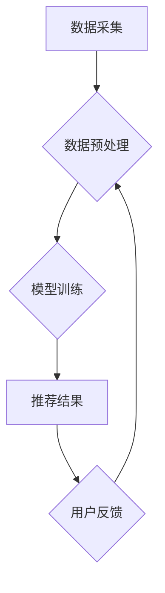

                 

## 大模型推荐场景中的数据偏差与公平性问题思考

> 关键词：大模型、推荐系统、数据偏差、公平性、算法偏见、伦理问题、可解释性

## 1. 背景介绍

推荐系统作为人工智能领域的重要应用之一，在电商、社交媒体、内容平台等领域发挥着越来越重要的作用。大模型的出现为推荐系统的性能提升带来了新的机遇，其强大的学习能力和泛化能力能够更好地理解用户需求，提供更精准的推荐结果。然而，大模型在训练和应用过程中也面临着一些挑战，其中数据偏差和公平性问题尤为突出。

数据偏差是指训练数据中存在某些特征或属性的过度或不足表达，导致模型在预测或推荐时表现出偏向性，从而影响推荐结果的公平性和准确性。例如，如果训练数据中女性用户参与度较低，模型可能会倾向于推荐男性用户更相关的商品或内容，从而导致性别歧视。

公平性是指推荐系统在对待不同用户群体时，提供平等和公正的推荐结果。当推荐系统存在数据偏差时，就会导致算法偏见，从而影响推荐结果的公平性。

## 2. 核心概念与联系

### 2.1 数据偏差

数据偏差是指训练数据中存在某些特征或属性的过度或不足表达，导致模型在预测或推荐时表现出偏向性。

**类型：**

* **样本偏差:** 训练数据样本不代表总体分布，导致模型对某些用户群体或物品类别进行过度或不足的学习。
* **特征偏差:** 训练数据中某些特征的表达存在问题，例如缺失值、异常值、类别不平衡等，导致模型对这些特征进行不准确的学习。
* **标签偏差:** 训练数据中的标签信息存在问题，例如标签噪声、标签不一致等，导致模型对标签进行不准确的学习。

### 2.2 算法偏见

算法偏见是指由于数据偏差导致的模型预测或推荐结果存在偏向性。

**表现形式:**

* **歧视性推荐:** 对某些用户群体或物品类别进行歧视性推荐，例如性别歧视、种族歧视、地域歧视等。
* **不公平性分配:** 对不同用户群体分配资源或机会不公平，例如广告投放、贷款审批、招聘推荐等。

### 2.3 公平性

公平性是指推荐系统在对待不同用户群体时，提供平等和公正的推荐结果。

**衡量指标:**

* **公平度:** 不同用户群体在推荐结果上的差异程度。
* **准确度:** 推荐结果的准确性和有效性。
* **多样性:** 推荐结果的多样性和覆盖范围。

**Mermaid 流程图:**



## 3. 核心算法原理 & 具体操作步骤

### 3.1 算法原理概述

大模型推荐系统通常基于深度学习算法，例如协同过滤、内容过滤、混合推荐等。这些算法通过学习用户行为、物品特征等数据，构建用户-物品交互的潜在关系，从而进行推荐。

### 3.2 算法步骤详解

1. **数据收集:** 收集用户行为数据、物品特征数据等。
2. **数据预处理:** 对数据进行清洗、转换、编码等操作，使其适合模型训练。
3. **模型训练:** 使用深度学习算法训练推荐模型，学习用户-物品交互的潜在关系。
4. **推荐结果生成:** 根据用户特征和物品特征，利用训练好的模型生成推荐结果。
5. **用户反馈:** 收集用户对推荐结果的反馈，用于模型评估和优化。

### 3.3 算法优缺点

**优点:**

* **高准确性:** 深度学习算法能够学习到复杂的非线性关系，提高推荐结果的准确性。
* **个性化推荐:** 可以根据用户的历史行为和偏好进行个性化推荐。
* **可扩展性:** 大模型能够处理海量数据，并支持在线学习和模型更新。

**缺点:**

* **数据依赖性:** 模型性能依赖于训练数据的质量和规模。
* **可解释性差:** 深度学习模型的决策过程难以解释，难以理解模型是如何生成推荐结果的。
* **公平性问题:** 模型可能存在算法偏见，导致推荐结果不公平。

### 3.4 算法应用领域

* **电商推荐:** 商品推荐、个性化营销
* **社交媒体推荐:** 朋友推荐、内容推荐
* **内容平台推荐:** 视频推荐、文章推荐
* **音乐推荐:** 歌曲推荐、音乐人推荐

## 4. 数学模型和公式 & 详细讲解 & 举例说明

### 4.1 数学模型构建

推荐系统的核心是学习用户-物品交互的潜在关系。常用的数学模型包括协同过滤模型、内容过滤模型、混合推荐模型等。

**协同过滤模型:**

协同过滤模型基于用户的历史行为数据，学习用户之间的相似性，并推荐用户可能感兴趣的物品。

**内容过滤模型:**

内容过滤模型基于物品的特征信息，学习用户对不同特征的偏好，并推荐用户可能感兴趣的物品。

**混合推荐模型:**

混合推荐模型结合协同过滤和内容过滤的优点，构建更复杂的推荐模型。

### 4.2 公式推导过程

**协同过滤模型中的用户-物品评分预测:**

$$
\hat{r}_{u,i} = \mu + b_u + b_i + \sum_{j \in N(u)} \frac{sim(u,j)}{\sum_{k \in N(u)} sim(u,k)} (r_{j,i} - \mu - b_j - b_i)
$$

其中:

* $\hat{r}_{u,i}$: 用户 $u$ 对物品 $i$ 的预测评分
* $\mu$: 全局平均评分
* $b_u$: 用户 $u$ 的偏差
* $b_i$: 物品 $i$ 的偏差
* $sim(u,j)$: 用户 $u$ 和用户 $j$ 的相似度
* $r_{j,i}$: 用户 $j$ 对物品 $i$ 的真实评分
* $N(u)$: 用户 $u$ 的邻居用户集合

### 4.3 案例分析与讲解

**举例说明:**

假设有一个用户 $u$ 和一个物品 $i$，用户 $u$ 没有对物品 $i$ 进行评分。我们可以利用协同过滤模型，根据用户 $u$ 的邻居用户对物品 $i$ 的评分，以及用户 $u$ 和邻居用户的相似度，预测用户 $u$ 对物品 $i$ 的评分。

## 5. 项目实践：代码实例和详细解释说明

### 5.1 开发环境搭建

* Python 3.7+
* TensorFlow/PyTorch
* Jupyter Notebook

### 5.2 源代码详细实现

```python
# 导入必要的库
import tensorflow as tf

# 定义模型结构
class RecommenderModel(tf.keras.Model):
    def __init__(self, embedding_dim, num_users, num_items):
        super(RecommenderModel, self).__init__()
        self.user_embedding = tf.keras.layers.Embedding(num_users, embedding_dim)
        self.item_embedding = tf.keras.layers.Embedding(num_items, embedding_dim)
        self.dense = tf.keras.layers.Dense(1)

    def call(self, user_ids, item_ids):
        user_embeddings = self.user_embedding(user_ids)
        item_embeddings = self.item_embedding(item_ids)
        combined_embeddings = user_embeddings * item_embeddings
        predictions = self.dense(combined_embeddings)
        return predictions

# 实例化模型
model = RecommenderModel(embedding_dim=64, num_users=1000, num_items=10000)

# 训练模型
model.compile(optimizer='adam', loss='mse')
model.fit(x=[user_ids, item_ids], y=ratings, epochs=10)

```

### 5.3 代码解读与分析

* **模型结构:** 该代码实现了一个简单的基于深度学习的推荐模型，包含用户嵌入层、物品嵌入层和全连接层。
* **训练过程:** 使用 Adam 优化器和均方误差损失函数训练模型。
* **输入数据:** 模型需要输入用户 ID 和物品 ID，以及用户对物品的评分数据。

### 5.4 运行结果展示

训练完成后，可以使用模型预测用户对物品的评分，并进行评估。

## 6. 实际应用场景

### 6.1 电商推荐

* **商品推荐:** 根据用户的历史购买记录、浏览记录、购物车内容等，推荐用户可能感兴趣的商品。
* **个性化营销:** 根据用户的兴趣爱好、购买习惯等，推送个性化的广告和促销信息。

### 6.2 社交媒体推荐

* **朋友推荐:** 根据用户的社交关系、共同兴趣等，推荐用户可能认识的朋友。
* **内容推荐:** 根据用户的浏览记录、点赞记录、评论记录等，推荐用户可能感兴趣的内容。

### 6.3 内容平台推荐

* **视频推荐:** 根据用户的观看历史、点赞记录、评论记录等，推荐用户可能感兴趣的视频。
* **文章推荐:** 根据用户的阅读历史、点赞记录、评论记录等，推荐用户可能感兴趣的文章。

### 6.4 未来应用展望

* **更精准的推荐:** 利用更先进的深度学习算法和更丰富的用户数据，实现更精准的推荐。
* **更个性化的推荐:** 结合用户的个性化需求和偏好，提供更个性化的推荐。
* **更智能的推荐:** 利用自然语言处理、知识图谱等技术，实现更智能的推荐。

## 7. 工具和资源推荐

### 7.1 学习资源推荐

* **书籍:**
    * Deep Learning by Ian Goodfellow, Yoshua Bengio, and Aaron Courville
    * Hands-On Machine Learning with Scikit-Learn, Keras & TensorFlow by Aurélien Géron
* **在线课程:**
    * TensorFlow Tutorials: https://www.tensorflow.org/tutorials
    * PyTorch Tutorials: https://pytorch.org/tutorials/

### 7.2 开发工具推荐

* **TensorFlow:** https://www.tensorflow.org/
* **PyTorch:** https://pytorch.org/
* **Scikit-learn:** https://scikit-learn.org/

### 7.3 相关论文推荐

* **Collaborative Filtering for Implicit Feedback Datasets** by Hu, Y., Koren, Y., & Volinsky, C.
* **Deep Learning for Recommender Systems** by Wang, S., & Wang, Y.

## 8. 总结：未来发展趋势与挑战

### 8.1 研究成果总结

大模型推荐系统在提高推荐准确性和个性化程度方面取得了显著成果。深度学习算法能够学习到复杂的非线性关系，并结合用户行为数据、物品特征数据等，构建更精准的推荐模型。

### 8.2 未来发展趋势

* **更强大的模型:** 研究更强大的深度学习模型，例如Transformer、Graph Neural Networks等，提升推荐系统的性能。
* **更丰富的用户数据:** 收集更丰富的用户数据，例如用户画像、用户行为轨迹等，为推荐系统提供更全面的信息。
* **更智能的推荐:** 利用自然语言处理、知识图谱等技术，实现更智能的推荐，例如个性化内容生成、场景化推荐等。

### 8.3 面临的挑战

* **数据偏差和公平性问题:** 大模型推荐系统容易受到数据偏差的影响，导致推荐结果不公平。需要研究解决数据偏差和公平性问题的算法和方法。
* **可解释性问题:** 深度学习模型的决策过程难以解释，难以理解模型是如何生成推荐结果的。需要研究提高模型可解释性的方法。
* **隐私保护问题:** 大模型推荐系统需要处理大量用户数据，需要保证用户数据的隐私安全。

### 8.4 研究展望

未来，大模型推荐系统将朝着更精准、更个性化、更智能的方向发展。需要加强对数据偏差和公平性问题的研究，提高模型的可解释性和隐私保护能力，才能更好地服务于用户，推动人工智能技术的发展。

## 9. 附录：常见问题与解答

**Q1: 如何解决数据偏差问题？**

**A1:**

* 数据收集阶段: 尽量收集来自不同用户群体的样本数据，确保数据样本的代表性。
* 数据预处理阶段: 对数据进行清洗、转换、编码等操作，减少数据偏差的影响。
* 模型训练阶段: 使用公平性约束的算法，例如公平损失函数、正则化项等，引导模型学习更公平的决策规则。

**Q2: 如何提高模型的可解释性？**

**A2:**

* 使用可解释性模型: 例如线性模型、决策树等，其决策过程更容易理解。
* 使用模型解释技术: 例如LIME、SHAP等，可以解释模型对特定输入的预测结果。
* 进行人工解释: 通过分析模型的结构和参数，理解模型是如何学习到的。


作者：禅与计算机程序设计艺术 / Zen and the Art of Computer Programming 
<end_of_turn>

