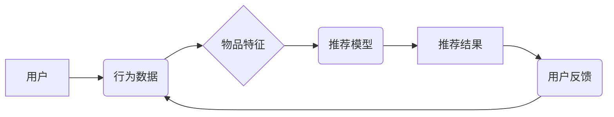
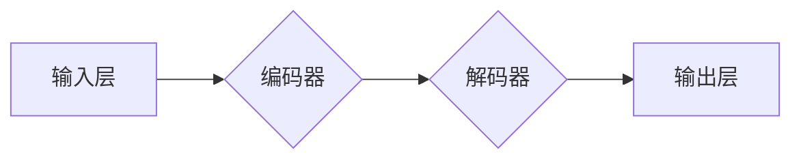

                 

## 大模型能改变推荐范式吗？

> 关键词：大模型、推荐系统、Transformer、个性化推荐、冷启动问题、数据效率、因果推理

## 1. 背景介绍

推荐系统是互联网时代的重要组成部分，它通过分析用户行为和物品特征，为用户提供个性化的建议，从而提升用户体验和商业价值。传统的推荐系统主要依赖于协同过滤、内容过滤和基于知识的推荐等方法，但这些方法在面对海量数据、用户多样性和冷启动问题时，存在一定的局限性。

近年来，大模型的快速发展为推荐系统带来了新的机遇。大模型，指的是参数规模庞大、训练数据海量的人工智能模型，例如GPT-3、BERT、PaLM等。这些模型拥有强大的语义理解和文本生成能力，能够从海量数据中学习到更深层的用户偏好和物品关系，从而提升推荐系统的准确性和个性化程度。

## 2. 核心概念与联系

### 2.1 推荐系统概述

推荐系统旨在根据用户的历史行为、偏好和上下文信息，预测用户对特定物品的兴趣，并提供个性化的建议。

**推荐系统架构**



### 2.2 大模型的优势

大模型在推荐系统中的优势主要体现在以下几个方面：

* **强大的语义理解能力:** 大模型能够理解用户输入的自然语言，并从中提取出用户的意图和需求。
* **丰富的知识表示:** 大模型通过训练海量文本数据，学习到了丰富的知识和语义关系，能够更好地理解用户和物品之间的关联。
* **个性化推荐:** 大模型能够根据用户的历史行为和偏好，生成个性化的推荐结果。
* **数据效率:** 大模型能够从有限的数据中学习到有效的知识，降低了推荐系统的训练成本。

### 2.3 大模型在推荐系统中的应用

大模型可以应用于推荐系统的各个环节，例如：

* **用户画像构建:** 利用大模型对用户的行为数据进行分析，构建更精准的用户画像。
* **物品特征提取:** 利用大模型对物品的描述文本进行分析，提取更丰富的物品特征。
* **推荐模型训练:** 利用大模型作为推荐模型的底层架构，提升推荐系统的准确性和个性化程度。
* **推荐结果生成:** 利用大模型生成更自然、更符合用户需求的推荐结果。

## 3. 核心算法原理 & 具体操作步骤

### 3.1 算法原理概述

大模型在推荐系统中的应用主要基于Transformer模型。Transformer模型是一种基于注意力机制的深度学习模型，能够有效地捕捉文本序列中的长距离依赖关系。

**Transformer模型架构**



编码器和解码器分别由多层Transformer模块组成，每个Transformer模块包含多头注意力机制、前馈神经网络和残差连接。

### 3.2 算法步骤详解

1. **数据预处理:** 将用户行为数据和物品特征数据进行清洗、转换和编码。
2. **模型训练:** 利用大模型训练数据，训练Transformer模型，学习用户和物品之间的关系。
3. **推荐结果生成:** 将用户的历史行为数据作为输入，通过训练好的Transformer模型，预测用户对特定物品的兴趣，并生成推荐结果。

### 3.3 算法优缺点

**优点:**

* 能够捕捉文本序列中的长距离依赖关系，提升推荐系统的准确性和个性化程度。
* 数据效率高，能够从有限的数据中学习到有效的知识。

**缺点:**

* 模型参数规模庞大，训练成本高。
* 需要大量的计算资源和存储空间。

### 3.4 算法应用领域

大模型在推荐系统中的应用领域广泛，例如：

* **电商推荐:** 为用户推荐商品。
* **内容推荐:** 为用户推荐新闻、视频、音乐等内容。
* **社交推荐:** 为用户推荐好友、群组等社交关系。

## 4. 数学模型和公式 & 详细讲解 & 举例说明

### 4.1 数学模型构建

大模型在推荐系统中的应用通常基于以下数学模型：

* **用户-物品交互矩阵:** 用来表示用户对物品的评分或点击行为。

* **嵌入向量:** 将用户和物品映射到低维向量空间，方便模型进行计算和学习。

* **注意力机制:** 用于计算用户对不同物品的关注程度，并根据关注程度调整推荐结果。

### 4.2 公式推导过程

Transformer模型的核心是注意力机制，其计算公式如下：

$$
Attention(Q, K, V) = softmax(\frac{QK^T}{\sqrt{d_k}})V
$$

其中：

* $Q$：查询向量
* $K$：键向量
* $V$：值向量
* $d_k$：键向量的维度
* $softmax$：softmax函数

### 4.3 案例分析与讲解

假设我们有一个用户-物品交互矩阵，其中每个元素表示用户对物品的评分。我们可以使用大模型将用户和物品映射到嵌入向量空间，并利用注意力机制计算用户对不同物品的关注程度。

例如，用户A对物品1评分为5，对物品2评分为3，对物品3评分为1。我们可以将用户A和物品1、物品2、物品3分别映射到嵌入向量空间，并计算用户A对每个物品的注意力权重。

根据注意力权重，我们可以生成一个推荐列表，将评分最高的物品排在前面。

## 5. 项目实践：代码实例和详细解释说明

### 5.1 开发环境搭建

推荐系统开发环境通常包括以下组件：

* **编程语言:** Python
* **深度学习框架:** TensorFlow、PyTorch
* **数据处理工具:** Pandas、NumPy
* **云计算平台:** AWS、Azure、GCP

### 5.2 源代码详细实现

以下是一个使用PyTorch实现的基于Transformer模型的推荐系统的代码示例：

```python
import torch
import torch.nn as nn

class TransformerRecommender(nn.Module):
    def __init__(self, embedding_dim, num_heads, num_layers):
        super(TransformerRecommender, self).__init__()
        self.embedding = nn.Embedding(num_users, embedding_dim)
        self.transformer = nn.Transformer(embedding_dim, num_heads, num_layers)
        self.fc = nn.Linear(embedding_dim, 1)

    def forward(self, user_ids, item_ids):
        user_embeddings = self.embedding(user_ids)
        item_embeddings = self.embedding(item_ids)
        output = self.transformer(user_embeddings, item_embeddings)
        scores = self.fc(output)
        return scores

# 实例化模型
model = TransformerRecommender(embedding_dim=64, num_heads=8, num_layers=2)

# 训练模型
# ...

# 生成推荐结果
user_id = 1
item_ids = torch.tensor([1, 2, 3])
scores = model(user_id, item_ids)
```

### 5.3 代码解读与分析

* `TransformerRecommender`类定义了推荐模型的结构。
* `embedding`层将用户和物品ID映射到嵌入向量空间。
* `transformer`层利用Transformer模型学习用户和物品之间的关系。
* `fc`层将Transformer模型的输出映射到评分。
* `forward`方法定义了模型的计算流程。

### 5.4 运行结果展示

训练完成后，我们可以使用模型生成推荐结果。例如，对于用户ID为1的用户，模型可以预测其对物品1、物品2、物品3的评分，并根据评分排序生成推荐列表。

## 6. 实际应用场景

### 6.1 电商推荐

大模型可以用于电商平台的商品推荐，例如：

* **个性化商品推荐:** 根据用户的历史购买记录、浏览记录和兴趣偏好，推荐个性化的商品。
* **新品推荐:** 推荐新上市的商品，帮助用户发现新产品。
* **关联推荐:** 根据用户购买的商品，推荐相关的商品。

### 6.2 内容推荐

大模型可以用于内容平台的推荐，例如：

* **新闻推荐:** 根据用户的阅读历史和兴趣偏好，推荐相关的新闻。
* **视频推荐:** 根据用户的观看历史和兴趣偏好，推荐相关的视频。
* **音乐推荐:** 根据用户的听歌历史和兴趣偏好，推荐相关的音乐。

### 6.3 社交推荐

大模型可以用于社交平台的推荐，例如：

* **好友推荐:** 根据用户的社交关系和兴趣偏好，推荐潜在的好友。
* **群组推荐:** 根据用户的兴趣偏好，推荐相关的群组。
* **话题推荐:** 根据用户的兴趣偏好，推荐相关的热门话题。

### 6.4 未来应用展望

大模型在推荐系统领域的应用前景广阔，未来可能应用于以下领域：

* **更精准的个性化推荐:** 大模型能够更好地理解用户的复杂需求，提供更精准的个性化推荐。
* **跨模态推荐:** 大模型能够处理多种类型的输入数据，例如文本、图像、音频等，实现跨模态的推荐。
* **因果推理推荐:** 大模型能够学习用户行为背后的因果关系，提供更合理的推荐解释。

## 7. 工具和资源推荐

### 7.1 学习资源推荐

* **书籍:**
    * Deep Learning by Ian Goodfellow, Yoshua Bengio, and Aaron Courville
    * Natural Language Processing with PyTorch by Yoav Goldberg
* **在线课程:**
    * Stanford CS224N: Natural Language Processing with Deep Learning
    * DeepLearning.AI TensorFlow Specialization

### 7.2 开发工具推荐

* **深度学习框架:** TensorFlow、PyTorch
* **数据处理工具:** Pandas、NumPy
* **云计算平台:** AWS、Azure、GCP

### 7.3 相关论文推荐

* Attention Is All You Need (Vaswani et al., 2017)
* BERT: Pre-training of Deep Bidirectional Transformers for Language Understanding (Devlin et al., 2018)
* Transformer-XL: Attentive Language Modeling Beyond Millions of Tokens (Dai et al., 2019)

## 8. 总结：未来发展趋势与挑战

### 8.1 研究成果总结

大模型在推荐系统领域取得了显著的成果，能够提升推荐系统的准确性和个性化程度。

### 8.2 未来发展趋势

未来，大模型在推荐系统领域的应用将朝着以下方向发展：

* **更强大的模型:** 模型参数规模将进一步扩大，模型能力将得到提升。
* **更精准的推荐:** 模型将能够更好地理解用户的复杂需求，提供更精准的个性化推荐。
* **更丰富的应用场景:** 大模型将应用于更多领域的推荐，例如跨模态推荐、因果推理推荐等。

### 8.3 面临的挑战

大模型在推荐系统领域也面临一些挑战：

* **训练成本高:** 大模型的训练需要大量的计算资源和时间。
* **数据效率:** 大模型需要海量数据才能有效训练。
* **可解释性:** 大模型的决策过程难以解释，缺乏透明度。

### 8.4 研究展望

未来研究将集中在以下几个方面：

* **降低训练成本:** 研究更有效的训练方法，降低大模型的训练成本。
* **提高数据效率:** 研究利用少量的训练数据也能训练出有效的大模型的方法。
* **提升可解释性:** 研究大模型的决策过程，提高推荐系统的透明度。


## 9. 附录：常见问题与解答

### 9.1 如何选择合适的模型架构？

选择合适的模型架构取决于具体的应用场景和数据特点。

* **用户-物品交互数据稀疏:** 可以考虑使用协同过滤或内容过滤等方法。
* **用户-物品交互数据丰富:** 可以考虑使用Transformer模型等深度学习方法。

### 9.2 如何处理冷启动问题？

冷启动问题是指新用户或新物品难以获得推荐结果的情况。

* **利用用户画像:** 利用用户的基本信息和行为数据构建用户画像，进行初步的推荐。
* **利用物品特征:** 利用物品的描述信息和相关属性进行推荐。
* **利用协同过滤:** 利用已有的用户-物品交互数据进行协同过滤，预测新用户或新物品的兴趣。

### 9.3 如何评估推荐系统的性能？

常用的推荐系统性能指标包括：

* **准确率:** 推荐结果与真实用户行为的匹配程度。
* **召回率:** 推荐结果包含真实用户感兴趣的物品的比例。
* **NDCG:** 衡量推荐结果的排序质量。

作者：禅与计算机程序设计艺术 / Zen and the Art of Computer Programming 


<end_of_turn>

