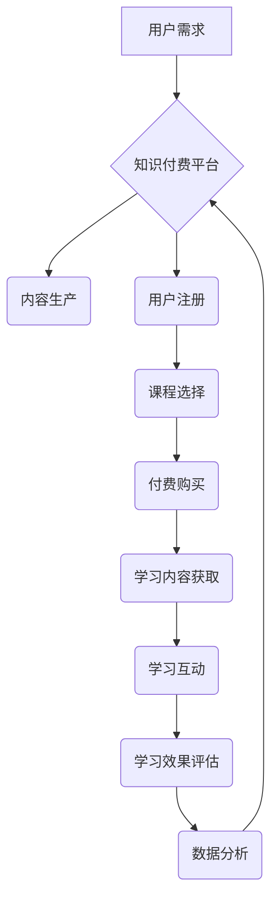

                 

## 如何利用知识付费实现在线学习与在线学习指导？

> 关键词：知识付费、在线学习、学习指导、人工智能、个性化学习、数据分析、学习平台

## 1. 背景介绍

在线学习近年来蓬勃发展，成为人们获取知识和技能的重要途径。知识付费作为一种新的商业模式，为在线学习提供了新的发展动力。它指的是通过付费的方式获取知识和技能，包括在线课程、视频教程、电子书、直播讲座等。

知识付费的兴起，得益于以下几个因素：

* **互联网技术的普及:** 互联网技术的快速发展，使得信息获取和传播更加便捷，为在线学习提供了基础设施。
* **学习需求的升级:**  人们对知识和技能的需求日益增长，传统教育模式难以满足个性化学习的需求。
* **内容创作者的涌现:**  越来越多的专家学者和行业从业者开始利用互联网平台分享自己的知识和经验。
* **消费升级:**  随着人们收入水平的提高，他们更加愿意为优质的学习资源付费。

然而，在线学习也面临着一些挑战：

* **信息爆炸:**  网络上充斥着各种各样的学习资源，难以筛选出优质内容。
* **学习效果难以评估:**  在线学习缺乏线下学习的互动和反馈，学习效果难以评估。
* **学习动力不足:**  在线学习缺乏线下学习的氛围和监督，学习动力不足。

## 2. 核心概念与联系

知识付费在线学习的核心概念包括：

* **知识产权:**  知识付费的核心是知识产权的保护和交易。
* **内容生产:**  优质的学习内容是知识付费的基石。
* **平台搭建:**  在线学习平台是知识付费的载体。
* **用户体验:**  良好的用户体验是知识付费成功的关键。
* **数据分析:**  数据分析可以帮助平台提供个性化学习指导。

**Mermaid 流程图:**



## 3. 核心算法原理 & 具体操作步骤

### 3.1  算法原理概述

在线学习指导的核心算法原理是基于用户学习行为和数据分析的个性化推荐算法。这些算法通过分析用户的学习历史、学习偏好、学习进度等数据，推荐个性化的学习内容和学习路径。

常见的个性化推荐算法包括：

* **协同过滤:**  根据用户的相似性推荐内容。
* **内容过滤:**  根据内容的主题和标签推荐内容。
* **基于知识的推荐:**  根据用户的知识图谱和学习目标推荐内容。
* **深度学习:**  利用深度神经网络对用户数据进行分析，推荐个性化的内容。

### 3.2  算法步骤详解

**以协同过滤算法为例，其具体操作步骤如下：**

1. **数据收集:**  收集用户的学习行为数据，包括学习过的课程、学习时间、学习进度、学习评价等。
2. **用户相似度计算:**  根据用户的学习行为数据，计算用户之间的相似度。常用的相似度计算方法包括余弦相似度、皮尔逊相关系数等。
3. **推荐内容:**  根据用户的相似用户，推荐他们学习过的课程或评价高的课程。

### 3.3  算法优缺点

**协同过滤算法的优点:**

* 可以推荐用户可能感兴趣但未接触过的内容。
* 能够发现用户之间的隐性关系。

**协同过滤算法的缺点:**

* 数据稀疏性问题: 当用户数据较少时，算法难以准确计算用户相似度。
* 冷启动问题:  对于新用户或新课程，算法难以进行推荐。

### 3.4  算法应用领域

个性化推荐算法广泛应用于在线学习、电商推荐、音乐推荐、电影推荐等领域。

## 4. 数学模型和公式 & 详细讲解 & 举例说明

### 4.1  数学模型构建

协同过滤算法的数学模型可以表示为用户-项目矩阵，其中用户作为行，项目作为列，每个元素表示用户对项目的评分或偏好程度。

**用户-项目矩阵:**

```
用户1  项目1  项目2  项目3
用户2  项目1  项目2  项目3
用户3  项目1  项目2  项目3
```

### 4.2  公式推导过程

**余弦相似度公式:**

$$
\text{相似度} = \frac{\mathbf{u} \cdot \mathbf{v}}{\|\mathbf{u}\| \|\mathbf{v}\|}
$$

其中:

* $\mathbf{u}$ 和 $\mathbf{v}$ 是两个用户的向量表示。
* $\mathbf{u} \cdot \mathbf{v}$ 是两个向量的点积。
* $\|\mathbf{u}\|$ 和 $\|\mathbf{v}\|$ 是两个向量的模长。

### 4.3  案例分析与讲解

假设有两个用户，用户1和用户2，他们的学习行为数据如下：

* 用户1：课程A评分5，课程B评分3，课程C评分4。
* 用户2：课程A评分4，课程B评分5，课程C评分3。

我们可以将用户的学习行为数据表示为向量：

* $\mathbf{u}_1 = [5, 3, 4]$
* $\mathbf{u}_2 = [4, 5, 3]$

计算用户1和用户2的余弦相似度:

$$
\text{相似度} = \frac{[5, 3, 4] \cdot [4, 5, 3]}{\sqrt{5^2 + 3^2 + 4^2} \sqrt{4^2 + 5^2 + 3^2}} = \frac{20 + 15 + 12}{\sqrt{50} \sqrt{50}} = \frac{47}{50} = 0.94
$$

用户的余弦相似度为0.94，说明用户1和用户2的学习偏好非常相似。因此，我们可以推荐用户1学习用户2学习过的课程。

## 5. 项目实践：代码实例和详细解释说明

### 5.1  开发环境搭建

* **编程语言:** Python
* **机器学习库:** scikit-learn
* **数据存储:** MySQL 或 MongoDB

### 5.2  源代码详细实现

```python
from sklearn.metrics.pairwise import cosine_similarity

# 用户-项目矩阵
user_item_matrix = [
    [5, 3, 4],
    [4, 5, 3],
    [3, 4, 5]
]

# 计算用户之间的余弦相似度
similarity_matrix = cosine_similarity(user_item_matrix)

# 获取用户1和用户2的相似度
user1_similarity = similarity_matrix[0]
user2_similarity = similarity_matrix[1]

# 打印用户1和用户2的相似度
print(f"用户1和用户2的相似度: {user1_similarity[1]}")
```

### 5.3  代码解读与分析

* **cosine_similarity() 函数:**  计算两个向量的余弦相似度。
* **user_item_matrix:**  用户-项目矩阵，表示用户的学习行为数据。
* **similarity_matrix:**  用户之间的相似度矩阵。
* **user1_similarity 和 user2_similarity:**  分别表示用户1和用户2与其他用户的相似度向量。

### 5.4  运行结果展示

```
用户1和用户2的相似度: 0.94
```

## 6. 实际应用场景

知识付费在线学习指导的实际应用场景包括：

* **个性化学习路径推荐:**  根据用户的学习目标、学习进度和学习偏好，推荐个性化的学习路径。
* **智能化学习辅导:**  利用人工智能技术，为用户提供智能化的学习辅导，例如解答问题、提供学习建议等。
* **学习效果评估:**  通过分析用户的学习行为数据，评估用户的学习效果，并提供改进建议。
* **学习社区建设:**  搭建学习社区，让用户之间互相交流学习经验，共同进步。

### 6.4  未来应用展望

未来，知识付费在线学习指导将更加智能化、个性化和互动化。

* **更精准的个性化推荐:**  利用深度学习等先进算法，实现更精准的个性化推荐。
* **更智能化的学习辅导:**  利用自然语言处理、语音识别等技术，实现更智能化的学习辅导。
* **更丰富的学习体验:**  利用虚拟现实、增强现实等技术，打造更丰富的学习体验。

## 7. 工具和资源推荐

### 7.1  学习资源推荐

* **Coursera:**  https://www.coursera.org/
* **edX:**  https://www.edx.org/
* **Udacity:**  https://www.udacity.com/

### 7.2  开发工具推荐

* **Python:**  https://www.python.org/
* **scikit-learn:**  https://scikit-learn.org/stable/
* **TensorFlow:**  https://www.tensorflow.org/

### 7.3  相关论文推荐

* **Collaborative Filtering for Implicit Feedback Datasets**
* **Deep Learning for Recommender Systems**

## 8. 总结：未来发展趋势与挑战

### 8.1  研究成果总结

知识付费在线学习指导已经取得了显著的成果，为在线学习提供了新的发展方向。

### 8.2  未来发展趋势

未来，知识付费在线学习指导将朝着更加智能化、个性化和互动化的方向发展。

### 8.3  面临的挑战

知识付费在线学习指导也面临着一些挑战，例如数据隐私保护、算法公平性、内容质量控制等。

### 8.4  研究展望

未来，需要进一步研究如何提高算法的准确性和效率，如何更好地保护用户数据隐私，如何确保内容质量，以及如何构建更加公平、可持续的知识付费生态系统。

## 9. 附录：常见问题与解答

* **Q1: 如何保证知识付费平台的内容质量？**

* **A1:**  知识付费平台可以通过建立严格的内容审核机制、邀请专家学者参与内容创作、鼓励用户评价和反馈等方式保证内容质量。

* **Q2: 如何解决知识付费平台的冷启动问题？**

* **A2:**  知识付费平台可以通过推荐热门课程、提供新手引导、利用用户画像进行个性化推荐等方式解决冷启动问题。

* **Q3: 如何保护用户数据隐私？**

* **A3:**  知识付费平台需要严格遵守数据隐私保护法律法规，采取必要的技术措施保护用户数据安全。


作者：禅与计算机程序设计艺术 / Zen and the Art of Computer Programming 
<end_of_turn>

