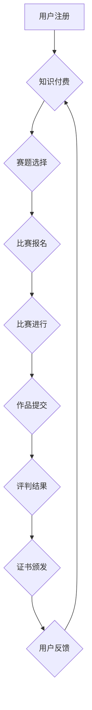

                 

## 如何利用知识付费实现在线技能大赛与竞赛组织服务？

> 关键词：知识付费、在线技能大赛、竞赛组织、技术平台、数据分析、用户体验、激励机制

## 1. 背景介绍

随着互联网技术的快速发展和普及，在线教育和知识付费市场蓬勃发展。人们对提升自身技能和获取专业知识的需求日益增长，而在线技能大赛和竞赛作为一种新型的学习和竞争模式，也逐渐受到关注。

在线技能大赛和竞赛能够为参与者提供一个展示能力、提升技能、获得认可的平台。同时，对于企业和组织来说，在线技能大赛和竞赛可以帮助他们发现和培养人才，提升品牌形象，促进技术创新。

然而，传统的线下技能大赛和竞赛模式存在着时间、地点、成本等方面的限制，难以满足现代社会对灵活、便捷、高效的学习和竞争需求。因此，利用知识付费模式构建在线技能大赛和竞赛平台，成为了一种新的趋势。

## 2. 核心概念与联系

**2.1 知识付费**

知识付费是指通过付费的方式获取知识、技能和服务。它是一种基于价值交换的商业模式，通过提供有价值的知识和服务，满足用户学习和提升的需求，实现盈利。

**2.2 在线技能大赛与竞赛**

在线技能大赛和竞赛是指在互联网平台上组织的，以测试和评估参与者技能水平的活动。它通常包括以下几个环节：

* **报名注册:** 参与者需要在平台上注册账号，并提交相关信息。
* **赛题发布:** 平台会发布相关的赛题，并提供相关资料和指导。
* **比赛进行:** 参与者在规定时间内完成赛题，并提交解决方案。
* **评判结果:** 平台会对提交的解决方案进行评判，并公布最终排名和获奖名单。

**2.3 平台架构**

在线技能大赛和竞赛平台通常由以下几个模块组成：

* **用户管理模块:** 用于管理用户注册、登录、信息维护等功能。
* **赛题管理模块:** 用于发布、管理和维护赛题信息。
* **比赛管理模块:** 用于管理比赛时间、规则、报名等功能。
* **评判管理模块:** 用于对参赛作品进行评判和评分。
* **数据分析模块:** 用于收集和分析比赛数据，提供用户行为分析、竞赛趋势分析等服务。

**2.4 核心流程图**



## 3. 核心算法原理 & 具体操作步骤

**3.1 算法原理概述**

在线技能大赛和竞赛平台的算法原理主要围绕着以下几个方面：

* **用户匹配算法:** 根据用户的技能水平、兴趣爱好等信息，匹配合适的赛题和比赛。
* **赛题推荐算法:** 根据用户的学习历史、考试成绩等信息，推荐相关的赛题和学习资源。
* **评判算法:** 根据比赛规则和标准，对参赛作品进行客观、公正的评判。
* **数据分析算法:** 对比赛数据进行分析，挖掘用户行为模式、竞赛趋势等信息。

**3.2 算法步骤详解**

* **用户匹配算法:**

    1. 收集用户基本信息，包括技能水平、兴趣爱好、学习目标等。
    2. 利用机器学习算法，构建用户画像，并进行用户分组。
    3. 根据用户分组，推荐合适的赛题和比赛。

* **赛题推荐算法:**

    1. 收集用户的学习历史、考试成绩等信息。
    2. 利用协同过滤算法或内容过滤算法，推荐相关的赛题和学习资源。
    3. 根据用户的反馈，不断优化推荐算法。

* **评判算法:**

    1. 根据比赛规则和标准，定义评判指标。
    2. 利用人工评判或自动评判系统，对参赛作品进行评分。
    3. 对评分结果进行统计分析，确定最终排名和获奖名单。

* **数据分析算法:**

    1. 收集比赛数据，包括用户行为、赛题数据、评判结果等。
    2. 利用数据挖掘和机器学习算法，分析用户行为模式、竞赛趋势等信息。
    3. 将分析结果转化为可视化的图表和报告，为平台运营和用户服务提供决策支持。

**3.3 算法优缺点**

* **优点:**

    * 能够提高平台的效率和精准度。
    * 能够提供个性化的学习和竞争体验。
    * 能够帮助平台运营者更好地了解用户需求和竞赛趋势。

* **缺点:**

    * 需要大量的训练数据和计算资源。
    * 算法的准确性和公平性需要不断优化。
    * 算法的透明度和可解释性需要提高。

**3.4 算法应用领域**

* 在线教育平台
* 职业技能培训平台
* 科技竞赛平台
* 游戏开发平台
* 数据分析平台

## 4. 数学模型和公式 & 详细讲解 & 举例说明

**4.1 数学模型构建**

在线技能大赛和竞赛平台的数学模型可以用来描述用户行为、赛题难度、评判标准等方面的关系。例如，我们可以使用贝叶斯网络来建模用户学习路径，或者使用马尔可夫链来模拟用户在平台上的行为模式。

**4.2 公式推导过程**

在用户匹配算法中，我们可以使用余弦相似度来衡量用户兴趣和赛题难度的匹配度。

$$
\text{余弦相似度} = \frac{\mathbf{u} \cdot \mathbf{v}}{\|\mathbf{u}\| \|\mathbf{v}\|}
$$

其中，$\mathbf{u}$ 表示用户的兴趣向量，$\mathbf{v}$ 表示赛题难度的向量，$\cdot$ 表示向量点积，$\|\mathbf{u}\|$ 和 $\|\mathbf{v}\|$ 分别表示向量的模长。

**4.3 案例分析与讲解**

假设我们有一个在线编程竞赛平台，平台上有 100 个用户和 100 个编程题。我们可以使用余弦相似度算法来匹配用户和编程题。

首先，我们需要将用户的兴趣向量和编程题的难度向量进行计算。例如，我们可以根据用户的编程语言掌握情况、编程经验等信息，构建用户的兴趣向量。我们可以根据编程题的难度级别、代码长度等信息，构建编程题的难度向量。

然后，我们可以使用公式计算用户和编程题之间的余弦相似度。相似度越高，表示用户和编程题的匹配度越高。

最后，我们可以根据用户的兴趣向量和编程题的难度向量，推荐用户合适的编程题。

## 5. 项目实践：代码实例和详细解释说明

**5.1 开发环境搭建**

* 操作系统: Ubuntu 20.04 LTS
* 编程语言: Python 3.8
* 框架: Django 3.2
* 数据库: PostgreSQL 13

**5.2 源代码详细实现**

```python
# models.py
from django.db import models

class User(models.Model):
    username = models.CharField(max_length=255)
    password = models.CharField(max_length=255)
    # ... 其他用户属性

class Contest(models.Model):
    name = models.CharField(max_length=255)
    description = models.TextField()
    # ... 其他比赛属性

class Problem(models.Model):
    title = models.CharField(max_length=255)
    description = models.TextField()
    # ... 其他题目属性

# views.py
from django.shortcuts import render
from .models import User, Contest, Problem

def index(request):
    # 获取所有比赛信息
    contests = Contest.objects.all()
    return render(request, 'index.html', {'contests': contests})

def contest_detail(request, contest_id):
    # 获取指定比赛信息
    contest = Contest.objects.get(pk=contest_id)
    # 获取指定比赛的题目信息
    problems = Problem.objects.filter(contest=contest)
    return render(request, 'contest_detail.html', {'contest': contest, 'problems': problems})

# ... 其他视图函数

```

**5.3 代码解读与分析**

* **models.py:** 定义了用户、比赛和题目的模型类，用于存储平台的数据。
* **views.py:** 定义了视图函数，用于处理用户请求，并返回相应的HTML页面。

**5.4 运行结果展示**

运行上述代码，可以搭建一个简单的在线技能大赛和竞赛平台。用户可以注册账号，选择比赛，查看题目，提交解决方案等。

## 6. 实际应用场景

**6.1 教育领域**

* 在线编程竞赛平台
* 在线数学竞赛平台
* 在线英语口语竞赛平台

**6.2 企业领域**

* 技术技能评估平台
* 新员工培训平台
* 员工技能提升平台

**6.3 个人学习**

* 提升个人技能
* 挑战自我
* 拓展人脉

**6.4 未来应用展望**

* 与虚拟现实、增强现实等技术结合，打造更加沉浸式的学习和竞争体验。
* 利用人工智能技术，提供更加个性化的学习和推荐服务。
* 与区块链技术结合，实现知识产权保护和数据安全。

## 7. 工具和资源推荐

**7.1 学习资源推荐**

* **在线课程:** Coursera, edX, Udemy
* **书籍:** 《Python编程：从入门到实践》、《机器学习实战》
* **博客:** Towards Data Science, Machine Learning Mastery

**7.2 开发工具推荐**

* **编程语言:** Python, Java, C++
* **框架:** Django, Flask, Spring Boot
* **数据库:** PostgreSQL, MySQL, MongoDB

**7.3 相关论文推荐**

* **用户匹配算法:** 《基于协同过滤的推荐系统》
* **赛题推荐算法:** 《基于内容过滤的推荐系统》
* **数据分析算法:** 《数据挖掘导论》

## 8. 总结：未来发展趋势与挑战

**8.1 研究成果总结**

在线技能大赛和竞赛平台的构建，需要结合知识付费模式、算法技术、数据分析等多方面因素。通过合理的算法设计和平台架构，可以为用户提供更加便捷、高效、个性化的学习和竞争体验。

**8.2 未来发展趋势**

* **人工智能技术:** 利用人工智能技术，实现更加智能化的用户匹配、赛题推荐和评判。
* **虚拟现实技术:** 与虚拟现实技术结合，打造更加沉浸式的学习和竞争体验。
* **区块链技术:** 利用区块链技术，实现知识产权保护和数据安全。

**8.3 面临的挑战**

* **算法公平性:** 算法的公平性和透明性需要不断提高，避免出现偏见和歧视。
* **数据安全:** 平台需要保障用户数据的安全和隐私。
* **商业模式:** 如何实现平台的盈利和可持续发展，是一个需要不断探索的问题。

**8.4 研究展望**

未来，在线技能大赛和竞赛平台将朝着更加智能化、个性化、安全化的方向发展。


## 9. 附录：常见问题与解答

**9.1 如何注册账号？**

用户可以通过点击平台首页上的“注册”按钮，填写相关信息进行注册。

**9.2 如何选择比赛？**

用户可以通过浏览平台首页上的比赛列表，选择自己感兴趣的比赛进行报名。

**9.3 如何提交解决方案？**

用户可以通过在比赛页面上上传代码文件或提交文本答案的方式，提交解决方案。

**9.4 如何查看评判结果？**

用户可以通过登录平台账号，查看自己参与的比赛的评判结果。

**9.5 如何联系客服？**

用户可以通过平台首页上的“联系我们”按钮，与客服人员联系。


作者：禅与计算机程序设计艺术 / Zen and the Art of Computer Programming 
<end_of_turn>

