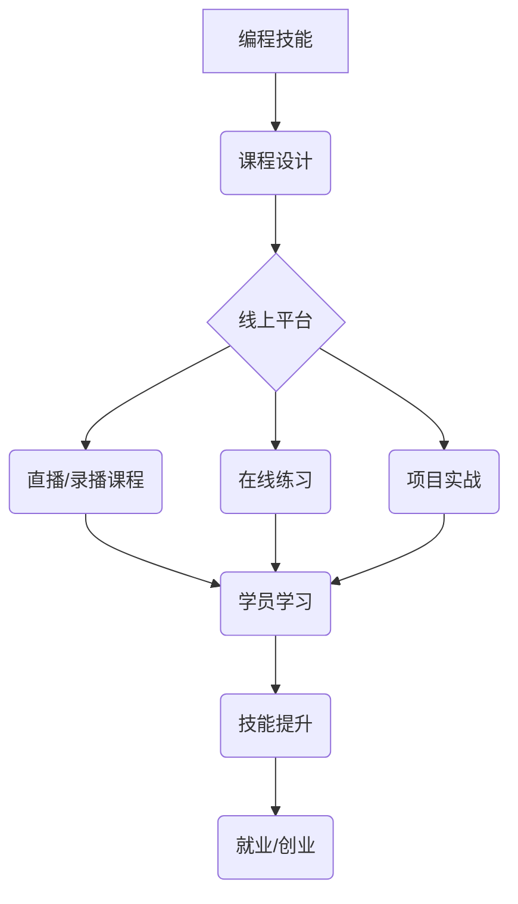

                 

## 如何将编程技能转化为线上编程训练营

> 关键词：编程技能、线上训练营、课程设计、教学方法、技术社区、市场营销、营收模式

### 1. 背景介绍

近年来，编程技能成为炙手可热的高需求职业技能，越来越多人渴望学习编程，但传统的线下培训模式存在着时间、地域、成本等方面的限制。线上编程训练营应运而生，凭借其灵活、便捷、高效的特点，迅速成为编程学习的新趋势。

对于拥有扎实编程技能的开发者来说，将自身经验和知识转化为线上编程训练营是一个具有巨大潜力的创业机会。 

### 2. 核心概念与联系

线上编程训练营的核心概念是将线下编程培训的模式迁移到线上平台，通过网络直播、录播课程、在线练习、项目实战等方式，为学员提供全面的编程学习体验。

**核心概念关系图:**

### 3. 核心算法原理 & 具体操作步骤

线上编程训练营的成功运营需要结合多种算法原理和操作步骤，例如：

**3.1 算法原理概述**

* **推荐算法:** 根据学员的学习进度、兴趣偏好、技能水平等信息，推荐合适的课程和学习资源。
* **内容分发算法:** 根据学员的学习行为和平台数据，优化课程内容的展示顺序和推荐策略。
* **社区运营算法:** 促进学员之间的互动和交流，构建活跃的学习社区。

**3.2 算法步骤详解**

* **推荐算法:**
    1. 收集学员的学习数据，包括学习历史、课程评价、学习时间等。
    2. 利用机器学习算法，构建学员兴趣和技能模型。
    3. 根据模型预测，推荐符合学员需求的课程和学习资源。
* **内容分发算法:**
    1. 分析学员的学习行为，例如点击率、停留时间、完成度等。
    2. 利用内容分发算法，优化课程内容的展示顺序和推荐策略。
    3. 持续监控和调整算法参数，提高内容推荐的准确性和有效性。
* **社区运营算法:**
    1. 鼓励学员参与论坛、讨论组等社区活动。
    2. 利用算法识别优质内容和活跃用户，给予奖励和推广。
    3. 建立社区规则和管理机制，维护良好的社区氛围。

**3.3 算法优缺点**

* **推荐算法:**
    * 优点: 个性化推荐，提高学员学习效率。
    * 缺点: 可能存在推荐偏差，导致学员缺乏探索性学习。
* **内容分发算法:**
    * 优点: 提高学员对课程内容的兴趣和参与度。
    * 缺点: 可能导致信息茧房效应，限制学员视野。
* **社区运营算法:**
    * 优点: 促进学员之间的互动和交流，构建学习社区。
    * 缺点: 需要投入人力资源进行社区管理和维护。

**3.4 算法应用领域**

* **教育领域:** 个性化学习推荐、内容分发优化、在线学习社区建设。
* **电商领域:** 商品推荐、内容推荐、用户画像分析。
* **社交媒体领域:** 内容推荐、用户匹配、社区运营。

### 4. 数学模型和公式 & 详细讲解 & 举例说明

线上编程训练营的运营可以借助数学模型和公式进行分析和优化，例如：

**4.1 数学模型构建**

* **学员学习进度模型:** 可以使用指数函数或线性函数来描述学员学习进度的变化趋势。
* **课程推荐模型:** 可以使用协同过滤算法或内容基准算法来构建课程推荐模型。
* **社区活跃度模型:** 可以使用社交网络分析算法来衡量社区活跃度。

**4.2 公式推导过程**

* **学员学习进度模型:** 假设学员学习进度为 y，学习时间为 x，则可以使用以下线性函数模型：

 $$y = kx + b$$

其中 k 为学习速度，b 为初始学习进度。

* **课程推荐模型:** 协同过滤算法可以根据学员和课程之间的交互数据，计算出学员对课程的兴趣评分，并推荐评分较高的课程。

**4.3 案例分析与讲解**

* **学员学习进度模型:** 假设一个学员学习一门编程语言，学习时间为 10 周，学习进度为 80%。根据线性函数模型，我们可以推算出该学员的学习速度为 8 周/80% = 0.1%。

* **课程推荐模型:** 假设一个学员对 Python 编程感兴趣，平台根据协同过滤算法分析，发现该学员与其他对 Python 编程感兴趣的学员有相似的学习行为，并推荐了几个 Python 相关的课程。

### 5. 项目实践：代码实例和详细解释说明

**5.1 开发环境搭建**

* 选择合适的线上平台，例如 Udemy、Coursera、Skillshare 等。
* 准备必要的开发工具，例如代码编辑器、版本控制系统、在线测试平台等。

**5.2 源代码详细实现**

* 使用编程语言编写课程内容，例如 Python、Java、C++ 等。
* 设计课程结构，包括课程介绍、学习目标、课程内容、练习题、项目实战等。
* 开发在线练习平台，提供代码提交、测试、反馈等功能。

**5.3 代码解读与分析**

* 详细解释代码逻辑，帮助学员理解编程原理。
* 提供代码示例和注释，方便学员学习和调试。
* 鼓励学员参与代码讨论和贡献，促进学习交流。

**5.4 运行结果展示**

* 展示代码运行结果，验证代码正确性。
* 提供代码运行分析，帮助学员理解代码执行过程。
* 鼓励学员进行代码优化和改进，提升编程能力。

### 6. 实际应用场景

线上编程训练营可以应用于各种场景，例如：

* **个人学习:** 帮助个人学习编程技能，提升职业竞争力。
* **企业培训:** 为企业员工提供编程培训，提升团队技术能力。
* **教育机构:** 为学生提供编程课程，培养未来人才。

**6.4 未来应用展望**

* **人工智能辅助学习:** 利用人工智能技术，提供个性化学习辅导和智能答疑。
* **虚拟现实/增强现实:** 利用虚拟现实和增强现实技术，打造沉浸式的编程学习体验。
* **元宇宙学习:** 在元宇宙平台上构建虚拟编程实验室，提供更丰富的学习场景和互动体验。

### 7. 工具和资源推荐

**7.1 学习资源推荐**

* **在线编程平台:** Codecademy, HackerRank, LeetCode
* **编程教程网站:** W3Schools, TutorialsPoint, FreeCodeCamp
* **编程书籍:** 《Python编程从入门到实践》、《JavaScript高级程序设计》

**7.2 开发工具推荐**

* **代码编辑器:** Visual Studio Code, Sublime Text, Atom
* **版本控制系统:** Git, GitHub
* **在线测试平台:** JSFiddle, CodePen

**7.3 相关论文推荐**

* **个性化学习推荐:** "A Survey of Recommender Systems"
* **内容分发算法:** "Content Recommendation Systems: A Survey"
* **社区运营算法:** "Social Network Analysis: Methods and Applications"

### 8. 总结：未来发展趋势与挑战

**8.1 研究成果总结**

线上编程训练营的发展取得了显著成果，为编程学习提供了更加便捷、高效、个性化的学习体验。

**8.2 未来发展趋势**

* **人工智能化:** 利用人工智能技术，实现更智能化的学习推荐、个性化辅导和智能答疑。
* **沉浸式体验:** 利用虚拟现实和增强现实技术，打造更加沉浸式的编程学习体验。
* **元宇宙化:** 在元宇宙平台上构建虚拟编程实验室，提供更丰富的学习场景和互动体验。

**8.3 面临的挑战**

* **内容质量:** 确保课程内容的质量和权威性，避免低质量课程的泛滥。
* **学员互动:** 促进学员之间的互动和交流，构建活跃的学习社区。
* **商业模式:** 探索可持续的商业模式，保证线上编程训练营的长期发展。

**8.4 研究展望**

未来，线上编程训练营将继续朝着更加智能化、沉浸式、元宇宙化的方向发展，为编程学习提供更加丰富、便捷、高效的体验。

### 9. 附录：常见问题与解答

* **Q1: 如何选择合适的线上编程训练营？**
    * **A1:** 考虑自身学习目标、编程技能水平、学习时间和预算等因素，选择适合自己的线上编程训练营。
* **Q2: 如何提高线上编程学习效率？**
    * **A2:** 制定学习计划，坚持每天学习，积极参与课程讨论，完成练习题和项目实战。
* **Q3: 线上编程训练营的收费标准如何？**
    * **A3:** 线上编程训练营的收费标准因平台、课程内容、时长等因素而异，一般分为订阅制、课程购买制等模式。

作者：禅与计算机程序设计艺术 / Zen and the Art of Computer Programming 
<end_of_turn>

